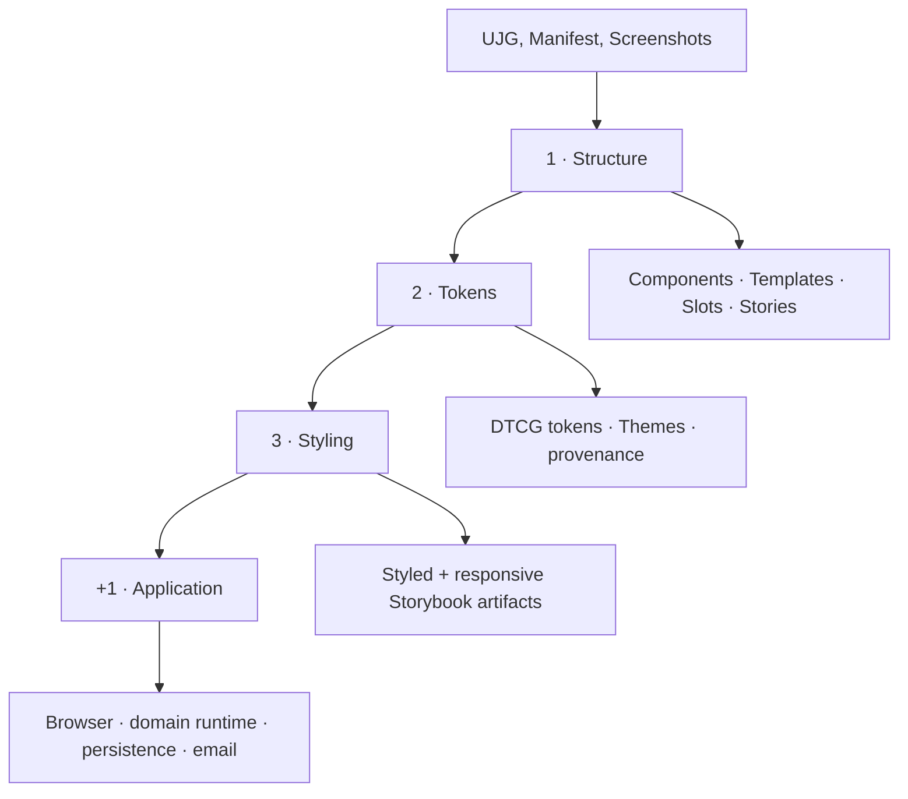
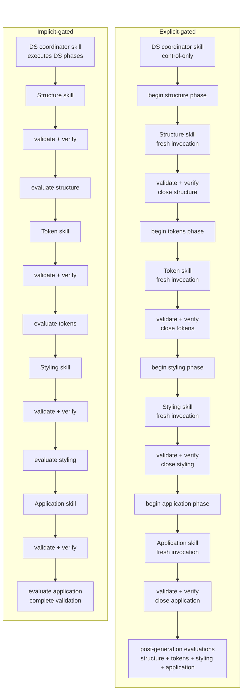
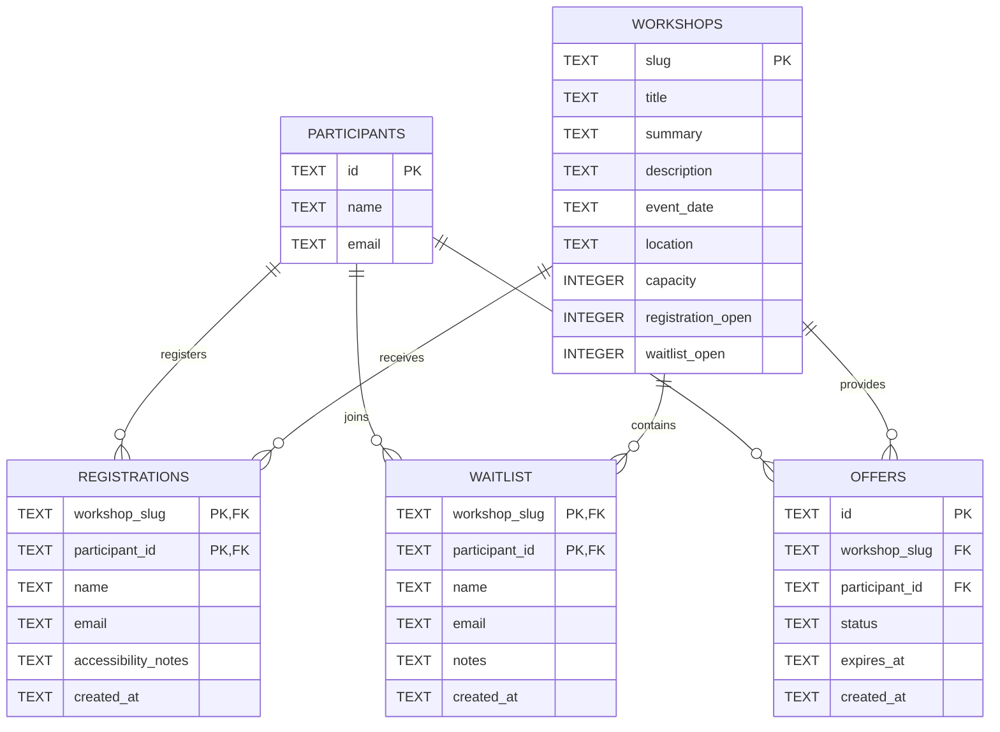

> **Exploratory case study — non-normative**
>
> This page is not part of the normative UJG specification. It documents a controlled generative-software experiment and is updated as evaluation evidence is completed.

|  |  |
| ----- | ----- |
| Implementation models | GPT-5.5 Codex, Claude Sonnet 5 |
| Experiment repository | [openuji/ujg-generative-se-case-study](https://github.com/openuji/ujg-generative-se-case-study) |
| UJG version | [UJG 1.0 Release Candidate 2](https://ujg.specs.openuji.org/tr/1.0-rc2) |
| Author | [Seva Dolgopolov](https://www.linkedin.com/in/seva-dolgopolov/) |

## Research question {#1-research-question}

User Journey Graph is intended to describe user-facing journey semantics independently from one specific software implementation. Generative software development provides a useful stress test for that separation: different AI models can make different implementation choices while still being constrained by the same intended experience.

This case study asks two related questions:

**RQ-1:** *Can one explicit UJG constrain multiple generative models toward the same intended journey without prescribing one implementation?*

**RQ-2:** *Does stronger generation guidance improve the quality and faithfulness of the realization?*

The study therefore compares not only models, but also **guidance protocols**. The same clean-room inputs are realized using an implicit guided process and an explicit phase-gated process.

The aim is not to make different models produce identical source code or identical interfaces. The aim is to examine whether independently generated implementations preserve the same semantic scope and whether their quality changes when generation is broken into inspectable, verified stages.

## What is held constant {#2-what-is-held-constant}

Through all generative jobs we used this same 3 inputs: **UJG document**, **Implementation manifest** and **Screenshots** to obtain the style.

### UJG

[Workshop registration UJG](https://github.com/openuji/ujg-generative-se-case-study/blob/main/ujg/workshop-registration.ujg.jsonld) · [schemas](https://github.com/openuji/ujg-generative-se-case-study/tree/main/ujg/schemas)

```stat-grid


UJG Document Graph Nodes

Journeys = 9
States = 30
Transitions = 35
```

The UJG is the semantic and structural source for the experiment.

### Implementation manifest

[ujg-implementation.yaml](https://github.com/openuji/ujg-generative-se-case-study/blob/main/ujg-implementation.yaml)

```yaml
domain_engine:
  target: apps/domain

interfaces:
  - touchpoint_ref: urn:ujg:touchpoint:workshop-app
    target: apps/ui
    kind: browser

  - touchpoint_ref: urn:ujg:touchpoint:email
    kind: email
```

The manifest fixes the controlled realization target and implementation choices used across runs.

### Reference screenshots

**10 screenshots** used as appearance evidence for token and styling realization.

<a href="https://github.com/openuji/ujg-generative-se-case-study/tree/main/references/workshop-registration/screens">
  
</a>
<a href="https://github.com/openuji/ujg-generative-se-case-study/tree/main/references/workshop-registration/screens">
  
</a>
<a href="https://github.com/openuji/ujg-generative-se-case-study/tree/main/references/workshop-registration/screens">
  
</a>
<a href="https://github.com/openuji/ujg-generative-se-case-study/tree/main/references/workshop-registration/screens">
  
</a>

[View all 10 screenshots →](https://github.com/openuji/ujg-generative-se-case-study/tree/main/references/workshop-registration/screens)

## The 3 + 1 realization process {#3-the-3-1-realization-process}

The realization is deliberately decomposed into three design-system phases followed by application realization.



### Structure {#31-structure}

The structure phase realizes the UJG Design System model without prematurely inventing the visual system. Components, Templates, Slots, SlotBindings, SurfaceRealizations, data-bound props, and Storybook inspection surfaces are established here.

The important question is whether the generated design-system structure preserves the UJG composition rather than turning semantic identities into ad-hoc screens or duplicating application behavior inside components.

<!-- Publication evidence planned here:
- representative Storybook structure screenshots
- annotations for Template / Slot / Command-backed Surface composition
-->

### Tokens {#32-tokens}

The token phase derives a reusable visual foundation from the supplied appearance evidence. Foundation and semantic DTCG tokens remain distinct, Theme differences stay data-driven, and provenance records whether evidence was directly visible or inferred.

The token phase also adds the generated Theme and TokenSource realization to the run-local UJG without changing the seeded journey semantics.

<!-- Publication evidence planned here:
- light/dark token specimens
- typography, spacing, palette and semantic-role extracts
- provenance examples
-->

### Styling {#33-styling}

The styling phase applies the token system to the already-established component and template structure. It is evaluated both for visual fidelity and for whether styling preserves the structural scope established earlier.

The strongest visual comparison is therefore not a random final screenshot: it is the **same modeled artifact before and after styling**, together with mobile and desktop inspection where responsive behavior exists.

<!-- Publication evidence planned here:
- before/after Storybook artifact pairs
- responsive variants
- reference-to-realization annotations
-->

### Application {#34-application}

The final phase realizes the manifest-selected interfaces and runtime boundaries. In this case that includes the browser application, domain runtime, HTTP/OpenAPI boundary, SQLite persistence, identity adapter, and email delivery adapter.

At this point the primary question changes from presentation fidelity to **behavioral fidelity**: do entries, commands, guarded branches, effects, invariants, continuations, data contracts, and touchpoint boundaries survive implementation?

<!-- Publication evidence planned here:
- representative application states
- journey outcome screenshots
- generated SQLite ER diagram
- selected verification evidence
-->

## Two guidance protocols {#4-two-guidance-protocols}

The experimental variable is how the model is guided through the same realization problem.

| | Implicit-gated guidance | Explicit-gated guidance |
| --- | --- | --- |
| Design-system generation | One orchestration skill guides structure → tokens → styling in sequence. | Structure, tokens, and styling are separate model invocations. |
| Application generation | Separate application realization. | Separate application realization. |
| Phase boundary | Mostly encoded inside orchestration guidance. | Every phase is explicitly opened and closed. |
| Verification | Retained legacy validation/evaluation evidence. | Static validation and executable verification must pass before the next phase starts. |
| Main question | Can a model follow the intended staged process from guidance alone? | Does making the stages and gates explicit reduce drift and improve realization quality? |



Both protocols use the same realization profile. The difference is therefore not “Claude used one stack and Codex another”; it is the degree to which generation phases and their gates are made explicit to the model.

## Experiment matrix {#5-experiment-matrix}

The repository currently retains the following implementation runs.

| Implementation model | Implicit-gated | Explicit-gated |
| --- | :---: | :---: |
| GPT-5.5 Codex | ✓ | ✓ |
| Claude Sonnet 5 | ✓ | ✓ |


## Evaluation design

Each run is evaluated independently for the four realization phases. Every phase has six quality dimensions scored from **0 to 5**. Their arithmetic mean produces the phase quality score; the published 0–100 score is the same mean scaled by 20.

Complexity indicators such as file count, infrastructure LOC, dependency count, and abstraction burden are reported separately. They do **not** raise or lower the quality score.

| Phase           | Quality dimensions                                                                                                                                         |
| --------------- | ---------------------------------------------------------------------------------------------------------------------------------------------------------- |
| **Structure**   | Artifact coverage · Composition fidelity · Data-contract fidelity · Identity containment · Implementation modularity · Storybook inspectability            |
| **Tokens**      | Token-model quality · Source-of-truth integrity · Theme portability · Traceability · Visual-foundation fidelity · Inspectability                           |
| **Styling**     | Visual fidelity · Token/theme adherence · Structural-scope preservation · Responsive quality · Styling modularity · Inspectability                         |
| **Application** | Manifest realization coverage · UJG behavioral fidelity · Domain integrity · Design-system integration · Source-of-truth integrity · Verification coverage |

### Two evaluators, one published phase score

Every retained Claude Sonnet 5 and GPT-5.5 Codex implementation is evaluated by both evaluator models.

For each implementation run and phase:

**published phase score = mean(Claude evaluator score, GPT-5.5 Codex evaluator score)**

The evaluator-specific values are retained so disagreement remains visible. The two-evaluator mean is used only for the comparable phase-quality scores.

Diagnostic counts are not averaged between evaluators because apparently factual measurements can depend on interpretation — for example which files count as infrastructure, which branches are considered modeled, or what constitutes a prohibited projection.

### Deterministic and diagnostic evidence

The results combine three kinds of evidence.

| Evidence                             | Source                                    | Examples                                                                                                |
| ------------------------------------ | ----------------------------------------- | ------------------------------------------------------------------------------------------------------- |
| **Deterministic repository metrics** | Counted directly from generated artifacts | Components, Templates, Slots, SurfaceRealizations, implementation primitives, DTCG token counts, Themes |
| **Evaluator diagnostics**            | Phase evaluation JSON                     | composition violations, raw-value leaks, responsive coverage, verified branches, prohibited projections |
| **Evaluator quality judgments**      | Six scored dimensions per phase           | source-of-truth integrity, token/theme adherence, UJG behavioral fidelity                               |

Where a property can be counted mechanically, the repository artifact is preferred as the measurement source. Evaluator diagnostics are used where the metric requires interpretation, while evaluator scores capture qualitative judgment.

This distinction is particularly important for the evidence below: the design-system inventory, implementation primitive count, and DTCG token inventory are counted from generated artifacts rather than inferred from the published quality score.

### Evaluator disagreement

Evaluator comparison is also treated as evidence. It can expose two different kinds of disagreement:

* **measurement disagreement** — evaluators identify or count evidence differently;
* **judgment disagreement** — evaluators inspect similar evidence but assign different quality scores.

Large disagreements are therefore shown rather than hidden by the published mean.

## RQ1 — Cross-model convergence

> **Can one explicit UJG constrain multiple generative models toward the same intended journey without prescribing one implementation?**

The four retained Claude Sonnet 5 and GPT-5.5 Codex runs use the same UJG and realization policy. This makes it possible to compare whether independently generated implementations converge at the modeled semantic and structural boundaries while remaining free to choose different source architectures and implementation helpers.

### Structural convergence

The UJG Design System model defines a shared reusable vocabulary of:

```stat-grid
title: Modeled design-system structure
subtitle: Shared UJG input for all four runs

Artifacts

Components = 12

Templates = 9

Slots = 18

SurfaceRealizations = 54

Reuse

Reusable Components + Templates = 21

SurfaceRealizations = 54

Realizations per reusable identity = 2.57
```

All four runs realize the complete Component and Template inventory.

| Run                        | Components | Templates | Implementation primitives | Missing stories | Composition violations | Data-contract violations | Interaction-story coverage |
| -------------------------- | ---------- | --------- | -------------------------- | ---------------- | ----------------------- | ------------------------- | --------------------------- |
| Claude Sonnet 5 · explicit |    12 / 12 |     9 / 9 |                         3 |               0 |                      0 |                        0 |                       100% |
| Claude Sonnet 5 · implicit |    12 / 12 |     9 / 9 |                         4 |               0 |                      0 |                        0 |                        50% |
| GPT-5.5 Codex · explicit   |    12 / 12 |     9 / 9 |                         0 |               0 |                      0 |                        0 |                       100% |
| GPT-5.5 Codex · implicit   |    12 / 12 |     9 / 9 |                         2 |               0 |                      0 |                        1 |                       100% |

`Component`, `Template`, `Slot`, and `SurfaceRealization` are modeled UJG Design System artifacts. **Implementation primitives** are additional generated code-level helpers and are reported separately.

The result is strong structural convergence: 54 modeled SurfaceRealizations are served by the same 12 Components and 9 Templates in every implementation rather than by state-specific UI artifacts. At the same time, the models independently introduce between zero and four additional implementation primitives.

The common modeled vocabulary is therefore preserved while the concrete implementation architecture remains unconstrained.

### DTCG token realization

The token phase materializes the visual system as DTCG token artifacts. Foundation and semantic tokens are counted from the generated DTCG files; Theme and TokenSource realization remains connected to the run-local UJG.

| Run                        | DTCG tokens | Foundation / semantic | Themes | Unresolved aliases | Raw-value leaks | Parallel catalog / theme registry | Provenance classified | Source-of-truth integrity |
| -------------------------- | ----------- | ---------------------- | ------ | ------------------- | ---------------- | ---------------------------------- | ---------------------- | -------------------------- |
| Claude Sonnet 5 · explicit |         168 |              100 / 68 |      2 |                  0 |               0 |                             0 / 0 |                  100% |                   4.9 / 5 |
| Claude Sonnet 5 · implicit |         110 |               66 / 44 |      2 |                  0 |             116 |                             0 / 1 |                 40.0% |                   4.0 / 5 |
| GPT-5.5 Codex · explicit   |         106 |               50 / 56 |      2 |                  0 |               0 |                             0 / 0 |                 52.8% |                   5.0 / 5 |
| GPT-5.5 Codex · implicit   |          63 |               31 / 32 |      2 |                  0 |              73 |                             1 / 1 |                 50.8% |                   2.3 / 5 |

The two models do **not** converge on an identical token inventory: Claude and Codex independently choose different numbers of foundation and semantic tokens. They do converge on the required two-Theme realization and produce resolvable DTCG token graphs.

This is an example of the intended boundary: UJG constrains the Theme and TokenSource semantics without prescribing one exact token taxonomy.

The more important variation is source-of-truth discipline. Both explicit runs keep generated styling values inside the DTCG realization, while the implicit runs retain substantial raw-value leakage or parallel theme/token registries.

### Styling realization

Styling is evaluated after the structural inventory has already been established.

| Run                        | Raw visual-value leaks | Component inventory changed | Template inventory changed | Duplicated style patterns | Misplaced style rules | Responsive artifacts | Responsive documentation | Token / theme adherence |
| -------------------------- | ----------------------- | ---------------------------- | ----------------------------- | ---------------------------- | ------------------------ | --------------------- | --------------------------- | ---------------------- |
| Claude Sonnet 5 · explicit |                      0 |              No             |             No             |                         0 |                     0 |                    9 |                      38% |               4.8 / 5 |
| Claude Sonnet 5 · implicit |                    116 |              No             |             No             |                         6 |                     2 |                   10 |                      22% |               3.0 / 5 |
| GPT-5.5 Codex · explicit   |                      0 |              No             |             No             |                         1 |                     0 |                    2 |                       0% |               4.5 / 5 |
| GPT-5.5 Codex · implicit   |                     73 |              No             |             No             |                         2 |                     2 |                    7 |                      33% |               2.1 / 5 |

All four runs preserve the modeled Component and Template inventory through styling. The generated implementations therefore remain structurally comparable even though the concrete CSS architecture, responsive strategy, and implementation-level reuse differ.

The clearest divergence is again source-of-truth ownership: the explicit runs contain no reported raw visual-value leakage, while both implicit runs maintain substantial styling values outside the DTCG-controlled path.

#### Same modeled template, different implementation models

| Claude Sonnet 5 · explicit-gated | GPT-5.5 Codex · explicit-gated |
| --- | --- |
| [](/case-studies/generative-software-development/evidence/review-with-actions-claude-explicit.png) | [](/case-studies/generative-software-development/evidence/review-with-actions-codex-explicit.png) |

Both implementations realize the same UJG-modeled `ReviewWithActions`
Template under the same explicit-gated protocol. The implementations
remain free to choose their own styling realization while preserving the
established Template and Component inventory.

### Application realization

The application phase tests whether the common journey semantics survive realization into the manifest-selected interfaces, domain runtime, persistence, and integration boundaries.

| Run                        | Interfaces realized | Verified branches | Verification coverage | DS integration violations | Prohibited projections | Effect / invariant violations | UJG behavioral fidelity |
| -------------------------- | -------------------- | ------------------ | ---------------------- | -------------------------- | ------------------------- | ------------------------------ | ------------------------ |
| Claude Sonnet 5 · explicit |               2 / 2 |           30 / 35 |                 86.0% |                         0 |                      1 |                             0 |                 4.6 / 5 |
| Claude Sonnet 5 · implicit |               2 / 2 |           12 / 21 |                 57.1% |                         0 |                      2 |                             1 |                 3.7 / 5 |
| GPT-5.5 Codex · explicit   |               2 / 2 |           11 / 13 |                 84.6% |                         0 |                      0 |                             0 |                4.25 / 5 |
| GPT-5.5 Codex · implicit   |               2 / 2 |           13 / 22 |                 59.1% |                         2 |                      2 |                             0 |                 3.4 / 5 |

All four implementations realize the two selected interfaces, but behavioral convergence is weaker than structural convergence.

The implementations differ materially in runtime architecture, verification depth, semantic projections, and persistence realization. The UJG therefore constrains the principal journey and interface scope without forcing the models toward one source architecture.

#### Example persistence realization

The generated persistence architecture also remains an implementation choice.



This diagram shows the **generated SQLite persistence realization for the explicit GPT-5.5 Codex run**. It is not the UJG domain model: SQLite and this relational schema are implementation choices made within the controlled realization policy.

### Fazit

**RQ1 result:** convergence is strongest at the UJG semantic and design-system boundaries. Independent models reproduce the same modeled artifact inventory and principal journey scope while generating substantially different code structures, token inventories, implementation primitives, and runtime architectures. Divergence increases in the application phase, where semantic projections and incomplete branch verification can affect behavioral fidelity.

## RQ2 — Effect of explicit guidance

> **Does stronger generation guidance improve the quality and faithfulness of the realization?**

For each implementation model, the implicit and explicit runs are compared directly. The implementation model is held constant while the guidance protocol changes.

### Effect of explicit guidance

Values below are the change in the two-evaluator phase mean, explicit minus implicit, in percentage points.

```stat-grid
title: Effect of explicit guidance
subtitle: Change in two-evaluator mean, explicit minus implicit (points)

Claude Sonnet 5

Structure = +2.67

Tokens = +6.50

Styling = +7.67

Application = +7.84

Average uplift = +6.17

GPT-5.5 Codex

Structure = +3.17

Tokens = +22.16

Styling = +21.00

Application = +30.84

Average uplift = +19.29
```

Explicit guidance improves every paired phase comparison.

The structural uplift is relatively small for both models because all four runs already reproduce the complete modeled Component and Template inventory. The difference widens in Tokens and Styling and is largest in Application, particularly for GPT-5.5 Codex.

### Quality through the realization pipeline

Scores are the two-evaluator mean, 0–100.

| Run                        | Structure | Tokens | Styling | Application |      Mean |
| -------------------------- | --------: | -----: | ------: | ----------: | --------: |
| Claude Sonnet 5 · explicit |     98.50 |  94.17 |   89.84 |       93.17 | **93.92** |
| Claude Sonnet 5 · implicit |     95.83 |  87.67 |   82.17 |       85.34 | **87.75** |
| GPT-5.5 Codex · explicit   |     98.34 |  90.83 |   85.00 |       77.50 | **87.92** |
| GPT-5.5 Codex · implicit   |     95.17 |  68.67 |   64.00 |       46.67 | **68.63** |

The phase profile shows that guidance has relatively little effect on initial structural coverage but increasingly affects the preservation of source-of-truth boundaries and runtime behavior later in the realization pipeline.

### What explicit guidance changed

The evaluator scores can be connected to concrete implementation properties.

| Metric                               | Claude implicit → explicit | GPT-5.5 Codex implicit → explicit |
| ------------------------------------ | -------------------------: | --------------------------------: |
| DTCG / styling raw-value leaks       |                116 → **0** |                        73 → **0** |
| Parallel token/theme sources         |                  1 → **0** |                         2 → **0** |
| Duplicated styling patterns          |                  6 → **0** |                         2 → **1** |
| Application verification coverage    |          57.1% → **86.0%** |                 59.1% → **84.6%** |
| Prohibited semantic projections      |                  2 → **1** |                         2 → **0** |
| Design-system integration violations |                      0 → 0 |                         2 → **0** |

#### Same implementation model, different guidance protocol
| GPT-5.5 Codex · imlicit-gated | GPT-5.5 Codex · explicit-gated |
| --- | --- |
| [](/case-studies/generative-software-development/evidence/codex-implicit.png) | [](/case-studies/generative-software-development/evidence/codex-explicit.png) |

Both screenshots show the workshop-overview application generated by the
same implementation model under different guidance protocols. The
explicit-gated realization is more tightly aligned with the staged
Structure → Tokens → Styling → Application process, while the
implicit-gated realization introduces a broader and less constrained
application shell.


The strongest effect is therefore not additional structural coverage. Explicit guidance improves **continuity between phases**:

* generated DTCG artifacts remain the styling source of truth;
* styling preserves the structure established in the previous phase;
* later application realization introduces fewer parallel semantic authorities;
* a larger proportion of evaluated behavioral branches is backed by verification evidence.

The effect is present for both models but substantially larger for GPT-5.5 Codex.

### Result sensitivity to evaluator

The published phase values are evaluator means, but evaluator disagreement is not uniform.

```bar-chart
title: Result sensitivity to evaluator
subtitle: Largest absolute differences between Claude Sonnet 5 and GPT-5.5 Codex evaluator scores (points)

max: 35

GPT-5.5 Codex implementation · implicit-gated · Application = 33.33

Claude Sonnet 5 implementation · implicit-gated · Application = 22.67

GPT-5.5 Codex implementation · explicit-gated · Application = 21.66

GPT-5.5 Codex implementation · implicit-gated · Styling = 14.66
```

Application has the highest evaluator sensitivity. This is also the phase where evaluation depends most strongly on interpreting runtime behavior, invariants, projections, integration boundaries, and verification evidence rather than inspecting a finite design-system inventory.

The guidance effect should therefore be read together with the underlying implementation metrics rather than from the aggregate score alone.


### Fazit
**RQ2 result:** explicit phase gating improves the evaluated quality of both implementation models. The effect is modest at the already-strong Structure phase and considerably larger in Tokens, Styling, and Application. The implementation evidence suggests that the main benefit is stronger preservation of source-of-truth and phase boundaries rather than simply generating more artifacts.

## Reproducibility and limitations

The experiment is intentionally narrow. It tests one workshop-registration case, one controlled realization profile, two implementation models, and two guidance protocols. It should not be read as a general ranking of AI coding systems.

The clean-room boundary is designed to reduce contamination between runs: the canonical UJG, referenced schemas, implementation manifest, and shared appearance references are supplied, while a reference application is excluded from the generation input.

The retained run directories, historical guidance skills, verification tooling, evaluation rubrics, evaluator JSON files, generated UJG documents, DTCG token sources, and application implementations are available in the [experiment repository](https://github.com/openuji/ujg-generative-se-case-study).

Repository-level counts used in the results — such as Component, Template, Slot, SurfaceRealization, implementation-primitive, DTCG-token, and Theme counts — are derived directly from the retained generated artifacts. Evaluator diagnostics and qualitative scores remain traceable to their corresponding evaluator result files.

Several limitations remain:

* only one product journey is studied;
* only two implementation models have complete paired implicit/explicit runs;
* the realization profile intentionally fixes the technology environment, so the experiment does not measure technology-selection quality;
* visual fidelity is partly dependent on static inspection where evaluator-time rendered evidence was unavailable;
* some diagnostic concepts require interpretation and can therefore differ between evaluators;
* the generated implementations were compared for semantic and quality convergence, not source-code identity.

The reproducibility target is therefore not identical generated source code. It is a traceable experiment in which the semantic input, realization policy, generation protocol, generated artifacts, evaluation rubric, supporting measurements, and published results can all be inspected independently.
