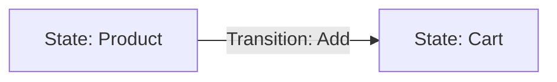
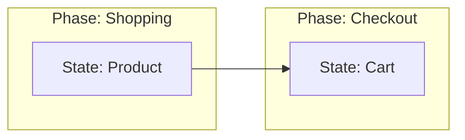
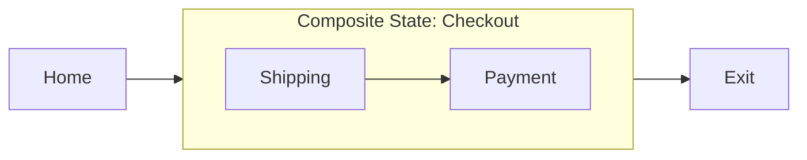
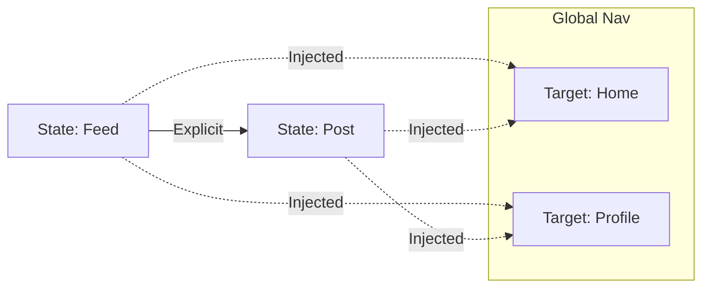

## Abstract {.unnumbered}

This document is the **Designed** module of the User Journey Graph (UJG) specification. It defines the vocabulary for describing **intended** user experiences—enabling teams to model journeys as structured, interactive graphs that support nesting and reusable navigation patterns.

## Scope

This module defines:

1. **Core Graph:** The fundamental units of [=State=] and [=Transition=].
2. **Organization:** Using `tags` to group states into logical phases.
3. **Composition:** How to model complex flows using nested [=CompositeState=]s.
4. **Reusability:** How to apply global navigation using [=TransitionSet=]s.
5. **Validation:** Rules for graph integrity.

## Terminology

- <dfn>Journey</dfn>: A named, versioned container for a specific user flow.
- <dfn>State</dfn>: A discrete moment in the experience (e.g., a screen, a modal).
- <dfn>Transition</dfn>: An explicit, directed link between two states.
- <dfn>Tag</dfn>: A string label used to group states (e.g., "phase:checkout").
- <dfn>CompositeState</dfn>: A state that acts as a container for another Journey (a "sub-journey").
- <dfn>TransitionSet</dfn>: A reusable definition of navigation links (like a Global Header) that can be applied to many states at once.

---

## The Basic Graph (Normative)

At its simplest, a Journey is a set of **States** connected by **Transitions**.

### Visual Concept

A user moves from a Product page to a Cart.



### Data Model

#### 1. State

- `type`: `"State"`
- `id`: Globally unique identifier (string).
- `label`: Human-readable name.

#### 2. Transition

- `type`: `"Transition"`
- `id`: Globally unique identifier (string).
- `from`: ID of the source State.
- `to`: ID of the target State.
- `label`: (Optional) Name of the action.

#### 3. Journey (Container)

- `type`: `"Journey"`
- `id`: Unique identifier.
- `version`: Version string.
- `states`: Array of State objects.
- `transitions`: Array of Transition objects.
- `startState`: ID of the entry state.

### Level 1 JSON Example

```json
{
  "type": "Journey",
  "id": "urn:ujg:journey:simple-shop",
  "version": "1.0",
  "startState": "urn:ujg:state:product",
  "states": [
    {
      "type": "State",
      "id": "urn:ujg:state:product",
      "label": "Product Page"
    },
    {
      "type": "State",
      "id": "urn:ujg:state:cart",
      "label": "Shopping Cart"
    }
  ],
  "transitions": [
    {
      "type": "Transition",
      "id": "urn:ujg:trans:add-to-cart",
      "from": "urn:ujg:state:product",
      "to": "urn:ujg:state:cart",
      "label": "Add"
    }
  ]
}
```

---

## Organization with Tags (Normative)

As graphs grow, humans need to group states into "Phases" or "Features." We use **Tags** for this.

### Visual Concept

The same graph, but grouped by "Phase".



### Data Model Additions

- **State Object**: Adds a `tags` field (Array of strings).
- **Journey Object**: Adds a `tags` field (Array of strings).

### Level 2 JSON Example

```json
{
  "type": "State",
  "id": "urn:ujg:state:cart",
  "label": "Shopping Cart",
  "tags": ["phase:checkout", "secure", "mobile-ready"]
}
```

---

## Managing Complexity with Composition (Normative)

Real journeys are too large to see on one screen. **Composition** allows a [=State=] to contain an entire sub-journey. This allows designers to "Zoom In" and "Zoom Out."

### Visual Concept

The "Checkout" is a single box in the main journey. But if you look inside, it has its own steps.



### Data Model Additions

#### 4. CompositeState

- `type`: `"CompositeState"`
- `id`, `label`, `tags`: Same as State.
- `subjourneyRef`: A reference object identifying the inner journey.
- `id`: The ID of the sub-journey.
- `version`: The version of the sub-journey.

### Level 3 JSON Example

```json
{
  "type": "Journey",
  "id": "urn:ujg:journey:main-site",
  "version": "2.0",
  "startState": "urn:ujg:state:home",
  "states": [
    {
      "type": "State",
      "id": "urn:ujg:state:home",
      "label": "Home Page"
    },
    {
      "type": "CompositeState",
      "id": "urn:ujg:state:checkout-flow",
      "label": "Checkout Process",
      "subjourneyRef": {
        "id": "urn:ujg:journey:checkout-v1",
        "version": "1.0"
      }
    }
  ],
  "transitions": [
    {
      "type": "Transition",
      "id": "urn:ujg:trans:start-checkout",
      "from": "urn:ujg:state:home",
      "to": "urn:ujg:state:checkout-flow"
    }
  ]
}
```

---

## Reusability with TransitionSets (Normative)

Applications often have "Global Navigation" (e.g., a Header with "Home" and "Profile" links) available on every page. Drawing these arrows manually for 50 states creates a messy "spaghetti graph."

**TransitionSets** allow you to define these links once and "inject" them into a journey.

### Visual Concept

The dashed arrows represent links that are _injected_ automatically by the TransitionSet into every state.



### Data Model Additions

#### 5. TransitionSet

A container for links that have a `to` (destination) but no fixed `from`.

- `type`: `"TransitionSet"`
- `id`: Unique identifier.
- `owner`: (Optional) Reference to the UI Component (e.g., Header) providing these links.
- `transitions`: Array of `TransitionSetTransition` objects.

#### 6. TransitionSetTransition

- `type`: `"TransitionSetTransition"`
- `id`: Unique identifier.
- `to`: ID of the target State.
- `label`: (Optional) Action name.

#### Journey Updates

- **Journey Object**: Adds `transitionSets` field (Array of TransitionSet IDs).

### Injection Logic (How to Process)

When a Consumer loads a Journey that lists `transitionSets`:

1. **Iterate** through every State in the Journey (excluding `endStates`).
2. **Apply** every transition defined in the TransitionSet to that State.
3. **Result:** The State effectively has new outgoing transitions to the Global targets, even though they weren't written in the `transitions` array.

### Level 4 JSON Example: The TransitionSet Definition

```json
{
  "type": "TransitionSet",
  "id": "urn:ujg:tset:global-header",
  "owner": { "id": "urn:ui:header" },
  "transitions": [
    {
      "type": "TransitionSetTransition",
      "id": "urn:ujg:tset:link-home",
      "to": "urn:ujg:state:home",
      "label": "Home"
    },
    {
      "type": "TransitionSetTransition",
      "id": "urn:ujg:tset:link-profile",
      "to": "urn:ujg:state:profile",
      "label": "Profile"
    }
  ]
}
```

### Level 4 JSON Example: The Consuming Journey

```json
{
  "type": "Journey",
  "id": "urn:ujg:journey:user-feed",
  "version": "3.0",
  "transitionSets": ["urn:ujg:tset:global-header"],
  "states": [
    { "type": "State", "id": "urn:ujg:state:feed", "label": "Feed" },
    { "type": "State", "id": "urn:ujg:state:post", "label": "Post Detail" }
  ],
  "transitions": [
    {
      "type": "Transition",
      "id": "trans:1",
      "from": "urn:ujg:state:feed",
      "to": "urn:ujg:state:post"
    }
  ]
  // Note: Transitions to Home/Profile are NOT listed here.
  // They are injected automatically by the transitionSets field.
}
```

---

## Journey version reference (journeyRef)

When a [=UJG Object=] references a specific [=Journey=] version, it **MUST** use a `journeyRef` member whose value is a JSON object of the form:

```json
{ "id": "…", "version": "…" }
```

#### Rules

- `journeyRef.id` **MUST** be a non-empty string.
- `journeyRef.version` **MUST** be a non-empty string.

## Validity Rules (Normative)

To ensure the graph can be traversed and measured reliably:

1. **Reference Integrity:** All `startState`, `from`, and `to` IDs **MUST** exist within the Journey's `states` array (or be resolvable imports).
2. **Unique Identifiers:** Every object in a document **MUST** have a unique `id`.
3. **No Dead Ends:** Unless a State is listed in `endStates`, it **SHOULD** have at least one outgoing transition (explicit or injected).
4. **Tag Type:** `tags` **MUST** be an array of strings.
5. **Sub-journey Resolution:** `CompositeState` references **MUST** point to valid, accessible Journeys.
