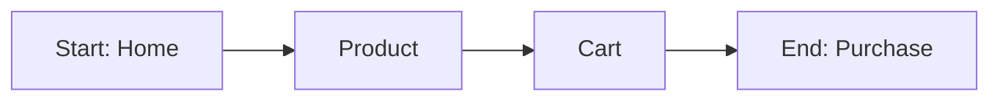
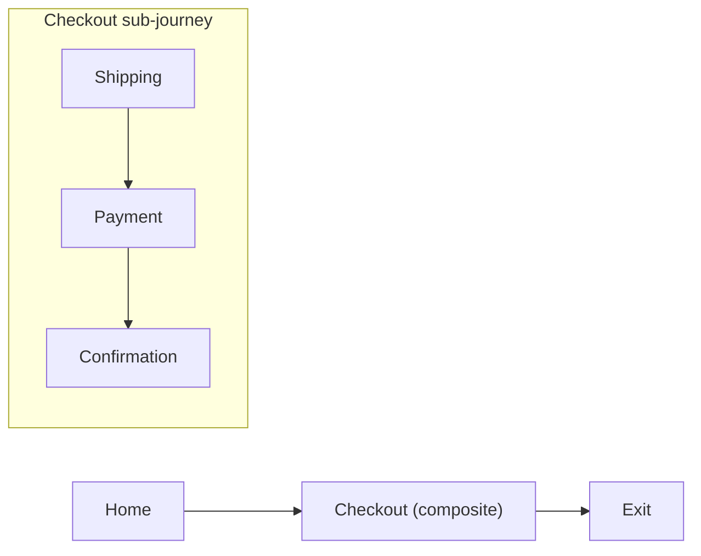
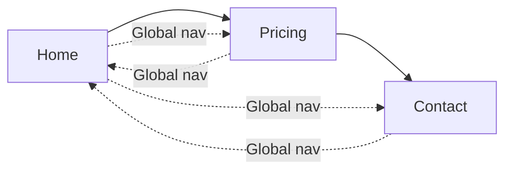

## Status of This Document {.unnumbered}

This module defines the **Designed** journey: a shared way to describe _what you meant to build_ as a map of moments and allowed moves.

If you can draw it as boxes and arrows, it fits:

- **States** are the boxes (moments like "Home", "Shipping", "Menu open").
- **Transitions** are the arrows (allowed moves like "Home → Checkout").

Two real-world features are included:

- **Composition:** a box can "contain" another journey (zoom-in / nested flow).
- **Reusable navigation:** global navigation can be defined once and applied across many journeys.

This module is about the _plan_. The **Runtime** module is about _what actually happened_, and how real sessions can reference this plan.

## Abstract {.unnumbered}

UJG Designed describes user journeys as a graph: **States** (moments) connected by **Transitions** (allowed moves). It supports nesting via **CompositeState** and reusable cross-cutting navigation via **TransitionSet**.

## Scope {.unnumbered}

This module covers:

- How to define a **Journey** as boxes (States) and arrows (Transitions)
- How to "zoom in" using **CompositeState** (a state that links to a sub-journey)
- How to apply shared navigation using **TransitionSet**
- Basic checks for "well-formed" journeys (e.g., references point to real states)

This module does not cover:

- Tracking events, sessions, or timelines (Runtime)
- Aggregated/observed graphs (Observed)
- Metrics and KPIs (Metrics)

## Visual mental model (informative) {.unnumbered}

A Journey is a **map of what's allowed**, not what happened in one session.

- Designed Journey: "From Browse you can go to Product; from Product you can go to Cart…"
- Runtime session: "Browse → Product → Cart → Exit"

### Suggested visualization conventions (informative)

These are recommendations for tools, docs, and workshops (the data model does not require any specific UI):

- **State**: rectangle (label inside)
- **Start**: pill/capsule or "Start" badge on a State
- **End**: pill/capsule or "End" badge on one or more States
- **CompositeState**: double-border rectangle or a "↳" marker (means "you can zoom in")
- **Transition**: solid arrow
- **TransitionSet overlay**: dashed arrows or a separate "global nav" layer

### Diagram: a simple journey (informative)



### Diagram: composition (zoom-in) with CompositeState (informative)



### Diagram: reusable navigation (TransitionSet) as an overlay (informative)



## Concepts (plain English) (informative) {.unnumbered}

- **State**: a meaningful moment (page, step, mode).
- **Transition**: an allowed move between moments.
- **Journey**: a bundle of states + transitions with a defined start (and optional ends).
- **CompositeState**: a state that points to a nested Journey (a "zoom-in" map).
- **TransitionSet**: reusable "go to X" transitions that you can apply to many Journeys.

**How to read the data model**: the JSON is simply a machine-readable way to store the same picture you'd draw in a workshop.

## Specification (normative)

This section is written for implementers and tool builders. Product/UX readers can treat it as reference.

### Conformance

#### Normative language

The key words **MUST**, **MUST NOT**, **REQUIRED**, **SHALL**, **SHALL NOT**, **SHOULD**, **SHOULD NOT**, **RECOMMENDED**, **MAY**, and **OPTIONAL** are to be interpreted as described in RFC 2119 and RFC 8174.

#### Conformance classes

This specification defines requirements for:

- **Designed Producer**: software that creates and emits UJG Designed objects.
- **Designed Consumer**: software that parses and processes UJG Designed objects.
- **Designed Validator** (optional): a Consumer that checks all validity rules in §Validity rules.

A system MAY conform to more than one class.

#### Relationship to Serialization

All Designed objects are serialized according to the UJG Serialization module's shared wire rules (e.g., JSON encoding, reserved keys, forward compatibility, extensibility).

## Terminology (plain English)

- **Journey**: the designed model of an experience at some layer (site, page, flow, component).
- **State**: a meaningful moment the user can be "in" (page, step, mode).
- **Transition**: an allowed move from one State to another.
- **CompositeState**: a State that contains a nested Journey.
- **TransitionSet**: a reusable bundle of "go to X" transitions (e.g., global nav) that can be applied in many Journeys.

## Identifier rules (normative)

### Global uniqueness

Every Designed object that has an `id` **MUST** use an identifier that is globally unique within the publisher's publication context.

This includes (at minimum):

- Journey
- State
- CompositeState
- Transition
- TransitionSet
- TransitionSetTransition

**Note (informative):** Using IRIs/URLs/URNs is a common way to achieve global uniqueness.

### Opaque identifiers

Consumers **MUST** treat `id` values as opaque strings. No parsing or dereferencing is required for conformance.

## State

### What is a State? (informative)

A State is a meaningful moment the user can be "in".

Think: a page, a step in a checkout flow, or a UI mode ("menu open").

### State object (normative)

A State **MUST** be a UJG Object with:

- `type`: the string `"State"`
- `id`: a non-empty string, globally unique (§Identifier rules)
- `label`: a non-empty string (human-readable)

A State **MAY** include additional members (e.g., `name`, `description`, `extensions`) as permitted by Serialization.

### Example: a couple of states (informative)

```json
{
  "type": "State",
  "id": "urn:ujg:example:state:home",
  "label": "Home"
}

{
  "type": "State",
  "id": "urn:ujg:example:state:checkout-shipping",
  "label": "Shipping details"
}
```

## Transition

### What is a Transition? (informative)

A Transition is an allowed move from one State to another:

- `from` = where you are now
- `to` = where you can go next

### Transition object (normative)

A Transition **MUST** be a UJG Object with:

- `type`: the string `"Transition"`
- `id`: a non-empty string, globally unique (§Identifier rules)
- `from`: a State id (string)
- `to`: a State id (string)

### Example: simple navigation (informative)

```json
{
  "type": "Transition",
  "id": "urn:ujg:example:transition:cart-to-checkout",
  "from": "urn:ujg:example:state:cart",
  "to": "urn:ujg:example:state:checkout-shipping"
}
```

### Example: toggling a UI mode (informative)

```json
{
  "type": "Transition",
  "id": "urn:ujg:example:transition:open-menu",
  "from": "urn:ujg:example:state:header-closed",
  "to": "urn:ujg:example:state:header-open"
}
```

## Journey

### What is a Journey? (informative)

A Journey is the designed model of an experience at some layer (site, page, component, flow).

It defines:

- where you start (`startState`)
- where you may end at this layer (`endStates`)
- what moments exist (`states`)
- what moves are allowed (`transitions`)
- optional reusable transitions applied from elsewhere (`transitionSets`)

### Journey object (normative)

A Journey **MUST** be a UJG Object with:

- `type`: the string `"Journey"`
- `id`: a non-empty string, globally unique (§Identifier rules)
- `version`: a non-empty string
- `startState`: a State/CompositeState id (string)
- `endStates`: an array of State/CompositeState id strings (MAY be empty)
- `states`: an array of State and/or CompositeState objects
- `transitions`: an array of Transition objects (MAY be empty)
- `transitionSets`: an array of TransitionSet id strings (MAY be empty)

### Example: a simple 3-step signup journey (informative)

```json
{
  "type": "Journey",
  "id": "urn:ujg:example:journey:signup",
  "version": "2026.01",
  "startState": "urn:ujg:example:journey:signup:state:start",
  "endStates": ["urn:ujg:example:journey:signup:state:done"],
  "transitionSets": [],
  "states": [
    {
      "type": "State",
      "id": "urn:ujg:example:journey:signup:state:start",
      "label": "Start"
    },
    {
      "type": "State",
      "id": "urn:ujg:example:journey:signup:state:form",
      "label": "Enter details"
    },
    {
      "type": "State",
      "id": "urn:ujg:example:journey:signup:state:done",
      "label": "Account created"
    }
  ],
  "transitions": [
    {
      "type": "Transition",
      "id": "urn:ujg:example:journey:signup:transition:begin",
      "from": "urn:ujg:example:journey:signup:state:start",
      "to": "urn:ujg:example:journey:signup:state:form"
    },
    {
      "type": "Transition",
      "id": "urn:ujg:example:journey:signup:transition:submit",
      "from": "urn:ujg:example:journey:signup:state:form",
      "to": "urn:ujg:example:journey:signup:state:done"
    }
  ]
}
```

**How to read `endStates` (informative):** "We're done modeling at this layer." It does not imply the user disappears; it's just the modeled boundary.

## CompositeState (composition)

### What is a CompositeState? (informative)

A CompositeState is a state that points to a nested Journey that happens "inside" it.

**Product/UX translation:** "This page/step has its own internal journey (components, sub-steps)."

### JourneyRef (normative)

A JourneyRef **MUST** be a JSON object with:

- `id`: a Journey id string
- `version`: a Journey version string

### CompositeState object (normative)

A CompositeState **MUST** be a UJG Object with:

- `type`: the string `"CompositeState"`
- `id`: a non-empty string, globally unique (§Identifier rules)
- `label`: a non-empty string
- `subjourneyRef`: a JourneyRef object

### Example: website journey with a composite "Checkout" page (informative)

```json
{
  "type": "Journey",
  "id": "urn:ujg:example:journey:website",
  "version": "2026.01",
  "startState": "urn:ujg:example:journey:website:state:home",
  "endStates": ["urn:ujg:example:journey:website:state:exit"],
  "transitionSets": [],
  "states": [
    {
      "type": "State",
      "id": "urn:ujg:example:journey:website:state:home",
      "label": "Home"
    },
    {
      "type": "CompositeState",
      "id": "urn:ujg:example:journey:website:state:checkout",
      "label": "Checkout",
      "subjourneyRef": {
        "id": "urn:ujg:example:journey:page-checkout",
        "version": "2026.01"
      }
    },
    {
      "type": "State",
      "id": "urn:ujg:example:journey:website:state:exit",
      "label": "Exit"
    }
  ],
  "transitions": [
    {
      "type": "Transition",
      "id": "urn:ujg:example:journey:website:transition:start-checkout",
      "from": "urn:ujg:example:journey:website:state:home",
      "to": "urn:ujg:example:journey:website:state:checkout"
    },
    {
      "type": "Transition",
      "id": "urn:ujg:example:journey:website:transition:leave-site",
      "from": "urn:ujg:example:journey:website:state:home",
      "to": "urn:ujg:example:journey:website:state:exit"
    }
  ]
}
```

### Example: the nested checkout page journey (informative)

```json
{
  "type": "Journey",
  "id": "urn:ujg:example:journey:page-checkout",
  "version": "2026.01",
  "startState": "urn:ujg:example:journey:page-checkout:state:shipping",
  "endStates": ["urn:ujg:example:journey:page-checkout:state:confirmation"],
  "transitionSets": [],
  "states": [
    {
      "type": "State",
      "id": "urn:ujg:example:journey:page-checkout:state:shipping",
      "label": "Shipping"
    },
    {
      "type": "State",
      "id": "urn:ujg:example:journey:page-checkout:state:payment",
      "label": "Payment"
    },
    {
      "type": "State",
      "id": "urn:ujg:example:journey:page-checkout:state:confirmation",
      "label": "Confirmation"
    }
  ],
  "transitions": [
    {
      "type": "Transition",
      "id": "urn:ujg:example:journey:page-checkout:transition:to-payment",
      "from": "urn:ujg:example:journey:page-checkout:state:shipping",
      "to": "urn:ujg:example:journey:page-checkout:state:payment"
    },
    {
      "type": "Transition",
      "id": "urn:ujg:example:journey:page-checkout:transition:confirm",
      "from": "urn:ujg:example:journey:page-checkout:state:payment",
      "to": "urn:ujg:example:journey:page-checkout:state:confirmation"
    }
  ]
}
```

## TransitionSet (reusable transitions) + Owner

### What is a TransitionSet? (informative)

A TransitionSet is a reusable bundle of "go to X" transitions (often global navigation) that can be applied in many Journeys without repeating edges everywhere.

### What is the Owner? (informative)

The owner indicates the UI surface/component journey that "provides" those transitions (e.g., a Header component).

### TransitionSet object (normative)

A TransitionSet **MUST** be a UJG Object with:

- `type`: the string `"TransitionSet"`
- `id`: a non-empty string, globally unique (§Identifier rules)
- `owner`: a JourneyRef object
- `transitions`: an array of TransitionSetTransition objects (MAY be empty)

### TransitionSetTransition object (normative)

A TransitionSetTransition **MUST** be a UJG Object with:

- `type`: the string `"TransitionSetTransition"`
- `id`: a non-empty string, globally unique (§Identifier rules)
- `to`: a State/CompositeState id string in the host Journey

A TransitionSetTransition intentionally has no `from`. It is injected broadly into a host Journey (see §Inclusion and injection rules).

### Example: TransitionSet "global nav" (informative)

```json
{
  "type": "TransitionSet",
  "id": "urn:ujg:example:transitionset:global-nav",
  "owner": { "id": "urn:ujg:example:journey:cmp-header", "version": "2026.01" },
  "transitions": [
    {
      "type": "TransitionSetTransition",
      "id": "urn:ujg:example:transitionset:global-nav:to-home",
      "to": "urn:ujg:example:journey:website:state:home"
    },
    {
      "type": "TransitionSetTransition",
      "id": "urn:ujg:example:transitionset:global-nav:to-pricing",
      "to": "urn:ujg:example:journey:website:state:pricing"
    },
    {
      "type": "TransitionSetTransition",
      "id": "urn:ujg:example:transitionset:global-nav:to-contact",
      "to": "urn:ujg:example:journey:website:state:contact"
    }
  ]
}
```

## Inclusion and injection rules (normative)

### Inclusion

A Journey's `transitionSets` entries **MUST** be id strings of TransitionSets available in the publication context.

A Designed Validator **MUST** treat an unresolved TransitionSet id as a validity error.

### Injection (materialization)

For each TransitionSet listed in a Journey's `transitionSets`, a Consumer computes effective transitions as follows:

For every host State `S` in the Journey's `states` such that `S.id` is not in `endStates`, and for every TransitionSetTransition `T` in the TransitionSet:

1. Let `candidateFrom = S.id`.
2. Let `candidateTo = T.to`.
3. Let `candidateId = InjectedTransitionId(transitionSetId, S.id, T.id)` as defined below.
4. If the host Journey already contains an explicit Transition with the same `(from, to)` pair, the injected transition **MUST NOT** be added (explicit wins).
5. If `candidateId` collides with any explicit Transition id in the host Journey, the injected transition **MUST NOT** be added.

Injected transitions are derived; they do not need to be physically present in the serialized `transitions` array.

### InjectedTransitionId function

To ensure injected Transition identifiers are collision-safe while treating input ids as opaque, the injected id **MUST** be computed using percent-encoding.

Define `enc(s)` as:

- replace every `%` with `%25`
- replace every `:` with `%3A`

Then:

```
InjectedTransitionId(tsId, fromStateId, tsTransitionId) returns:
  "urn:ujg:injected:" + enc(tsId) + ":" + enc(fromStateId) + ":" + enc(tsTransitionId)
```

A Designed Consumer **MUST** use this function exactly to compute injected ids.

## Validity rules (well-formed journeys) (normative)

A Journey **MUST** be well-formed:

1. `startState` **MUST** reference a State/CompositeState id present in `states`.
2. Every id in `endStates` **MUST** reference a State/CompositeState id present in `states`.
3. Every Transition's `from` and `to` **MUST** reference State/CompositeState id values present in `states`.
4. Every TransitionSet id in `transitionSets` **MUST** resolve to an existing TransitionSet.
5. For each included TransitionSetTransition `T`, `T.to` **MUST** reference a State/CompositeState id present in the host Journey's `states`.
6. After injection (§Inclusion and injection rules), every injected transition's `to` **MUST** reference a State/CompositeState id present in the host Journey's `states`.

A Designed Validator **MUST** treat violation of any rule above as an error.

## Modeling guidance (informative)

- A Journey **MAY** have `transitions: []` (composition-only layers are common).
- If a State has no outgoing transitions at this layer, authors **SHOULD** list it in `endStates` (unless intentionally partial).
- Prefer TransitionSets for cross-cutting navigation instead of repeating the same navigation edges everywhere.
- Use stable, globally unique ids to simplify cross-document publishing, bundling, and analytics alignment.
