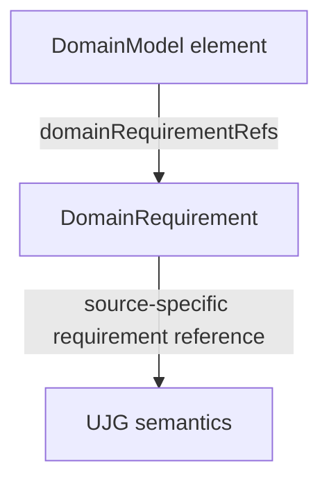
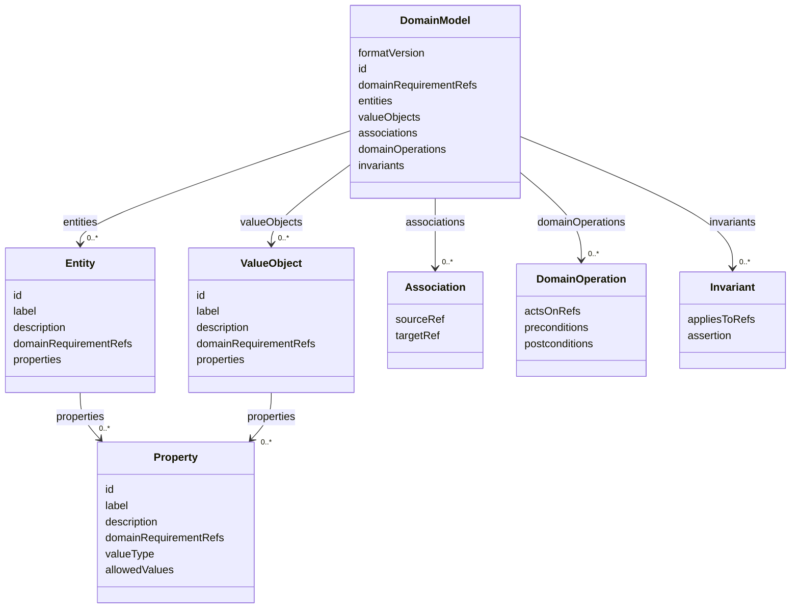

## Overview

The Domain Model Document Extension defines an optional, technology-neutral application domain
model attached to a `UJGDocument`.

The extension is a Document Extension, not an RDF optional module. Its payload is opaque JSON from
the perspective of generic UJG JSON-LD processing. It is validated by JSON Schema and derives
traceability from [[UJG Domain Requirements]].

The Domain Model Extension does not prescribe technical realization.

## Extension Attachment {data-cop-concept="domain-model-extension"}

The extension value is attached to `UJGDocument.extensions` using the key
`org.openuji.domain-model`.

```json
{
  "@type": "UJGDocument",
  "@id": "https://example.org/journey.jsonld",
  "extensions": {
    "org.openuji.domain-model": {
      "formatVersion": "0.1",
      "id": "urn:domain:model:example",
      "domainRequirementRefs": [],
      "entities": [],
      "valueObjects": [],
      "associations": [],
      "domainOperations": [],
      "invariants": []
    }
  },
  "nodes": []
}
```

<spec-statement>The value of `extensions["org.openuji.domain-model"]` **MUST** be a
`DomainModel` payload conforming to this specification.</spec-statement>

<spec-statement>Core **MUST NOT** define Domain Model-specific properties such as `domainModel` or
`domainModelRef`.</spec-statement>

## Processing Model {data-cop-concept="domain-model-processing"}

Generic UJG processors treat the Domain Model payload as opaque JSON.

<spec-statement>A processor that does not implement this extension **MAY** ignore its semantics
while preserving its JSON payload during non-lossy read-transform-write.</spec-statement>

<spec-statement>A processor implementing this extension **MUST** validate the payload using the
Domain Model JSON Schema.</spec-statement>

<spec-statement>A Domain Model-aware validator **MUST** resolve referenced Domain Requirements,
resolve internal Domain Model references, and apply the semantic rules defined by this
specification.</spec-statement>

Unknown Domain Model semantics MUST NOT affect Core identity, import resolution, reference
resolution, Graph traversal, or Graph semantics.

## Relationship to Domain Requirements {data-cop-concept="domain-model-traceability"}

Domain Model traceability flows through Domain Requirements.



<spec-statement>The Domain Model Extension **MUST NOT** duplicate direct references to Conditions,
Effects, States, EntryBindings, or other UJG semantic sources for requirement traceability.</spec-statement>

Domain Requirements are the boundary between UJG journey semantics and the Domain Model.

## Domain Model Vocabulary

Version `0.1` defines exactly these payload object types:

- `DomainModel`
- `Entity`
- `ValueObject`
- `Property`
- `Association`
- `DomainOperation`
- `Invariant`



Version `0.1` does not define aggregate boundaries, domain services, domain events, repositories,
commands, bounded contexts, persistence models, API models, executable rule languages, or technical
architecture.

### DomainModel {data-cop-concept="domain-model"}

A `DomainModel` is the root payload stored in `extensions["org.openuji.domain-model"]`.

| Property | Requirement |
| --- | --- |
| `formatVersion` | MUST be `"0.1"`. |
| `id` | MUST be a stable identifier for the Domain Model. |
| `domainRequirementRefs` | MUST declare the complete set of UJG Domain Requirements this Domain Model claims to satisfy. |
| `entities` | MUST exist; MAY be empty. |
| `valueObjects` | MUST exist; MAY be empty. |
| `associations` | MUST exist; MAY be empty. |
| `domainOperations` | MUST exist; MAY be empty. |
| `invariants` | MUST exist; MAY be empty. |

<spec-statement>Every requirement listed in `DomainModel.domainRequirementRefs` **MUST** be
referenced by at least one contained Domain Model element.</spec-statement>

<spec-statement>Every `domainRequirementRefs` value on a contained element **MUST** also occur in
the root `DomainModel.domainRequirementRefs`.</spec-statement>

### Common Domain Element

Every `Entity`, `ValueObject`, `Property`, `Association`, `DomainOperation`, and `Invariant` shares
the same basic identification and traceability properties.

| Property | Requirement |
| --- | --- |
| `id` | MUST uniquely identify the element within the Domain Model and remain stable while the element's semantics remain stable. |
| `label` | MUST provide a concise human-readable domain name. |
| `description` | MAY provide explanatory human-readable text. |
| `domainRequirementRefs` | MUST contain at least one reference, contain no duplicates, and contain only references declared by the containing `DomainModel`. |

### Entity and ValueObject

An `Entity` represents a domain object for which independent identity matters. A `ValueObject`
represents a domain value whose meaning is determined by its value rather than an independent
identity lifecycle.

Both object types use the Common Domain Element properties and add:

| Property | Requirement |
| --- | --- |
| `properties` | MUST be an array of `Property`. |

The specification does not prescribe how entity instances are identified or persisted. A producer
SHOULD NOT introduce a `ValueObject` merely to wrap a primitive value without domain significance.

### Property

A `Property` describes domain information belonging to an `Entity` or `ValueObject`.

In addition to the Common Domain Element properties, a `Property` has:

| Property | Requirement |
| --- | --- |
| `valueType` | MUST be one of `string`, `integer`, `number`, `boolean`, `date`, or `datetime`. |
| `allowedValues` | MAY restrict the property to a finite set of values. |

The specification does not define storage types, programming-language types, columns, nullability,
or serialization formats.

### Association

An `Association` represents a required relationship between domain objects.

In addition to the Common Domain Element properties, an `Association` has:

| Property | Requirement |
| --- | --- |
| `sourceRef` | MUST resolve to an `Entity` or `ValueObject` in the same Domain Model. |
| `targetRef` | MUST resolve to an `Entity` or `ValueObject` in the same Domain Model. |

Version `0.1` does not standardize cardinality and does not define ORM or persistence
relationships.

### DomainOperation

A `DomainOperation` represents behavior required from the domain.

In addition to the Common Domain Element properties, a `DomainOperation` has:

| Property | Requirement |
| --- | --- |
| `actsOnRefs` | MUST be an array of references to `Entity` or `ValueObject` elements in the same Domain Model. |
| `preconditions` | MUST be an array of technology-neutral semantic statements. |
| `postconditions` | MUST be an array of technology-neutral semantic statements. |

Version `0.1` deliberately defines no predicate or expression language. A `DomainOperation` does
not imply an API operation, HTTP endpoint, service method, UI action handler, or execution location.

### Invariant

An `Invariant` represents a domain rule that must remain true across valid domain behavior.

In addition to the Common Domain Element properties, an `Invariant` has:

| Property | Requirement |
| --- | --- |
| `appliesToRefs` | MUST reference Domain Model elements. |
| `assertion` | MUST be a technology-neutral semantic statement. |

Version `0.1` defines no executable invariant language.

## Validation Semantics {data-cop-concept="domain-model-validation"}

JSON Schema is responsible only for structural validation. Cross-reference resolution MUST be
performed by a Domain Model-aware UJG validator.

### Internal References {data-cop-concept="domain-model-internal-references"}

<spec-statement>All Domain Model element IDs **MUST** be unique.</spec-statement>

<spec-statement>`Association.sourceRef`, `Association.targetRef`, `DomainOperation.actsOnRefs`,
and `Invariant.appliesToRefs` **MUST** resolve within the same Domain Model.</spec-statement>

A structurally valid JSON document containing dangling internal references is semantically invalid.

### Domain Requirement Resolution {data-cop-concept="domain-model-requirement-resolution"}

<spec-statement>Every value in `domainRequirementRefs` **MUST** resolve to a UJG Domain
Requirement available through the containing UJG document and its normal import
resolution.</spec-statement>

A dangling Domain Requirement reference makes the Domain Model invalid.

### Requirement Coverage {data-cop-concept="domain-model-requirement-coverage"}

<spec-statement>For every Domain Requirement declared by `DomainModel.domainRequirementRefs`, at
least one contained Domain Model element **MUST** reference that requirement.</spec-statement>

This permits one requirement to justify multiple Domain Model elements, and one Domain Model element
to satisfy multiple requirements. No one-to-one mapping is implied.

## Realization Boundary

The Domain Model describes domain semantics.

It MUST NOT prescribe frontend versus backend placement, browser versus server execution, local or
remote persistence, SQL or NoSQL, APIs or transport, framework architecture, repositories or
controllers, authentication mechanisms, messaging infrastructure, or deployment topology.

## Normative Artifacts

The normative Domain Model JSON Schema is defined below and is published at
`https://ujg.specs.openuji.org/ed/extensions/domain-model/domain-model.schema.json`.

For namespace-style artifact discovery, the same schema is also published at
`https://ujg.specs.openuji.org/ed/ns/domain-model.schema.json`.

:::include ./domain-model.schema.json :::

## Examples

### Workshop Waitlist Domain Model

This example attaches a Domain Model payload to a `UJGDocument`. The example assumes the referenced
Domain Requirement nodes are present in the containing document or resolvable through normal UJG
imports.

```json
{
  "@context": [
    "https://ujg.specs.openuji.org/ed/ns/context.jsonld",
    "https://ujg.specs.openuji.org/ed/ns/domain-requirements.context.jsonld"
  ],
  "@id": "https://example.com/ujg/workshop-waitlist.jsonld",
  "@type": "UJGDocument",
  "extensions": {
    "org.openuji.domain-model": {
      "formatVersion": "0.1",
      "id": "urn:domain:model:workshop-waitlist",
      "domainRequirementRefs": [
        "urn:ujg:domain-requirement:waitlisted-participation",
        "urn:ujg:domain-requirement:offer-validity",
        "urn:ujg:domain-requirement:accept-offer"
      ],
      "entities": [
        {
          "id": "urn:domain:entity:participant",
          "label": "Participant",
          "domainRequirementRefs": [
            "urn:ujg:domain-requirement:waitlisted-participation",
            "urn:ujg:domain-requirement:accept-offer"
          ],
          "properties": [
            {
              "id": "urn:domain:property:participation-status",
              "label": "Participation status",
              "domainRequirementRefs": [
                "urn:ujg:domain-requirement:waitlisted-participation",
                "urn:ujg:domain-requirement:accept-offer"
              ],
              "valueType": "string",
              "allowedValues": [
                "waitlisted",
                "confirmed"
              ]
            }
          ]
        },
        {
          "id": "urn:domain:entity:offer",
          "label": "Offer",
          "domainRequirementRefs": [
            "urn:ujg:domain-requirement:offer-validity",
            "urn:ujg:domain-requirement:accept-offer"
          ],
          "properties": [
            {
              "id": "urn:domain:property:offer-expires-at",
              "label": "Offer expires at",
              "domainRequirementRefs": [
                "urn:ujg:domain-requirement:offer-validity"
              ],
              "valueType": "datetime"
            }
          ]
        }
      ],
      "valueObjects": [],
      "associations": [
        {
          "id": "urn:domain:association:offer-participant",
          "label": "Offer participant",
          "domainRequirementRefs": [
            "urn:ujg:domain-requirement:accept-offer"
          ],
          "sourceRef": "urn:domain:entity:offer",
          "targetRef": "urn:domain:entity:participant"
        }
      ],
      "domainOperations": [
        {
          "id": "urn:domain:operation:accept-offer",
          "label": "Accept offer",
          "domainRequirementRefs": [
            "urn:ujg:domain-requirement:accept-offer"
          ],
          "actsOnRefs": [
            "urn:domain:entity:offer",
            "urn:domain:entity:participant"
          ],
          "preconditions": [
            "The offer is currently valid."
          ],
          "postconditions": [
            "The offer is consumed and the participant is confirmed."
          ]
        }
      ],
      "invariants": [
        {
          "id": "urn:domain:invariant:accepted-offer-consumed",
          "label": "Accepted offer is consumed",
          "domainRequirementRefs": [
            "urn:ujg:domain-requirement:accept-offer"
          ],
          "appliesToRefs": [
            "urn:domain:entity:offer",
            "urn:domain:operation:accept-offer"
          ],
          "assertion": "An accepted offer is no longer outstanding."
        }
      ]
    }
  },
  "nodes": [
    {
      "@type": "StateDomainRequirement",
      "@id": "urn:ujg:domain-requirement:waitlisted-participation",
      "label": "Waitlisted participation is distinguishable",
      "stateRef": "urn:ujg:state:waitlisted",
      "requirement": "The implementation must preserve that the participant is currently waiting for a place in the workshop."
    },
    {
      "@type": "ConditionDomainRequirement",
      "@id": "urn:ujg:domain-requirement:offer-validity",
      "label": "Offer validity can be determined",
      "conditionRef": "urn:ujg:condition:offer-valid",
      "requirement": "The implementation must be able to determine whether the outstanding workshop offer is currently valid."
    },
    {
      "@type": "EffectDomainRequirement",
      "@id": "urn:ujg:domain-requirement:accept-offer",
      "label": "Accepted offer confirms participation",
      "effectRef": "urn:ujg:effect:accept-offer",
      "requirement": "Accepting the outstanding offer must consume that offer and establish confirmed workshop participation."
    }
  ]
}
```
