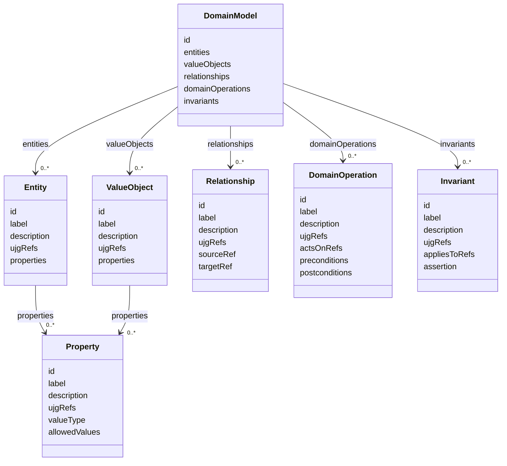

## Overview

The Domain Model Document Extension defines an optional, technology-neutral application domain
model attached to a `UJGDocument`.

The extension is a Document Extension, not an RDF optional module. Its payload is opaque JSON from
the perspective of generic UJG JSON-LD processing. It is validated by JSON Schema.

UJG describes journeys and observable behavior. The Domain Model describes the domain semantics
used to realize that behavior, together with legitimate domain knowledge that may exist
independently of the journey.

UJG constrains the Domain Model. It does not mechanically derive it or exhaustively define it.

The Domain Model Extension does not prescribe technical realization.

## Extension Attachment {data-cop-concept="domain-model-extension"}

The extension value is attached to `UJGDocument.extensions` using the key
`org.openuji.domain-model`.

```json
{
  "@type": "UJGDocument",
  "@id": "https://example.org/journey.jsonld",
  "extensions": {
    "org.openuji.domain-model": {
      "id": "urn:domain:model:example",
      "entities": [],
      "valueObjects": [],
      "relationships": [],
      "domainOperations": [],
      "invariants": []
    }
  },
  "nodes": []
}
```

<spec-statement>The value of `extensions["org.openuji.domain-model"]` **MUST** be a
`DomainModel` payload conforming to this specification.</spec-statement>

<spec-statement>Core **MUST NOT** define Domain Model-specific properties such as `domainModel` or
`domainModelRef`.</spec-statement>

## Processing Model {data-cop-concept="domain-model-processing"}

Generic UJG processors treat the Domain Model payload as opaque JSON.

<spec-statement>A processor that does not implement this extension **MAY** ignore its semantics
while preserving its JSON payload during non-lossy read-transform-write.</spec-statement>

<spec-statement>A processor implementing this extension **MUST** validate the payload using the
Domain Model JSON Schema.</spec-statement>

<spec-statement>The Domain Model payload **MUST NOT** carry an independent version marker.</spec-statement>

Its applicable contract is selected from the specification family of the containing UJG document and
the resolved namespace artifact route, such as `/ed/ns/domain-model.schema.json` for the Editor's
Draft.

<spec-statement>A Domain Model-aware validator **MUST** resolve internal Domain Model references,
resolve present `ujgRefs`, and apply the semantic rules defined by this specification.</spec-statement>

Unknown Domain Model semantics MUST NOT affect Core identity, import resolution, reference
resolution, Graph traversal, or Graph semantics.

## Relationship to UJG {data-cop-concept="domain-model-traceability"}

The Domain Model Extension describes UJG as a behavioral constraint on domain design, not as a
source of one-to-one domain objects.

| Node | Requirement |
| --- | --- |
| State |  MUST be materializable by the eventual implementation |
| Condition | MUST be decidable when its transition is evaluated |
| Effect  | MUST be realizable when its transition occurs |
| Entry   | MUST provide sufficient context for its target journey state |
| Transition | connects these behavioral obligations |

This relationship does not require each UJG element to have a corresponding Domain Model element.

<spec-statement>A Domain Model element **MAY** use `ujgRefs` to identify UJG semantic elements that
constrain, motivate, or explain the existence or semantics of that Domain Model element.</spec-statement>

<spec-statement>`ujgRefs` **MUST NOT** imply that the Domain Model element was logically or
mechanically derived from the referenced UJG element.</spec-statement>

A Domain Model element may reference multiple UJG elements. One UJG element may justify multiple
Domain Model elements. No one-to-one mapping is implied.

### Multi-Journey Composite Evidence Scope {data-cop-concept="domain-model-composite-evidence-scope"}

When a [=CompositeState=] contains more than one child [=Journey=] through `subjourneyRefs`, each
child journey is a separate semantic evidence scope for Domain Model interpretation. A producer
SHOULD analyze each child journey independently before correlating domain concepts across sibling
child journeys.

The evidence scope for a child journey includes that child [=Journey=]'s entries, states,
composite states, transitions, exits, and applicable optional-module nodes referenced by those
topology elements. Conditions and Effects attached to transitions are interpreted as evidence in the
behavioral concern of each transition's owning journey. When the same Condition or Effect resource is
referenced by transitions in more than one journey, it may contribute evidence in each owning journey
scope; sharing the resource does not change Graph ownership.

<spec-statement>A Domain Model producer or evaluator **MUST NOT** flatten sibling child journeys into
one implied sequence or combined state space merely because they are referenced by the same
[=CompositeState=].</spec-statement>

<spec-statement>A child [=Journey=] referenced by `subjourneyRefs` **MAY** appear in a Domain Model
element's `ujgRefs` when it directly constrains, motivates, or explains that element. More specific
UJG refs, such as state, transition, condition, or effect refs, MAY also be used.</spec-statement>

<spec-statement>A Domain Model producer or evaluator **MUST NOT** infer any of the following solely
from multi-journey [=CompositeState=] topology: one child journey maps to exactly one `Entity`,
`ValueObject`, `Relationship`, `DomainOperation`, or `Invariant`; sibling child journeys imply a
domain relationship; a child journey is a bounded context, aggregate, service, component, persistence
boundary, or technical module; sibling journeys synchronize, depend on each other, cause each other,
or share a lifecycle; sibling child states form Cartesian-product domain states; a child
[=JourneyExit=] is collective completion of the composite or aggregate completion; or presentation,
structural, and interaction-local states belong in the Domain Model.</spec-statement>

## State Materialization Boundary {data-cop-concept="domain-model-state-boundary"}

Every reachable UJG `State` must ultimately be materializable by an implementation.

This does not imply that a UJG `State` is a domain state. A UJG `State` may be directly backed by
domain state, derived from domain facts, derived from application state, interaction-local,
presentation-local, or structural.

The Domain Model Extension describes only the domain part of that realization.

<spec-statement>A Domain Model **MUST NOT** absorb interaction state, presentation state, or
structural topology merely to mirror UJG topology.</spec-statement>

For example, a form-error state may require no Domain Model element, while a
confirmed-participation state may require durable domain semantics.

## Domain Knowledge Beyond Topology {data-cop-concept="domain-model-independent-knowledge"}

A Domain Model may contain domain knowledge not represented by UJG. Examples include business
invariants, domain policies, legal or organizational constraints, domain classifications, temporal
business rules, consistency constraints, and facts supplied from domain expertise.

<spec-statement>A Domain Model element without `ujgRefs` **MAY** be valid when it represents
explicit domain knowledge or a documented domain-design decision.</spec-statement>

Absence of `ujgRefs` means only that no direct UJG provenance is asserted. It does not make the
element invalid.

## UJG Alignment {data-cop-concept="domain-model-alignment"}

Additional domain knowledge MUST NOT contradict canonical UJG behavior.

If a Domain Model rule changes observable journey behavior by preventing a UJG transition,
introducing a new user-visible branch, changing which UJG `State` is reachable, changing the
observable result of an `Effect`, or introducing a user-visible failure outcome, then the
corresponding behavior MUST be represented in UJG before the Domain Model can be considered aligned
with that UJG.

Pure domain constraints that do not alter the represented journey MAY remain exclusively in the
Domain Model.

## Domain Model Vocabulary

This specification defines exactly these payload object types:

- `DomainModel`
- `Entity`
- `ValueObject`
- `Property`
- `Relationship`
- `DomainOperation`
- `Invariant`



This specification does not define aggregate boundaries, domain services, domain events, repositories,
commands, bounded contexts, persistence models, API models, executable rule languages, or technical
architecture.

### DomainModel {data-cop-concept="domain-model"}

A `DomainModel` is the root payload stored in `extensions["org.openuji.domain-model"]`.

| Property | Requirement |
| --- | --- |
| `id` | MUST be a stable identifier for the Domain Model. |
| `entities` | MUST exist; MAY be empty. |
| `valueObjects` | MUST exist; MAY be empty. |
| `relationships` | MUST exist; MAY be empty. |
| `domainOperations` | MUST exist; MAY be empty. |
| `invariants` | MUST exist; MAY be empty. |

<spec-statement>`DomainModel` **MUST NOT** define `ujgRefs`.</spec-statement>

### Common Domain Element

Every `Entity`, `ValueObject`, `Property`, `Relationship`, `DomainOperation`, and `Invariant` shares
the same basic identification and optional traceability properties.

| Property | Requirement |
| --- | --- |
| `id` | MUST uniquely identify the element within the Domain Model and remain stable while the element's semantics remain stable. |
| `label` | MUST provide a concise human-readable domain name. |
| `description` | MAY provide explanatory human-readable text. |
| `ujgRefs` | MAY contain direct design traceability refs. When present, it MUST contain at least one value, contain no duplicates, and contain stable UJG identifiers resolvable through the containing UJG document and normal UJG import resolution. |

### Entity and ValueObject

An `Entity` represents a domain concept for which independent identity matters. A `ValueObject`
represents a domain concept whose meaning is defined by value rather than independent identity.

Both object types use the Common Domain Element properties and add:

| Property | Requirement |
| --- | --- |
| `properties` | MUST be an array of `Property`. |

The specification does not prescribe how entity instances are identified or persisted. A producer
SHOULD NOT introduce a `ValueObject` merely to wrap a primitive value without domain significance.

### Property

A `Property` describes domain information belonging to an `Entity` or `ValueObject`.

In addition to the Common Domain Element properties, a `Property` has:

| Property | Requirement |
| --- | --- |
| `valueType` | MUST be one of `string`, `integer`, `number`, `boolean`, `date`, or `datetime`. |
| `allowedValues` | MAY restrict the property to a finite set of values. |

The specification does not define storage types, programming-language types, columns, nullability,
or serialization formats.

### Relationship

A `Relationship` represents a domain relationship between modeled concepts.

In addition to the Common Domain Element properties, a `Relationship` has:

| Property | Requirement |
| --- | --- |
| `sourceRef` | MUST resolve to an `Entity` or `ValueObject` in the same Domain Model. |
| `targetRef` | MUST resolve to an `Entity` or `ValueObject` in the same Domain Model. |

This specification does not standardize cardinality and does not define ORM or persistence
relationships.

### DomainOperation

A `DomainOperation` represents technology-neutral domain behavior.

In addition to the Common Domain Element properties, a `DomainOperation` has:

| Property | Requirement |
| --- | --- |
| `actsOnRefs` | MUST be an array of references to `Entity` or `ValueObject` elements in the same Domain Model. |
| `preconditions` | MUST be an array of technology-neutral semantic statements. |
| `postconditions` | MUST be an array of technology-neutral semantic statements. |

This specification deliberately defines no predicate or expression language. A `DomainOperation` does
not imply an API operation, HTTP endpoint, service method, UI action handler, or execution location.

### Invariant

An `Invariant` represents a rule that must remain true across valid domain behavior.

In addition to the Common Domain Element properties, an `Invariant` has:

| Property | Requirement |
| --- | --- |
| `appliesToRefs` | MUST reference Domain Model elements. |
| `assertion` | MUST be a technology-neutral semantic statement. |

An `Invariant` may be constrained by UJG and therefore have `ujgRefs`, or it may represent
independent business knowledge and therefore have no `ujgRefs`.

This specification defines no executable invariant language.

## Validation Semantics {data-cop-concept="domain-model-validation"}

JSON Schema is responsible only for structural validation. Cross-reference resolution MUST be
performed by a Domain Model-aware UJG validator.

### Internal References {data-cop-concept="domain-model-internal-references"}

<spec-statement>All Domain Model element IDs **MUST** be unique.</spec-statement>

<spec-statement>`Relationship.sourceRef`, `Relationship.targetRef`, `DomainOperation.actsOnRefs`,
and `Invariant.appliesToRefs` **MUST** resolve within the same Domain Model.</spec-statement>

A structurally valid JSON document containing dangling internal references is semantically invalid.

### UJG Reference Resolution {data-cop-concept="domain-model-ujg-reference-resolution"}

<spec-statement>Every value in `ujgRefs`, when present, **MUST** resolve to a UJG semantic element
available through the containing UJG document and its normal import resolution.</spec-statement>

A dangling `ujgRefs` value makes the Domain Model semantically invalid.

Do not define a serialized UJG coverage list. Do not derive or require global UJG coverage from
`ujgRefs`. Journey-realization completeness belongs to design and evaluation tooling, not JSON
Schema validity.

<spec-statement>A Domain Model-aware validator **MUST** reject Domain Model rules that directly
contradict known referenced UJG semantics where such contradiction can be determined.</spec-statement>

For multi-journey [=CompositeState=] topology, Domain Model-aware validation and evaluation SHOULD
consider each referenced child [=Journey=] as an independent evidence scope before accepting any
cross-child correlation. A correlation across sibling child journeys is valid only when supported by
semantic evidence such as shared referenced domain-relevant states, conditions, effects, entries,
exits, explicit domain knowledge, or a documented domain-design decision.

## Realization Boundary

The Domain Model describes domain semantics.

It MUST NOT prescribe frontend versus backend placement, browser versus server execution, local or
remote persistence, SQL or NoSQL, APIs or transport, framework architecture, repositories or
controllers, authentication mechanisms, messaging infrastructure, or deployment topology.

## Normative Artifacts

The normative Domain Model JSON Schema is defined below and is published at
`https://ujg.specs.openuji.org/ed/extensions/domain-model/domain-model.schema.json`.

For namespace-style artifact discovery, the same schema is also published at
`https://ujg.specs.openuji.org/ed/ns/domain-model.schema.json`.

:::include ./domain-model.schema.json :::

## Examples

### Workshop Waitlist Domain Model

This example attaches a Domain Model payload to a `UJGDocument`. It demonstrates direct UJG
traceability and an invariant with no artificial UJG provenance.

```json
{
  "@context": [
    "https://ujg.specs.openuji.org/ed/ns/context.jsonld",
    "https://ujg.specs.openuji.org/ed/ns/condition.context.jsonld",
    "https://ujg.specs.openuji.org/ed/ns/effect.context.jsonld"
  ],
  "@id": "https://example.com/ujg/workshop-waitlist.jsonld",
  "@type": "UJGDocument",
  "extensions": {
    "org.openuji.domain-model": {
      "id": "urn:domain:model:workshop-waitlist",
      "entities": [
        {
          "id": "urn:domain:entity:workshop-participation",
          "label": "Workshop participation",
          "ujgRefs": [
            "urn:ujg:state:waitlisted",
            "urn:ujg:state:registration-confirmed",
            "urn:ujg:condition:participant-already-waitlisted"
          ],
          "properties": [
            {
              "id": "urn:domain:property:participation-status",
              "label": "Participation status",
              "ujgRefs": [
                "urn:ujg:state:waitlisted",
                "urn:ujg:state:registration-confirmed"
              ],
              "valueType": "string",
              "allowedValues": [
                "waitlisted",
                "confirmed"
              ]
            }
          ]
        }
      ],
      "valueObjects": [],
      "relationships": [],
      "domainOperations": [
        {
          "id": "urn:domain:operation:join-waitlist",
          "label": "Join waitlist",
          "ujgRefs": [
            "urn:ujg:effect:join-waitlist"
          ],
          "actsOnRefs": [
            "urn:domain:entity:workshop-participation"
          ],
          "preconditions": [
            "The participant is eligible to join the waitlist."
          ],
          "postconditions": [
            "A workshop participation is waitlisted."
          ]
        }
      ],
      "invariants": [
        {
          "id": "urn:domain:invariant:participation-scope",
          "label": "Participation scope",
          "appliesToRefs": [
            "urn:domain:entity:workshop-participation"
          ],
          "assertion": "A workshop participation belongs to one participant and one workshop."
        }
      ]
    }
  },
  "nodes": [
    {
      "@type": "Journey",
      "@id": "urn:ujg:journey:workshop-waitlist",
      "defaultEntryRef": "urn:ujg:entry:workshop-waitlist",
      "entryRefs": [
        "urn:ujg:entry:workshop-waitlist"
      ],
      "stateRefs": [
        "urn:ujg:state:registration-open",
        "urn:ujg:state:waitlisted",
        "urn:ujg:state:registration-confirmed"
      ],
      "transitionRefs": [
        "urn:ujg:transition:join-waitlist",
        "urn:ujg:transition:confirm-registration"
      ]
    },
    {
      "@type": "JourneyEntry",
      "@id": "urn:ujg:entry:workshop-waitlist",
      "stateRef": "urn:ujg:state:registration-open"
    },
    {
      "@type": "State",
      "@id": "urn:ujg:state:registration-open",
      "label": "Registration open"
    },
    {
      "@type": "State",
      "@id": "urn:ujg:state:waitlisted",
      "label": "Waitlisted"
    },
    {
      "@type": "State",
      "@id": "urn:ujg:state:registration-confirmed",
      "label": "Registration confirmed"
    },
    {
      "@type": "Condition",
      "@id": "urn:ujg:condition:participant-already-waitlisted"
    },
    {
      "@type": "Effect",
      "@id": "urn:ujg:effect:join-waitlist"
    },
    {
      "@type": "Transition",
      "@id": "urn:ujg:transition:join-waitlist",
      "from": "urn:ujg:state:registration-open",
      "to": "urn:ujg:state:waitlisted",
      "conditionRef": "urn:ujg:condition:participant-already-waitlisted",
      "effectRef": "urn:ujg:effect:join-waitlist"
    },
    {
      "@type": "Transition",
      "@id": "urn:ujg:transition:confirm-registration",
      "from": "urn:ujg:state:waitlisted",
      "to": "urn:ujg:state:registration-confirmed"
    }
  ]
}
```
