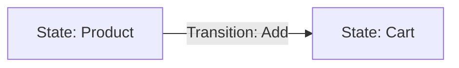
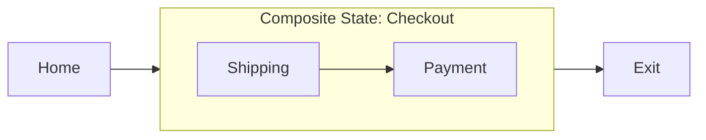
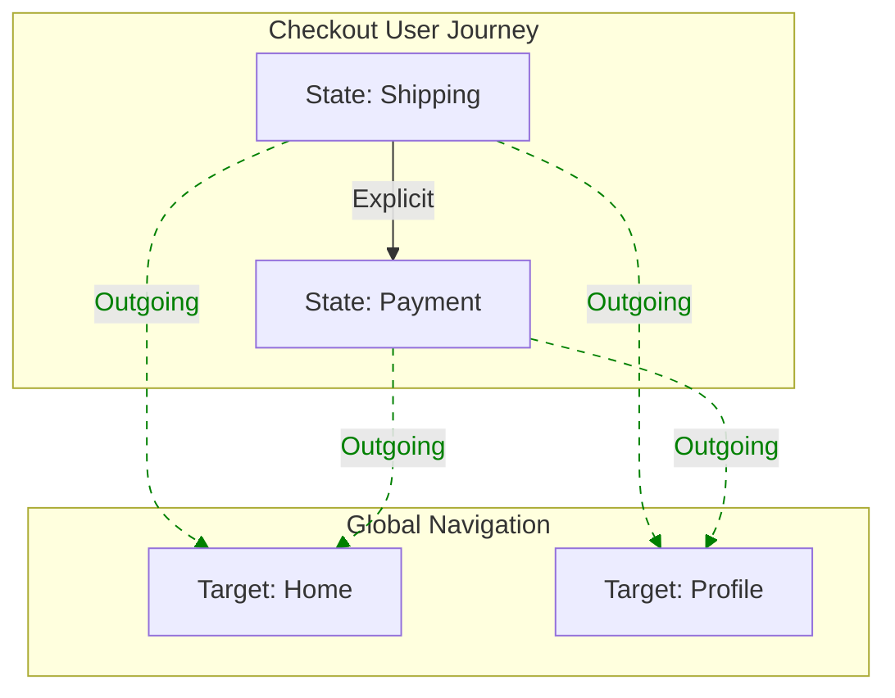

## Overview

This module defines the vocabulary for **intended** user flow. It extends [[UJG Core]] to support structured, interactive graphs with composition via sub-journey references, organization tags, and reusable outgoing navigation patterns.

## Terminology

* <dfn>Journey</dfn>: A named container for a user flow.
* <dfn>State</dfn>: A discrete node in the experience (e.g., a screen, modal).
* <dfn>Transition</dfn>: A directed edge between two states.
* <dfn>CompositeState</dfn>: A state that encapsulates another [=Journey=] (sub-journey).
* <dfn>OutgoingTransition</dfn>: A one way edge pointing to a next possible [=State=]
* <dfn>OutgoingTransitionGroup</dfn>: A reusable set of outgoing transitions that a Consumer can treat as present on multiple states (e.g., global nav).

---

## The Core Graph {data-cop-concept="core"}

<spec-statement>A [=Journey=] **MUST** consist of [=State|States=] connected by [=Transition|Transitions=].</spec-statement>

### Visual Model



### Data Model

#### The Journey Container

<spec-statement>A [=Journey=] **MUST** include:

* `type`: `"Journey"`
* `id`: Unique URI/URN.
* `startState`: ID of the entry [=State=] or [=CompositeState=].
* `stateRefs`: Array of IDs of [=State=] or [=CompositeState=] Nodes.
* `transitionRefs`: Array of IDs of [=Transition=] Nodes.
* `outgoingTransitionGroupRefs`: (Optional) Array of IDs of [=OutgoingTransitionGroup=] Nodes.
</spec-statement>

#### The State Object

A [=State=] **MUST** include:

* `type`: `"State"`
* `id`: Unique URI/URN.
* `label`: Human-readable string.
* `tags`: (Optional) Array of strings for grouping (e.g., `["phase:checkout"]`).

#### The Transition Object

A [=Transition=] **MUST** include:

* `type`: `"Transition"`
* `id`: Unique URI/URN.
* `from`: ID of the source [=State=] or [=CompositeState=].
* `to`: ID of the target [=State=] or [=CompositeState=].
* `label`: (Optional) Action name.


---

## Composition (CompositeState)

Composition allows a node to reference an entire sub-journey, enabling "zoomable" graph interactions.

### Visual Model



### Schema

A [=CompositeState=] **MUST** include:

* `type`: `"CompositeState"`
* `id`: Unique URI/URN.
* `label`: Human-readable string.
* `subjourneyId`: The ID of the target [=Journey=].


---

## Reusability (OutgoingTransitionGroup) {data-cop-concept="reusability"}

An [=OutgoingTransitionGroup=] defines reusable outgoing transitions (e.g., headers/footers) to avoid duplicating common navigation across many states.

An [=OutgoingTransitionGroup=] **MUST** include:

* `type`: `"OutgoingTransitionGroup"`
* `id`: Unique URI/URN.
* `outgoingTransitionRefs`: Array of IDs of [=OutgoingTransition=] Nodes.

An [=OutgoingTransition=] **MUST** include:

* `type`: `"OutgoingTransition"`
* `id`: Unique URI/URN.
* `to`: Target [=State=] or [=CompositeState=] ID.
* `label`: (Optional) Action name.


### Visual Model




### Processing Model (Injection)

<spec-statement>
When a Consumer loads a [=Journey=] referencing `outgoingTransitionGroupRefs`:
1. **Resolution:**:
  * The Consumer **MUST** resolve each referenced [=OutgoingTransitionGroup=]
  * The Consumer **MUST** resolve each `outgoingTransitionRefs` entry to an [=OutgoingTransition=].
2. **Iteration:** The Consumer **MUST** iterate over every [=State=] and [=CompositeState=] ID in `stateRefs`.
3. **Injection:** The Consumer **MUST** treat each iterated state as having an outgoing edge to every resolved [=OutgoingTransition=] `to`.
4. **Deduplication:** A Consumer **SHOULD** treat injected and explicit edges with the same effective `from` and `to` as one effective edge.
</spec-statement>

---

## Validation Rules {data-cop-concept="validation"}

<spec-statement>
To ensure graph integrity, the following constraints **MUST** be met:
1. **Reference Integrity:** All `startState`, `stateRefs`, `transitionRefs`, `outgoingTransitionGroupRefs`, `outgoingTransitionRefs`, `from`, and `to` IDs **MUST** resolve to valid Nodes within the current scope or imported modules.
2. **Composition Safety**: `subjourneyId` **MUST** resolve to a valid [=Journey=].
3. **Group Resolution**: Every ID in `outgoingTransitionGroupRefs` **MUST** resolve to an [=OutgoingTransitionGroup=].
4. **Outgoing Resolution**: Every ID in `outgoingTransitionRefs` **MUST** resolve to an [=OutgoingTransition=].
</spec-statement>

---

## Appendix: Combined JSON Example {.unnumbered}

```json
{
  "@context": "https://ujg.specs.openuji.org/ed/context.jsonld",
  "type": "UJGDocument",
  "specVersion": "1.0",
  "items": [
    {
      "type": "Journey",
      "id": "urn:ujg:journey:main-site",
      "startState": "urn:ujg:state:home",
      "stateRefs": ["urn:ujg:state:home", "urn:ujg:state:checkout-flow"],
      "transitionRefs": ["urn:ujg:transition:home-to-checkout"],
      "outgoingTransitionGroupRefs": ["urn:ujg:otg:global-header"]
    },

    {
      "type": "Transition",
      "id": "urn:ujg:transition:home-to-checkout",
      "from": "urn:ujg:state:home",
      "to": { "id": "urn:ujg:state:checkout-flow", "type": "CompositeState" },
      "label": "Buy Now"
    },

    { "type": "State", "id": "urn:ujg:state:home", "label": "Home Page", "tags": ["phase:landing"] },

    {
      "type": "CompositeState",
      "id": "urn:ujg:state:checkout-flow",
      "label": "Checkout Process",
      "subjourneyId": "urn:ujg:journey:checkout"
    },

    { "type": "State", "id": "urn:ujg:state:profile", "label": "Profile" },

    {
      "type": "OutgoingTransition",
      "id": "urn:ujg:ot:go-home",
      "to": "urn:ujg:state:home",
      "label": "Home"
    },

    {
      "type": "OutgoingTransition",
      "id": "urn:ujg:ot:go-profile",
      "to": "urn:ujg:state:profile",
      "label": "Profile"
    },

    {
      "type": "OutgoingTransitionGroup",
      "id": "urn:ujg:otg:global-header",
      "outgoingTransitionRefs": ["urn:ujg:ot:go-home", "urn:ujg:ot:go-profile"]
    }
    
  ]
}

```