## Overview

This module defines the vocabulary for **intended** user flow. It extends [[UJG Core]] to support structured, interactive graphs with composition via sub-journey references, exported exits from nested journeys, organization tags, and reusable outgoing navigation patterns.

## Normative Artifacts

This module is published through the following artifacts:

- `graph.ttl`: ontology, published at `https://ujg.specs.openuji.org/ed/ns/graph`
- `graph.context.jsonld`: JSON-LD term mappings, published at `https://ujg.specs.openuji.org/ed/ns/graph.context.jsonld`
- `graph.shape.ttl`: SHACL validation rules, published at `https://ujg.specs.openuji.org/ed/ns/graph.shape`

Examples in this page use explicit Core and Graph context arrays. This keeps Graph's `stateRef` term scoped to [=JourneyEntry=] examples and avoids ambiguity with other modules that define their own compact `stateRef` terms.

## Terminology

- <dfn>Journey</dfn>: A named container for local traversable user flow topology.
- <dfn>JourneyEntry</dfn>: An explicit entry contract for a [=Journey=].
- <dfn>JourneyEntryIndex</dfn>: A catalogue of addressable journey entry states that does not define traversal.
- <dfn>LocalVertex</dfn>: An abstract local topology vertex of a [=Journey=].
- <dfn>State</dfn>: A discrete node in the experience (e.g., a screen, modal).
- <dfn>Transition</dfn>: A structural directed edge between local vertices of a [=Journey=].
- <dfn>CompositeState</dfn>: A state that encapsulates another [=Journey=] (sub-journey).
- <dfn>JourneyExit</dfn>: A terminal local graph vertex and exported completion contract declared by a [=Journey=].
- <dfn>OutgoingTransition</dfn>: A navigational affordance pointing to a next possible [=State=] or [=CompositeState=].
- <dfn>OutgoingTransitionGroup</dfn>: A reusable set of outgoing transitions that a Consumer can treat as present on multiple states (e.g., global nav).

---

## LocalVertex {data-cop-concept="local-vertex"}

A [=LocalVertex=] is the abstract topology node type for the local topology of a [=Journey=].

[=State=] and [=JourneyExit=] are sibling kinds of [=LocalVertex=]. A [=CompositeState=] is a specialized [=State=]. A [=JourneyExit=] is not a [=State=].

<spec-statement>
1. A [=State=] **MUST** be a [=LocalVertex=].
2. A [=CompositeState=] **MUST** be a [=State=].
3. A [=JourneyExit=] **MUST** be a [=LocalVertex=].
4. A [=JourneyExit=] **MUST NOT** be a [=State=].
</spec-statement>

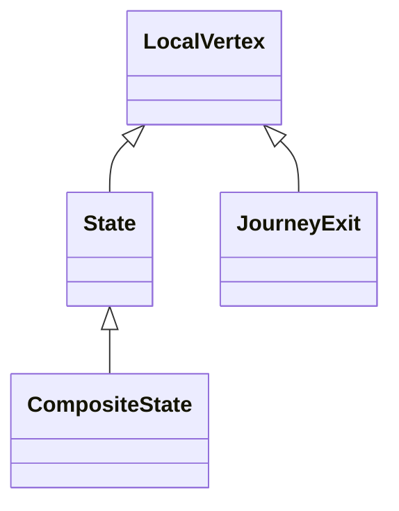
```mermaid
classDiagram
  class LocalVertex
  class State
  class CompositeState
  class JourneyExit

  LocalVertex <|-- State
  State <|-- CompositeState
  LocalVertex <|-- JourneyExit
```

---

## State {data-cop-concept="state"}

A [=State=] is the base graph node for a discrete point in an intended user experience, such as a page, screen, modal, or other user-visible step.

Later sections define navigation affordances that can be attached to eligible states. This section defines only the base state node.

<spec-statement>
1. A [=State=] **MUST** be identified by an IRI.
2. A [=State=] **MUST** declare exactly one `label`.
3. A [=State=] **MAY** declare one or more `tags`.
</spec-statement>

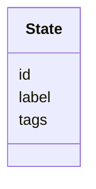
```mermaid
classDiagram
  class State {
    id
    label
    tags
  }
```

Example JSON node:

```json
{
  "@type": "State",
  "@id": "urn:ujg:state:search-form",
  "label": "Search form",
  "tags": [
    "phase:search"
  ]
}
```

---

## Transition {data-cop-concept="transition"}

A [=Transition=] is a structural directed edge between local vertices of a [=Journey=]. It models ordinary progression inside the local topology of a [=Journey=].

A [=Transition=] is not owned by either endpoint state. It is owned by a journey through `transitionRefs`.

<spec-statement>
1. A [=Transition=] **MUST** be identified by an IRI.
2. A [=Transition=] **MUST** declare exactly one `from` value.
3. A [=Transition=] **MUST** declare exactly one `to` value.
4. The `from` value of a [=Transition=] listed in a [=Journey=]'s `transitionRefs` **MUST** reference a [=State=] or [=CompositeState=] listed in that same journey's `stateRefs`.
5. The `to` value of a [=Transition=] listed in a [=Journey=]'s `transitionRefs` **MUST** reference either a [=State=] or [=CompositeState=] listed in that same journey's `stateRefs`, or a [=JourneyExit=] listed in that same journey's `exitRefs`.
6. Equivalently, `from` is a member of `stateRefs`, and `to` is a member of `stateRefs` union `exitRefs`.
7. A [=Transition=] **MUST NOT** use a [=JourneyExit=] as its `from` value.
8. A [=Transition=] **MUST NOT** use `from` or `to` to reference local vertices belonging to another journey.
9. A [=Transition=] **MAY** declare `toEntryRef` when its `to` value references a [=CompositeState=].
10. A [=Transition=] **MUST NOT** declare more than one `toEntryRef`.
11. `toEntryRef` **MUST NOT** weaken, replace, or bypass local transition endpoint validation.
12. A [=Transition=] **MUST NOT** declare more than one `label`.
</spec-statement>

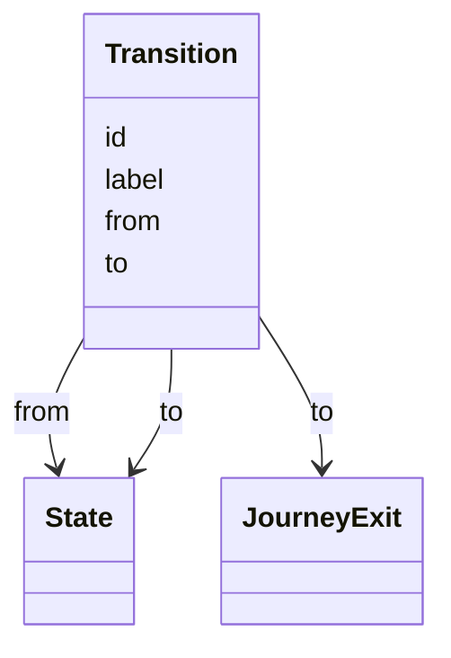
```mermaid
classDiagram
  class State
  class JourneyExit

  class Transition {
    id
    label
    from
    to
  }

  Transition --> State : from
  Transition --> State : to
  Transition --> JourneyExit : to
```

Example JSON node:

```json
{
  "@type": "Transition",
  "@id": "urn:ujg:transition:search-form-to-results",
  "label": "Submit search",
  "from": "urn:ujg:state:search-form",
  "to": "urn:ujg:state:results"
}
```

---

## Journey {data-cop-concept="journey"}

A [=Journey=] is the local container for intended flow topology. It lists the experiential states that belong to the journey, the terminal exits exported by the journey, and, when present, the transitions that connect those local vertices.

Use [=Journey=] when the modeled object owns local traversal, progression, or structural order. If the model only needs to list known entry points into pages, surfaces, flows, or journeys, use [=JourneyEntryIndex=] instead.

<spec-statement>
1. A [=Journey=] **MUST** be identified by an IRI.
2. A [=Journey=] **MUST** declare at least one `entryRefs` value.
3. A [=Journey=] **MUST** declare exactly one `defaultEntryRef`.
4. The `defaultEntryRef` value **MUST** be listed in the same [=Journey=]'s `entryRefs`.
5. A [=Journey=] **MUST** declare at least one `stateRefs` value.
6. A [=Journey=] **MAY** declare `transitionRefs`.
7. A [=Journey=] **MAY** declare `exitRefs`.
8. Each `entryRefs` value **MUST** reference a [=JourneyEntry=].
9. Each `stateRefs` value **MUST** reference a [=State=] or a valid [=State=] subclass defined by this module.
10. If present, each `transitionRefs` value **MUST** reference a [=Transition=].
11. If present, each `exitRefs` value **MUST** reference a [=JourneyExit=].
12. A [=Journey=] **MUST** contain one or more [=State|States=] and **MAY** connect local vertices with [=Transition|Transitions=].
13. The derived local vertex set of a [=Journey=] is `stateRefs` union `exitRefs`.
14. `stateRefs` contains experiential local vertices.
15. `exitRefs` contains terminal exported local vertices that participate in local topology but do not represent UX states.
16. Every `stateRefs` value of a [=Journey=] **SHOULD** belong to that journey's local experiential topology.
17. A state belongs to a journey when it is referenced by a [=JourneyEntry=] listed in the journey's `entryRefs`, a `from` or state-valued `to` endpoint of a transition listed in that journey's `transitionRefs`, or a local observable segment or condition connected by the journey's structural order.
18. A [=Journey=] **MUST NOT** list a linked destination page, surface, flow, or journey entry inside `stateRefs` merely because an [=OutgoingTransition=] can reach it.
</spec-statement>

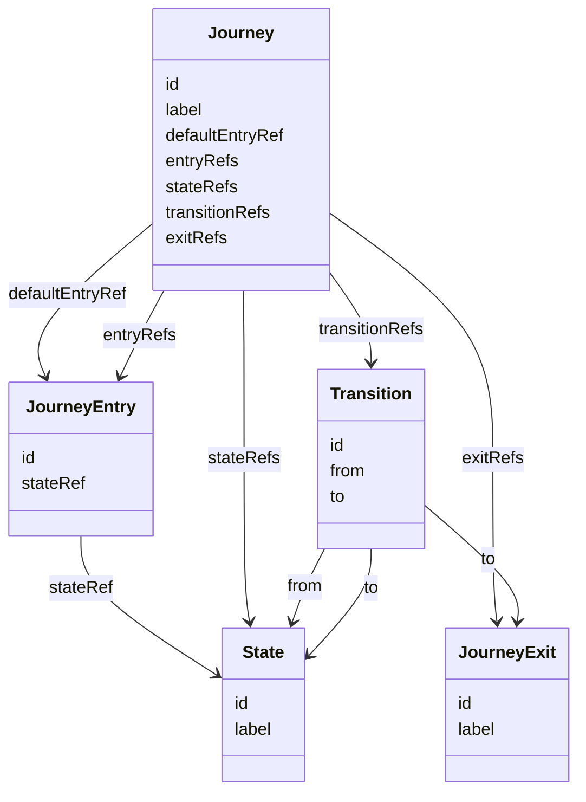
```mermaid
classDiagram
  class Journey {
    id
    label
    defaultEntryRef
    entryRefs
    stateRefs
    transitionRefs
    exitRefs
  }

  class JourneyEntry {
    id
    stateRef
  }

  class State {
    id
    label
  }

  class JourneyExit {
    id
    label
  }

  class Transition {
    id
    from
    to
  }

  Journey --> JourneyEntry : defaultEntryRef
  Journey --> JourneyEntry : entryRefs
  JourneyEntry --> State : stateRef
  Journey --> State : stateRefs
  Journey --> JourneyExit : exitRefs
  Journey --> Transition : transitionRefs
  Transition --> State : from
  Transition --> State : to
  Transition --> JourneyExit : to
```

Example JSON node:

```json
[
  {
    "@type": "Journey",
    "@id": "urn:ujg:journey:site-search",
    "label": "Site search",
    "defaultEntryRef": "urn:ujg:entry:site-search-default",
    "entryRefs": [
      "urn:ujg:entry:site-search-default"
    ],
    "stateRefs": [
      "urn:ujg:state:search-form",
      "urn:ujg:state:results"
    ],
    "transitionRefs": [
      "urn:ujg:transition:search-form-to-results"
    ]
  },
  {
    "@type": "JourneyEntry",
    "@id": "urn:ujg:entry:site-search-default",
    "stateRef": "urn:ujg:state:search-form"
  }
]
```

A single-state journey can omit `transitionRefs`:

```json
[
  {
    "@type": "Journey",
    "@id": "urn:ujg:journey:privacy-policy",
    "label": "Privacy policy",
    "defaultEntryRef": "urn:ujg:entry:privacy-policy-default",
    "entryRefs": [
      "urn:ujg:entry:privacy-policy-default"
    ],
    "stateRefs": [
      "urn:ujg:state:privacy-policy"
    ]
  },
  {
    "@type": "JourneyEntry",
    "@id": "urn:ujg:entry:privacy-policy-default",
    "stateRef": "urn:ujg:state:privacy-policy"
  }
]
```

---

## JourneyEntry {data-cop-concept="journey-entry"}

A [=JourneyEntry=] is an explicit entry contract for a [=Journey=]. It identifies the local [=State=] or [=CompositeState=] where traversal begins without making that entry node part of the local transition topology.

<spec-statement>
1. A [=JourneyEntry=] **MUST** be identified by an IRI.
2. A [=JourneyEntry=] **MUST** declare exactly one `stateRef`.
3. The `stateRef` value **MUST** reference a [=State=] or [=CompositeState=].
4. The `stateRef` value **MUST** be listed in the `stateRefs` of the same [=Journey=] that lists the [=JourneyEntry=] in `entryRefs`.
5. A [=JourneyEntry=] **MUST** be listed in exactly one [=Journey=]'s `entryRefs`.
6. A [=JourneyEntry=] **MUST NOT** reference a [=JourneyExit=].
7. A [=JourneyEntry=] **MUST NOT** be used as a [=Transition=]'s `from` or `to` value.
8. A [=JourneyEntry=] **MAY** declare one `label`.
9. A [=JourneyEntry=] **MAY** declare one or more `tags`.
</spec-statement>

Top-level execution of a [=Journey=] begins at the `stateRef` of the [=Journey=]'s `defaultEntryRef`. Child journey execution can select a more specific entry through a parent transition's `toEntryRef`; otherwise it also begins at the child journey's `defaultEntryRef`.

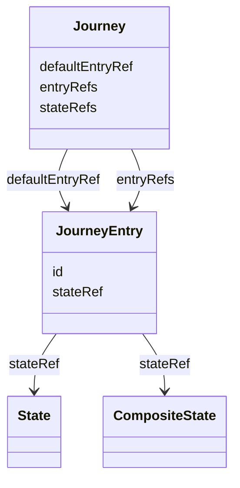
```mermaid
classDiagram
  class Journey {
    defaultEntryRef
    entryRefs
    stateRefs
  }
  class JourneyEntry {
    id
    stateRef
  }
  class State
  class CompositeState

  Journey --> JourneyEntry : defaultEntryRef
  Journey --> JourneyEntry : entryRefs
  JourneyEntry --> State : stateRef
  JourneyEntry --> CompositeState : stateRef
```

Example JSON node:

```json
{
  "@type": "JourneyEntry",
  "@id": "urn:ujg:entry:site-search-default",
  "label": "Default search entry",
  "stateRef": "urn:ujg:state:search-form"
}
```

---

## JourneyEntryIndex {data-cop-concept="journey-index"}

A [=JourneyEntryIndex=] is a Graph class and Core [=Node=] that acts as a catalogue of addressable journey entry states. It is not a subclass of [=Journey=] and does not define traversal. A Consumer **MUST NOT** infer that indexed states are reachable from one another, ordered as a path, or part of a parent-owned progression.

Use [=Journey=] when modeling local topology. Use [=JourneyEntryIndex=] when listing known entry points into modeled journeys. A root [=Journey=] should only be used when the root itself owns real traversal, progression, or structural order.

In common use, a [=JourneyEntryIndex=] lists [=CompositeState=] entries whose `subjourneyId` values point to modeled pages, surfaces, flows, or journeys.

<spec-statement>
1. A [=JourneyEntryIndex=] **MUST** be identified by an IRI.
2. A [=JourneyEntryIndex=] **MUST** declare at least one `stateRefs` value.
3. Each `stateRefs` value **MUST** reference a resolvable [=State=] or [=CompositeState=].
4. Each referenced state **MUST** be a top-level node in the same document or resolvable through imports.
5. Each referenced state **SHOULD** be a [=CompositeState=] when it represents a page, surface, or nested journey entry.
6. A [=JourneyEntryIndex=] **MUST NOT** reference a [=JourneyExit=] in `stateRefs`.
7. A [=JourneyEntryIndex=] **MUST NOT** declare `defaultEntryRef`.
8. A [=JourneyEntryIndex=] **MUST NOT** declare `entryRefs`.
9. A [=JourneyEntryIndex=] **MUST NOT** declare `stateRef`.
10. A [=JourneyEntryIndex=] **MUST NOT** declare `transitionRefs`.
11. A [=JourneyEntryIndex=] **MUST NOT** declare `exitRefs`.
12. A [=JourneyEntryIndex=] **MUST NOT** declare `outgoingTransitionGroupRefs`.
13. A [=JourneyEntryIndex=] **MUST NOT** declare `from`.
14. A [=JourneyEntryIndex=] **MUST NOT** declare `to`.
15. A [=JourneyEntryIndex=] **MUST NOT** declare `fromExitRef`.
16. A [=JourneyEntryIndex=] **MUST NOT** declare `toEntryRef`.
17. A [=JourneyEntryIndex=] **MUST NOT** declare `subjourneyId`.
18. A [=JourneyEntryIndex=] **MUST NOT** declare `outgoingTransitionRefs`.
19. `stateRefs` on a [=JourneyEntryIndex=] **MUST NOT** imply traversal order, reachability, user path, progression, or parent continuation.
20. The order of values in `stateRefs` **MUST NOT** be interpreted normatively unless a future ordering mechanism is explicitly added.
</spec-statement>

[=JourneyEntryIndex=] is intended for top-level page maps, product surface indexes, search-result target indexes, documentation indexes, route or catalogue manifests, and other collections of known journey entry points. Do not use [=JourneyEntryIndex=] to model page-segment order, local journey progression, child completion, runtime observations, or experience annotations.

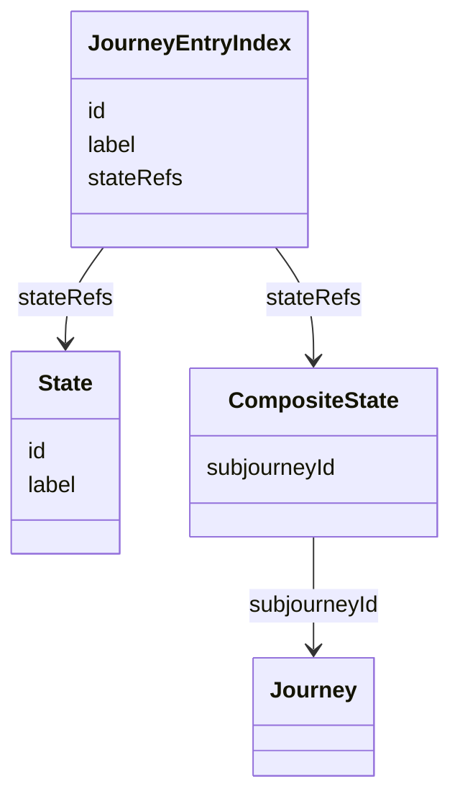
```mermaid
classDiagram
  class JourneyEntryIndex {
    id
    label
    stateRefs
  }

  class State {
    id
    label
  }

  class CompositeState {
    subjourneyId
  }

  JourneyEntryIndex --> State : stateRefs
  JourneyEntryIndex --> CompositeState : stateRefs
  CompositeState --> Journey : subjourneyId
```

Example JSON node:

```json
{
  "@type": "JourneyEntryIndex",
  "@id": "urn:ujg:index:site-pages",
  "label": "Site page index",
  "stateRefs": [
    "urn:ujg:state:home-page",
    "urn:ujg:state:search-page",
    "urn:ujg:state:profile-page"
  ]
}
```

The indexed states are known entry points. Their order above does not define a path from the home page to search to profile.

---

## CompositeState {data-cop-concept="composition"}

A [=CompositeState=] is a [=State=] that represents nested composition. It references a child [=Journey=] through `subjourneyId`, allowing consumers to interpret the referenced journey as a zoomable or nested graph.

The parent journey treats the [=CompositeState=] as a parent-local state. The parent journey does not list the child journey's states directly.

<spec-statement>
1. A [=CompositeState=] **MUST** be a [=State=].
2. A [=CompositeState=] **MUST** declare exactly one `subjourneyId`.
3. The `subjourneyId` value **MUST** resolve to a [=Journey=].
4. A [=CompositeState=] **MUST NOT** list child states directly with `stateRefs`.
</spec-statement>

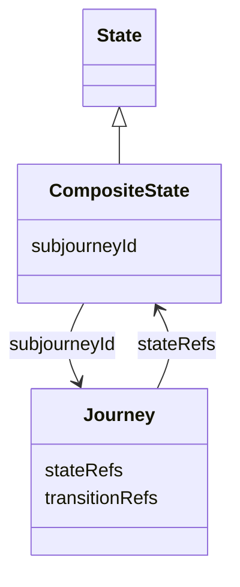
```mermaid
classDiagram
  class State
  class CompositeState {
    subjourneyId
  }
  class Journey {
    stateRefs
    transitionRefs
  }

  State <|-- CompositeState
  Journey --> CompositeState : stateRefs
  CompositeState --> Journey : subjourneyId
```

Example JSON node:

```json
{
  "@type": "CompositeState",
  "@id": "urn:ujg:state:checkout-flow",
  "label": "Checkout flow",
  "subjourneyId": "urn:ujg:journey:checkout"
}
```

---

## JourneyExit {data-cop-concept="journey-exits"}

A [=JourneyExit=] is a terminal local graph vertex and exported completion contract declared by a [=Journey=]. It represents a terminal journey outcome that can be reached by a local [=Transition=].

A parent journey can use exported exits to distinguish which outcome of a child journey was reached, without directly referencing child states.

<spec-statement>
1. A [=Journey=] **MAY** declare `exitRefs`.
2. Each value of `exitRefs` **MUST** reference a [=JourneyExit=].
3. A [=JourneyExit=] **MUST** be declared in exactly one [=Journey=]'s `exitRefs`.
4. A [=JourneyExit=] **MAY** be the `to` endpoint of a [=Transition=] listed in the declaring journey's `transitionRefs`.
5. A [=JourneyExit=] **MUST NOT** be the `from` endpoint of a [=Transition=].
6. A [=JourneyExit=] **MUST NOT** declare `outgoingTransitionRefs`.
7. Outgoing transition group injection **MUST NOT** create effective outgoing transitions from a [=JourneyExit=].
8. A [=JourneyExit=] **MUST NOT** be used for ordinary internal child transitions when a normal [=State=] or [=Transition=] preserves the same meaning.
9. Runtime observations, user actions, form values, clicked elements, submitted values, selected values, analytics facts, or other runtime facts **MUST NOT** be modeled in the Graph module through [=JourneyExit=].
</spec-statement>

If a completion point is an actual user-visible screen, page, modal, or step, it should remain a normal [=State=]. A journey can then transition from that state to a [=JourneyExit=] that represents the exported terminal outcome.

Informative pattern:

```text
CheckoutForm -> SuccessScreen -> CheckoutCompleteExit
```

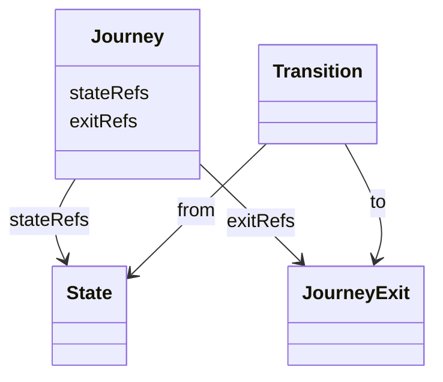
```mermaid
classDiagram
  class Journey {
    stateRefs
    exitRefs
  }
  class State
  class JourneyExit
  class Transition

  Journey --> State : stateRefs
  Journey --> JourneyExit : exitRefs
  Transition --> State : from
  Transition --> JourneyExit : to
```

Example JSON graph:

```json
{
  "@context": [
    "https://ujg.specs.openuji.org/ed/ns/core.context.jsonld",
    "https://ujg.specs.openuji.org/ed/ns/graph.context.jsonld"
  ],
  "@id": "https://example.com/ujg/checkout-exit.jsonld",
  "@type": "UJGDocument",
  "nodes": [
    {
      "@type": "Journey",
      "@id": "urn:ujg:journey:checkout",
      "label": "Checkout journey",
      "defaultEntryRef": "urn:ujg:entry:checkout-default",
      "entryRefs": [
        "urn:ujg:entry:checkout-default"
      ],
      "stateRefs": [
        "urn:ujg:state:checkout-form"
      ],
      "transitionRefs": [
        "urn:ujg:transition:checkout-form-to-complete"
      ],
      "exitRefs": [
        "urn:ujg:exit:checkout-complete"
      ]
    },
    {
      "@type": "JourneyEntry",
      "@id": "urn:ujg:entry:checkout-default",
      "stateRef": "urn:ujg:state:checkout-form"
    },
    {
      "@type": "State",
      "@id": "urn:ujg:state:checkout-form",
      "label": "Checkout form"
    },
    {
      "@type": "Transition",
      "@id": "urn:ujg:transition:checkout-form-to-complete",
      "label": "Submit checkout",
      "from": "urn:ujg:state:checkout-form",
      "to": "urn:ujg:exit:checkout-complete"
    },
    {
      "@type": "JourneyExit",
      "@id": "urn:ujg:exit:checkout-complete",
      "label": "Checkout complete"
    }
  ]
}
```

### Boundary Entry and Exit Mapping {data-cop-concept="boundary-mapping"}

`toEntryRef` and `fromExitRef` are mapping properties on parent [=Transition=] resources. They describe how a parent-local [=CompositeState=] connects to the entry and exit contracts of its child [=Journey=].

These properties are not transition endpoints. The transition's `from` and `to` values remain local to the enclosing journey.

<spec-statement>
1. A [=Transition=] **MAY** declare `toEntryRef`.
2. A [=Transition=] **MUST NOT** declare more than one `toEntryRef`.
3. A [=Transition=] with `toEntryRef` **MUST** have a `to` value that references a [=CompositeState=].
4. The [=CompositeState=] referenced by `to` **MUST** declare exactly one `subjourneyId`.
5. The `subjourneyId` value of that `to` [=CompositeState=] **MUST** resolve to a [=Journey=].
6. The `toEntryRef` value **MUST** be listed in the `entryRefs` of the journey referenced by the `to` composite state's `subjourneyId`.
7. A [=Transition=] **MAY** declare `fromExitRef`.
8. A [=Transition=] **MUST NOT** declare more than one `fromExitRef`.
9. A [=Transition=] with `fromExitRef` **MUST** have a `from` value that references a [=CompositeState=].
10. The [=CompositeState=] referenced by `from` **MUST** declare exactly one `subjourneyId`.
11. The `subjourneyId` value of that `from` [=CompositeState=] **MUST** resolve to a [=Journey=].
12. The `fromExitRef` value **MUST** be listed in the `exitRefs` of the journey referenced by the `from` composite state's `subjourneyId`.
13. `toEntryRef` and `fromExitRef` **MUST NOT** weaken, replace, or bypass local transition endpoint validation.
14. A parent transition **MUST NOT** directly reference a child journey's state as `from`, `to`, or through any child-state-specific transition property.
15. A journey **MUST NOT** contain more than one transition with the same `from` value and the same `fromExitRef` value.
</spec-statement>

<spec-statement>
When a Consumer enters a [=CompositeState=], it **MAY** resolve the composite state's `subjourneyId` and interpret the referenced child [=Journey=].

If the parent transition whose `to` value enters the [=CompositeState=] declares `toEntryRef`, child traversal begins at the `stateRef` of that [=JourneyEntry=].

If the parent transition does not declare `toEntryRef`, child traversal begins at the `stateRef` of the child [=Journey=]'s `defaultEntryRef`.

If interpretation of the child journey reaches a [=JourneyExit=] listed in that child journey's `exitRefs`, that [=JourneyExit=] becomes the exported exit of the child journey.

The enclosing journey may then continue only by taking a parent transition whose:

1. `from` value is the active parent-local [=CompositeState=]; and
2. `fromExitRef` value is the exported [=JourneyExit=].

If exactly one matching parent transition exists, the Consumer **MAY** continue to that transition's parent-local `to` state.

If no matching parent transition exists, the Consumer **MUST NOT** synthesize an implicit parent transition.

If more than one matching parent transition exists, the graph is invalid. A Consumer **MUST NOT** choose one arbitrarily.

A Consumer **MUST NOT** treat `toEntryRef` or `fromExitRef` as a replacement for `from` or `to`.

A Consumer **MUST NOT** treat a parent transition without `fromExitRef` as a fallback for an exported child journey exit.
</spec-statement>

Use `toEntryRef` when a parent transition must choose a specific child entry other than the child journey's default entry. Use [=JourneyExit=] and `fromExitRef` when a nested journey has multiple explicit child outcomes that the parent journey needs to distinguish. Do not use [=JourneyExit=] for ordinary transitions inside the child journey; use normal child [=Transition=] resources for internal child movement.

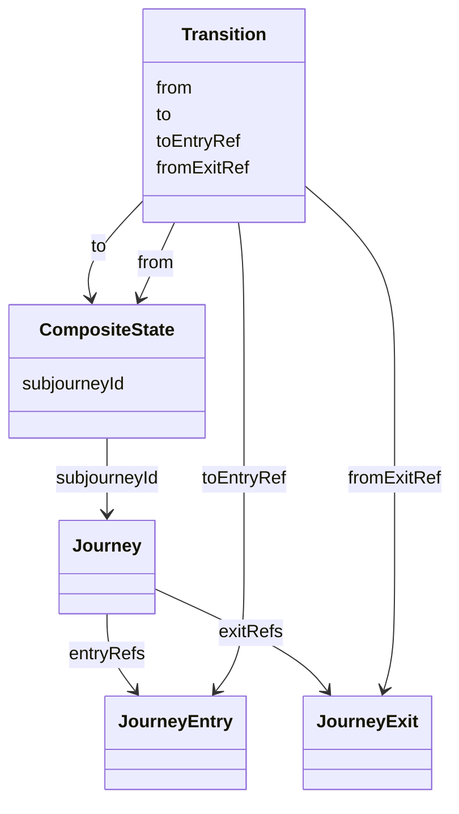
```mermaid
classDiagram
  class Journey
  class CompositeState {
    subjourneyId
  }
  class JourneyEntry
  class JourneyExit
  class Transition {
    from
    to
    toEntryRef
    fromExitRef
  }

  CompositeState --> Journey : subjourneyId
  Journey --> JourneyEntry : entryRefs
  Journey --> JourneyExit : exitRefs
  Transition --> CompositeState : to
  Transition --> JourneyEntry : toEntryRef
  Transition --> CompositeState : from
  Transition --> JourneyExit : fromExitRef
```

Example JSON graph:

```json
{
  "@context": [
    "https://ujg.specs.openuji.org/ed/ns/core.context.jsonld",
    "https://ujg.specs.openuji.org/ed/ns/graph.context.jsonld"
  ],
  "@id": "https://example.com/ujg/checkout-with-exit.jsonld",
  "@type": "UJGDocument",
  "nodes": [
    {
      "@type": "Journey",
      "@id": "urn:ujg:journey:shop",
      "label": "Shop journey",
      "defaultEntryRef": "urn:ujg:entry:shop-default",
      "entryRefs": [
        "urn:ujg:entry:shop-default"
      ],
      "stateRefs": [
        "urn:ujg:state:cart",
        "urn:ujg:state:checkout-flow",
        "urn:ujg:state:confirmation"
      ],
      "transitionRefs": [
        "urn:ujg:transition:cart-to-checkout",
        "urn:ujg:transition:checkout-to-confirmation"
      ]
    },
    {
      "@type": "JourneyEntry",
      "@id": "urn:ujg:entry:shop-default",
      "stateRef": "urn:ujg:state:cart"
    },
    {
      "@type": "State",
      "@id": "urn:ujg:state:cart",
      "label": "Cart"
    },
    {
      "@type": "CompositeState",
      "@id": "urn:ujg:state:checkout-flow",
      "label": "Checkout flow",
      "subjourneyId": "urn:ujg:journey:checkout"
    },
    {
      "@type": "State",
      "@id": "urn:ujg:state:confirmation",
      "label": "Confirmation"
    },
    {
      "@type": "Transition",
      "@id": "urn:ujg:transition:cart-to-checkout",
      "label": "Start checkout",
      "from": "urn:ujg:state:cart",
      "to": "urn:ujg:state:checkout-flow",
      "toEntryRef": "urn:ujg:entry:checkout-default"
    },
    {
      "@type": "Transition",
      "@id": "urn:ujg:transition:checkout-to-confirmation",
      "label": "Show confirmation",
      "from": "urn:ujg:state:checkout-flow",
      "to": "urn:ujg:state:confirmation",
      "fromExitRef": "urn:ujg:exit:checkout-complete"
    },
    {
      "@type": "Journey",
      "@id": "urn:ujg:journey:checkout",
      "label": "Checkout child journey",
      "defaultEntryRef": "urn:ujg:entry:checkout-default",
      "entryRefs": [
        "urn:ujg:entry:checkout-default"
      ],
      "stateRefs": [
        "urn:ujg:state:checkout-form"
      ],
      "transitionRefs": [
        "urn:ujg:transition:checkout-form-to-complete"
      ],
      "exitRefs": [
        "urn:ujg:exit:checkout-complete"
      ]
    },
    {
      "@type": "JourneyEntry",
      "@id": "urn:ujg:entry:checkout-default",
      "stateRef": "urn:ujg:state:checkout-form"
    },
    {
      "@type": "State",
      "@id": "urn:ujg:state:checkout-form",
      "label": "Checkout form"
    },
    {
      "@type": "Transition",
      "@id": "urn:ujg:transition:checkout-form-to-complete",
      "label": "Submit checkout",
      "from": "urn:ujg:state:checkout-form",
      "to": "urn:ujg:exit:checkout-complete"
    },
    {
      "@type": "JourneyExit",
      "@id": "urn:ujg:exit:checkout-complete",
      "label": "Checkout complete"
    }
  ]
}
```

Example JSON graph with an explicit child entry selection:

```json
{
  "@context": [
    "https://ujg.specs.openuji.org/ed/ns/core.context.jsonld",
    "https://ujg.specs.openuji.org/ed/ns/graph.context.jsonld"
  ],
  "@id": "https://example.com/ujg/mfa-entry.jsonld",
  "@type": "UJGDocument",
  "nodes": [
    {
      "@type": "Journey",
      "@id": "urn:ujg:journey:account-access",
      "label": "Account access",
      "defaultEntryRef": "urn:ujg:entry:account-access-default",
      "entryRefs": [
        "urn:ujg:entry:account-access-default"
      ],
      "stateRefs": [
        "urn:ujg:state:password-check",
        "urn:ujg:state:mfa-challenge"
      ],
      "transitionRefs": [
        "urn:ujg:transition:password-to-mfa"
      ]
    },
    {
      "@type": "JourneyEntry",
      "@id": "urn:ujg:entry:account-access-default",
      "stateRef": "urn:ujg:state:password-check"
    },
    {
      "@type": "State",
      "@id": "urn:ujg:state:password-check",
      "label": "Password check"
    },
    {
      "@type": "CompositeState",
      "@id": "urn:ujg:state:mfa-challenge",
      "label": "MFA challenge",
      "subjourneyId": "urn:ujg:journey:mfa"
    },
    {
      "@type": "Transition",
      "@id": "urn:ujg:transition:password-to-mfa",
      "label": "Require MFA",
      "from": "urn:ujg:state:password-check",
      "to": "urn:ujg:state:mfa-challenge",
      "toEntryRef": "urn:ujg:entry:mfa-code-entry"
    },
    {
      "@type": "Journey",
      "@id": "urn:ujg:journey:mfa",
      "label": "MFA",
      "defaultEntryRef": "urn:ujg:entry:mfa-default",
      "entryRefs": [
        "urn:ujg:entry:mfa-default",
        "urn:ujg:entry:mfa-code-entry"
      ],
      "stateRefs": [
        "urn:ujg:state:mfa-method-choice",
        "urn:ujg:state:mfa-code"
      ]
    },
    {
      "@type": "JourneyEntry",
      "@id": "urn:ujg:entry:mfa-default",
      "label": "Choose MFA method",
      "stateRef": "urn:ujg:state:mfa-method-choice"
    },
    {
      "@type": "JourneyEntry",
      "@id": "urn:ujg:entry:mfa-code-entry",
      "label": "Enter MFA code",
      "stateRef": "urn:ujg:state:mfa-code"
    },
    {
      "@type": "State",
      "@id": "urn:ujg:state:mfa-method-choice",
      "label": "MFA method choice"
    },
    {
      "@type": "State",
      "@id": "urn:ujg:state:mfa-code",
      "label": "MFA code entry"
    }
  ]
}
```

---

## OutgoingTransition {data-cop-concept="outgoing-transition"}

An [=OutgoingTransition=] is a navigational affordance. It defines a possible effective target state but does not declare a structural transition in a journey's local topology.

An [=OutgoingTransition=] has no explicit `from` property. Its effective source comes from either a state-scoped `outgoingTransitionRefs` value or an injected [=OutgoingTransitionGroup=].

<spec-statement>
1. An [=OutgoingTransition=] **MUST** be identified by an IRI.
2. An [=OutgoingTransition=] **MUST** declare exactly one effective target mechanism: either exactly one `to` value, or `toCurrentState: true`.
3. An [=OutgoingTransition=] with `toCurrentState: true` **MUST NOT** also declare `to`.
4. An [=OutgoingTransition=] with neither `to` nor `toCurrentState: true` is invalid.
5. `toCurrentState: false` is equivalent to the property being absent and does not satisfy the target requirement.
6. `OutgoingTransition.to` **MAY** reference a resolvable [=State=] or [=CompositeState=] outside the journey that contributes the affordance.
7. `OutgoingTransition.to` **MUST NOT** reference a [=JourneyExit=].
8. An [=OutgoingTransition=] **MUST NOT** be listed in a [=Journey=]'s `transitionRefs`.
9. An [=OutgoingTransition=] **MUST NOT** be used for ordinary internal journey progression when a local [=Transition=] is appropriate.
10. An [=OutgoingTransition=] **MUST NOT** declare more than one `label`.
</spec-statement>

If the `to` target is a known page, surface, or flow entry, it should normally be listed in a [=JourneyEntryIndex=]. Do not list that target in the source [=Journey=]'s `stateRefs` unless it also belongs to the source journey's local topology.

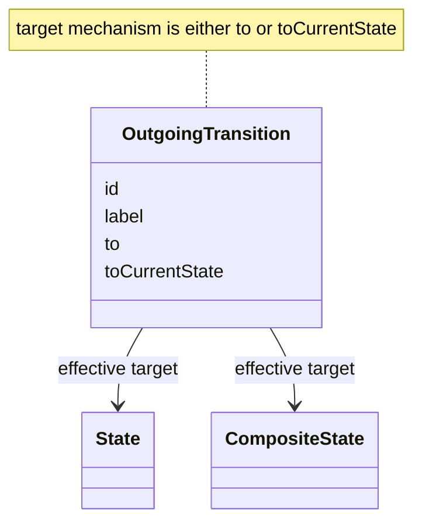
```mermaid
classDiagram
  class OutgoingTransition {
    id
    label
    to
    toCurrentState
  }
  class State
  class CompositeState

  OutgoingTransition --> State : effective target
  OutgoingTransition --> CompositeState : effective target
  note for OutgoingTransition "target mechanism is either to or toCurrentState"
```

Example JSON nodes:

Fixed target navigation:

```json
{
  "@type": "OutgoingTransition",
  "@id": "urn:ujg:ot:go-home",
  "label": "Home",
  "to": "urn:ujg:state:home"
}
```

### Relative Current-State Targeting

Some outgoing affordances do not target a fixed state. Instead, they preserve the current effective state and modify some non-topological dimension such as locale, presentation mode, or filter context. Such affordances **MAY** use `toCurrentState: true`. When used, the outgoing transition resolves to the effective source where the affordance is available, which can be a [=State=] or [=CompositeState=]. This allows reusable outgoing transition groups, such as global language switchers, to be attached across journeys without duplicating per-page transitions.

`toCurrentState` changes graph target resolution, but it does not imply any runtime event, click, URL, locale, payload, or private extension behavior.


Current-state targeting:

```json
{
  "@type": "OutgoingTransition",
  "@id": "urn:ujg:ot:keep-current-state",
  "label": "Keep current state",
  "toCurrentState": true
}
```

---

## OutgoingTransitionGroup {data-cop-concept="outgoing-transition-group"}

An [=OutgoingTransitionGroup=] defines a reusable set of outgoing affordances, such as header or footer navigation, that a Consumer can treat as present on multiple eligible states.

Group injection does not add structural [=Transition=] resources to `transitionRefs`.

<spec-statement>
1. An [=OutgoingTransitionGroup=] **MUST** be identified by an IRI.
2. An [=OutgoingTransitionGroup=] **MUST** declare at least one `outgoingTransitionRefs` value.
3. Each group `outgoingTransitionRefs` value **MUST** reference an [=OutgoingTransition=].
4. A [=Journey=] **MAY** reference an [=OutgoingTransitionGroup=] through `outgoingTransitionGroupRefs`.
</spec-statement>

<spec-statement>
For journey-level group injection:

1. The Consumer **MUST** resolve each referenced [=OutgoingTransitionGroup=] and each group `outgoingTransitionRefs` entry to an [=OutgoingTransition=].
2. The Consumer **MUST** iterate over every [=State=] and [=CompositeState=] ID in `stateRefs`.
3. The Consumer **MUST** resolve each [=OutgoingTransition=] target at the iterated state where the group is applied.
4. For a resolved [=OutgoingTransition=] with `toCurrentState: true`, the effective target is the current iterated [=State=] or [=CompositeState=].
5. For a resolved [=OutgoingTransition=] with `to`, the effective target is the referenced `to` state.
6. The Consumer **MUST NOT** create effective outgoing transitions from a [=JourneyExit=].
7. A Consumer **SHOULD** treat duplicate effective outgoing edges with the same effective source state and same effective target as one effective edge.
</spec-statement>

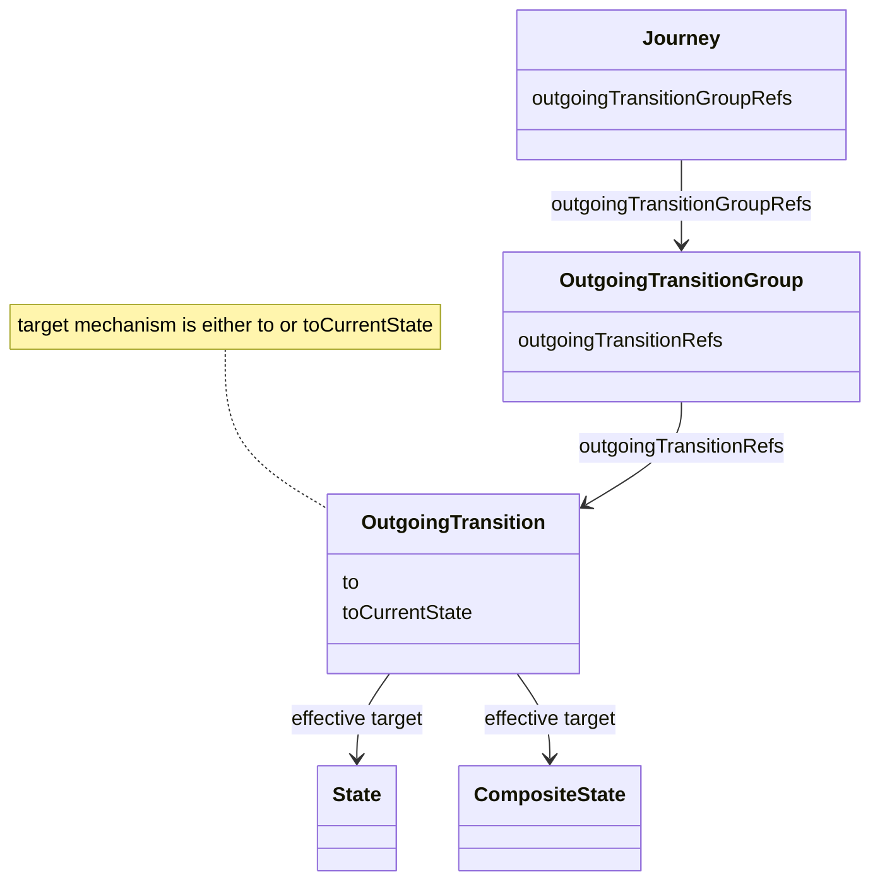
```mermaid
classDiagram
  class Journey {
    outgoingTransitionGroupRefs
  }
  class OutgoingTransitionGroup {
    outgoingTransitionRefs
  }
  class OutgoingTransition {
    to
    toCurrentState
  }
  class State
  class CompositeState

  Journey --> OutgoingTransitionGroup : outgoingTransitionGroupRefs
  OutgoingTransitionGroup --> OutgoingTransition : outgoingTransitionRefs
  OutgoingTransition --> State : effective target
  OutgoingTransition --> CompositeState : effective target
  note for OutgoingTransition "target mechanism is either to or toCurrentState"
```

Example JSON node:

```json
{
  "@type": "OutgoingTransitionGroup",
  "@id": "urn:ujg:otg:global-header",
  "outgoingTransitionRefs": [
    "urn:ujg:ot:go-home",
    "urn:ujg:ot:go-profile"
  ]
}
```

Example JSON nodes for a shared language switcher:

```json
{
  "@type": "OutgoingTransitionGroup",
  "@id": "urn:ankommenskreis:otg:shared-header-language-switcher",
  "label": "Shared header language switcher",
  "outgoingTransitionRefs": [
    "urn:ankommenskreis:ot:lang-de",
    "urn:ankommenskreis:ot:lang-en",
    "urn:ankommenskreis:ot:lang-ar",
    "urn:ankommenskreis:ot:lang-fa",
    "urn:ankommenskreis:ot:lang-tr",
    "urn:ankommenskreis:ot:lang-uk",
    "urn:ankommenskreis:ot:lang-ru"
  ]
}
```

```json
{
  "@type": "OutgoingTransition",
  "@id": "urn:ankommenskreis:ot:lang-en",
  "label": "English",
  "toCurrentState": true,
  "l10n:targetLocale": "en"
}
```

The `l10n:targetLocale` value in this example is locale metadata from the Localization module. The current-state target behavior is defined only by Graph's `toCurrentState`.

---

## State-scoped Outgoing Affordances {data-cop-concept="state-scoped-outgoing"}

A [=State=] can also declare outgoing affordances directly. These affordances apply only to that state and are not injected into other states.

Direct state-scoped affordances are for local navigational options, not for ordinary internal progression through a journey.

<spec-statement>
1. A [=State=] **MAY** declare `outgoingTransitionRefs`.
2. A [=CompositeState=] **MUST NOT** declare `outgoingTransitionRefs`.
3. A [=JourneyExit=] **MUST NOT** declare `outgoingTransitionRefs`.
4. Each state-scoped `outgoingTransitionRefs` value **MUST** reference an [=OutgoingTransition=].
5. The effective source of a state-scoped [=OutgoingTransition=] is the [=State=] that declares the `outgoingTransitionRefs` value.
6. For a state-scoped [=OutgoingTransition=] with `toCurrentState: true`, the effective target is the [=State=] that declares the `outgoingTransitionRefs` value.
7. For a state-scoped [=OutgoingTransition=] with `to`, the effective target is the referenced `to` state.
8. A Consumer **MUST NOT** treat a state-scoped [=OutgoingTransition=] as a member of the enclosing [=Journey=]'s `transitionRefs`.
9. A Consumer **SHOULD** treat duplicate effective outgoing edges with the same effective source state and same effective target as one effective edge.
</spec-statement>

If navigation should be available while a [=CompositeState=] is active, model it either as an [=OutgoingTransitionGroup=] referenced by the enclosing journey or as direct `outgoingTransitionRefs` on concrete states inside the composite state's subjourney.

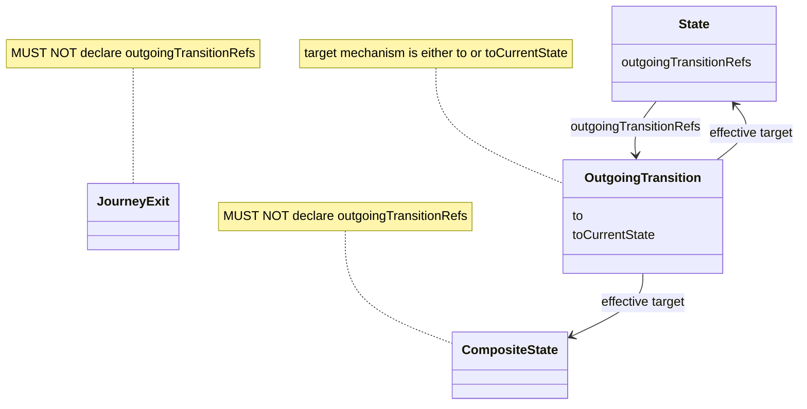
```mermaid
classDiagram
  class State {
    outgoingTransitionRefs
  }
  class CompositeState
  class JourneyExit
  class OutgoingTransition {
    to
    toCurrentState
  }

  State --> OutgoingTransition : outgoingTransitionRefs
  OutgoingTransition --> State : effective target
  OutgoingTransition --> CompositeState : effective target
  note for OutgoingTransition "target mechanism is either to or toCurrentState"

  note for CompositeState "MUST NOT declare outgoingTransitionRefs"
  note for JourneyExit "MUST NOT declare outgoingTransitionRefs"
```

Example JSON nodes:

```json
{
  "@type": "State",
  "@id": "urn:ujg:state:w3c-searchpage-form",
  "label": "Search form",
  "outgoingTransitionRefs": [
    "urn:ujg:ot:w3c-searchpage-form-back-home"
  ]
}
```

```json
{
  "@type": "OutgoingTransition",
  "@id": "urn:ujg:ot:w3c-searchpage-form-back-home",
  "label": "Back to home page",
  "to": "urn:ujg:state:w3c-root-homepage"
}
```

This example shows a search form state with a local "Back to home page" affordance. This is not a structural [=Transition=] from the SearchPage journey to a root journey or [=JourneyEntryIndex=]. It is a state-scoped navigational affordance. The `to` target must resolve to a known [=State=] or [=CompositeState=], but it does not need to be listed in the current journey's `stateRefs`. If the home page is a known page entry, it should normally be listed in a [=JourneyEntryIndex=].

---

## Ontology {data-cop-concept="ontology"}

The normative Graph ontology is defined below and is published at `https://ujg.specs.openuji.org/ed/ns/graph`. It is the authoritative structural definition for Graph classes and properties, including `Journey`, `JourneyEntry`, `JourneyEntryIndex`, `LocalVertex`, `State`, `CompositeState`, `Transition`, `JourneyExit`, `OutgoingTransition`, `OutgoingTransitionGroup`, `defaultEntryRef`, `entryRefs`, `stateRef`, `exitRefs`, `toEntryRef`, `fromExitRef`, `toCurrentState`, and `outgoingTransitionRefs`.

:::include ./graph.ttl :::

## JSON-LD Context {data-cop-concept="jsonld-context"}

The normative Graph JSON-LD context is defined below and is published at `https://ujg.specs.openuji.org/ed/ns/graph.context.jsonld`. It provides the compact JSON-LD term mappings for the Graph vocabulary used by the examples on this page.

:::include ./graph.context.jsonld :::

---

## Validation {data-cop-concept="validation"}

The normative Graph SHACL shape is defined below and is published at `https://ujg.specs.openuji.org/ed/ns/graph.shape`. It is the authoritative validation artifact for Graph structural constraints.

:::include ./graph.shape.ttl :::

---

## Graph Integrity and Resolution {data-cop-concept="graph-integrity"}

The rules below define additional graph integrity and resolution behavior beyond the structural constraints captured by the SHACL shape.

<spec-statement>
To ensure graph integrity, the following constraints **MUST** be met:
1. **Reference Integrity:** All `defaultEntryRef`, `entryRefs`, `stateRef`, `stateRefs`, `transitionRefs`, `exitRefs`, `outgoingTransitionGroupRefs`, and `outgoingTransitionRefs` IDs **MUST** resolve to valid Nodes within the current scope or imported modules.
2. **Transition Endpoint Resolution:** The `from` ID of a [=Transition=] **MUST** resolve to a [=State=] or [=CompositeState=] listed in the enclosing [=Journey=]'s `stateRefs`. The `to` ID of a [=Transition=] **MUST** resolve to a [=State=] or [=CompositeState=] listed in the enclosing [=Journey=]'s `stateRefs`, or a [=JourneyExit=] listed in the enclosing [=Journey=]'s `exitRefs`. A transition **MUST NOT** reference local vertices belonging to other journeys.
3. **Entry Resolution:** Every ID in `entryRefs` **MUST** resolve to a [=JourneyEntry=], and each [=JourneyEntry=]'s `stateRef` **MUST** resolve to a [=State=] or [=CompositeState=] listed in the same [=Journey=]'s `stateRefs`.
4. **Composition Safety:** `subjourneyId` **MUST** resolve to a valid [=Journey=].
5. **Boundary Mapping Resolution:** A `toEntryRef` value **MUST** resolve to a [=JourneyEntry=] of the child journey referenced by the transition's `to` [=CompositeState=], and a `fromExitRef` value **MUST** resolve to a [=JourneyExit=] of the child journey referenced by the transition's `from` [=CompositeState=].
6. **Journey Exit Resolution:** Every ID in `exitRefs` **MUST** resolve to a [=JourneyExit=].
7. **Group Resolution:** Every ID in `outgoingTransitionGroupRefs` **MUST** resolve to an [=OutgoingTransitionGroup=].
8. **Outgoing Resolution:** Every ID in `outgoingTransitionRefs` **MUST** resolve to an [=OutgoingTransition=].
9. **Outgoing Target Resolution:** Each [=OutgoingTransition=] **MUST** resolve through exactly one effective target mechanism: a fixed `to` target, or `toCurrentState: true` resolved at the current effective source where the outgoing affordance is available.
</spec-statement>

---

## Migration from BoundaryState {data-cop-concept="boundary-state-migration"}

Previous versions modeled journey exits through a `BoundaryState` plus `JourneyExit.exitStateRef`. This has been simplified. A `BoundaryState` should be migrated to a [=JourneyExit=], and transitions that previously targeted the `BoundaryState` should instead target the corresponding [=JourneyExit=]. The `exitStateRef` property is removed.

Migration rule:

```text
BoundaryState B
JourneyExit E where E.exitStateRef = B
Transition T where T.to = B

becomes:

JourneyExit E
Transition T where T.to = E
```

If the old `BoundaryState` represented a real user-visible screen, page, modal, or step, migrate it to a normal [=State=] and add an explicit transition from that state to the [=JourneyExit=].

---

## Migration from startStateRef {data-cop-concept="start-state-ref-migration"}

Previous versions identified a journey's starting state directly with `startStateRef`. The entry model replaces that direct pointer with an explicit [=JourneyEntry=].

Migration rule:

```text
Journey J where J.startStateRef = S

becomes:

Journey J where J.defaultEntryRef = E and J.entryRefs includes E
JourneyEntry E where E.stateRef = S
```

When a journey has only one possible entry, create one [=JourneyEntry=] and use it as both the `defaultEntryRef` and the only value in `entryRefs`. When a journey has multiple valid entries, list each as a [=JourneyEntry=] and choose the default entry explicitly with `defaultEntryRef`.

---

## Examples

### JourneyEntryIndex with External Outgoing Target

This example lists known page entries in a [=JourneyEntryIndex=]. The search page journey has a state-scoped [=OutgoingTransition=] to the profile page entry, but the profile page is not part of the search page journey's local `stateRefs`.

```json
{
  "@context": [
    "https://ujg.specs.openuji.org/ed/ns/core.context.jsonld",
    "https://ujg.specs.openuji.org/ed/ns/graph.context.jsonld"
  ],
  "@id": "https://example.com/ujg/graph/page-index.jsonld",
  "@type": "UJGDocument",
  "nodes": [
    {
      "@type": "JourneyEntryIndex",
      "@id": "urn:ujg:index:pages",
      "label": "Page index",
      "stateRefs": [
        "urn:ujg:state:search-page",
        "urn:ujg:state:profile-page"
      ]
    },
    {
      "@type": "CompositeState",
      "@id": "urn:ujg:state:search-page",
      "label": "Search page",
      "subjourneyId": "urn:ujg:journey:search-page"
    },
    {
      "@type": "CompositeState",
      "@id": "urn:ujg:state:profile-page",
      "label": "Profile page",
      "subjourneyId": "urn:ujg:journey:profile-page"
    },
    {
      "@type": "Journey",
      "@id": "urn:ujg:journey:search-page",
      "label": "Search page journey",
      "defaultEntryRef": "urn:ujg:entry:search-page-default",
      "entryRefs": [
        "urn:ujg:entry:search-page-default"
      ],
      "stateRefs": [
        "urn:ujg:state:search-form",
        "urn:ujg:state:search-results"
      ],
      "transitionRefs": [
        "urn:ujg:transition:search-form-to-results"
      ]
    },
    {
      "@type": "JourneyEntry",
      "@id": "urn:ujg:entry:search-page-default",
      "stateRef": "urn:ujg:state:search-form"
    },
    {
      "@type": "State",
      "@id": "urn:ujg:state:search-form",
      "label": "Search form"
    },
    {
      "@type": "State",
      "@id": "urn:ujg:state:search-results",
      "label": "Search results",
      "outgoingTransitionRefs": [
        "urn:ujg:ot:search-results-to-profile"
      ]
    },
    {
      "@type": "Transition",
      "@id": "urn:ujg:transition:search-form-to-results",
      "label": "Submit search",
      "from": "urn:ujg:state:search-form",
      "to": "urn:ujg:state:search-results"
    },
    {
      "@type": "OutgoingTransition",
      "@id": "urn:ujg:ot:search-results-to-profile",
      "label": "Open profile",
      "to": "urn:ujg:state:profile-page"
    },
    {
      "@type": "Journey",
      "@id": "urn:ujg:journey:profile-page",
      "label": "Profile page journey",
      "defaultEntryRef": "urn:ujg:entry:profile-page-default",
      "entryRefs": [
        "urn:ujg:entry:profile-page-default"
      ],
      "stateRefs": [
        "urn:ujg:state:profile-summary"
      ]
    },
    {
      "@type": "JourneyEntry",
      "@id": "urn:ujg:entry:profile-page-default",
      "stateRef": "urn:ujg:state:profile-summary"
    },
    {
      "@type": "State",
      "@id": "urn:ujg:state:profile-summary",
      "label": "Profile summary"
    }
  ]
}
```

### Form Child Journey with Parent Continuation

This example models a form as a child journey. The form exports `submitted` through a [=JourneyExit=]. The enclosing journey continues from the form [=CompositeState=] to a result-page [=CompositeState=] using `fromExitRef`.

```json
{
  "@context": [
    "https://ujg.specs.openuji.org/ed/ns/core.context.jsonld",
    "https://ujg.specs.openuji.org/ed/ns/graph.context.jsonld"
  ],
  "@id": "https://example.com/ujg/graph/form-continuation.jsonld",
  "@type": "UJGDocument",
  "nodes": [
    {
      "@type": "JourneyEntryIndex",
      "@id": "urn:ujg:index:form-example-pages",
      "label": "Form example pages",
      "stateRefs": [
        "urn:ujg:state:contact-page",
        "urn:ujg:state:result-page"
      ]
    },
    {
      "@type": "Journey",
      "@id": "urn:ujg:journey:contact-page",
      "label": "Contact page journey",
      "defaultEntryRef": "urn:ujg:entry:contact-page-default",
      "entryRefs": [
        "urn:ujg:entry:contact-page-default"
      ],
      "stateRefs": [
        "urn:ujg:state:contact-form",
        "urn:ujg:state:result-page"
      ],
      "transitionRefs": [
        "urn:ujg:transition:contact-form-to-result"
      ]
    },
    {
      "@type": "JourneyEntry",
      "@id": "urn:ujg:entry:contact-page-default",
      "stateRef": "urn:ujg:state:contact-form"
    },
    {
      "@type": "CompositeState",
      "@id": "urn:ujg:state:contact-page",
      "label": "Contact page",
      "subjourneyId": "urn:ujg:journey:contact-page"
    },
    {
      "@type": "CompositeState",
      "@id": "urn:ujg:state:contact-form",
      "label": "Contact form",
      "subjourneyId": "urn:ujg:journey:contact-form"
    },
    {
      "@type": "CompositeState",
      "@id": "urn:ujg:state:result-page",
      "label": "Result page",
      "subjourneyId": "urn:ujg:journey:result-page"
    },
    {
      "@type": "Transition",
      "@id": "urn:ujg:transition:contact-form-to-result",
      "label": "Show result page",
      "from": "urn:ujg:state:contact-form",
      "to": "urn:ujg:state:result-page",
      "fromExitRef": "urn:ujg:exit:contact-form-submitted"
    },
    {
      "@type": "Journey",
      "@id": "urn:ujg:journey:contact-form",
      "label": "Contact form journey",
      "defaultEntryRef": "urn:ujg:entry:contact-form-default",
      "entryRefs": [
        "urn:ujg:entry:contact-form-default"
      ],
      "stateRefs": [
        "urn:ujg:state:contact-form-editing"
      ],
      "transitionRefs": [
        "urn:ujg:transition:contact-form-submit"
      ],
      "exitRefs": [
        "urn:ujg:exit:contact-form-submitted"
      ]
    },
    {
      "@type": "JourneyEntry",
      "@id": "urn:ujg:entry:contact-form-default",
      "stateRef": "urn:ujg:state:contact-form-editing"
    },
    {
      "@type": "State",
      "@id": "urn:ujg:state:contact-form-editing",
      "label": "Contact form editing"
    },
    {
      "@type": "Transition",
      "@id": "urn:ujg:transition:contact-form-submit",
      "label": "Submit form",
      "from": "urn:ujg:state:contact-form-editing",
      "to": "urn:ujg:exit:contact-form-submitted"
    },
    {
      "@type": "JourneyExit",
      "@id": "urn:ujg:exit:contact-form-submitted",
      "label": "Submitted"
    },
    {
      "@type": "Journey",
      "@id": "urn:ujg:journey:result-page",
      "label": "Result page journey",
      "defaultEntryRef": "urn:ujg:entry:result-page-default",
      "entryRefs": [
        "urn:ujg:entry:result-page-default"
      ],
      "stateRefs": [
        "urn:ujg:state:result-summary"
      ]
    },
    {
      "@type": "JourneyEntry",
      "@id": "urn:ujg:entry:result-page-default",
      "stateRef": "urn:ujg:state:result-summary"
    },
    {
      "@type": "State",
      "@id": "urn:ujg:state:result-summary",
      "label": "Result summary"
    }
  ]
}
```

### Anti-Example: Linked Destination in Source Journey

The following source journey incorrectly lists `urn:ujg:state:profile-page` in `stateRefs` merely because an outgoing affordance can reach it. The profile page should be listed in a [=JourneyEntryIndex=] and referenced by `OutgoingTransition.to`; it should not be promoted into the search page journey's local topology.

```json
[
  {
    "@type": "Journey",
    "@id": "urn:ujg:journey:search-page",
    "label": "Search page journey",
    "defaultEntryRef": "urn:ujg:entry:search-page-default",
    "entryRefs": [
      "urn:ujg:entry:search-page-default"
    ],
    "stateRefs": [
      "urn:ujg:state:search-form",
      "urn:ujg:state:search-results",
      "urn:ujg:state:profile-page"
    ],
    "transitionRefs": [
      "urn:ujg:transition:search-form-to-results"
    ]
  },
  {
    "@type": "JourneyEntry",
    "@id": "urn:ujg:entry:search-page-default",
    "stateRef": "urn:ujg:state:search-form"
  }
]
```

### Combined JSON Example

```json
{
  "@context": [
    "https://ujg.specs.openuji.org/ed/ns/core.context.jsonld",
    "https://ujg.specs.openuji.org/ed/ns/graph.context.jsonld"
  ],
  "@id": "https://example.com/ujg/graph/main-site.jsonld",
  "@type": "UJGDocument",
  "nodes": [
    {
      "@type": "JourneyEntryIndex",
      "@id": "urn:ujg:index:main-site-pages",
      "label": "Main site pages",
      "stateRefs": [
        "urn:ujg:state:home-page",
        "urn:ujg:state:checkout-flow",
        "urn:ujg:state:profile-page"
      ]
    },
    {
      "@type": "CompositeState",
      "@id": "urn:ujg:state:home-page",
      "label": "Home page",
      "subjourneyId": "urn:ujg:journey:home-page"
    },
    {
      "@type": "CompositeState",
      "@id": "urn:ujg:state:checkout-flow",
      "label": "Checkout process",
      "subjourneyId": "urn:ujg:journey:checkout"
    },
    {
      "@type": "CompositeState",
      "@id": "urn:ujg:state:profile-page",
      "label": "Profile page",
      "subjourneyId": "urn:ujg:journey:profile"
    },
    {
      "@type": "Journey",
      "@id": "urn:ujg:journey:home-page",
      "label": "Home page journey",
      "defaultEntryRef": "urn:ujg:entry:home-page-default",
      "entryRefs": [
        "urn:ujg:entry:home-page-default"
      ],
      "stateRefs": [
        "urn:ujg:state:home",
        "urn:ujg:state:checkout-flow"
      ],
      "transitionRefs": [
        "urn:ujg:transition:home-to-checkout"
      ],
      "outgoingTransitionGroupRefs": [
        "urn:ujg:otg:global-header"
      ]
    },
    {
      "@type": "JourneyEntry",
      "@id": "urn:ujg:entry:home-page-default",
      "stateRef": "urn:ujg:state:home"
    },
    {
      "@type": "Transition",
      "@id": "urn:ujg:transition:home-to-checkout",
      "from": "urn:ujg:state:home",
      "to": "urn:ujg:state:checkout-flow",
      "label": "Buy Now"
    },
    {
      "@type": "State",
      "@id": "urn:ujg:state:home",
      "label": "Home Page",
      "tags": [
        "phase:landing"
      ]
    },
    {
      "@type": "Journey",
      "@id": "urn:ujg:journey:checkout",
      "label": "Checkout journey",
      "defaultEntryRef": "urn:ujg:entry:checkout-default",
      "entryRefs": [
        "urn:ujg:entry:checkout-default"
      ],
      "stateRefs": [
        "urn:ujg:state:checkout-cart"
      ]
    },
    {
      "@type": "JourneyEntry",
      "@id": "urn:ujg:entry:checkout-default",
      "stateRef": "urn:ujg:state:checkout-cart"
    },
    {
      "@type": "State",
      "@id": "urn:ujg:state:checkout-cart",
      "label": "Checkout cart"
    },
    {
      "@type": "Journey",
      "@id": "urn:ujg:journey:profile",
      "label": "Profile journey",
      "defaultEntryRef": "urn:ujg:entry:profile-default",
      "entryRefs": [
        "urn:ujg:entry:profile-default"
      ],
      "stateRefs": [
        "urn:ujg:state:profile-summary"
      ]
    },
    {
      "@type": "JourneyEntry",
      "@id": "urn:ujg:entry:profile-default",
      "stateRef": "urn:ujg:state:profile-summary"
    },
    {
      "@type": "State",
      "@id": "urn:ujg:state:profile-summary",
      "label": "Profile summary"
    },
    {
      "@type": "OutgoingTransition",
      "@id": "urn:ujg:ot:go-home",
      "to": "urn:ujg:state:home-page",
      "label": "Home"
    },
    {
      "@type": "OutgoingTransition",
      "@id": "urn:ujg:ot:go-profile",
      "to": "urn:ujg:state:profile-page",
      "label": "Profile"
    },
    {
      "@type": "OutgoingTransitionGroup",
      "@id": "urn:ujg:otg:global-header",
      "outgoingTransitionRefs": [
        "urn:ujg:ot:go-home",
        "urn:ujg:ot:go-profile"
      ]
    }
  ]
}
```
