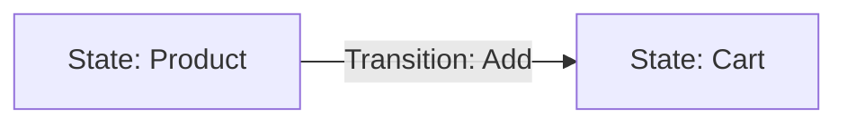
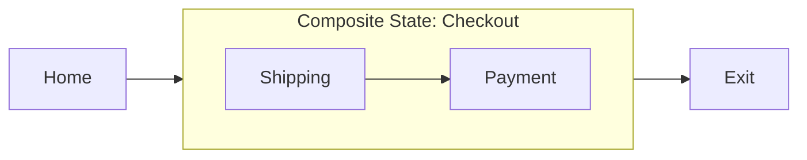
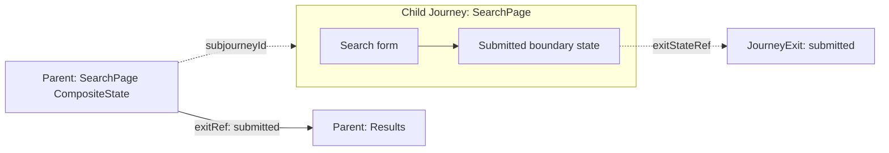
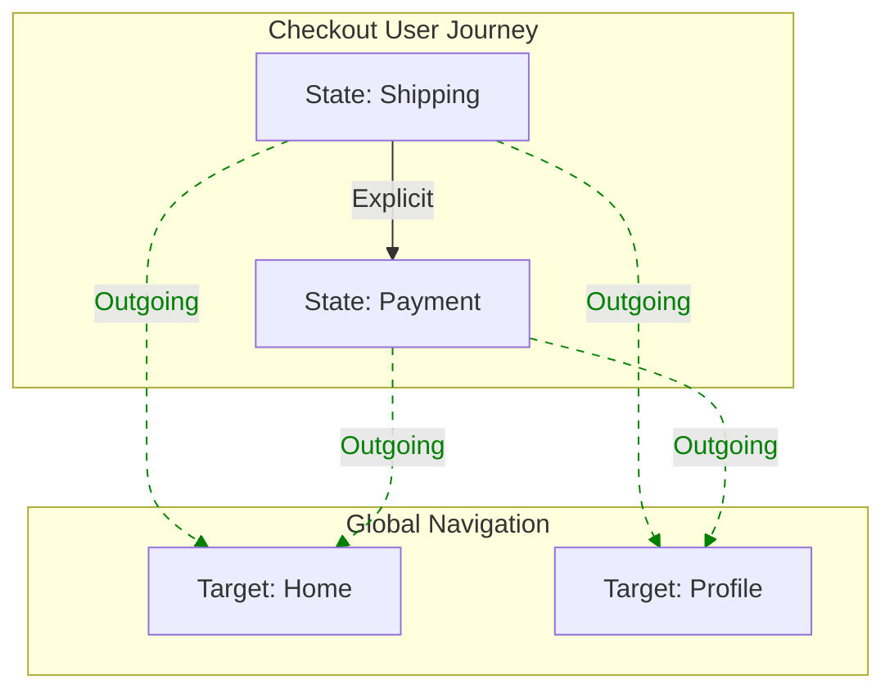

## Overview

This module defines the vocabulary for **intended** user flow. It extends [[UJG Core]] to support structured, interactive graphs with composition via sub-journey references, exported exits from nested journeys, organization tags, and reusable outgoing navigation patterns.

## Normative Artifacts

This module is published through the following artifacts:

- `graph.ttl`: ontology, published at `https://ujg.specs.openuji.org/ed/ns/graph`
- `graph.context.jsonld`: JSON-LD term mappings, published at `https://ujg.specs.openuji.org/ed/ns/graph.context.jsonld`
- `graph.shape.ttl`: SHACL validation rules, published at `https://ujg.specs.openuji.org/ed/ns/graph.shape`

Examples in this page use an explicit context array composed from the published module contexts. The same composition is also published as the convenience context `https://ujg.specs.openuji.org/ed/ns/context.jsonld`.

## Terminology

- <dfn>Journey</dfn>: A named container for a user flow.
- <dfn>State</dfn>: A discrete node in the experience (e.g., a screen, modal).
- <dfn>Transition</dfn>: A directed edge between two states.
- <dfn>CompositeState</dfn>: A state that encapsulates another [=Journey=] (sub-journey).
- <dfn>JourneyExit</dfn>: An exported boundary contract declared by a [=Journey=].
- <dfn>Boundary state</dfn>: A [=State=] or [=CompositeState=] listed in a [=Journey=]'s `stateRefs` that represents a completed outcome of that journey.
- <dfn>OutgoingTransition</dfn>: A one way edge pointing to a next possible [=State=].
- <dfn>OutgoingTransitionGroup</dfn>: A reusable set of outgoing transitions that a Consumer can treat as present on multiple states (e.g., global nav).

---

## The Core Graph {data-cop-concept="core"}

<spec-statement>A [=Journey=] **MUST** consist of [=State|States=] connected by [=Transition|Transitions=].</spec-statement>

### Visual Model


```mermaid
graph LR
    A[State: Product] -->|Transition: Add| B[State: Cart]
```

## Composition (CompositeState) {data-cop-concept="composition"}

Composition allows a node to reference an entire sub-journey, enabling "zoomable" graph interactions.

### Visual Model


```mermaid
graph LR
    H[Home] --> C
    subgraph C [Composite State: Checkout]
      direction LR
      s1[Shipping] --> s2[Payment]
    end
    C --> E[Exit]
```

The structural definition of [=CompositeState=] and `subjourneyId` is normative in the ontology and validation artifacts. This section defines only how consumers interpret that structure as nested or zoomable journey composition.

<spec-statement>A [=CompositeState=] **MUST** reference its nested graph through `subjourneyId` and **MUST NOT** list child states directly with `stateRefs`.</spec-statement>

---

## Exported Journey Exits {data-cop-concept="journey-exits"}

A [=JourneyExit=] lets a child [=Journey=] export one or more named boundary exits. A parent [=Journey=] can then map each exported exit to a parent-local [=Transition=] from the [=CompositeState=] that references the child journey.

A [=JourneyExit=] identifies one local [=Boundary state=] of the declaring journey using `exitStateRef`. It allows an enclosing parent journey to distinguish which exported outcome of a nested child journey was reached without allowing the parent journey to reference child states directly.

`exitRef` is a mapping property on a parent transition. It is not a transition endpoint. A transition's `from` and `to` values remain local to the enclosing journey.

### Visual Model


```mermaid
graph LR
    P1[Parent: SearchPage CompositeState] -->|exitRef: submitted| P2[Parent: Results]

    subgraph Child [Child Journey: SearchPage]
      direction LR
      C1[Search form] --> C2[Submitted boundary state]
    end

    P1 -. subjourneyId .-> Child
    C2 -. exitStateRef .-> X[JourneyExit: submitted]
```

### Conceptual Model

<spec-statement>
1. A [=Journey=] **MAY** declare `exitRefs`.
2. Each value of `exitRefs` **MUST** reference a [=JourneyExit=].
3. A [=JourneyExit=] **MUST** declare exactly one `exitStateRef`.
4. The `exitStateRef` of a [=JourneyExit=] declared by a journey **MUST** reference a [=State=] or [=CompositeState=] listed in that same journey's `stateRefs`.
5. A [=JourneyExit=] **MUST** be declared by no more than one [=Journey=].
6. A [=Journey=] **MUST NOT** list more than one [=JourneyExit=] with the same `exitStateRef`.
</spec-statement>

<spec-statement>
1. A [=Transition=] **MAY** declare `exitRef`.
2. A [=Transition=] **MUST NOT** declare more than one `exitRef`.
3. A [=Transition=] with `exitRef` **MUST** have a `from` value that references a [=CompositeState=].
4. The [=CompositeState=] referenced by `from` **MUST** declare exactly one `subjourneyId`.
5. The `subjourneyId` value **MUST** resolve to a [=Journey=].
6. The `exitRef` value **MUST** be listed in the `exitRefs` of the journey referenced by the `from` composite state's `subjourneyId`.
7. `exitRef` **MUST NOT** weaken, replace, or bypass local transition endpoint validation.
8. A transition's `from` and `to` values **MUST** continue to reference states or composite states listed in the enclosing journey's `stateRefs`.
9. A parent transition **MUST NOT** directly reference a child journey's state as `from`, `to`, or through any child-state-specific transition property.
10. A journey **MUST NOT** contain more than one transition with the same `from` value and the same `exitRef` value.
</spec-statement>

### Boundary States

<spec-statement>
1. A state referenced by `JourneyExit.exitStateRef` **MUST** be a [=Boundary state=] for the declaring journey.
2. A state referenced by `JourneyExit.exitStateRef` **MUST NOT** be used as the `from` value of another [=Transition=] listed in the same journey's `transitionRefs`.
3. Outgoing transition group injection **MUST NOT** create effective outgoing transitions from a state referenced by `JourneyExit.exitStateRef` in the same journey.
4. A [=JourneyExit=] **MUST NOT** be used for ordinary internal child transitions. Internal movement inside the child journey **MUST** continue to use normal [=Transition=] resources.
5. Runtime observations, user actions, form values, clicked elements, submitted values, selected values, analytics facts, or other runtime facts **MUST NOT** be modeled in the Graph module through [=JourneyExit=]. Runtime facts remain outside the Graph module.
6. If `exitStateRef` references a [=CompositeState=], the declaring journey reaches that [=JourneyExit=] only when interpretation of that composite state has completed according to the exported-exit processing model.
</spec-statement>

### Processing Model

<spec-statement>
When a Consumer enters a [=CompositeState=], it **MAY** resolve the composite state's `subjourneyId` and interpret the referenced child [=Journey=].

If interpretation of the child journey reaches a state that is the `exitStateRef` of a [=JourneyExit=] listed in that child journey's `exitRefs`, that [=JourneyExit=] becomes the exported exit of the child journey.

If more than one [=JourneyExit=] listed by the same child journey has the same `exitStateRef`, the graph is invalid. A Consumer **MUST NOT** choose one arbitrarily.

The enclosing journey may then continue only by taking a parent transition whose:

1. `from` value is the active parent-local [=CompositeState=]; and
2. `exitRef` value is the exported [=JourneyExit=].

If exactly one matching parent transition exists, the Consumer **MAY** continue to that transition's parent-local `to` state.

If no matching parent transition exists, the Consumer **MUST NOT** synthesize an implicit parent transition.

If more than one matching parent transition exists, the graph is invalid. A Consumer **MUST NOT** choose one arbitrarily.

A Consumer **MUST NOT** treat `exitRef` as a replacement for `from` or `to`.

A Consumer **MUST NOT** follow a parent transition whose `from` or `to` value is not listed in the enclosing journey's `stateRefs`.

A Consumer **MUST NOT** treat a parent transition without `exitRef` as a fallback for an exported child journey exit.
</spec-statement>

<spec-statement>If a child journey declares `exitRefs` and reaches one of those exported exits, parent continuation for that exported exit **MUST** use a matching parent transition with `exitRef`. A parent transition without `exitRef` **MUST NOT** be treated as a fallback match for an exported child journey exit.</spec-statement>

### Authoring Guidance

Use [=JourneyExit=] when a nested journey has multiple explicit boundary outcomes that the parent journey needs to distinguish. For example, a search form child journey may export `submitted`, `cancelled`, and `emptyQuery`; the parent journey can then map each exported exit to a different parent-level transition without referring directly to child states.

Do not use [=JourneyExit=] for ordinary transitions inside the child journey. Use normal child [=Transition=] resources for internal child movement.

Do not use [=JourneyExit=] when the parent transition intentionally treats the composite state as an undifferentiated whole. In that case, a normal transition from the [=CompositeState=] without `exitRef` remains sufficient, and the child journey should not require exported exits for that parent-level behavior.

---

## Reusability (OutgoingTransitionGroup) {data-cop-concept="reusability"}

An [=OutgoingTransitionGroup=] defines reusable outgoing transitions (e.g., headers/footers) to avoid duplicating common navigation across many states.

The structural definition of [=OutgoingTransitionGroup=] and [=OutgoingTransition=] is normative in the ontology and validation artifacts. This section defines only the consumer processing model for applying those reusable outgoing edges.

### Visual Model


```mermaid
graph TD
    subgraph Global [Global Navigation]
      direction LR
      H[Target: Home]
      P[Target: Profile]
    end

    subgraph Flow [Checkout User Journey]
      direction LR
      S1[State: Shipping] -->|Explicit| S2[State: Payment]
    end

    S1 -.->|Outgoing| H
    S1 -.->|Outgoing| P
    S2 -.->|Outgoing| H
    S2 -.->|Outgoing| P

    linkStyle 1,2,3,4 stroke-dasharray: 5 5, stroke:green, color:green;
```

### Processing Model (Injection)

<spec-statement>
When a Consumer loads a [=Journey=] referencing `outgoingTransitionGroupRefs`:
1. **Resolution:** The Consumer **MUST** resolve each referenced [=OutgoingTransitionGroup=] and each `outgoingTransitionRefs` entry to an [=OutgoingTransition=].
2. **Iteration:** The Consumer **MUST** iterate over every [=State=] and [=CompositeState=] ID in `stateRefs` except states referenced by a [=JourneyExit=] `exitStateRef` in the same journey.
3. **Injection:** The Consumer **MUST** treat each iterated state as having an outgoing edge to every resolved [=OutgoingTransition=] `to`.
4. **Boundary states:** The Consumer **MUST NOT** create effective outgoing transitions from a state referenced by [=JourneyExit=] `exitStateRef` in the same journey.
5. **Deduplication:** A Consumer **SHOULD** treat injected and explicit edges with the same effective `from` and `to` as one effective edge.
</spec-statement>

---

## Ontology {data-cop-concept="ontology"}

The normative Graph ontology is defined below and is published at `https://ujg.specs.openuji.org/ed/ns/graph`. It is the authoritative structural definition for Graph classes and properties, including `Journey`, `State`, `CompositeState`, `Transition`, `JourneyExit`, `OutgoingTransition`, `OutgoingTransitionGroup`, `exitRefs`, `exitRef`, and `exitStateRef`.

:::include ./graph.ttl :::

## JSON-LD Context {data-cop-concept="jsonld-context"}

The normative Graph JSON-LD context is defined below and is published at `https://ujg.specs.openuji.org/ed/ns/graph.context.jsonld`. It provides the compact JSON-LD term mappings for the Graph vocabulary used by the examples on this page.

:::include ./graph.context.jsonld :::

---

## Validation {data-cop-concept="validation"}

The normative Graph SHACL shape is defined below and is published at `https://ujg.specs.openuji.org/ed/ns/graph.shape`. It is the authoritative validation artifact for Graph structural constraints.

:::include ./graph.shape.ttl :::

The rules below define additional graph integrity and resolution behavior beyond the structural constraints captured by the SHACL shape.

<spec-statement>
To ensure graph integrity, the following constraints **MUST** be met:
1. **Reference Integrity:** All `startState`, `stateRefs`, `transitionRefs`, `exitRefs`, `outgoingTransitionGroupRefs`, and `outgoingTransitionRefs` IDs **MUST** resolve to valid Nodes within the current scope or imported modules.
2. **Transition Endpoint Resolution:** The `from` and `to` IDs of a [=Transition=] **MUST** resolve to valid Nodes, and are required to be members of the enclosing [=Journey=]'s `stateRefs`. A transition **MUST NOT** reference states belonging to other journeys.
3. **Composition Safety:** `subjourneyId` **MUST** resolve to a valid [=Journey=].
4. **Journey Exit Resolution:** Every ID in `exitRefs` **MUST** resolve to a [=JourneyExit=].
5. **Group Resolution:** Every ID in `outgoingTransitionGroupRefs` **MUST** resolve to an [=OutgoingTransitionGroup=].
6. **Outgoing Resolution:** Every ID in `outgoingTransitionRefs` **MUST** resolve to an [=OutgoingTransition=].
</spec-statement>

---

## Non-Goals {data-cop-concept="non-goals"}

This module does **not** introduce cross-journey `from` or `to` endpoints.

This module does **not** allow parent transitions to directly reference states that are not listed in the parent journey's `stateRefs`.

This module does **not** replace `CompositeState.subjourneyId`.

This module does **not** model runtime facts such as submitted form data, typed query text, selected result, clicked button, observed user behavior, analytics events, or runtime conditions.

This module does **not** introduce guards, conditions, priorities, fallback matching, or runtime event matching.

---

## Appendix: Exported Exit JSON Example {.unnumbered}

This example shows a parent journey with a `CompositeState`, a child journey, a child `JourneyExit`, and a parent transition that uses `exitRef`. The parent transition's `from` value is the parent-local `CompositeState`, its `to` value is a parent-local `State`, and its `exitRef` identifies the exported child journey exit. The parent transition does not reference the child state directly.

```json
{
  "@context": "https://ujg.specs.openuji.org/ed/ns/context.jsonld",
  "@id": "https://example.com/ujg/graph/w3c-search.jsonld",
  "@type": "UJGDocument",
  "nodes": [
    {
      "@type": "Journey",
      "@id": "urn:ujg:journey:w3c-search",
      "label": "W3C search journey",
      "startState": "urn:ujg:state:w3c-search-searchpage",
      "stateRefs": ["urn:ujg:state:w3c-search-searchpage", "urn:ujg:state:w3c-search-results"],
      "transitionRefs": ["urn:ujg:transition:w3c-search-searchpage-to-results"]
    },
    {
      "@type": "CompositeState",
      "@id": "urn:ujg:state:w3c-search-searchpage",
      "label": "SearchPage",
      "subjourneyId": "urn:ujg:journey:w3c-searchpage"
    },
    {
      "@type": "State",
      "@id": "urn:ujg:state:w3c-search-results",
      "label": "Results"
    },
    {
      "@type": "Transition",
      "@id": "urn:ujg:transition:w3c-search-searchpage-to-results",
      "label": "Search results",
      "from": "urn:ujg:state:w3c-search-searchpage",
      "to": "urn:ujg:state:w3c-search-results",
      "exitRef": "urn:ujg:exit:w3c-searchpage-submitted"
    },
    {
      "@type": "Journey",
      "@id": "urn:ujg:journey:w3c-searchpage",
      "label": "W3C search page journey",
      "startState": "urn:ujg:state:w3c-searchpage-form",
      "stateRefs": ["urn:ujg:state:w3c-searchpage-form", "urn:ujg:state:w3c-searchpage-submitted"],
      "transitionRefs": ["urn:ujg:transition:w3c-searchpage-form-to-submitted"],
      "exitRefs": ["urn:ujg:exit:w3c-searchpage-submitted"]
    },
    {
      "@type": "State",
      "@id": "urn:ujg:state:w3c-searchpage-form",
      "label": "Search form"
    },
    {
      "@type": "State",
      "@id": "urn:ujg:state:w3c-searchpage-submitted",
      "label": "Submitted"
    },
    {
      "@type": "JourneyExit",
      "@id": "urn:ujg:exit:w3c-searchpage-submitted",
      "label": "Submitted",
      "exitStateRef": "urn:ujg:state:w3c-searchpage-submitted"
    },
    {
      "@type": "Transition",
      "@id": "urn:ujg:transition:w3c-searchpage-form-to-submitted",
      "label": "Submit search form",
      "from": "urn:ujg:state:w3c-searchpage-form",
      "to": "urn:ujg:state:w3c-searchpage-submitted"
    }
  ]
}
```

## Appendix: Combined JSON Example {.unnumbered}

```json
{
  "@context": "https://ujg.specs.openuji.org/ed/ns/context.jsonld",
  "@id": "https://example.com/ujg/graph/main-site.jsonld",
  "@type": "UJGDocument",
  "nodes": [
    {
      "@type": "Journey",
      "@id": "urn:ujg:journey:main-site",
      "startState": "urn:ujg:state:home",
      "stateRefs": ["urn:ujg:state:home", "urn:ujg:state:checkout-flow"],
      "transitionRefs": ["urn:ujg:transition:home-to-checkout"],
      "outgoingTransitionGroupRefs": ["urn:ujg:otg:global-header"]
    },

    {
      "@type": "Transition",
      "@id": "urn:ujg:transition:home-to-checkout",
      "from": "urn:ujg:state:home",
      "to": "urn:ujg:state:checkout-flow",
      "label": "Buy Now"
    },

    {
      "@type": "State",
      "@id": "urn:ujg:state:home",
      "label": "Home Page",
      "tags": ["phase:landing"]
    },

    {
      "@type": "CompositeState",
      "@id": "urn:ujg:state:checkout-flow",
      "label": "Checkout Process",
      "subjourneyId": "urn:ujg:journey:checkout"
    },

    { "@type": "State", "@id": "urn:ujg:state:profile", "label": "Profile" },

    {
      "@type": "OutgoingTransition",
      "@id": "urn:ujg:ot:go-home",
      "to": "urn:ujg:state:home",
      "label": "Home"
    },

    {
      "@type": "OutgoingTransition",
      "@id": "urn:ujg:ot:go-profile",
      "to": "urn:ujg:state:profile",
      "label": "Profile"
    },

    {
      "@type": "OutgoingTransitionGroup",
      "@id": "urn:ujg:otg:global-header",
      "outgoingTransitionRefs": ["urn:ujg:ot:go-home", "urn:ujg:ot:go-profile"]
    }
  ]
}
```
