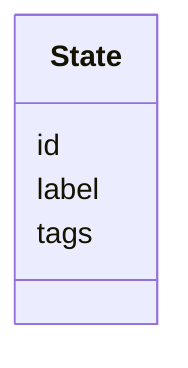
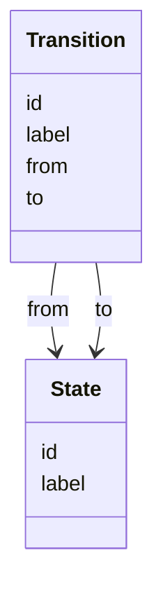
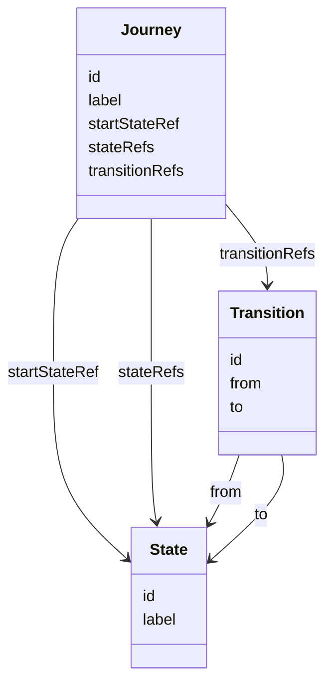
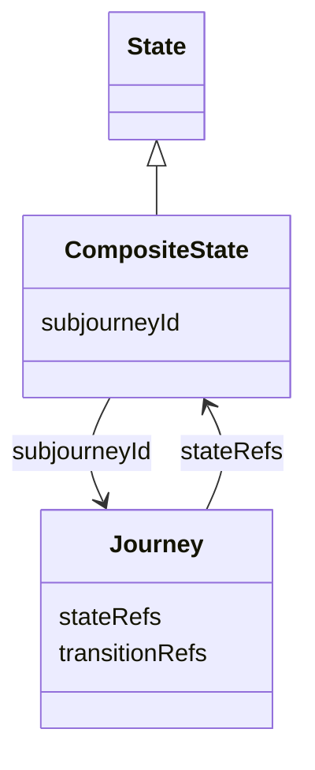
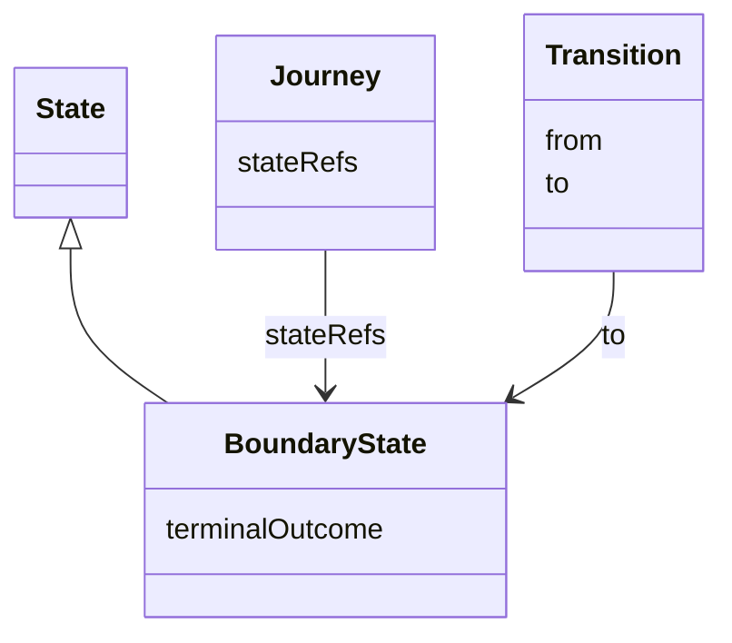
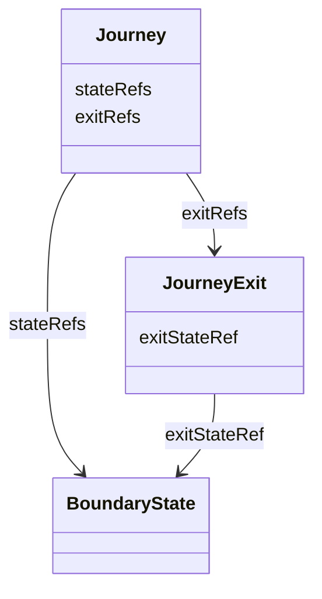
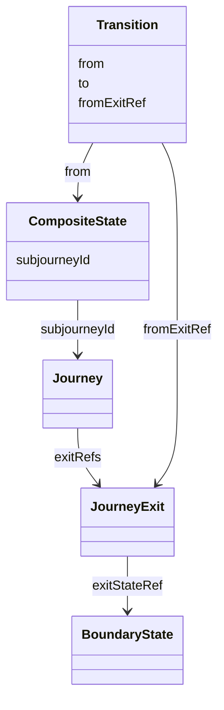
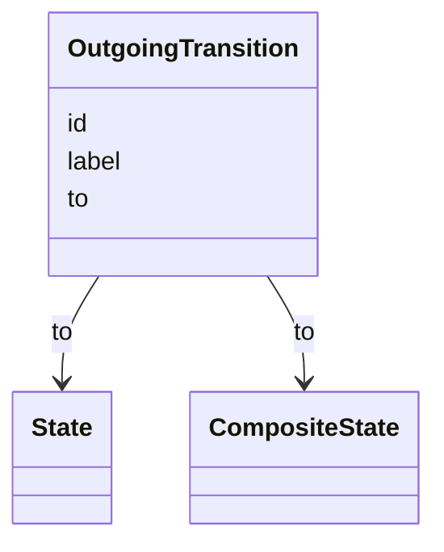
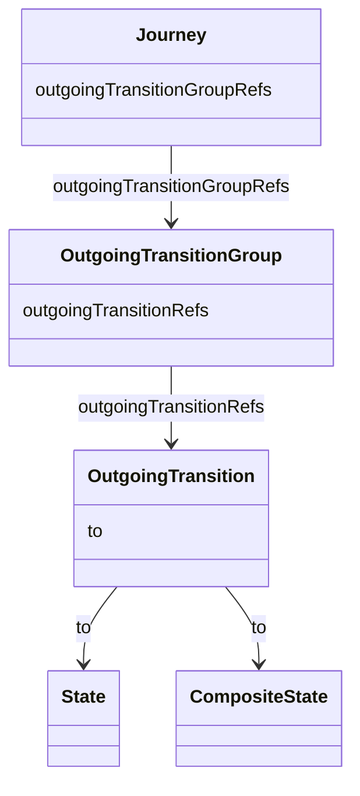
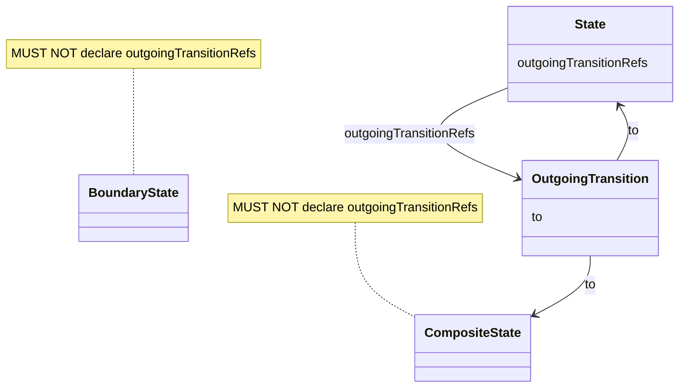

## Overview

This module defines the vocabulary for **intended** user flow. It extends [[UJG Core]] to support structured, interactive graphs with composition via sub-journey references, exported exits from nested journeys, organization tags, and reusable outgoing navigation patterns.

## Normative Artifacts

This module is published through the following artifacts:

- `graph.ttl`: ontology, published at `https://ujg.specs.openuji.org/ed/ns/graph`
- `graph.context.jsonld`: JSON-LD term mappings, published at `https://ujg.specs.openuji.org/ed/ns/graph.context.jsonld`
- `graph.shape.ttl`: SHACL validation rules, published at `https://ujg.specs.openuji.org/ed/ns/graph.shape`

Examples in this page use an explicit context array composed from the published module contexts. The same composition is also published as the convenience context `https://ujg.specs.openuji.org/ed/ns/context.jsonld`.

## Terminology

- <dfn>Journey</dfn>: A named container for a user flow.
- <dfn>State</dfn>: A discrete node in the experience (e.g., a screen, modal).
- <dfn>Transition</dfn>: A directed edge between two states.
- <dfn>CompositeState</dfn>: A state that encapsulates another [=Journey=] (sub-journey).
- <dfn>BoundaryState</dfn>: A terminal [=State=] that represents an exported outcome of a [=Journey=].
- <dfn>JourneyExit</dfn>: An exported boundary contract declared by a [=Journey=].
- <dfn>OutgoingTransition</dfn>: A navigational affordance pointing to a next possible [=State=] or [=CompositeState=].
- <dfn>OutgoingTransitionGroup</dfn>: A reusable set of outgoing transitions that a Consumer can treat as present on multiple states (e.g., global nav).

---

## State {data-cop-concept="state"}

A [=State=] is the base graph node for a discrete point in an intended user experience, such as a page, screen, modal, or other user-visible step.

Later sections define navigation affordances that can be attached to eligible states. This section defines only the base state node.

<spec-statement>
1. A [=State=] **MUST** be identified by an IRI.
2. A [=State=] **MUST** declare exactly one `label`.
3. A [=State=] **MAY** declare one or more `tags`.
</spec-statement>


```mermaid
classDiagram
  class State {
    id
    label
    tags
  }
```

---

## Transition {data-cop-concept="transition"}

A [=Transition=] is a structural directed edge between graph states. It models ordinary progression inside the local topology of a [=Journey=].

A [=Transition=] is not owned by either endpoint state. It is owned by a journey through `transitionRefs`.

<spec-statement>
1. A [=Transition=] **MUST** be identified by an IRI.
2. A [=Transition=] **MUST** declare exactly one `from` value.
3. A [=Transition=] **MUST** declare exactly one `to` value.
4. The `from` and `to` values of a [=Transition=] **MUST** reference a [=State=] or a valid [=State=] subclass defined by this module.
5. A [=Transition=] listed in a [=Journey=]'s `transitionRefs` **MUST** have `from` and `to` values listed in that same journey's `stateRefs`.
6. A [=Transition=] **MUST NOT** use `from` or `to` to reference states belonging to another journey.
7. A [=Transition=] **MUST NOT** declare more than one `label`.
</spec-statement>


```mermaid
classDiagram
  class State {
    id
    label
  }

  class Transition {
    id
    label
    from
    to
  }

  Transition --> State : from
  Transition --> State : to
```

---

## Journey {data-cop-concept="journey"}

A [=Journey=] is the local container for intended flow topology. It lists the states that belong to the journey and the transitions that connect those states.

<spec-statement>
1. A [=Journey=] **MUST** be identified by an IRI.
2. A [=Journey=] **MUST** declare exactly one `startStateRef`.
3. A [=Journey=] **MUST** declare at least one `stateRefs` value.
4. A [=Journey=] **MUST** declare at least one `transitionRefs` value.
5. Each `stateRefs` value **MUST** reference a [=State=] or a valid [=State=] subclass defined by this module.
6. Each `transitionRefs` value **MUST** reference a [=Transition=].
7. A [=Journey=] **MUST** consist of [=State|States=] connected by [=Transition|Transitions=].
</spec-statement>


```mermaid
classDiagram
  class Journey {
    id
    label
    startStateRef
    stateRefs
    transitionRefs
  }

  class State {
    id
    label
  }

  class Transition {
    id
    from
    to
  }

  Journey --> State : startStateRef
  Journey --> State : stateRefs
  Journey --> Transition : transitionRefs
  Transition --> State : from
  Transition --> State : to
```

---

## CompositeState {data-cop-concept="composition"}

A [=CompositeState=] is a [=State=] that represents nested composition. It references a child [=Journey=] through `subjourneyId`, allowing consumers to interpret the referenced journey as a zoomable or nested graph.

The parent journey treats the [=CompositeState=] as a parent-local state. The parent journey does not list the child journey's states directly.

<spec-statement>
1. A [=CompositeState=] **MUST** be a [=State=].
2. A [=CompositeState=] **MUST** declare exactly one `subjourneyId`.
3. The `subjourneyId` value **MUST** resolve to a [=Journey=].
4. A [=CompositeState=] **MUST NOT** list child states directly with `stateRefs`.
</spec-statement>


```mermaid
classDiagram
  class State
  class CompositeState {
    subjourneyId
  }
  class Journey {
    stateRefs
    transitionRefs
  }

  State <|-- CompositeState
  Journey --> CompositeState : stateRefs
  CompositeState --> Journey : subjourneyId
```

---

## BoundaryState {data-cop-concept="boundary-state"}

A [=BoundaryState=] is a terminal [=State=] that represents an exported outcome of a journey. A nested journey uses boundary states to expose completed outcomes to a parent journey through [=JourneyExit=].

Boundary states remain local states of the journey that declares them.

<spec-statement>
1. A [=BoundaryState=] **MUST** be a [=State=].
2. A [=BoundaryState=] **MUST NOT** also be a [=CompositeState=].
3. A [=BoundaryState=] **MUST NOT** declare `subjourneyId`.
4. A [=BoundaryState=] **MUST NOT** declare `outgoingTransitionRefs`.
5. A [=BoundaryState=] listed in a [=Journey=]'s `stateRefs` **MUST NOT** be used as the `from` value of another [=Transition=] listed in that same journey's `transitionRefs`.
6. Outgoing transition group injection **MUST NOT** create effective outgoing transitions from a [=BoundaryState=].
</spec-statement>


```mermaid
classDiagram
  class State
  class BoundaryState {
    terminalOutcome
  }
  class Journey {
    stateRefs
  }
  class Transition {
    from
    to
  }

  State <|-- BoundaryState
  Journey --> BoundaryState : stateRefs
  Transition --> BoundaryState : to
```

---

## JourneyExit {data-cop-concept="journey-exits"}

A [=JourneyExit=] is an exported boundary contract declared by a [=Journey=]. It identifies one local [=BoundaryState=] using `exitStateRef`.

A parent journey can use exported exits to distinguish which outcome of a child journey was reached, without directly referencing child states.

<spec-statement>
1. A [=Journey=] **MAY** declare `exitRefs`.
2. Each value of `exitRefs` **MUST** reference a [=JourneyExit=].
3. A [=JourneyExit=] **MUST** declare exactly one `exitStateRef`.
4. The `exitStateRef` of a [=JourneyExit=] declared by a journey **MUST** reference a [=BoundaryState=] listed in that same journey's `stateRefs`.
5. A [=JourneyExit=] `exitStateRef` **MUST NOT** reference a [=CompositeState=].
6. A [=JourneyExit=] **MUST** be declared by no more than one [=Journey=].
7. A [=Journey=] **MUST NOT** list more than one [=JourneyExit=] with the same `exitStateRef`.
8. A [=JourneyExit=] **MUST NOT** be used for ordinary internal child transitions.
9. Runtime observations, user actions, form values, clicked elements, submitted values, selected values, analytics facts, or other runtime facts **MUST NOT** be modeled in the Graph module through [=JourneyExit=].
</spec-statement>

If a [=CompositeState=] completes and needs to export an outcome upward, the declaring journey SHOULD transition to a local [=BoundaryState=], and the [=JourneyExit=] SHOULD reference that [=BoundaryState=].


```mermaid
classDiagram
  class Journey {
    stateRefs
    exitRefs
  }
  class BoundaryState
  class JourneyExit {
    exitStateRef
  }

  Journey --> BoundaryState : stateRefs
  Journey --> JourneyExit : exitRefs
  JourneyExit --> BoundaryState : exitStateRef
```

---

## Parent Continuation with fromExitRef {data-cop-concept="parent-continuation"}

`fromExitRef` is a mapping property on a parent [=Transition=]. It identifies which exported [=JourneyExit=] completed for the child journey of the transition's `from` [=CompositeState=].

`fromExitRef` is not a transition endpoint. The transition's `from` and `to` values remain local to the enclosing journey.

<spec-statement>
1. A [=Transition=] **MAY** declare `fromExitRef`.
2. A [=Transition=] **MUST NOT** declare more than one `fromExitRef`.
3. A [=Transition=] with `fromExitRef` **MUST** have a `from` value that references a [=CompositeState=].
4. The [=CompositeState=] referenced by `from` **MUST** declare exactly one `subjourneyId`.
5. The `subjourneyId` value **MUST** resolve to a [=Journey=].
6. The `fromExitRef` value **MUST** be listed in the `exitRefs` of the journey referenced by the `from` composite state's `subjourneyId`.
7. `fromExitRef` **MUST NOT** weaken, replace, or bypass local transition endpoint validation.
8. A parent transition **MUST NOT** directly reference a child journey's state as `from`, `to`, or through any child-state-specific transition property.
9. A journey **MUST NOT** contain more than one transition with the same `from` value and the same `fromExitRef` value.
</spec-statement>

<spec-statement>
When a Consumer enters a [=CompositeState=], it **MAY** resolve the composite state's `subjourneyId` and interpret the referenced child [=Journey=].

If interpretation of the child journey reaches a [=BoundaryState=] that is the `exitStateRef` of a [=JourneyExit=] listed in that child journey's `exitRefs`, that [=JourneyExit=] becomes the exported exit of the child journey.

The enclosing journey may then continue only by taking a parent transition whose:

1. `from` value is the active parent-local [=CompositeState=]; and
2. `fromExitRef` value is the exported [=JourneyExit=].

If exactly one matching parent transition exists, the Consumer **MAY** continue to that transition's parent-local `to` state.

If no matching parent transition exists, the Consumer **MUST NOT** synthesize an implicit parent transition.

If more than one matching parent transition exists, the graph is invalid. A Consumer **MUST NOT** choose one arbitrarily.

A Consumer **MUST NOT** treat `fromExitRef` as a replacement for `from` or `to`.

A Consumer **MUST NOT** treat a parent transition without `fromExitRef` as a fallback for an exported child journey exit.
</spec-statement>

Use [=JourneyExit=] and `fromExitRef` when a nested journey has multiple explicit boundary outcomes that the parent journey needs to distinguish. Do not use [=JourneyExit=] for ordinary transitions inside the child journey; use normal child [=Transition=] resources for internal child movement.


```mermaid
classDiagram
  class Journey
  class CompositeState {
    subjourneyId
  }
  class BoundaryState
  class JourneyExit
  class Transition {
    from
    to
    fromExitRef
  }

  CompositeState --> Journey : subjourneyId
  Journey --> JourneyExit : exitRefs
  JourneyExit --> BoundaryState : exitStateRef
  Transition --> CompositeState : from
  Transition --> JourneyExit : fromExitRef
```

---

## OutgoingTransition {data-cop-concept="outgoing-transition"}

An [=OutgoingTransition=] is a navigational affordance. It points to a possible target state but does not declare a structural transition in a journey's local topology.

An [=OutgoingTransition=] has no explicit `from` property. Its effective source comes from either a state-scoped `outgoingTransitionRefs` value or an injected [=OutgoingTransitionGroup=].

<spec-statement>
1. An [=OutgoingTransition=] **MUST** be identified by an IRI.
2. An [=OutgoingTransition=] **MUST** declare exactly one `to` value.
3. `OutgoingTransition.to` **MAY** reference a resolvable [=State=] or [=CompositeState=] outside the journey that contributes the affordance.
4. `OutgoingTransition.to` **MUST NOT** reference a [=BoundaryState=].
5. An [=OutgoingTransition=] **MUST NOT** be listed in a [=Journey=]'s `transitionRefs`.
6. An [=OutgoingTransition=] **MUST NOT** be used for ordinary internal journey progression when a local [=Transition=] is appropriate.
7. An [=OutgoingTransition=] **MUST NOT** declare more than one `label`.
</spec-statement>


```mermaid
classDiagram
  class OutgoingTransition {
    id
    label
    to
  }
  class State
  class CompositeState

  OutgoingTransition --> State : to
  OutgoingTransition --> CompositeState : to
```

---

## OutgoingTransitionGroup {data-cop-concept="outgoing-transition-group"}

An [=OutgoingTransitionGroup=] defines a reusable set of outgoing affordances, such as header or footer navigation, that a Consumer can treat as present on multiple eligible states.

Group injection does not add structural [=Transition=] resources to `transitionRefs`.

<spec-statement>
1. An [=OutgoingTransitionGroup=] **MUST** be identified by an IRI.
2. An [=OutgoingTransitionGroup=] **MUST** declare at least one `outgoingTransitionRefs` value.
3. Each group `outgoingTransitionRefs` value **MUST** reference an [=OutgoingTransition=].
4. A [=Journey=] **MAY** reference an [=OutgoingTransitionGroup=] through `outgoingTransitionGroupRefs`.
</spec-statement>

<spec-statement>
For journey-level group injection:

1. The Consumer **MUST** resolve each referenced [=OutgoingTransitionGroup=] and each group `outgoingTransitionRefs` entry to an [=OutgoingTransition=].
2. The Consumer **MUST** iterate over every [=State=] and [=CompositeState=] ID in `stateRefs` except [=BoundaryState=] instances.
3. The Consumer **MUST** treat each iterated state as having an outgoing edge to every resolved [=OutgoingTransition=] `to`.
4. The Consumer **MUST NOT** create effective outgoing transitions from a [=BoundaryState=].
5. A Consumer **SHOULD** treat duplicate effective outgoing edges with the same effective source state and same [=OutgoingTransition=] `to` target as one effective edge.
</spec-statement>


```mermaid
classDiagram
  class Journey {
    outgoingTransitionGroupRefs
  }
  class OutgoingTransitionGroup {
    outgoingTransitionRefs
  }
  class OutgoingTransition {
    to
  }
  class State
  class CompositeState

  Journey --> OutgoingTransitionGroup : outgoingTransitionGroupRefs
  OutgoingTransitionGroup --> OutgoingTransition : outgoingTransitionRefs
  OutgoingTransition --> State : to
  OutgoingTransition --> CompositeState : to
```

---

## State-scoped Outgoing Affordances {data-cop-concept="state-scoped-outgoing"}

A [=State=] can also declare outgoing affordances directly. These affordances apply only to that state and are not injected into other states.

Direct state-scoped affordances are for local navigational options, not for ordinary internal progression through a journey.

<spec-statement>
1. A [=State=] **MAY** declare `outgoingTransitionRefs`.
2. A [=CompositeState=] **MUST NOT** declare `outgoingTransitionRefs`.
3. A [=BoundaryState=] **MUST NOT** declare `outgoingTransitionRefs`.
4. Each state-scoped `outgoingTransitionRefs` value **MUST** reference an [=OutgoingTransition=].
5. The effective source of a state-scoped [=OutgoingTransition=] is the [=State=] that declares the `outgoingTransitionRefs` value.
6. A Consumer **MUST NOT** treat a state-scoped [=OutgoingTransition=] as a member of the enclosing [=Journey=]'s `transitionRefs`.
7. A Consumer **SHOULD** treat duplicate effective outgoing edges with the same effective source state and same [=OutgoingTransition=] `to` target as one effective edge.
</spec-statement>

If navigation should be available while a [=CompositeState=] is active, model it either as an [=OutgoingTransitionGroup=] referenced by the enclosing journey or as direct `outgoingTransitionRefs` on concrete states inside the composite state's subjourney.


```mermaid
classDiagram
  class State {
    outgoingTransitionRefs
  }
  class CompositeState
  class BoundaryState
  class OutgoingTransition {
    to
  }

  State --> OutgoingTransition : outgoingTransitionRefs
  OutgoingTransition --> State : to
  OutgoingTransition --> CompositeState : to

  note for CompositeState "MUST NOT declare outgoingTransitionRefs"
  note for BoundaryState "MUST NOT declare outgoingTransitionRefs"
```

### Example: State-scoped Back to Home

This example shows a search form state with a local "Back to home page" affordance. This is not a structural [=Transition=] from the SearchPage journey to the Root journey. It is a state-scoped navigational affordance. The `to` target must resolve to a known [=State=] or [=CompositeState=], but it does not need to be listed in the current journey's `stateRefs`.

```json
{
  "@type": "State",
  "@id": "urn:ujg:state:w3c-searchpage-form",
  "label": "Search form",
  "outgoingTransitionRefs": [
    "urn:ujg:ot:w3c-searchpage-form-back-home"
  ]
}
```

```json
{
  "@type": "OutgoingTransition",
  "@id": "urn:ujg:ot:w3c-searchpage-form-back-home",
  "label": "Back to home page",
  "to": "urn:ujg:state:w3c-root-homepage"
}
```

---

## Ontology {data-cop-concept="ontology"}

The normative Graph ontology is defined below and is published at `https://ujg.specs.openuji.org/ed/ns/graph`. It is the authoritative structural definition for Graph classes and properties, including `Journey`, `State`, `CompositeState`, `BoundaryState`, `Transition`, `JourneyExit`, `OutgoingTransition`, `OutgoingTransitionGroup`, `exitRefs`, `fromExitRef`, `exitStateRef`, and `outgoingTransitionRefs`.

:::include ./graph.ttl :::

## JSON-LD Context {data-cop-concept="jsonld-context"}

The normative Graph JSON-LD context is defined below and is published at `https://ujg.specs.openuji.org/ed/ns/graph.context.jsonld`. It provides the compact JSON-LD term mappings for the Graph vocabulary used by the examples on this page.

:::include ./graph.context.jsonld :::

---

## Validation {data-cop-concept="validation"}

The normative Graph SHACL shape is defined below and is published at `https://ujg.specs.openuji.org/ed/ns/graph.shape`. It is the authoritative validation artifact for Graph structural constraints.

:::include ./graph.shape.ttl :::

---

## Graph Integrity and Resolution {data-cop-concept="graph-integrity"}

The rules below define additional graph integrity and resolution behavior beyond the structural constraints captured by the SHACL shape.

<spec-statement>
To ensure graph integrity, the following constraints **MUST** be met:
1. **Reference Integrity:** All `startStateRef`, `stateRefs`, `transitionRefs`, `exitRefs`, `outgoingTransitionGroupRefs`, and `outgoingTransitionRefs` IDs **MUST** resolve to valid Nodes within the current scope or imported modules.
2. **Transition Endpoint Resolution:** The `from` and `to` IDs of a [=Transition=] **MUST** resolve to valid Nodes, and are required to be members of the enclosing [=Journey=]'s `stateRefs`. A transition **MUST NOT** reference states belonging to other journeys.
3. **Composition Safety:** `subjourneyId` **MUST** resolve to a valid [=Journey=].
4. **Journey Exit Resolution:** Every ID in `exitRefs` **MUST** resolve to a [=JourneyExit=].
5. **Group Resolution:** Every ID in `outgoingTransitionGroupRefs` **MUST** resolve to an [=OutgoingTransitionGroup=].
6. **Outgoing Resolution:** Every ID in `outgoingTransitionRefs` **MUST** resolve to an [=OutgoingTransition=].
</spec-statement>

---


## Examples
### Exported Exit JSON Example

This example shows a parent journey with a `CompositeState`, a child journey, a child `JourneyExit`, and a parent transition that uses `fromExitRef`. The parent transition's `from` value is the parent-local `CompositeState`, its `to` value is a parent-local `State`, and its `fromExitRef` identifies the exported child journey exit. The parent transition does not reference the child state directly.

```json
{
  "@context": "https://ujg.specs.openuji.org/ed/ns/context.jsonld",
  "@id": "https://example.com/ujg/graph/w3c-search.jsonld",
  "@type": "UJGDocument",
  "nodes": [
    {
      "@type": "Journey",
      "@id": "urn:ujg:journey:w3c-search",
      "label": "W3C search journey",
      "startStateRef": "urn:ujg:state:w3c-search-searchpage",
      "stateRefs": ["urn:ujg:state:w3c-search-searchpage", "urn:ujg:state:w3c-search-results"],
      "transitionRefs": ["urn:ujg:transition:w3c-search-searchpage-to-results"]
    },
    {
      "@type": "CompositeState",
      "@id": "urn:ujg:state:w3c-search-searchpage",
      "label": "SearchPage",
      "subjourneyId": "urn:ujg:journey:w3c-searchpage"
    },
    {
      "@type": "State",
      "@id": "urn:ujg:state:w3c-root-homepage",
      "label": "Root homepage"
    },
    {
      "@type": "State",
      "@id": "urn:ujg:state:w3c-search-results",
      "label": "Results"
    },
    {
      "@type": "Transition",
      "@id": "urn:ujg:transition:w3c-search-searchpage-to-results",
      "label": "Search results",
      "from": "urn:ujg:state:w3c-search-searchpage",
      "to": "urn:ujg:state:w3c-search-results",
      "fromExitRef": "urn:ujg:exit:w3c-searchpage-submitted"
    },
    {
      "@type": "Journey",
      "@id": "urn:ujg:journey:w3c-searchpage",
      "label": "W3C search page journey",
      "startStateRef": "urn:ujg:state:w3c-searchpage-form",
      "stateRefs": ["urn:ujg:state:w3c-searchpage-form", "urn:ujg:state:w3c-searchpage-submitted"],
      "transitionRefs": ["urn:ujg:transition:w3c-searchpage-form-to-submitted"],
      "exitRefs": ["urn:ujg:exit:w3c-searchpage-submitted"]
    },
    {
      "@type": "State",
      "@id": "urn:ujg:state:w3c-searchpage-form",
      "label": "Search form",
      "outgoingTransitionRefs": ["urn:ujg:ot:w3c-searchpage-form-back-home"]
    },
    {
      "@type": "BoundaryState",
      "@id": "urn:ujg:state:w3c-searchpage-submitted",
      "label": "Submitted"
    },
    {
      "@type": "JourneyExit",
      "@id": "urn:ujg:exit:w3c-searchpage-submitted",
      "label": "Submitted",
      "exitStateRef": "urn:ujg:state:w3c-searchpage-submitted"
    },
    {
      "@type": "OutgoingTransition",
      "@id": "urn:ujg:ot:w3c-searchpage-form-back-home",
      "label": "Back to home page",
      "to": "urn:ujg:state:w3c-root-homepage"
    },
    {
      "@type": "Transition",
      "@id": "urn:ujg:transition:w3c-searchpage-form-to-submitted",
      "label": "Submit search form",
      "from": "urn:ujg:state:w3c-searchpage-form",
      "to": "urn:ujg:state:w3c-searchpage-submitted"
    }
  ]
}
```

### Combined JSON Example

```json
{
  "@context": "https://ujg.specs.openuji.org/ed/ns/context.jsonld",
  "@id": "https://example.com/ujg/graph/main-site.jsonld",
  "@type": "UJGDocument",
  "nodes": [
    {
      "@type": "Journey",
      "@id": "urn:ujg:journey:main-site",
      "startStateRef": "urn:ujg:state:home",
      "stateRefs": ["urn:ujg:state:home", "urn:ujg:state:checkout-flow"],
      "transitionRefs": ["urn:ujg:transition:home-to-checkout"],
      "outgoingTransitionGroupRefs": ["urn:ujg:otg:global-header"]
    },

    {
      "@type": "Transition",
      "@id": "urn:ujg:transition:home-to-checkout",
      "from": "urn:ujg:state:home",
      "to": "urn:ujg:state:checkout-flow",
      "label": "Buy Now"
    },

    {
      "@type": "State",
      "@id": "urn:ujg:state:home",
      "label": "Home Page",
      "tags": ["phase:landing"]
    },

    {
      "@type": "CompositeState",
      "@id": "urn:ujg:state:checkout-flow",
      "label": "Checkout Process",
      "subjourneyId": "urn:ujg:journey:checkout"
    },

    { "@type": "State", "@id": "urn:ujg:state:profile", "label": "Profile" },

    {
      "@type": "OutgoingTransition",
      "@id": "urn:ujg:ot:go-home",
      "to": "urn:ujg:state:home",
      "label": "Home"
    },

    {
      "@type": "OutgoingTransition",
      "@id": "urn:ujg:ot:go-profile",
      "to": "urn:ujg:state:profile",
      "label": "Profile"
    },

    {
      "@type": "OutgoingTransitionGroup",
      "@id": "urn:ujg:otg:global-header",
      "outgoingTransitionRefs": ["urn:ujg:ot:go-home", "urn:ujg:ot:go-profile"]
    }
  ]
}
```
