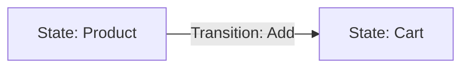
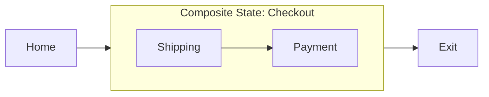
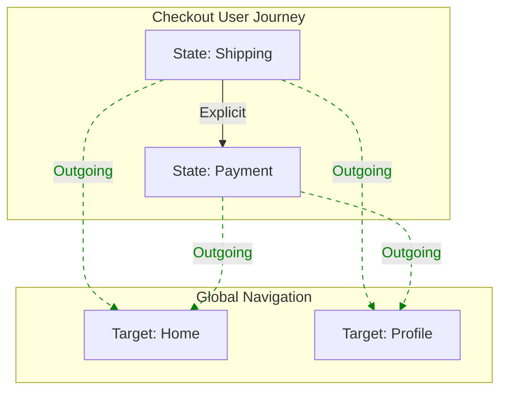

## Overview

This module defines the vocabulary for **intended** user flow. It extends [[UJG Core]] to support structured, interactive graphs with composition via sub-journey references, organization tags, and reusable outgoing navigation patterns.

## Normative Artifacts

This module is published through the following artifacts:

- `graph.ttl`: ontology, published at `https://ujg.specs.openuji.org/ed/ns/graph`
- `graph.context.jsonld`: JSON-LD term mappings, published at `https://ujg.specs.openuji.org/ed/ns/graph.context.jsonld`
- `graph.shape.ttl`: SHACL validation rules, published at `https://ujg.specs.openuji.org/ed/ns/graph.shape`

Examples in this page use an explicit context array composed from the published module contexts. The same composition is also published as the convenience context `https://ujg.specs.openuji.org/ed/ns/context.jsonld`.

## Terminology

- <dfn>Journey</dfn>: A named container for a user flow.
- <dfn>State</dfn>: A discrete node in the experience (e.g., a screen, modal).
- <dfn>Transition</dfn>: A directed edge between two states.
- <dfn>CompositeState</dfn>: A state that encapsulates another [=Journey=] (sub-journey).
- <dfn>OutgoingTransition</dfn>: A one way edge pointing to a next possible [=State=]
- <dfn>OutgoingTransitionGroup</dfn>: A reusable set of outgoing transitions that a Consumer can treat as present on multiple states (e.g., global nav).

---

## The Core Graph {data-cop-concept="core"}

<spec-statement>A [=Journey=] **MUST** consist of [=State|States=] connected by [=Transition|Transitions=].</spec-statement>

### Visual Model


```mermaid
graph LR
    A[State: Product] -->|Transition: Add| B[State: Cart]

```

## Composition (CompositeState)

Composition allows a node to reference an entire sub-journey, enabling "zoomable" graph interactions.

### Visual Model


```mermaid
graph LR
    H[Home] --> C
    subgraph C [Composite State: Checkout]
      direction LR
      s1[Shipping] --> s2[Payment]
    end
    C --> E[Exit]

```

The structural definition of [=CompositeState=] and `subjourneyId` is normative in the ontology and validation artifacts. This section defines only how consumers interpret that structure as nested or zoomable journey composition.

---

## Reusability (OutgoingTransitionGroup) {data-cop-concept="reusability"}

An [=OutgoingTransitionGroup=] defines reusable outgoing transitions (e.g., headers/footers) to avoid duplicating common navigation across many states.

The structural definition of [=OutgoingTransitionGroup=] and [=OutgoingTransition=] is normative in the ontology and validation artifacts. This section defines only the consumer processing model for applying those reusable outgoing edges.

### Visual Model


```mermaid
graph TD
    %% Global Destinations defined in the Group
    subgraph Global [Global Navigation]
      direction LR
      H[Target: Home]
      P[Target: Profile]
    end

    %% The Standard User Journey
    subgraph Flow [Checkout User Journey]
      direction LR
      S1[State: Shipping] -->|Explicit| S2[State: Payment]
    end

    %% The Injection Logic (Applies to ALL states in Flow)
    S1 -.->|Outgoing| H
    S1 -.->|Outgoing| P
    S2 -.->|Outgoing| H
    S2 -.->|Outgoing| P

    %% Styling for clarity
    linkStyle 1,2,3,4 stroke-dasharray: 5 5, stroke:green, color:green;

```

### Processing Model (Injection)

<spec-statement>
When a Consumer loads a [=Journey=] referencing `outgoingTransitionGroupRefs`:
1. **Resolution:**
  * The Consumer **MUST** resolve each referenced [=OutgoingTransitionGroup=]
  * The Consumer **MUST** resolve each `outgoingTransitionRefs` entry to an [=OutgoingTransition=].
2. **Iteration:** The Consumer **MUST** iterate over every [=State=] and [=CompositeState=] ID in `stateRefs`.
3. **Injection:** The Consumer **MUST** treat each iterated state as having an outgoing edge to every resolved [=OutgoingTransition=] `to`.
4. **Deduplication:** A Consumer **SHOULD** treat injected and explicit edges with the same effective `from` and `to` as one effective edge.
</spec-statement>

---

## Ontology {data-cop-concept="ontology"}

The normative Graph ontology is defined below and is published at `https://ujg.specs.openuji.org/ed/ns/graph`. It is the authoritative structural definition for Graph classes and properties, including `Journey`, `State`, `CompositeState`, `Transition`, `OutgoingTransition`, and `OutgoingTransitionGroup`.

:::include ./graph.ttl :::

## JSON-LD Context {data-cop-concept="jsonld-context"}

The normative Graph JSON-LD context is defined below and is published at `https://ujg.specs.openuji.org/ed/ns/graph.context.jsonld`. It provides the compact JSON-LD term mappings for the Graph vocabulary used by the examples on this page.

:::include ./graph.context.jsonld :::

---
## Validation {data-cop-concept="validation"}

The normative Graph SHACL shape is defined below and is published at `https://ujg.specs.openuji.org/ed/ns/graph.shape`. It is the authoritative validation artifact for Graph structural constraints.

:::include ./graph.shape.ttl :::

The rules below define additional graph integrity and resolution behavior beyond the structural constraints captured by the SHACL shape.

<spec-statement>
To ensure graph integrity, the following constraints **MUST** be met:
1. **Reference Integrity:** All `startState`, `stateRefs`, `transitionRefs`, `outgoingTransitionGroupRefs`, and `outgoingTransitionRefs` IDs **MUST** resolve to valid Nodes within the current scope or imported modules.
2. **Transition Endpoint Resolution:** The `from` and `to` IDs of a [=Transition=] **MUST** resolve to valid Nodes, and are required to be members of the enclosing [=Journey=]'s `stateRefs`. A transition **MUST NOT** reference states belonging to other journeys.
3. **Composition Safety**: `subjourneyId` **MUST** resolve to a valid [=Journey=].
4. **Group Resolution**: Every ID in `outgoingTransitionGroupRefs` **MUST** resolve to an [=OutgoingTransitionGroup=].
5. **Outgoing Resolution**: Every ID in `outgoingTransitionRefs` **MUST** resolve to an [=OutgoingTransition=].
</spec-statement>

---

## Appendix: Combined JSON Example {.unnumbered}

```json
{
  "@context": "https://ujg.specs.openuji.org/ed/ns/context.jsonld",
  "@id": "https://example.com/ujg/graph/main-site.jsonld",
  "@type": "UJGDocument",
  "specVersion": "1.0",
  "nodes": [
    {
      "@type": "Journey",
      "@id": "urn:ujg:journey:main-site",
      "startState": "urn:ujg:state:home",
      "stateRefs": ["urn:ujg:state:home", "urn:ujg:state:checkout-flow"],
      "transitionRefs": ["urn:ujg:transition:home-to-checkout"],
      "outgoingTransitionGroupRefs": ["urn:ujg:otg:global-header"]
    },

    {
      "@type": "Transition",
      "@id": "urn:ujg:transition:home-to-checkout",
      "from": "urn:ujg:state:home",
      "to": "urn:ujg:state:checkout-flow",
      "label": "Buy Now"
    },

    {
      "@type": "State",
      "@id": "urn:ujg:state:home",
      "label": "Home Page",
      "tags": ["phase:landing"]
    },

    {
      "@type": "CompositeState",
      "@id": "urn:ujg:state:checkout-flow",
      "label": "Checkout Process",
      "subjourneyId": "urn:ujg:journey:checkout"
    },

    { "@type": "State", "@id": "urn:ujg:state:profile", "label": "Profile" },

    {
      "@type": "OutgoingTransition",
      "@id": "urn:ujg:ot:go-home",
      "to": "urn:ujg:state:home",
      "label": "Home"
    },

    {
      "@type": "OutgoingTransition",
      "@id": "urn:ujg:ot:go-profile",
      "to": "urn:ujg:state:profile",
      "label": "Profile"
    },

    {
      "@type": "OutgoingTransitionGroup",
      "@id": "urn:ujg:otg:global-header",
      "outgoingTransitionRefs": ["urn:ujg:ot:go-home", "urn:ujg:ot:go-profile"]
    }
  ]
}
```
