## Overview

This module defines the vocabulary for intended user flow. It extends [[UJG Core]] to support structured, interactive graphs with composition through one or more child-Journey references, exported exits from nested journeys, organization tags, and reusable outgoing navigation patterns. Graph describes intended topology and possible movement; it does not prescribe execution, scheduling, condition evaluation, or event processing.

## Terminology

- <dfn>Journey</dfn>: A named container for local traversable user flow topology.
- <dfn>JourneyEntry</dfn>: An explicit entry contract for a [=Journey=].
- <dfn>JourneyEntryIndex</dfn>: A catalogue of addressable [=JourneyEntry=] contracts that does not define traversal.
- <dfn>LocalVertex</dfn>: An abstract local topology vertex of a [=Journey=].
- <dfn>State</dfn>: A discrete node in the experience (e.g., a screen, modal).
- <dfn>State occurrence</dfn>: A concrete experienced occurrence of a [=State=] during traversal.
- <dfn>Transition</dfn>: A structural directed edge between local vertices of a [=Journey=].
- <dfn>Command</dfn>: A stable semantic identity of an intentional invocation in the modeled experience.
- <dfn>CompositeState</dfn>: A state that contains one or more child [=Journey|Journeys=]. Multiple child Journeys define independent local flows within the same composite scope.
- <dfn>Composite scope</dfn>: The set of child Journeys referenced by one [=CompositeState=].
- <dfn>JourneyExit</dfn>: A terminal local graph vertex and exported completion contract declared by a [=Journey=].
- <dfn>OutgoingTransition</dfn>: A navigational affordance pointing to a next possible [=State=] or [=CompositeState=].
- <dfn>OutgoingTransitionGroup</dfn>: A reusable set of outgoing transitions that a Consumer can treat as present on multiple states (e.g., global nav).

---

## LocalVertex {data-cop-concept="local-vertex"}

A [=LocalVertex=] is the abstract topology node type for the local topology of a [=Journey=].

[=State=] and [=JourneyExit=] are sibling kinds of [=LocalVertex=]. A [=CompositeState=] is a specialized [=State=]. A [=JourneyExit=] is not a [=State=].

<spec-statement>
1. A [=State=] **MUST** be a [=LocalVertex=].
2. A [=CompositeState=] **MUST** be a [=State=].
3. A [=JourneyExit=] **MUST** be a [=LocalVertex=].
4. A [=JourneyExit=] **MUST NOT** be a [=State=].
</spec-statement>

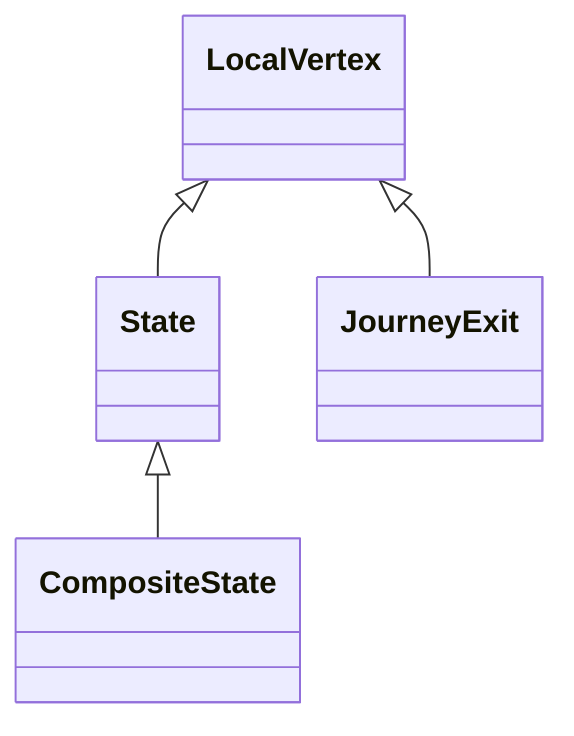
```mermaid
classDiagram
  class LocalVertex
  class State
  class CompositeState
  class JourneyExit

  LocalVertex <|-- State
  State <|-- CompositeState
  LocalVertex <|-- JourneyExit
```

[=LocalVertex=] is abstract. Documents use concrete [=State=], [=CompositeState=], or
[=JourneyExit=] nodes rather than serializing ordinary `LocalVertex` nodes.

---

## State {data-cop-concept="state"}

A [=State=] is the base graph node for a discrete point in an intended user experience, such as a page, screen, modal, or other user-visible step.

Later sections define navigation affordances that can be attached to eligible states. This section defines only the base state node.

<spec-statement>
1. A [=State=] **MUST** be identified by an IRI.
2. A [=State=] **MUST** declare exactly one `label`.
3. A [=State=] **MAY** declare one or more `tags`.
</spec-statement>

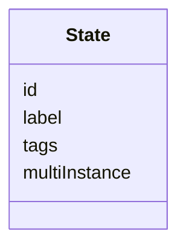
```mermaid
classDiagram
  class State {
    id
    label
    tags
    multiInstance
  }
```

Example JSON node:

```json
{
  "@type": "State",
  "@id": "urn:ujg:state:search-form",
  "label": "Search form",
  "tags": [
    "phase:search"
  ]
}
```

### multiInstance {data-cop-concept="multi-instance"}

<spec-statement>
`multiInstance` is optional. If present, it **MUST** be a boolean. Absence of `multiInstance`, or
`multiInstance: false`, means that the [=State=] does not declare multiple concurrent concrete
occurrences.

`multiInstance: true` means that one canonical [=State=] may appear as multiple concrete occurrences
within one active [=Journey=]. It **MUST NOT** define an occurrence count, occurrence IDs, data
source, collection logic, domain entity mapping, query, expression, or rendering behavior.
</spec-statement>

Example multi-instance state:

```json
{
  "@type": "State",
  "@id": "urn:ujg:state:workshop-teaser",
  "label": "Workshop teaser",
  "multiInstance": true
}
```

A Graph with this node still contains one canonical `Workshop teaser` [=State=]. Runtime or
application data may present multiple concrete workshop teaser occurrences.

---

## Transition {data-cop-concept="transition"}

A [=Transition=] is a structural directed edge between local vertices of a [=Journey=]. It models ordinary progression inside the local topology of a [=Journey=].

A [=Transition=] is not owned by either endpoint state. It is owned by a journey through `transitionRefs`.

When a [=Transition=]'s `from` value references a [=State=] with `multiInstance: true`, the same
[=Transition=] applies to each concrete occurrence of that state. The [=Transition=] itself remains
one stable Graph node.

The presence of multiple child Journeys in one [=CompositeState=] does not create implicit
Transitions between them.

<spec-statement>
1. A [=Transition=] **MUST** be identified by an IRI, declare exactly one `from`, and declare exactly one `to`.
2. A [=Transition=] **MAY** declare one `label`.
3. A [=Transition=] **MAY** reference one [=Command=] with `commandRef`.
4. When listed in a [=Journey=]'s `transitionRefs`, `from` **MUST** reference a [=State=] or [=CompositeState=] in that journey's `stateRefs`.
5. When listed in a [=Journey=]'s `transitionRefs`, `to` **MUST** reference a [=State=] or [=CompositeState=] in that journey's `stateRefs`, or a [=JourneyExit=] in that journey's `exitRefs`.
6. [=Transition=] endpoints **MUST** stay local to the enclosing [=Journey=].
7. `toEntryRef` **MAY** be used only on parent transitions into [=CompositeState=] nodes, as defined by the boundary mapping rules below.
8. A [=Transition=] from a [=State=] with `multiInstance: true` **MUST** remain one Graph node; per-instance transition properties are outside Graph.
9. A child Journey's [=Transition=] **MUST NOT** connect directly to a [=State=], [=CompositeState=], or [=JourneyExit=] owned only by another child Journey.
</spec-statement>

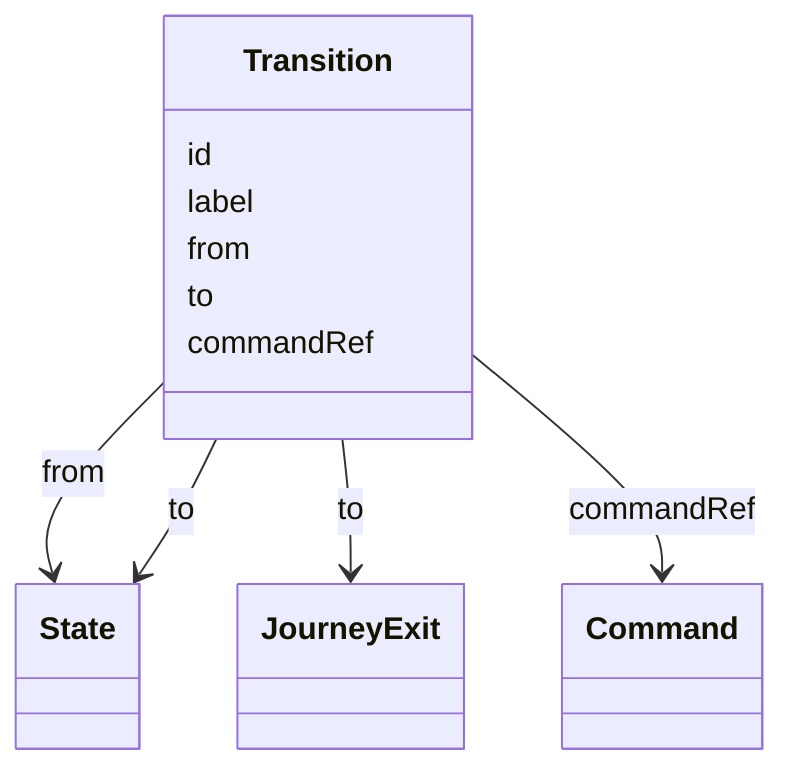
```mermaid
classDiagram
  class State
  class JourneyExit
  class Command

  class Transition {
    id
    label
    from
    to
    commandRef
  }

  Transition --> State : from
  Transition --> State : to
  Transition --> JourneyExit : to
  Transition --> Command : commandRef
```

Example JSON node:

```json
{
  "@type": "Transition",
  "@id": "urn:ujg:transition:search-form-to-results",
  "label": "Submit search",
  "from": "urn:ujg:state:search-form",
  "to": "urn:ujg:state:results",
  "commandRef": "urn:ujg:command:submit-search"
}
```

Example transition from a multi-instance state:

```json
{
  "@type": "Transition",
  "@id": "urn:ujg:transition:open-workshop",
  "label": "Open workshop",
  "from": "urn:ujg:state:workshop-teaser",
  "to": "urn:ujg:state:workshop-detail"
}
```

The `open-workshop` transition is declared once; it may be taken from any concrete `Workshop teaser`
occurrence.

---

## Command {data-cop-concept="command"}

A [=Command=] identifies the stable semantic identity of an intentional invocation in the modeled
experience.

A [=Command=] can be referenced by [=Transition=] and [=OutgoingTransition=] nodes through
`commandRef`. Multiple transitions may reference the same [=Command=]. Sharing a `commandRef`
establishes only common invocation identity. Graph does not assign branching, selection, ordering,
resolution, execution-result, or effect semantics to that relationship.

A [=Command=] is not a transition endpoint and does not replace [=Transition=] or
[=OutgoingTransition=]. Structural, automatic, expiry-driven, or otherwise non-invoked transitions
can remain without `commandRef`.

<spec-statement>
1. A [=Command=] **MUST** be identified by an IRI.
2. A [=Command=] **MAY** declare one `label` and one or more `tags`.
3. A [=Command=] **MUST NOT** declare `from`, `to`, branching, condition resolution, effect execution, visual representation, runtime execution, or execution-result semantics.
4. `commandRef` **MAY** appear on a [=Transition=] or [=OutgoingTransition=] and **MUST** reference a [=Command=].
5. A [=Transition=] or [=OutgoingTransition=] **MUST NOT** reference more than one [=Command=].
6. Absence of `commandRef` makes no claim that the transition represents an intentional invocation.
</spec-statement>

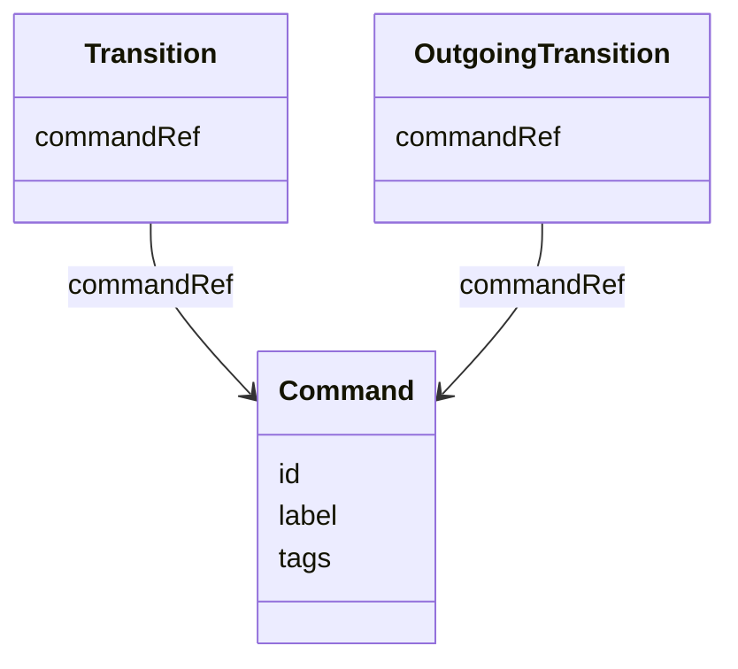
```mermaid
classDiagram
  class Command {
    id
    label
    tags
  }
  class Transition {
    commandRef
  }
  class OutgoingTransition {
    commandRef
  }

  Transition --> Command : commandRef
  OutgoingTransition --> Command : commandRef
```

Example JSON node:

```json
{
  "@type": "Command",
  "@id": "urn:ujg:command:continue-registration",
  "label": "Continue registration"
}
```

Example transition associated with a command:

```json
{
  "@type": "Transition",
  "@id": "urn:ujg:transition:start-registration",
  "from": "urn:ujg:state:registration-open",
  "to": "urn:ujg:state:registration-form",
  "commandRef": "urn:ujg:command:start-registration"
}
```

---

## Journey {data-cop-concept="journey"}

A [=Journey=] is the local container for intended flow topology. It lists the experiential states that belong to the journey, the terminal exits exported by the journey, and, when present, the transitions that connect those local vertices.

Use [=Journey=] when the modeled object owns local traversal, progression, or structural order. If the model only needs to list known entry points into pages, surfaces, flows, or journeys, use [=JourneyEntryIndex=] instead.

<spec-statement>
1. A [=Journey=] **MUST** be identified by an IRI and declare at least one `entryRefs` value and one `stateRefs` value.
2. A [=Journey=] **MAY** declare one `defaultEntryRef`; if present, it **MUST** also appear in `entryRefs`.
3. `entryRefs`, `stateRefs`, `transitionRefs`, `exitRefs`, and `outgoingTransitionGroupRefs` **MUST** reference nodes of the corresponding Graph classes.
4. A [=Journey=]'s local vertices are its `stateRefs` plus its `exitRefs`.
5. `stateRefs` **MUST** describe local experiential topology, not destinations that are merely reachable through [=OutgoingTransition=] navigation.
</spec-statement>

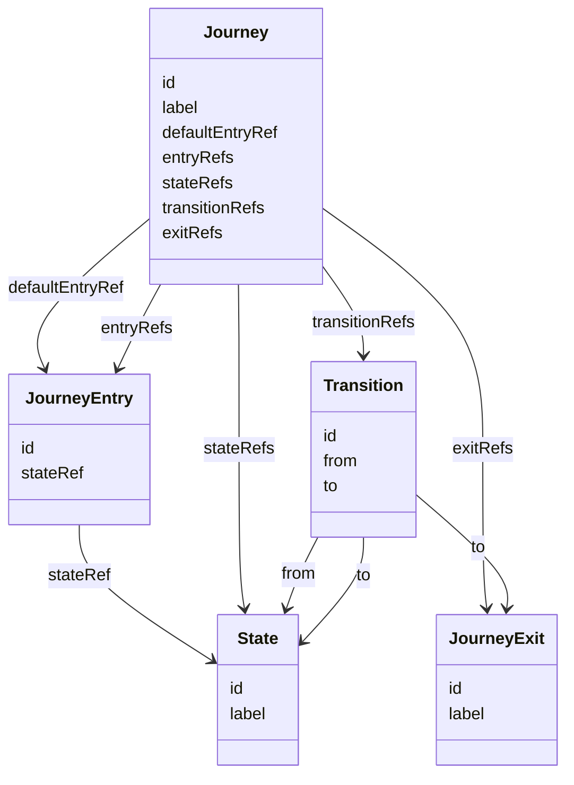
```mermaid
classDiagram
  class Journey {
    id
    label
    defaultEntryRef
    entryRefs
    stateRefs
    transitionRefs
    exitRefs
  }

  class JourneyEntry {
    id
    stateRef
  }

  class State {
    id
    label
  }

  class JourneyExit {
    id
    label
  }

  class Transition {
    id
    from
    to
  }

  Journey --> JourneyEntry : defaultEntryRef
  Journey --> JourneyEntry : entryRefs
  JourneyEntry --> State : stateRef
  Journey --> State : stateRefs
  Journey --> JourneyExit : exitRefs
  Journey --> Transition : transitionRefs
  Transition --> State : from
  Transition --> State : to
  Transition --> JourneyExit : to
```

Example JSON node:

```json
[
  {
    "@type": "Journey",
    "@id": "urn:ujg:journey:site-search",
    "label": "Site search",
    "defaultEntryRef": "urn:ujg:entry:site-search-default",
    "entryRefs": [
      "urn:ujg:entry:site-search-default"
    ],
    "stateRefs": [
      "urn:ujg:state:search-form",
      "urn:ujg:state:results"
    ],
    "transitionRefs": [
      "urn:ujg:transition:search-form-to-results"
    ]
  },
  {
    "@type": "JourneyEntry",
    "@id": "urn:ujg:entry:site-search-default",
    "stateRef": "urn:ujg:state:search-form"
  }
]
```

A single-state journey can omit `transitionRefs`:

```json
[
  {
    "@type": "Journey",
    "@id": "urn:ujg:journey:privacy-policy",
    "label": "Privacy policy",
    "defaultEntryRef": "urn:ujg:entry:privacy-policy-default",
    "entryRefs": [
      "urn:ujg:entry:privacy-policy-default"
    ],
    "stateRefs": [
      "urn:ujg:state:privacy-policy"
    ]
  },
  {
    "@type": "JourneyEntry",
    "@id": "urn:ujg:entry:privacy-policy-default",
    "stateRef": "urn:ujg:state:privacy-policy"
  }
]
```

A journey can also omit `defaultEntryRef` when no entry is semantically a general fallback. In that
case, entry selection is unresolved by Graph unless an execution or materialization context selects
exactly one listed [=JourneyEntry=].

```json
[
  {
    "@type": "Journey",
    "@id": "urn:ujg:journey:workshop-detail",
    "label": "Workshop detail",
    "entryRefs": [
      "urn:ujg:entry:workshop-registration-open",
      "urn:ujg:entry:workshop-waitlist-open",
      "urn:ujg:entry:workshop-registration-closed"
    ],
    "stateRefs": [
      "urn:ujg:state:workshop-registration-open",
      "urn:ujg:state:workshop-waitlist-open",
      "urn:ujg:state:workshop-registration-closed"
    ]
  },
  {
    "@type": "JourneyEntry",
    "@id": "urn:ujg:entry:workshop-registration-open",
    "label": "Registration open",
    "stateRef": "urn:ujg:state:workshop-registration-open"
  },
  {
    "@type": "JourneyEntry",
    "@id": "urn:ujg:entry:workshop-waitlist-open",
    "label": "Waitlist open",
    "stateRef": "urn:ujg:state:workshop-waitlist-open"
  },
  {
    "@type": "JourneyEntry",
    "@id": "urn:ujg:entry:workshop-registration-closed",
    "label": "Registration closed",
    "stateRef": "urn:ujg:state:workshop-registration-closed"
  }
]
```

---

## JourneyEntry {data-cop-concept="journey-entry"}

A [=JourneyEntry=] is an explicit entry contract for a [=Journey=]. It identifies the local [=State=] or [=CompositeState=] where traversal begins without making that entry node part of the local transition topology.

<spec-statement>
1. A [=JourneyEntry=] **MUST** be identified by an IRI and declare exactly one `stateRef`.
2. `stateRef` **MUST** reference a [=State=] or [=CompositeState=] listed in the declaring [=Journey=]'s `stateRefs`.
3. A [=JourneyEntry=] **MUST** be listed in exactly one [=Journey=]'s `entryRefs`.
4. A [=JourneyEntry=] **MUST NOT** be used as a [=Transition=] endpoint.
5. A [=JourneyEntry=] **MAY** declare one `label` and one or more `tags`.
</spec-statement>

Top-level traversal of a [=Journey=] begins at an explicitly selected [=JourneyEntry=]. If no
entry is explicitly selected and the [=Journey=] declares `defaultEntryRef`, traversal begins at
the `stateRef` of that default entry. If neither applies, entry selection remains unresolved by
Graph.

When Graph leaves entry selection unresolved, a materialization or execution context may select one
listed entry. Consumers do not infer a default from `entryRefs` order, and contextual entry selection
does not change Graph topology. If no entry can be selected, traversal into that [=Journey=] remains
unresolved; that does not make the Graph invalid.

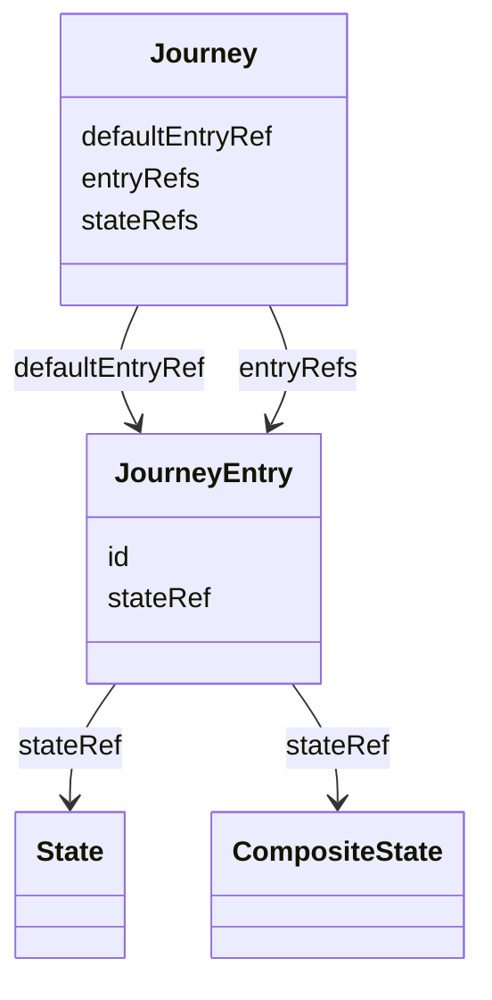
```mermaid
classDiagram
  class Journey {
    defaultEntryRef
    entryRefs
    stateRefs
  }
  class JourneyEntry {
    id
    stateRef
  }
  class State
  class CompositeState

  Journey --> JourneyEntry : defaultEntryRef
  Journey --> JourneyEntry : entryRefs
  JourneyEntry --> State : stateRef
  JourneyEntry --> CompositeState : stateRef
```

Example JSON node:

```json
{
  "@type": "JourneyEntry",
  "@id": "urn:ujg:entry:site-search-default",
  "label": "Default search entry",
  "stateRef": "urn:ujg:state:search-form"
}
```

---

## JourneyEntryIndex {data-cop-concept="journey-index"}

A [=JourneyEntryIndex=] is a Graph class and Core [=Node=] that acts as a catalogue of addressable [=JourneyEntry=] contracts. It is not a subclass of [=Journey=] and does not define traversal. A Consumer **MUST NOT** infer that indexed entries are reachable from one another, ordered as a path, or part of a parent-owned progression.

Use [=Journey=] when modeling local topology. Use [=JourneyEntryIndex=] when listing known entry points into modeled journeys. A root [=Journey=] should only be used when the root itself owns real traversal, progression, or structural order.

In common use, a [=JourneyEntryIndex=] lists default or named [=JourneyEntry=] contracts for modeled pages, surfaces, flows, or journeys. The referenced entries remain owned by their declaring [=Journey=].

<spec-statement>
1. A [=JourneyEntryIndex=] **MUST** be identified by an IRI and declare at least one `entryRefs` value.
2. Each `entryRefs` value **MUST** reference a [=JourneyEntry=] owned by exactly one [=Journey=].
3. A [=JourneyEntryIndex=] is a catalogue only: it **MUST NOT** own topology, entries, states, transitions, exits, outgoing groups, or child-journey mappings.
4. `entryRefs` on a [=JourneyEntryIndex=] **MUST NOT** imply order, reachability, progression, a user path, or parent continuation.
</spec-statement>

[=JourneyEntryIndex=] is intended for top-level page maps, product surface indexes, search-result target indexes, documentation indexes, entry catalogues, and other collections of known journey entry points. Do not use [=JourneyEntryIndex=] to model page-segment order, local journey progression, child completion, runtime observations, or experience annotations.

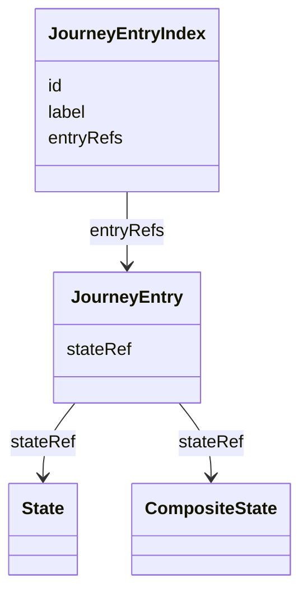
```mermaid
classDiagram
  class JourneyEntryIndex {
    id
    label
    entryRefs
  }

  class JourneyEntry {
    stateRef
  }

  class State
  class CompositeState
  JourneyEntryIndex --> JourneyEntry : entryRefs
  JourneyEntry --> State : stateRef
  JourneyEntry --> CompositeState : stateRef
```

Example JSON node:

```json
{
  "@type": "JourneyEntryIndex",
  "@id": "urn:ujg:index:site-pages",
  "label": "Site page index",
  "entryRefs": [
    "urn:ujg:entry:home-page-default",
    "urn:ujg:entry:search-page-default",
    "urn:ujg:entry:profile-page-default"
  ]
}
```

The indexed entries are known entry contracts. Their order above does not define a path from the home page to search to profile.

---

## CompositeState {data-cop-concept="composition"}

A [=CompositeState=] is a [=State=] that represents nested composition. It references one or more
child [=Journey=] resources through `subjourneyRefs`, allowing consumers to interpret those Journeys
as zoomable or nested local graphs.

The parent journey treats the [=CompositeState=] as one parent-local state. The parent journey does
not list the child Journeys' states directly.

<spec-statement>
1. A [=CompositeState=] **MUST** be a [=State=].
2. A [=CompositeState=] **MUST** declare at least one `subjourneyRefs` value.
3. Every `subjourneyRefs` value **MUST** be an IRI that resolves to a [=Journey=].
4. `subjourneyRefs` is a set. Each resolved child Journey occurs at most once in the set.
5. A [=CompositeState=] **MUST NOT** list child states directly with `stateRefs`.
6. The parent [=Journey=] **MUST** treat the [=CompositeState=] as one local vertex regardless of the
   number of child Journeys.
7. Every referenced child Journey defines an independent local topology scope.
8. The order in which `subjourneyRefs` values are serialized **MUST NOT** imply priority, sequence,
   causality, activation order, or presentation order.
9. A Consumer **MUST NOT** infer a [=Transition=], dependency, condition, synchronization rule, or
   completion relationship between child Journeys from their common containment.
10. While an occurrence of the [=CompositeState=] is current, observations belonging to different
    child Journeys **MAY** overlap or interleave.
11. A child Journey's internal movement does not, by itself, change the current local position of
    another child Journey.
12. A [=CompositeState=] with one child Journey defines ordinary nested composition.
13. A [=CompositeState=] with more than one child Journey defines multi-Journey composition.
14. Each child Journey **SHOULD** represent one coherent behavioral concern that is independently
    understandable from its siblings.
15. Common containment of child Journeys **MUST NOT** by itself imply that they represent different
    domain entities, related domain entities, or parts of one domain aggregate.
</spec-statement>

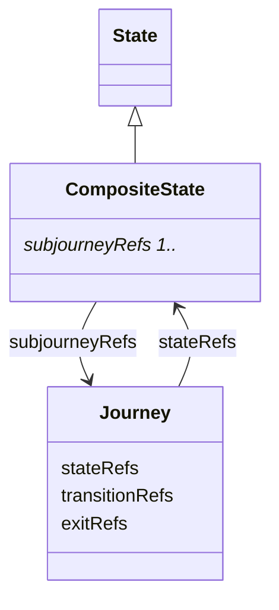
```mermaid
classDiagram
  class State
  class CompositeState {
    subjourneyRefs 1..*
  }
  class Journey {
    stateRefs
    transitionRefs
    exitRefs
  }

  State <|-- CompositeState
  Journey --> CompositeState : stateRefs
  CompositeState --> Journey : subjourneyRefs
```

Example JSON node:

```json
{
  "@type": "CompositeState",
  "@id": "urn:ujg:state:checkout",
  "label": "Checkout",
  "subjourneyRefs": [
    "urn:ujg:journey:shipping",
    "urn:ujg:journey:payment"
  ]
}
```

The Shipping and Payment Journeys are separate local topology scopes. Graph permits their
observations to interleave while Checkout is current. It does not assert that either Journey is
entered first or that both must be visited.

### Nested composition

<spec-statement>
1. A child Journey **MAY** contain a [=CompositeState=] in its own `stateRefs`.
2. Composition is interpreted recursively; child Journeys **MUST NOT** be flattened into the parent
   Journey's local vertex set.
3. A child [=JourneyExit=] leaves the directly containing [=CompositeState=] occurrence in the
   applicable containment path.
4. Leaving a nested [=CompositeState=] does not by itself leave an ancestor [=CompositeState=]. The
   ancestor is left only through movement that exits that ancestor's own composite scope.
</spec-statement>

### Interaction with multiInstance

<spec-statement>
1. Multiple child Journeys and `multiInstance` describe independent dimensions.
2. More than one `subjourneyRefs` value **MUST NOT** imply `multiInstance: true`.
3. `multiInstance: true` on a [=CompositeState=] means that multiple concrete occurrences of the same
   canonical CompositeState may coexist.
4. Each concrete CompositeState occurrence has a distinct composite scope occurrence for Mapping
   purposes.
5. Child observations associated with one CompositeState occurrence **MUST NOT** be used as local
   predecessors for child observations associated with another occurrence.
6. Graph does not define occurrence identifiers or occurrence-association data.
</spec-statement>

---

## JourneyExit {data-cop-concept="journey-exits"}

A [=JourneyExit=] is a terminal local graph vertex and exported completion contract declared by a [=Journey=]. It represents a terminal journey outcome that can be reached by a local [=Transition=].

A parent journey can use exported exits to distinguish which outcome of a child journey was reached, without directly referencing child states.

<spec-statement>
1. A [=JourneyExit=] **MUST** be identified by an IRI and listed in exactly one [=Journey=]'s `exitRefs`.
2. A [=JourneyExit=] **MAY** declare one `label` and one or more `tags`.
3. A [=JourneyExit=] **MAY** be the `to` endpoint of a [=Transition=] in the declaring [=Journey=].
4. A [=JourneyExit=] is terminal: it **MUST NOT** be a `from` endpoint or expose outgoing affordances.
5. A [=JourneyExit=] **MUST NOT** model runtime facts, submitted values, analytics facts, or ordinary internal child movement.
</spec-statement>

If a completion point is an actual user-visible screen, page, modal, or step, it should remain a normal [=State=]. A journey can then transition from that state to a [=JourneyExit=] that represents the exported terminal outcome.

Informative pattern:

```text
CheckoutForm -> SuccessScreen -> CheckoutCompleteExit
```

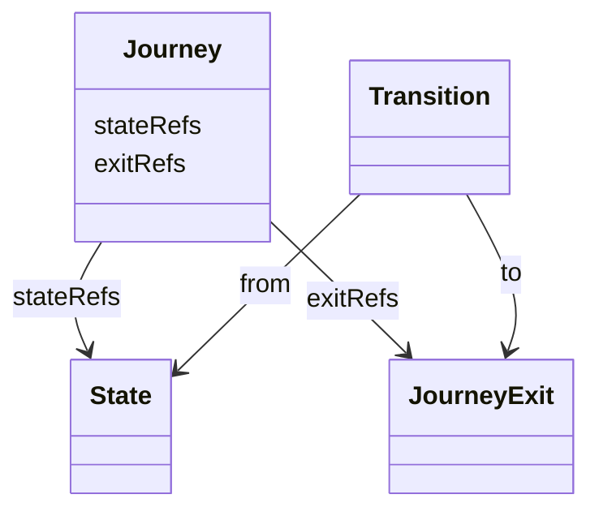
```mermaid
classDiagram
  class Journey {
    stateRefs
    exitRefs
  }
  class State
  class JourneyExit
  class Transition

  Journey --> State : stateRefs
  Journey --> JourneyExit : exitRefs
  Transition --> State : from
  Transition --> JourneyExit : to
```

Example JSON nodes:

```json
{
  "@type": "JourneyExit",
  "@id": "urn:ujg:exit:checkout-complete",
  "label": "Checkout complete"
}
```

```json
{
  "@type": "Transition",
  "@id": "urn:ujg:transition:checkout-form-to-complete",
  "label": "Submit checkout",
  "from": "urn:ujg:state:checkout-form",
  "to": "urn:ujg:exit:checkout-complete"
}
```

### JourneyExit in a composite scope

A [=JourneyExit=] owned by any child Journey of a [=CompositeState=] is an exported exit from that
CompositeState.

<spec-statement>
1. Reaching a child [=JourneyExit=] means that the containing [=CompositeState=] occurrence has been
   left.
2. Once the [=CompositeState=] has been left, none of its child Journeys remains in scope for that
   occurrence.
3. A child Journey's [=JourneyExit=] **MUST NOT** mean only that the child has locally completed while
   the containing [=CompositeState=] remains current.
4. A locally complete point that does not leave the containing [=CompositeState=] **MUST** be modeled
   as a [=State=], not as a [=JourneyExit=].
5. Graph **MUST NOT** infer that every child Journey must reach an exit.
6. Graph **MUST NOT** infer a joint, collective, or all-child completion outcome.
7. Graph **MUST NOT** infer an ordering among exits belonging to different child Journeys.
</spec-statement>

Informative pattern:

```text
Payment Journey:
  Authorizing -> Authorized

Shipping Journey:
  Address -> DeliveryOption -> Confirmed
```

`Authorized` is a State when Payment may remain locally complete while Shipping continues.

```text
Payment Journey:
  Authorizing -> PaymentFailureExit
```

`PaymentFailureExit` leaves the containing Checkout CompositeState.

### Boundary Entry and Exit Mapping {data-cop-concept="boundary-mapping"}

`toEntryRef` and `fromExitRef` are mapping properties on parent [=Transition=] resources. They
describe how a parent-local [=CompositeState=] connects to entry and exit contracts belonging to its
child Journeys.

These properties are not transition endpoints. The transition's `from` and `to` values remain local to the enclosing journey.

### Entry boundary

<spec-statement>
1. A [=Transition=] **MAY** declare at most one `toEntryRef` when its `to` value references a
   [=CompositeState=].
2. The `toEntryRef` value **MUST** reference a [=JourneyEntry=] listed in the `entryRefs` of exactly
   one Journey referenced by the target CompositeState's `subjourneyRefs`.
3. `toEntryRef` identifies the child entry represented by that parent boundary Transition.
4. `toEntryRef` applies only to the child Journey that owns the referenced [=JourneyEntry=].
5. `toEntryRef` **MUST NOT** select, initialize, or imply entries for the CompositeState's other child
   Journeys.
6. Entry into a [=CompositeState=] without `toEntryRef` does not select a child Journey or child entry
   at the parent boundary.
7. When traversal of a particular child Journey is interpreted without an explicitly selected entry,
   that child Journey independently uses its `defaultEntryRef`, otherwise a materialization or
   execution context may select exactly one of its listed entries.
8. A Consumer **MUST NOT** infer that every child Journey's default entry is selected merely because
   the containing [=CompositeState=] was entered.
</spec-statement>

### Exit boundary

<spec-statement>
1. A [=Transition=] **MAY** declare at most one `fromExitRef` when its `from` value references a
   [=CompositeState=].
2. The `fromExitRef` value **MUST** reference a [=JourneyExit=] listed in the `exitRefs` of exactly
   one Journey referenced by the source CompositeState's `subjourneyRefs`.
3. Reaching that child [=JourneyExit=] means that the source [=CompositeState=] occurrence has been
   left.
4. Parent continuation for the child exit may use only a parent [=Transition=] whose `from` is the
   containing [=CompositeState=] and whose `fromExitRef` is that child exit.
5. No matching parent Transition means that no parent continuation is inferred.
6. More than one parent Transition with the same `from` and `fromExitRef` pair is invalid.
7. Taking a parent Transition from a [=CompositeState=], whether or not it declares `fromExitRef`,
   leaves the CompositeState and ends the composite scope for that occurrence.
8. `fromExitRef` remains singular. It identifies one concrete exported child outcome and **MUST NOT**
   represent a conjunction, disjunction, set, or synchronization of exits.
</spec-statement>

`toEntryRef` and `fromExitRef` **MUST NOT** replace local `from` or `to`, point directly to child
States, or create hidden Graph edges.

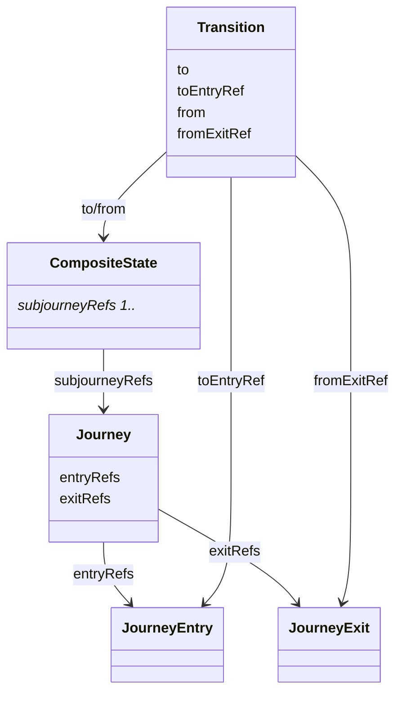
```mermaid
classDiagram
  class CompositeState {
    subjourneyRefs 1..*
  }
  class Journey {
    entryRefs
    exitRefs
  }
  class JourneyEntry
  class JourneyExit
  class Transition {
    to
    toEntryRef
    from
    fromExitRef
  }

  CompositeState --> Journey : subjourneyRefs
  Journey --> JourneyEntry : entryRefs
  Journey --> JourneyExit : exitRefs
  Transition --> CompositeState : to/from
  Transition --> JourneyEntry : toEntryRef
  Transition --> JourneyExit : fromExitRef
```

Example child entry selection:

```json
{
  "@type": "Transition",
  "@id": "urn:ujg:transition:cart-to-checkout",
  "label": "Start checkout",
  "from": "urn:ujg:state:cart",
  "to": "urn:ujg:state:checkout",
  "toEntryRef": "urn:ujg:entry:shipping-address"
}
```

The selected `toEntryRef` applies to the Shipping child Journey. It does not select or initialize
entries for the Checkout CompositeState's other child Journeys.

Example parent continuation after a child exit:

```json
{
  "@type": "Transition",
  "@id": "urn:ujg:transition:checkout-to-payment-error",
  "label": "Show payment error",
  "from": "urn:ujg:state:checkout",
  "to": "urn:ujg:state:payment-error",
  "fromExitRef": "urn:ujg:exit:payment-failed"
}
```

---

## OutgoingTransition {data-cop-concept="outgoing-transition"}

An [=OutgoingTransition=] is a navigational affordance. It defines a possible effective target state but does not declare a structural transition in a journey's local topology.

An [=OutgoingTransition=] has no explicit `from` property. Its effective source comes from either a state-scoped `outgoingTransitionRefs` value or an injected [=OutgoingTransitionGroup=].

<spec-statement>
1. An [=OutgoingTransition=] **MUST** be identified by an IRI and **MAY** declare one `label`.
2. An [=OutgoingTransition=] **MUST** use exactly one target mechanism: one `to` value, or `toCurrentState: true`.
3. An [=OutgoingTransition=] **MAY** reference one [=Command=] with `commandRef`.
4. `to` **MAY** reference a resolvable [=State=] or [=CompositeState=], including one outside the journey that contributes the affordance.
5. `toCurrentState: false` is equivalent to absence and does not satisfy the target requirement.
6. An [=OutgoingTransition=] is a navigational affordance, not local topology: it **MUST NOT** target a [=JourneyExit=], appear in `transitionRefs`, or model ordinary internal progression.
</spec-statement>

If the `to` target belongs to a known page, surface, or flow entry, that entry should normally be listed in a [=JourneyEntryIndex=]. Do not list the target state in the source [=Journey=]'s `stateRefs` unless it also belongs to the source journey's local topology.

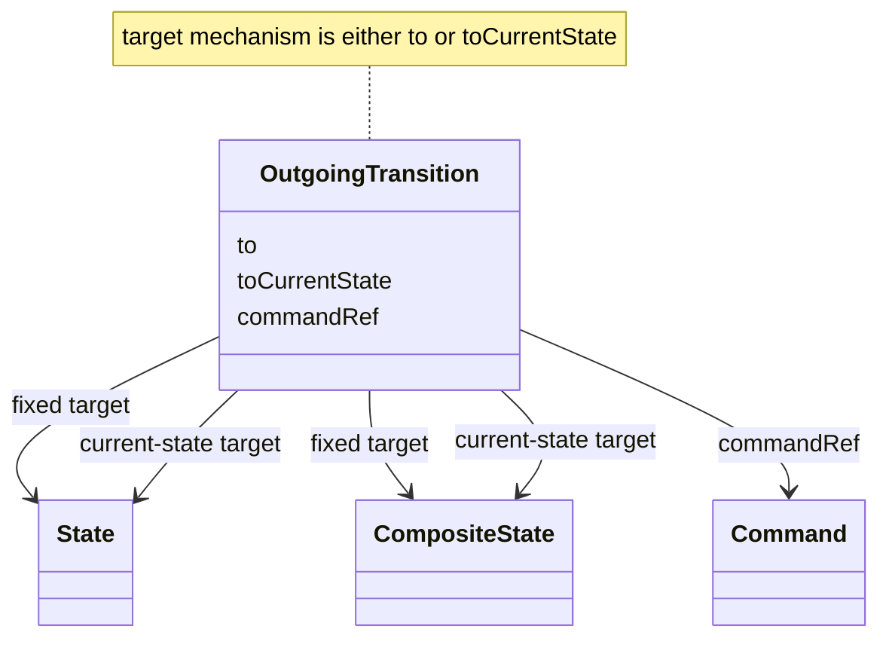
```mermaid
classDiagram
  class OutgoingTransition {
    to
    toCurrentState
    commandRef
  }
  class State
  class CompositeState
  class Command

  OutgoingTransition --> State : fixed target
  OutgoingTransition --> CompositeState : fixed target
  OutgoingTransition --> State : current-state target
  OutgoingTransition --> CompositeState : current-state target
  OutgoingTransition --> Command : commandRef
  note for OutgoingTransition "target mechanism is either to or toCurrentState"
```

Example JSON nodes:

Fixed target navigation:

```json
{
  "@type": "OutgoingTransition",
  "@id": "urn:ujg:ot:go-home",
  "label": "Home",
  "to": "urn:ujg:state:home",
  "commandRef": "urn:ujg:command:go-home"
}
```

### Relative Current-State Targeting

Use `toCurrentState: true` for affordances that keep the current graph state while changing a
non-topological dimension such as locale, presentation mode, or filter context. The target resolves
to the [=State=] or [=CompositeState=] where the affordance is available.

`toCurrentState` changes only Graph target resolution. It does not define runtime events, URLs,
payloads, locale metadata, or private extension behavior.


Current-state targeting:

```json
{
  "@type": "OutgoingTransition",
  "@id": "urn:ujg:ot:keep-current-state",
  "label": "Keep current state",
  "toCurrentState": true
}
```

---

## OutgoingTransitionGroup {data-cop-concept="outgoing-transition-group"}

An [=OutgoingTransitionGroup=] defines a reusable set of outgoing affordances, such as header or footer navigation, that a Consumer can treat as present on multiple eligible states.

Group injection does not add structural [=Transition=] resources to `transitionRefs`.

<spec-statement>
1. An [=OutgoingTransitionGroup=] **MUST** be identified by an IRI and declare at least one `outgoingTransitionRefs` value.
2. Each `outgoingTransitionRefs` value **MUST** reference an [=OutgoingTransition=].
3. A [=Journey=] **MAY** attach a group through `outgoingTransitionGroupRefs`.
4. A journey-level group applies each referenced [=OutgoingTransition=] to each [=State=] or [=CompositeState=] in the journey's `stateRefs`.
5. `toCurrentState: true` resolves at the state where the group is applied; groups **MUST NOT** create outgoing affordances from [=JourneyExit=] nodes.
</spec-statement>

Consumers **SHOULD** treat duplicate effective outgoing edges with the same source and target as one
effective edge.

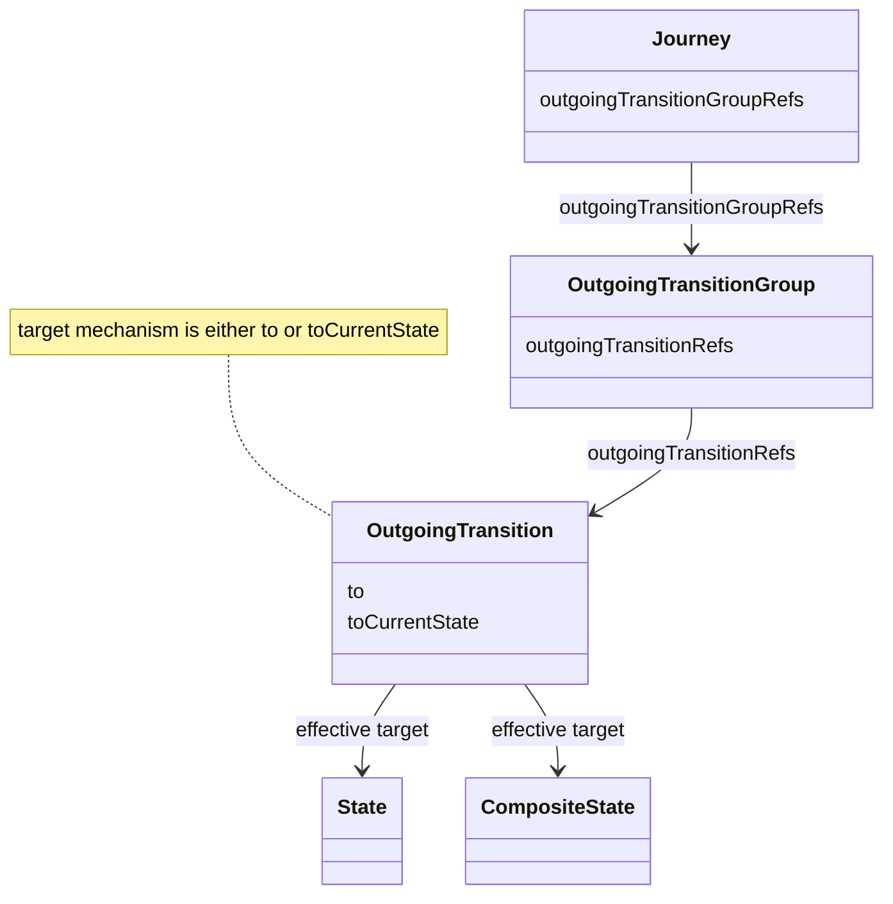
```mermaid
classDiagram
  class Journey {
    outgoingTransitionGroupRefs
  }
  class OutgoingTransitionGroup {
    outgoingTransitionRefs
  }
  class OutgoingTransition {
    to
    toCurrentState
  }
  class State
  class CompositeState

  Journey --> OutgoingTransitionGroup : outgoingTransitionGroupRefs
  OutgoingTransitionGroup --> OutgoingTransition : outgoingTransitionRefs
  OutgoingTransition --> State : effective target
  OutgoingTransition --> CompositeState : effective target
  note for OutgoingTransition "target mechanism is either to or toCurrentState"
```

Example JSON node:

```json
{
  "@type": "OutgoingTransitionGroup",
  "@id": "urn:ujg:otg:global-header",
  "outgoingTransitionRefs": [
    "urn:ujg:ot:go-home",
    "urn:ujg:ot:go-profile"
  ]
}
```

## State-scoped Outgoing Affordances {data-cop-concept="state-scoped-outgoing"}

A [=State=] can also declare outgoing affordances directly. These affordances apply only to that state and are not injected into other states.

Direct state-scoped affordances are for local navigational options, not for ordinary internal progression through a journey.

<spec-statement>
1. A [=State=] **MAY** declare `outgoingTransitionRefs`.
2. Each state-scoped `outgoingTransitionRefs` value **MUST** reference an [=OutgoingTransition=].
3. The declaring [=State=] is the effective source of the referenced [=OutgoingTransition=].
4. `toCurrentState: true` resolves to the declaring [=State=].
5. State-scoped outgoing affordances are not members of the enclosing [=Journey=]'s `transitionRefs`.
</spec-statement>

Only ordinary [=State=] nodes declare state-scoped outgoing affordances. If navigation should be
available while a [=CompositeState=] is active, model it as an [=OutgoingTransitionGroup=] on the
enclosing journey or as direct `outgoingTransitionRefs` on states inside the child journey.

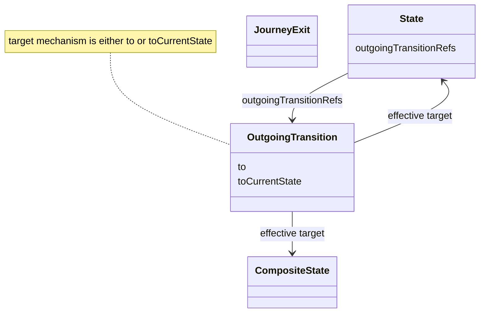
```mermaid
classDiagram
  class State {
    outgoingTransitionRefs
  }
  class CompositeState
  class JourneyExit
  class OutgoingTransition {
    to
    toCurrentState
  }

  State --> OutgoingTransition : outgoingTransitionRefs
  OutgoingTransition --> State : effective target
  OutgoingTransition --> CompositeState : effective target
  note for OutgoingTransition "target mechanism is either to or toCurrentState"
```

Example JSON nodes:

```json
{
  "@type": "State",
  "@id": "urn:ujg:state:w3c-searchpage-form",
  "label": "Search form",
  "outgoingTransitionRefs": [
    "urn:ujg:ot:w3c-searchpage-form-back-home"
  ]
}
```

```json
{
  "@type": "OutgoingTransition",
  "@id": "urn:ujg:ot:w3c-searchpage-form-back-home",
  "label": "Back to home page",
  "to": "urn:ujg:state:w3c-root-homepage"
}
```

This is a local "Back to home page" navigation affordance, not an internal [=Transition=]. Its `to`
target can be outside the current journey's `stateRefs`.

---


## Normative Artifacts

This module is published through the following artifacts:

- `graph.ttl`: ontology, published at `https://ujg.specs.openuji.org/ed/ns/graph`
- `graph.context.jsonld`: JSON-LD term mappings, published at `https://ujg.specs.openuji.org/ed/ns/graph.context.jsonld`
- `graph.shape.ttl`: SHACL validation rules, published at `https://ujg.specs.openuji.org/ed/ns/graph.shape`

Examples on this page use compact JSON-LD fragments. Complete documents can use the aggregate
context `https://ujg.specs.openuji.org/ed/ns/context.jsonld`, which preserves Graph's compact
`stateRef` term for [=JourneyEntry=].

### Ontology {data-cop-concept="ontology"}

The normative Graph ontology is defined below and is published at `https://ujg.specs.openuji.org/ed/ns/graph`. It is the authoritative structural definition for Graph classes and properties, including `Journey`, `JourneyEntry`, `JourneyEntryIndex`, `LocalVertex`, `State`, `CompositeState`, `Transition`, `Command`, `JourneyExit`, `OutgoingTransition`, `OutgoingTransitionGroup`, `defaultEntryRef`, `entryRefs`, `stateRef`, `exitRefs`, `toEntryRef`, `fromExitRef`, `commandRef`, `subjourneyRefs`, `multiInstance`, `toCurrentState`, and `outgoingTransitionRefs`.

:::include ./graph.ttl :::

### JSON-LD Context {data-cop-concept="jsonld-context"}

The normative Graph JSON-LD context is defined below and is published at `https://ujg.specs.openuji.org/ed/ns/graph.context.jsonld`. It provides the compact JSON-LD term mappings for the Graph vocabulary used by the examples on this page.

:::include ./graph.context.jsonld :::

---

### Validation {data-cop-concept="validation"}

The normative Graph SHACL shape is defined below and is published at `https://ujg.specs.openuji.org/ed/ns/graph.shape`. It is the authoritative validation artifact for Graph structural constraints.

:::include ./graph.shape.ttl :::

---

## Graph Integrity and Resolution {data-cop-concept="graph-integrity"}

The rules below define additional graph integrity and resolution behavior beyond the structural constraints captured by the SHACL shape.

<spec-statement>
To ensure graph integrity, the following constraints **MUST** be met:

1. Every Graph reference **MUST** resolve within the current scope or imported modules.
2. References **MUST** resolve to the class expected by the property that uses them.
3. Local [=Transition=] endpoints **MUST** stay inside the declaring [=Journey=]'s local vertex set.
4. `toEntryRef` and `fromExitRef` **MUST** resolve through one of the child Journeys referenced by the relevant [=CompositeState=]'s `subjourneyRefs`. The referenced [=JourneyEntry=] or [=JourneyExit=] **MUST** be owned by exactly one such child Journey.
5. Every `subjourneyRefs` value **MUST** resolve to a [=Journey=].
6. A `subjourneyRefs` set **MUST** contain at least one Journey.
7. The same Journey **MUST NOT** occur more than once in the RDF set represented by `subjourneyRefs`.
8. Child Journey containment **MUST NOT** weaken [=Transition=] endpoint locality.
9. No edge between child Journeys is inferred from their common [=CompositeState=].
10. Each [=OutgoingTransition=] **MUST** resolve to exactly one target mechanism: fixed `to` or `toCurrentState: true`.
11. Each `commandRef` **MUST** resolve to a [=Command=].
</spec-statement>
