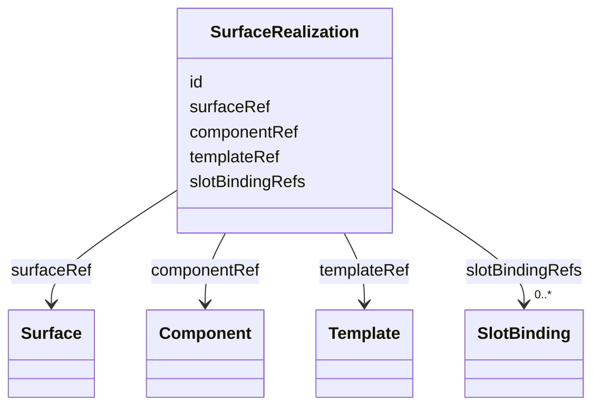
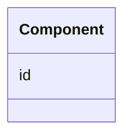
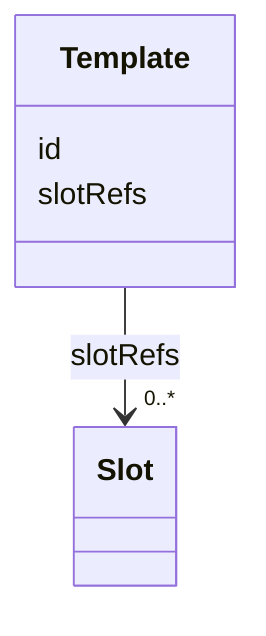
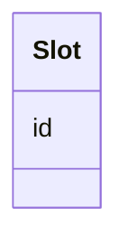
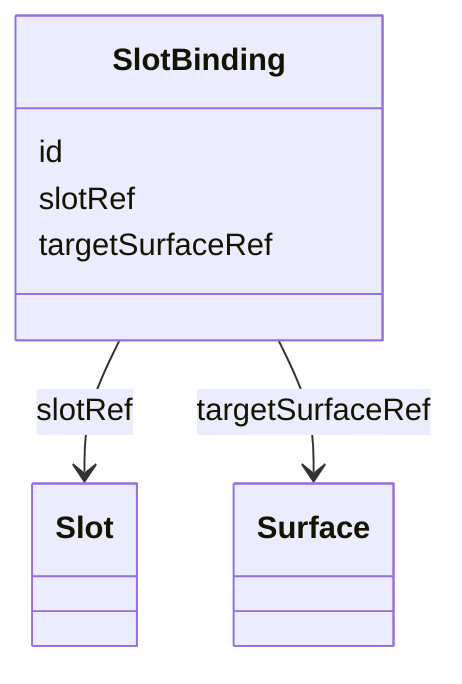
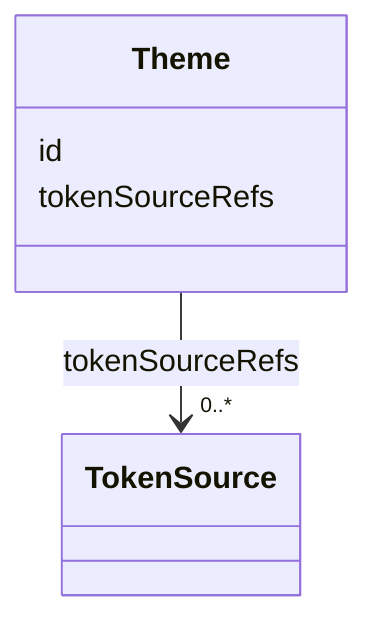
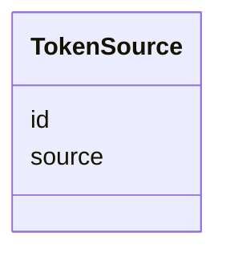

## Overview

This optional module defines a graph-native vocabulary for describing how design-system artifacts
realize Surface resources.

The module is intentionally second-level. It depends on the Surface layer as the bridge between
Graph topology and user-facing materialization. Graph nodes do not point to design-system artifacts,
and Surface resources remain design-system-agnostic.

The Design System module introduces `SurfaceRealization` as the design-system-side bridge. A
`SurfaceRealization` references exactly one `Surface` and then identifies either a `Component` or a
`Template` as the primary realization. When a template is used, the realization may reference
`SlotBinding` nodes that fill template-declared `Slot` nodes with surfaces.

This module is optional. It annotates the shared graph with interoperable design-system realization
resources, but it does not change graph topology, traversal rules, Surface attachment rules, import
resolution, rendering behavior, or runtime semantics.

## Terminology

- <dfn>Theme</dfn>: A graph-native design-system scope that references token sources.
- <dfn>TokenSource</dfn>: An addressable token source, package, manifest, or token set with a
  resolvable `source`. The internal token format is external to UJG.
- <dfn>Component</dfn>: An addressable design-system artifact that can realize a surface.
- <dfn>Template</dfn>: A reusable design-system artifact that declares slots.
- <dfn>Slot</dfn>: An addressable slot declaration owned by or referenced from a template.
- <dfn>SurfaceRealization</dfn>: A design-system-side node that references one surface and describes
  its primary component or template realization.
- <dfn>SlotBinding</dfn>: A realization-local binding from a template slot to one surface target.

## Surface Realization

A `Surface` is a design-system-agnostic materialized boundary for exactly one supported Graph node.
Surface defines the relation from `Surface` to that supported Graph node. Graph nodes do not point
to design-system artifacts or depend on Surface. This module does not add properties to `Surface`
and does not make `Surface` depend on design-system artifacts.

Design-system realization is expressed with `SurfaceRealization`, `Component`, `Template`, `Slot`,
and `SlotBinding` nodes. A realization links a stable `Surface` to one primary design-system
artifact. Template-backed realizations can keep required composition explicit by binding declared
slots to child surfaces.

Component, template, and realization inventories are derived from `Component`, `Template`, and
`SurfaceRealization` nodes instead of being maintained as duplicate lists on `Theme`.

### SurfaceRealization {data-cop-concept="surface-realization"}

A [=SurfaceRealization=] links one [=Surface=] to its primary design-system realization, either a
[=Component=] or a [=Template=]. Template-backed realizations may also reference [=SlotBinding|SlotBindings=].



Example JSON node:

```json
{
  "@type": "SurfaceRealization",
  "@id": "urn:ujg:realization:checkout-form",
  "label": "Checkout form realization",
  "surfaceRef": "urn:ujg:surface:checkout-form",
  "componentRef": "urn:ujg:component:CheckoutForm"
}
```

A `SurfaceRealization` MUST reference exactly one `Surface` through `surfaceRef` and exactly one
primary realization through either `componentRef` or `templateRef`. It MUST NOT use both
`componentRef` and `templateRef`.

Use `componentRef` when one addressable artifact directly realizes the surface and no required child
composition needs to remain explicit. Use `templateRef` when reusable slots or required child
surfaces/controls must remain derivable. `slotBindingRefs` MUST be used only on a template-backed
realization.

### Component {data-cop-concept="component"}

A [=Component=] is an addressable design-system artifact that can directly realize a [=Surface=].



Example JSON node:

```json
{
  "@type": "Component",
  "@id": "urn:ujg:component:CheckoutForm",
  "label": "Checkout form component"
}
```

### Template {data-cop-concept="template"}

The mental model for a `Template`, its `Slot` nodes, and the `SlotBinding` nodes that fill those
slots is:

```text
Template
   |
   +-- Slot "main"       <-- empty hole
   |
   +-- Slot "submit"     <-- empty hole


SurfaceRealization says:

    use Template FormShell

    AND

    bind "main"   -> Refund form surface
    bind "submit" -> Submit Refund surface
```

A `Template` declares reusable holes. A `SurfaceRealization` chooses that template for one surface,
and its `SlotBinding` nodes fill those holes with surfaces for that realization. A component appears
inside a slot only indirectly, by realizing a surface that a `SlotBinding` targets.

A [=Template=] is a reusable design-system artifact that declares zero or more [=Slot|Slots=].
A template declares reusable slots with `slotRefs`. A template MUST NOT hard-code concrete surfaces,
components, transitions, or outgoing transitions into those slots.



Example JSON node:

```json
{
  "@type": "Template",
  "@id": "urn:ujg:template:checkout-layout",
  "label": "Checkout layout template",
  "slotRefs": ["urn:ujg:slot:checkout-main"]
}
```

### Slot {data-cop-concept="slot"}

A [=Slot=] is an addressable slot declaration used by a [=Template=].
Slots represent reusable presentation positions. Slots MUST NOT encode Graph nodes, traversal,
Command resolution, runtime instances, localization loading, data binding, collection iteration,
condition evaluation, or business logic.



Example JSON node:

```json
{
  "@type": "Slot",
  "@id": "urn:ujg:slot:checkout-main",
  "label": "Checkout main slot"
}
```

### SlotBinding {data-cop-concept="slot-binding"}

A [=SlotBinding=] fills one declared [=Slot=] with exactly one [=Surface=].
Concrete assembly belongs to a `SurfaceRealization` through `SlotBinding` nodes.



Example JSON nodes:

```json
[
  {
    "@type": "SlotBinding",
    "@id": "urn:ujg:slot-binding:checkout-main",
    "label": "Checkout main slot binding",
    "slotRef": "urn:ujg:slot:checkout-main",
    "targetSurfaceRef": "urn:ujg:surface:checkout-form"
  },
  {
    "@type": "Component",
    "@id": "urn:ujg:component:CheckoutForm",
    "label": "Checkout form component"
  },
  {
    "@type": "SurfaceRealization",
    "@id": "urn:ujg:realization:checkout-form",
    "label": "Checkout form realization",
    "surfaceRef": "urn:ujg:surface:checkout-form",
    "componentRef": "urn:ujg:component:CheckoutForm"
  },
  {
    "@type": "SurfaceRealization",
    "@id": "urn:ujg:realization:checkout-page",
    "label": "Checkout page realization",
    "surfaceRef": "urn:ujg:surface:checkout-page",
    "templateRef": "urn:ujg:template:checkout-layout",
    "slotBindingRefs": ["urn:ujg:slot-binding:checkout-main"]
  }
]
```

A `SlotBinding` MUST reference exactly one declared slot with `slotRef` and exactly one surface with
`targetSurfaceRef`.

When a `SlotBinding` targets a `Surface`, the target surface is composed into the slot for
presentation purposes only. The binding MUST NOT imply graph traversal, state activation, transition
validity, composite-state containment, execution order, or lifecycle semantics. A renderer, MCP
server, skill, or design-system resolver MAY resolve the graph-level subject associated with a target
surface through the Surface layer.

If a transition, outgoing transition, or outgoing-transition group affordance belongs in a slot,
model the stable invocation as a [=Command=], reference it from the applicable Graph edge with
`commandRef`, model a `Surface` for that command through the Surface layer, and target that surface
with `targetSurfaceRef`.

## Token Scope

Theme and token-source resources describe token scope. They do not define which components,
templates, or surface realizations exist, and they are independent of the surface realization chain.

A `Theme` identifies a design-system context by referencing token sources through `tokenSourceRefs`.
A `TokenSource` identifies the location of a token source, package, manifest, or token set through
`source`.

`source` values MUST be IRI references. A `source` value MAY be absolute or relative. Relative
`source` values MUST be resolved against the location of the containing [=UJGDocument=], following
the same base-resolution model used by Core imports.

Individual token names, token paths, token groups, token values, aliases, and inheritance rules are
outside this module. Consumers that need component, template, or realization inventories derive them
from addressable design-system nodes and their references.

### Theme {data-cop-concept="theme"}

A [=Theme=] is a design-system scope that references token sources. Components, templates,
and surface realizations are discovered from their own nodes and are not duplicated on the
`Theme`.



Example JSON node:

```json
{
  "@type": "Theme",
  "@id": "urn:ujg:theme:shop",
  "label": "Shop theme",
  "tokenSourceRefs": ["urn:ujg:token-source:brand"]
}
```

### TokenSource {data-cop-concept="token-source"}

A [=TokenSource=] identifies a token source, token package, token manifest, or token set. A
`TokenSource` MUST declare exactly one `source`.

The internal token format is external to UJG.



Example JSON node:

```json
{
  "@type": "TokenSource",
  "@id": "urn:ujg:token-source:workshop-foundation",
  "label": "Workshop foundation tokens",
  "source": "design/tokens/workshop-foundation.tokens.json"
}
```

## Normative Artifacts

This module is published through the following artifacts:

- `design-system.ttl`: ontology, published at `https://ujg.specs.openuji.org/ed/ns/design-system`
- `design-system.context.jsonld`: JSON-LD term mappings, published at `https://ujg.specs.openuji.org/ed/ns/design-system.context.jsonld`
- `design-system.shape.ttl`: SHACL validation rules, published at `https://ujg.specs.openuji.org/ed/ns/design-system.shape`

### Ontology {data-cop-concept="ontology"}

The normative Design System ontology is defined below and is published at
`https://ujg.specs.openuji.org/ed/ns/design-system`. It is the authoritative structural definition
for the classes and properties declared by this module.

:::include ./design-system.ttl :::

### JSON-LD Context {data-cop-concept="jsonld-context"}

The normative Design System JSON-LD context is defined below and is published at
`https://ujg.specs.openuji.org/ed/ns/design-system.context.jsonld`. It provides compact JSON-LD term
mappings and coercions for Design System-specific properties and classes.

Surface uses `graphNodeRef` for graph-node attachment. This module keeps a separate, type-scoped
`surfaceRef` on `SurfaceRealization`, where it means realization-to-Surface. Surface also defines
`surfaceRef` on `SurfaceInstance`, where it means surface-instance-to-Surface. Design System
realization and slot-binding references continue to target stable `Surface` nodes, not
`SurfaceInstance` nodes.

:::include ./design-system.context.jsonld :::

### Validation {data-cop-concept="validation"}

The normative Design System SHACL shape is defined below and is published at
`https://ujg.specs.openuji.org/ed/ns/design-system.shape`. It is the authoritative validation
artifact for Design System structural constraints.

:::include ./design-system.shape.ttl :::

The remaining module semantics beyond the structural SHACL constraints are:

1. **Surface boundary:** Design System properties MUST NOT change Surface attachment semantics, make
   `Surface` depend on design-system artifacts, or introduce graph traversal, state activation,
   transition validity, composite-state containment, execution order, or lifecycle semantics.
2. **Surface realization:** A `SurfaceRealization` MUST reference exactly one `Surface` and exactly
   one primary realization, either `componentRef` or `templateRef`. `slotBindingRefs` MUST be used
   only when `templateRef` is present.
3. **Slot composition:** `Template` slot references are declarations. `SurfaceRealization` slot
   bindings are concrete assembly. A `SlotBinding` MUST reference exactly one `Surface` target
   through `targetSurfaceRef`, and surface targets compose presentation only.
4. **Token scope:** A `TokenSource` MUST declare exactly one `source` IRI reference. Relative
   `source` values MUST resolve against the containing `UJGDocument` location.
5. **Out of scope:** Component implementation APIs, props, variants, lifecycle, layout algorithms,
   rendering engines, framework adapters, responsive behavior, hydration behavior, token syntax,
   token value resolution, token inheritance, and accessibility implementation rules remain outside
   this module unless a future module defines them.
6. **Graceful degradation:** A consumer that does not implement this module MAY ignore Design System
   semantics, but it SHOULD preserve recognized JSON-LD data during read-transform-write when
   possible.

## MCP And Tooling Resolution

MCP servers, skills, AI tooling, design-system resolvers, and renderers MAY use referenced node IDs
plus active graph context to fetch implementation details. Those details can include framework
components, source files, Storybook entries, token files, runtime render plans, or platform adapters.

This module intentionally standardizes only the graph-native references needed for interoperability.
It does not duplicate design-system implementation catalogs or renderer configuration.

## Relationship To Core Extensions

Core `extensions` remains available for vendor-private, non-interoperable payloads. Component,
template, slot, slot-binding, surface-realization, and token-source relationships intended for
interoperability SHOULD use this module instead of opaque extension payloads.

## Examples

Examples in this page compose the Core, Graph, Surface, and Design System contexts explicitly.
Examples include `label` values on Design System nodes for human readability. Those labels use the
shared Graph `label` term and are informative unless the referenced class requires labels elsewhere.

### Example A: Surface Without Realization

```json
{
  "@context": [
    "https://ujg.specs.openuji.org/ed/ns/core.context.jsonld",
    "https://ujg.specs.openuji.org/ed/ns/graph.context.jsonld",
    "https://ujg.specs.openuji.org/ed/ns/surface.context.jsonld"
  ],
  "@id": "https://example.com/ujg/surface-only.jsonld",
  "@type": "UJGDocument",
  "nodes": [
    {
      "@id": "urn:state:cart",
      "@type": "State",
      "label": "Cart"
    },
    {
      "@id": "urn:surface:cart",
      "@type": "Surface",
      "graphNodeRef": "urn:state:cart"
    }
  ]
}
```

This example assigns a state to a surface. It does not declare any design-system realization.

### Example B: Component Realization

```json
{
  "@context": [
    "https://ujg.specs.openuji.org/ed/ns/core.context.jsonld",
    "https://ujg.specs.openuji.org/ed/ns/graph.context.jsonld",
    "https://ujg.specs.openuji.org/ed/ns/surface.context.jsonld",
    "https://ujg.specs.openuji.org/ed/ns/design-system.context.jsonld"
  ],
  "@id": "https://example.com/ujg/cart-component.jsonld",
  "@type": "UJGDocument",
  "nodes": [
    {
      "@id": "urn:state:cart",
      "@type": "State",
      "label": "Cart"
    },
    {
      "@id": "urn:surface:cart",
      "@type": "Surface",
      "graphNodeRef": "urn:state:cart"
    },
    {
      "@id": "urn:component:CartView",
      "@type": "Component",
      "label": "Cart view component"
    },
    {
      "@id": "urn:realization:cart-web",
      "@type": "SurfaceRealization",
      "label": "Cart web realization",
      "surfaceRef": "urn:surface:cart",
      "componentRef": "urn:component:CartView"
    }
  ]
}
```

The surface remains unchanged. The realization node points to the surface directly, and clients can
derive the used component by following the realization reference.

### Example C: Template Realization

```json
{
  "@context": [
    "https://ujg.specs.openuji.org/ed/ns/core.context.jsonld",
    "https://ujg.specs.openuji.org/ed/ns/graph.context.jsonld",
    "https://ujg.specs.openuji.org/ed/ns/surface.context.jsonld",
    "https://ujg.specs.openuji.org/ed/ns/design-system.context.jsonld"
  ],
  "@id": "https://example.com/ujg/refund-template.jsonld",
  "@type": "UJGDocument",
  "nodes": [
    {
      "@id": "urn:state:refund",
      "@type": "State",
      "label": "Refund request"
    },
    {
      "@id": "urn:surface:refund",
      "@type": "Surface",
      "graphNodeRef": "urn:state:refund"
    },
    {
      "@id": "urn:surface:refund-form",
      "@type": "Surface",
      "graphNodeRef": "urn:state:refund"
    },
    {
      "@id": "urn:transition:submit-refund",
      "@type": "Transition",
      "from": "urn:state:refund",
      "to": "urn:state:refund-submitted",
      "commandRef": "urn:command:submit-refund"
    },
    {
      "@id": "urn:command:submit-refund",
      "@type": "Command",
      "label": "Submit refund"
    },
    {
      "@id": "urn:surface:submit-refund",
      "@type": "Surface",
      "graphNodeRef": "urn:command:submit-refund"
    },
    {
      "@id": "urn:component:RefundForm",
      "@type": "Component",
      "label": "Refund form component"
    },
    {
      "@id": "urn:realization:refund-form-fields",
      "@type": "SurfaceRealization",
      "label": "Refund form fields realization",
      "surfaceRef": "urn:surface:refund-form",
      "componentRef": "urn:component:RefundForm"
    },
    {
      "@id": "urn:template:FormShell",
      "@type": "Template",
      "label": "Form shell template",
      "slotRefs": [
        "urn:slot:main",
        "urn:slot:submit"
      ]
    },
    {
      "@id": "urn:slot:main",
      "@type": "Slot",
      "label": "Main content slot"
    },
    {
      "@id": "urn:slot:submit",
      "@type": "Slot",
      "label": "Submit action slot"
    },
    {
      "@id": "urn:binding:refund-main",
      "@type": "SlotBinding",
      "label": "Refund main slot binding",
      "slotRef": "urn:slot:main",
      "targetSurfaceRef": "urn:surface:refund-form"
    },
    {
      "@id": "urn:binding:refund-submit",
      "@type": "SlotBinding",
      "label": "Refund submit slot binding",
      "slotRef": "urn:slot:submit",
      "targetSurfaceRef": "urn:surface:submit-refund"
    },
    {
      "@id": "urn:realization:refund-form",
      "@type": "SurfaceRealization",
      "label": "Refund form realization",
      "surfaceRef": "urn:surface:refund",
      "templateRef": "urn:template:FormShell",
      "slotBindingRefs": [
        "urn:binding:refund-main",
        "urn:binding:refund-submit"
      ]
    }
  ]
}
```

The template declares slots. The realization binds those slots for this surface.

### Example D: Composite Surface With Child Surfaces

```json
{
  "@context": [
    "https://ujg.specs.openuji.org/ed/ns/core.context.jsonld",
    "https://ujg.specs.openuji.org/ed/ns/graph.context.jsonld",
    "https://ujg.specs.openuji.org/ed/ns/surface.context.jsonld",
    "https://ujg.specs.openuji.org/ed/ns/design-system.context.jsonld"
  ],
  "@id": "https://example.com/ujg/product-discovery.jsonld",
  "@type": "UJGDocument",
  "nodes": [
    {
      "@id": "urn:state:product-discovery",
      "@type": "CompositeState",
      "label": "Product discovery",
      "subjourneyRefs": ["urn:journey:product-discovery"]
    },
    {
      "@id": "urn:journey:product-discovery",
      "@type": "Journey",
      "defaultEntryRef": "urn:entry:product-discovery-default",
      "entryRefs": [
        "urn:entry:product-discovery-default"
      ],
      "stateRefs": [
        "urn:state:search-query",
        "urn:state:filters",
        "urn:state:results",
        "urn:state:product-preview"
      ],
      "transitionRefs": [
        "urn:transition:search-to-filters",
        "urn:transition:filters-to-results",
        "urn:transition:results-to-preview"
      ]
    },
    {
      "@type": "JourneyEntry",
      "@id": "urn:entry:product-discovery-default",
      "stateRef": "urn:state:search-query"
    },
    {
      "@id": "urn:state:search-query",
      "@type": "State",
      "label": "Search query"
    },
    {
      "@id": "urn:state:filters",
      "@type": "State",
      "label": "Filters"
    },
    {
      "@id": "urn:state:results",
      "@type": "State",
      "label": "Results"
    },
    {
      "@id": "urn:state:product-preview",
      "@type": "State",
      "label": "Product preview"
    },
    {
      "@id": "urn:transition:search-to-filters",
      "@type": "Transition",
      "from": "urn:state:search-query",
      "to": "urn:state:filters",
      "label": "Refine"
    },
    {
      "@id": "urn:transition:filters-to-results",
      "@type": "Transition",
      "from": "urn:state:filters",
      "to": "urn:state:results",
      "label": "Apply filters"
    },
    {
      "@id": "urn:transition:results-to-preview",
      "@type": "Transition",
      "from": "urn:state:results",
      "to": "urn:state:product-preview",
      "label": "Preview product"
    },
    {
      "@id": "urn:surface:product-discovery",
      "@type": "Surface",
      "graphNodeRef": "urn:state:product-discovery"
    },
    {
      "@id": "urn:surface:search-query",
      "@type": "Surface",
      "graphNodeRef": "urn:state:search-query"
    },
    {
      "@id": "urn:surface:filters",
      "@type": "Surface",
      "graphNodeRef": "urn:state:filters"
    },
    {
      "@id": "urn:surface:results",
      "@type": "Surface",
      "graphNodeRef": "urn:state:results"
    },
    {
      "@id": "urn:surface:product-preview",
      "@type": "Surface",
      "graphNodeRef": "urn:state:product-preview"
    },
    {
      "@id": "urn:template:ProductDiscovery",
      "@type": "Template",
      "label": "Product discovery template",
      "slotRefs": [
        "urn:slot:search",
        "urn:slot:filters",
        "urn:slot:results",
        "urn:slot:preview"
      ]
    },
    {
      "@id": "urn:slot:search",
      "@type": "Slot",
      "label": "Search slot"
    },
    {
      "@id": "urn:slot:filters",
      "@type": "Slot",
      "label": "Filters slot"
    },
    {
      "@id": "urn:slot:results",
      "@type": "Slot",
      "label": "Results slot"
    },
    {
      "@id": "urn:slot:preview",
      "@type": "Slot",
      "label": "Preview slot"
    },
    {
      "@id": "urn:binding:search",
      "@type": "SlotBinding",
      "label": "Search slot binding",
      "slotRef": "urn:slot:search",
      "targetSurfaceRef": "urn:surface:search-query"
    },
    {
      "@id": "urn:binding:filters",
      "@type": "SlotBinding",
      "label": "Filters slot binding",
      "slotRef": "urn:slot:filters",
      "targetSurfaceRef": "urn:surface:filters"
    },
    {
      "@id": "urn:binding:results",
      "@type": "SlotBinding",
      "label": "Results slot binding",
      "slotRef": "urn:slot:results",
      "targetSurfaceRef": "urn:surface:results"
    },
    {
      "@id": "urn:binding:preview",
      "@type": "SlotBinding",
      "label": "Preview slot binding",
      "slotRef": "urn:slot:preview",
      "targetSurfaceRef": "urn:surface:product-preview"
    },
    {
      "@id": "urn:realization:product-discovery",
      "@type": "SurfaceRealization",
      "label": "Product discovery realization",
      "surfaceRef": "urn:surface:product-discovery",
      "templateRef": "urn:template:ProductDiscovery",
      "slotBindingRefs": [
        "urn:binding:search",
        "urn:binding:filters",
        "urn:binding:results",
        "urn:binding:preview"
      ]
    }
  ]
}
```

The composite state's surface is realized as a shell. Child containment comes from the child journeys
referenced by `subjourneyRefs`. The child surfaces are placed into slots for presentation only;
Graph remains the source of containment and traversal semantics.

### Example E: Multiple Design-System Token Scopes

```json
{
  "@context": [
    "https://ujg.specs.openuji.org/ed/ns/core.context.jsonld",
    "https://ujg.specs.openuji.org/ed/ns/graph.context.jsonld",
    "https://ujg.specs.openuji.org/ed/ns/surface.context.jsonld",
    "https://ujg.specs.openuji.org/ed/ns/design-system.context.jsonld"
  ],
  "@id": "https://example.com/ujg/multiple-design-systems.jsonld",
  "@type": "UJGDocument",
  "nodes": [
    {
      "@id": "urn:state:checkout",
      "@type": "State",
      "label": "Checkout"
    },
    {
      "@id": "urn:surface:checkout",
      "@type": "Surface",
      "graphNodeRef": "urn:state:checkout"
    },
    {
      "@id": "urn:component:Checkout",
      "@type": "Component",
      "label": "Checkout component"
    },
    {
      "@id": "urn:realization:checkout",
      "@type": "SurfaceRealization",
      "label": "Checkout realization",
      "surfaceRef": "urn:surface:checkout",
      "componentRef": "urn:component:Checkout"
    },
    {
      "@id": "urn:ujg:token-source:web",
      "@type": "TokenSource",
      "label": "Web token source",
      "source": "design/tokens/web.tokens.json"
    },
    {
      "@id": "urn:ujg:token-source:kiosk",
      "@type": "TokenSource",
      "label": "Kiosk token source",
      "source": "design/tokens/kiosk.tokens.json"
    },
    {
      "@id": "urn:ujg:token-source:cli",
      "@type": "TokenSource",
      "label": "CLI token source",
      "source": "design/tokens/cli.tokens.json"
    },
    {
      "@id": "urn:theme:web",
      "@type": "Theme",
      "label": "Web theme",
      "tokenSourceRefs": [
        "urn:ujg:token-source:web"
      ]
    },
    {
      "@id": "urn:theme:kiosk",
      "@type": "Theme",
      "label": "Kiosk theme",
      "tokenSourceRefs": [
        "urn:ujg:token-source:kiosk"
      ]
    },
    {
      "@id": "urn:theme:cli",
      "@type": "Theme",
      "label": "CLI theme",
      "tokenSourceRefs": [
        "urn:ujg:token-source:cli"
      ]
    }
  ]
}
```

Multiple themes can provide different token sources for the same surface and
realization graph. Components, templates, and surface realizations remain discoverable from their own
nodes rather than from duplicated `Theme` lists.
