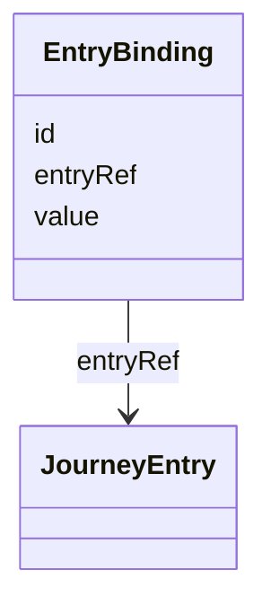

## Overview

This optional module defines a minimal vocabulary for binding opaque materialization-context values
to [=JourneyEntry=] contracts. It lets a producer publish stable entry selection values without
putting browser, native, command-line, kiosk, QR, or other platform notation in [[UJG Graph]].

This module is optional. It annotates [=JourneyEntry=] contracts with external invocation values, but
it does **not** change graph topology, traversal rules, entry ownership, or import resolution.

## Terminology

* <dfn>EntryBinding</dfn>: An addressable binding from an opaque `value` to a [=JourneyEntry=].

## EntryBinding {data-cop-concept="entry-binding"}

An [=EntryBinding=] is an addressable resource that identifies one opaque value for selecting one
[=JourneyEntry=]. The value is interpreted by the current materialization context outside UJG.



Example JSON node:

```json
{
  "@type": "EntryBinding",
  "@id": "urn:ujg:entry-binding:checkout",
  "entryRef": "urn:ujg:entry:checkout-default",
  "value": "checkout"
}
```

## Attachment Model

The module introduces real JSON-LD terms and RDF edges for entry binding:

* `entryRef` links an `EntryBinding` to a [=JourneyEntry=].
* `value` carries an opaque string interpreted outside UJG by the current materialization context.

`EntryBinding` does not declare a touchpoint, materialization discriminator, fallback target,
structured invocation fields, or execution rule.

## Normative Artifacts

This module is published through the following artifacts:

- `entry-binding.ttl`: ontology, published at `https://ujg.specs.openuji.org/ed/ns/entry-binding`
- `entry-binding.context.jsonld`: JSON-LD term mappings, published at `https://ujg.specs.openuji.org/ed/ns/entry-binding.context.jsonld`
- `entry-binding.shape.ttl`: SHACL validation rules, published at `https://ujg.specs.openuji.org/ed/ns/entry-binding.shape`

Examples in this page compose the shared baseline context `https://ujg.specs.openuji.org/ed/ns/context.jsonld`
with the Entry Binding context.

**Non-goals:**

* This module does **not** define platform-specific invocation syntax or matching.
* This module does **not** introduce traversal semantics beyond [[UJG Graph]].
* This module does **not** bind entries to [[UJG Surface]] touchpoints.
* This module does **not** replace opaque vendor-private hints carried in [[UJG Core]] `extensions`.

### Ontology {data-cop-concept="ontology"}

The normative Entry Binding ontology is defined below and is published at
`https://ujg.specs.openuji.org/ed/ns/entry-binding`. It is the authoritative structural definition
for `EntryBinding` and the properties declared by this module.

:::include ./entry-binding.ttl :::

### JSON-LD Context {data-cop-concept="jsonld-context"}

The normative Entry Binding JSON-LD context is defined below and is published at
`https://ujg.specs.openuji.org/ed/ns/entry-binding.context.jsonld`. It provides the compact JSON-LD
term mappings and coercions for Entry Binding-specific properties and classes.

:::include ./entry-binding.context.jsonld :::

---

### Validation {data-cop-concept="validation"}

The normative Entry Binding SHACL shape is defined below and is published at
`https://ujg.specs.openuji.org/ed/ns/entry-binding.shape`. It is the authoritative validation
artifact for Entry Binding structural constraints.

:::include ./entry-binding.shape.ttl :::

The rules below define the remaining module semantics beyond the structural constraints captured by
the SHACL shape.

1. **Entry selection only:** Entry Binding properties **MUST NOT** change Graph validity, graph
   traversal behavior, import resolution, or core node identity.
2. **Opaque value:** Consumers **MUST NOT** infer materialization syntax, protocol, addressing
   semantics, execution behavior, fallback behavior, or structured invocation data from `value`.
3. **Graceful degradation:** A consumer that does not implement this module **MAY** ignore Entry
   Binding semantics, but it **SHOULD** preserve recognized JSON-LD data during read-transform-write
   when possible.
4. **Private runtime hints:** Platform-specific invocation configuration that is not intended for
   shared queryability or validation **SHOULD** remain in Core `extensions`.

---

## Examples

### Combined JSON Example

```json
{
  "@context": [
    "https://ujg.specs.openuji.org/ed/ns/context.jsonld",
    "https://ujg.specs.openuji.org/ed/ns/entry-binding.context.jsonld"
  ],
  "@id": "https://example.com/ujg/entry-binding/checkout.jsonld",
  "@type": "UJGDocument",
  "nodes": [
    {
      "@type": "Journey",
      "@id": "urn:ujg:journey:checkout",
      "label": "Checkout",
      "defaultEntryRef": "urn:ujg:entry:checkout-default",
      "entryRefs": [
        "urn:ujg:entry:checkout-default"
      ],
      "stateRefs": [
        "urn:ujg:state:checkout-start"
      ]
    },
    {
      "@type": "JourneyEntry",
      "@id": "urn:ujg:entry:checkout-default",
      "label": "Checkout default",
      "stateRef": "urn:ujg:state:checkout-start"
    },
    {
      "@type": "State",
      "@id": "urn:ujg:state:checkout-start",
      "label": "Checkout start"
    },
    {
      "@type": "EntryBinding",
      "@id": "urn:ujg:entry-binding:checkout",
      "entryRef": "urn:ujg:entry:checkout-default",
      "value": "checkout"
    }
  ]
}
```

### Private Invocation Hints

```json
{
  "@id": "urn:ujg:entry-binding:checkout",
  "@type": "EntryBinding",
  "entryRef": "urn:ujg:entry:checkout-default",
  "value": "checkout",
  "extensions": {
    "com.acme.launcher": {
      "prefetch": "intent",
      "cachePolicy": "stale-while-revalidate"
    }
  }
}
```
