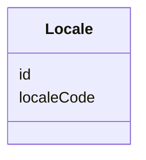
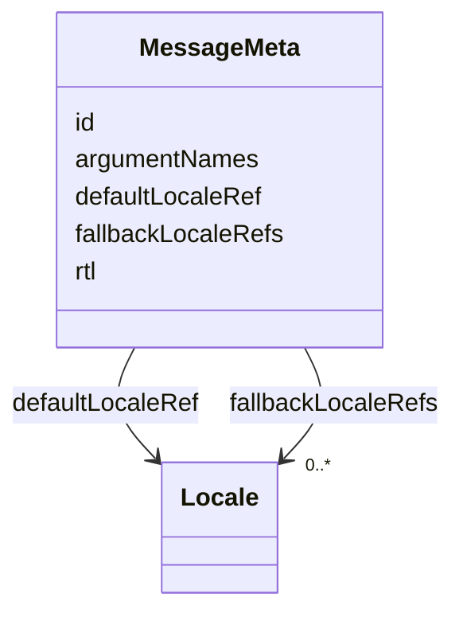
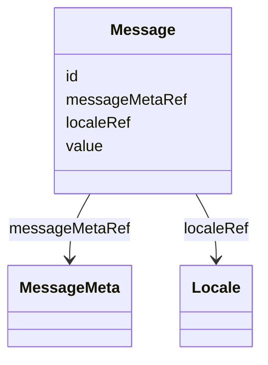
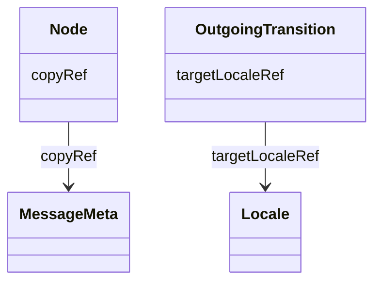

## Overview

This optional module defines a graph-native vocabulary for attaching localization metadata to UJG
nodes. It lets a producer bind any addressable node to a reusable `MessageMeta` resource through
`l10n:copyRef`, and model concrete locale-specific text as addressable `Message` nodes.

This module is optional. It annotates the shared graph with localization resources, but it does
**not** change graph topology, traversal rules, or import resolution.

## Terminology

* <dfn>Locale</dfn>: An addressable locale resource identified by a language tag.
* <dfn>MessageMeta</dfn>: An addressable message identity and shared metadata resource.
* <dfn>Message</dfn>: An addressable locale-specific value for one `MessageMeta` and one `Locale`.

## Locale {data-cop-concept="locale"}

A [=Locale=] identifies one locale used by localization metadata or locale-specific messages.



Example JSON node:

```json
{
  "@type": "l10n:Locale",
  "@id": "urn:l10n:locale:en",
  "l10n:localeCode": "en"
}
```

## MessageMeta {data-cop-concept="message-meta"}

A [=MessageMeta=] identifies a reusable copy contract. The `MessageMeta` IRI is the stable message
identity. UJG nodes reference a message meta node with `l10n:copyRef`.



Example JSON node:

```json
{
  "@type": "l10n:MessageMeta",
  "@id": "urn:l10n:message-meta:order-confirmation-title",
  "l10n:argumentNames": ["orderNumber"],
  "l10n:defaultLocaleRef": "urn:l10n:locale:en",
  "l10n:fallbackLocaleRefs": ["urn:l10n:locale:en", "urn:l10n:locale:de"],
  "l10n:rtl": false
}
```

## Message {data-cop-concept="message"}

A [=Message=] carries one locale-specific string value for one [=MessageMeta=] and one [=Locale=].
The value is an opaque string from the perspective of Localization conformance.



Example JSON node:

```json
{
  "@type": "l10n:Message",
  "@id": "urn:l10n:message:order-confirmation-title:en",
  "l10n:messageMetaRef": "urn:l10n:message-meta:order-confirmation-title",
  "l10n:localeRef": "urn:l10n:locale:en",
  "l10n:value": "Order ${orderNumber} confirmed"
}
```

## Attachment Model

The module introduces real JSON-LD terms and RDF edges for localization attachment:

* `l10n:copyRef` links any UJG node to a `MessageMeta`.
* `l10n:messageMetaRef` links a `Message` to the `MessageMeta` it realizes.
* `l10n:localeRef` links a `Message` to its `Locale`.
* `l10n:defaultLocaleRef` and `l10n:fallbackLocaleRefs` link `MessageMeta` to fallback locale
  resources.
* `l10n:targetLocaleRef` declares the requested `Locale` associated with an [=OutgoingTransition=].



Example JSON nodes:

```json
[
  {
    "@type": "State",
    "@id": "urn:ujg:state:order-confirmation",
    "label": "Order confirmation",
    "l10n:copyRef": "urn:l10n:message-meta:order-confirmation-title"
  },
  {
    "@type": "l10n:MessageMeta",
    "@id": "urn:l10n:message-meta:order-confirmation-title",
    "l10n:argumentNames": ["orderNumber"],
    "l10n:defaultLocaleRef": "urn:l10n:locale:en"
  },
  {
    "@type": "l10n:Message",
    "@id": "urn:l10n:message:order-confirmation-title:en",
    "l10n:messageMetaRef": "urn:l10n:message-meta:order-confirmation-title",
    "l10n:localeRef": "urn:l10n:locale:en",
    "l10n:value": "Order ${orderNumber} confirmed"
  },
  {
    "@type": "OutgoingTransition",
    "@id": "urn:example:ot:language-english",
    "label": "English",
    "toCurrentState": true,
    "l10n:targetLocaleRef": "urn:l10n:locale:en"
  }
]
```

The module also defines non-reference properties `l10n:localeCode`, `l10n:argumentNames`,
`l10n:rtl`, and `l10n:value`.

## Normative Artifacts

This module is published through the following artifacts:

- `l10n.ttl`: ontology, published at `https://ujg.specs.openuji.org/ed/ns/l10n`
- `l10n.context.jsonld`: JSON-LD term mappings, published at `https://ujg.specs.openuji.org/ed/ns/l10n.context.jsonld`
- `l10n.shape.ttl`: SHACL validation rules, published at `https://ujg.specs.openuji.org/ed/ns/l10n.shape`

Examples in this page compose the shared baseline context `https://ujg.specs.openuji.org/ed/ns/context.jsonld`
with the Localization context.

**Non-goals:**

* This module does **not** define locale negotiation, runtime translation loading, JavaScript
  evaluation, ICU formatting behavior, pluralization, or runtime interpolation APIs.
* This module does **not** introduce new traversal semantics beyond [[UJG Graph]].
* This module does **not** replace opaque vendor-private hints carried in [[UJG Core]] `extensions`.

### Ontology {data-cop-concept="ontology"}

The normative Localization ontology is defined below and is published at
`https://ujg.specs.openuji.org/ed/ns/l10n`. It is the authoritative structural definition for
`Locale`, `MessageMeta`, `Message`, and the properties declared by this module.

:::include ./l10n.ttl :::

### JSON-LD Context {data-cop-concept="jsonld-context"}

The normative Localization JSON-LD context is defined below and is published at
`https://ujg.specs.openuji.org/ed/ns/l10n.context.jsonld`. It provides the compact JSON-LD term
mappings and coercions for Localization-specific properties and classes.

:::include ./l10n.context.jsonld :::

---

### Validation {data-cop-concept="validation"}

The normative Localization SHACL shape is defined below and is published at
`https://ujg.specs.openuji.org/ed/ns/l10n.shape`. It is the authoritative validation artifact for
Localization structural constraints.

:::include ./l10n.shape.ttl :::

The rules below define the remaining module semantics beyond the structural constraints captured by
the SHACL shape.

1. **Attachment only:** Localization properties **MUST NOT** change Graph validity, graph traversal
   behavior, import resolution, or core node identity.
2. **Message identity:** A `MessageMeta` IRI identifies the reusable message contract. Producers
   **MUST** use that IRI as the shared message identity.
3. **Locale identity:** Locale references use `Locale` IRIs. A `Locale.localeCode` value identifies
   the language tag represented by that locale resource.
4. **Message uniqueness:** Producers **MUST NOT** create more than one `Message` for the same
   `messageMetaRef` and `localeRef` pair.
5. **Opaque value:** `Message.value` is a string value. Consumers **MUST NOT** infer UJG graph edges,
   message dependencies, JavaScript execution, ICU behavior, or cycle constraints from the string.
6. **Locale target metadata:** `l10n:targetLocaleRef` declares the requested locale associated with an
   outgoing affordance. It does not itself define graph traversal behavior. If a locale switch should
   keep the user on the same graph state, use Graph's `toCurrentState: true` together with
   `l10n:targetLocaleRef`.
7. **Graceful degradation:** A consumer that does not implement this module **MAY** ignore
   Localization semantics, but it **SHOULD** preserve recognized JSON-LD data during
   read-transform-write when possible.
8. **Private runtime hints:** Platform-specific i18n loader configuration that is not intended for
   shared queryability or validation **SHOULD** remain in Core `extensions`.

---

## Examples

### Locale Switch Affordance Example

```json
{
  "@context": [
    "https://ujg.specs.openuji.org/ed/ns/core.context.jsonld",
    "https://ujg.specs.openuji.org/ed/ns/graph.context.jsonld",
    "https://ujg.specs.openuji.org/ed/ns/l10n.context.jsonld"
  ],
  "@type": "UJGDocument",
  "@id": "https://example.com/ujg/l10n/locale-switch.jsonld",
  "nodes": [
    {
      "@type": "l10n:Locale",
      "@id": "urn:l10n:locale:en",
      "l10n:localeCode": "en"
    },
    {
      "@type": "OutgoingTransition",
      "@id": "urn:example:ot:language-english",
      "label": "English",
      "toCurrentState": true,
      "l10n:targetLocaleRef": "urn:l10n:locale:en"
    }
  ]
}
```

### Combined JSON Example

```json
{
  "@context": [
    "https://ujg.specs.openuji.org/ed/ns/context.jsonld",
    "https://ujg.specs.openuji.org/ed/ns/l10n.context.jsonld"
  ],
  "@id": "https://example.com/ujg/l10n/checkout.jsonld",
  "@type": "UJGDocument",
  "nodes": [
    {
      "@type": "l10n:Locale",
      "@id": "urn:l10n:locale:en",
      "l10n:localeCode": "en"
    },
    {
      "@type": "l10n:Locale",
      "@id": "urn:l10n:locale:de",
      "l10n:localeCode": "de"
    },
    {
      "@type": "State",
      "@id": "urn:ujg:state:order-confirmation",
      "label": "Order confirmation",
      "l10n:copyRef": "urn:l10n:message-meta:order-confirmation-title"
    },
    {
      "@type": "l10n:MessageMeta",
      "@id": "urn:l10n:message-meta:order-confirmation-title",
      "l10n:argumentNames": ["orderNumber"],
      "l10n:defaultLocaleRef": "urn:l10n:locale:en",
      "l10n:fallbackLocaleRefs": ["urn:l10n:locale:en", "urn:l10n:locale:de"],
      "l10n:rtl": false
    },
    {
      "@type": "l10n:Message",
      "@id": "urn:l10n:message:order-confirmation-title:en",
      "l10n:messageMetaRef": "urn:l10n:message-meta:order-confirmation-title",
      "l10n:localeRef": "urn:l10n:locale:en",
      "l10n:value": "Order ${orderNumber} confirmed"
    },
    {
      "@type": "l10n:Message",
      "@id": "urn:l10n:message:order-confirmation-title:de",
      "l10n:messageMetaRef": "urn:l10n:message-meta:order-confirmation-title",
      "l10n:localeRef": "urn:l10n:locale:de",
      "l10n:value": "Bestellung ${orderNumber} bestaetigt"
    }
  ]
}
```

### Opaque Runtime Hints

```json
{
  "@id": "urn:l10n:message-meta:order-confirmation-title",
  "@type": "l10n:MessageMeta",
  "extensions": {
    "com.acme.i18n-runtime": {
      "resourceFile": "checkout/confirmation.json",
      "bundleFormat": "icu"
    }
  }
}
```
