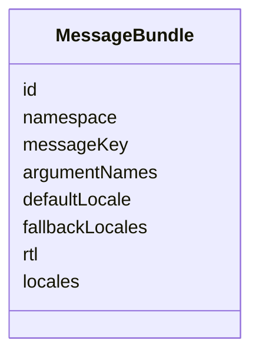
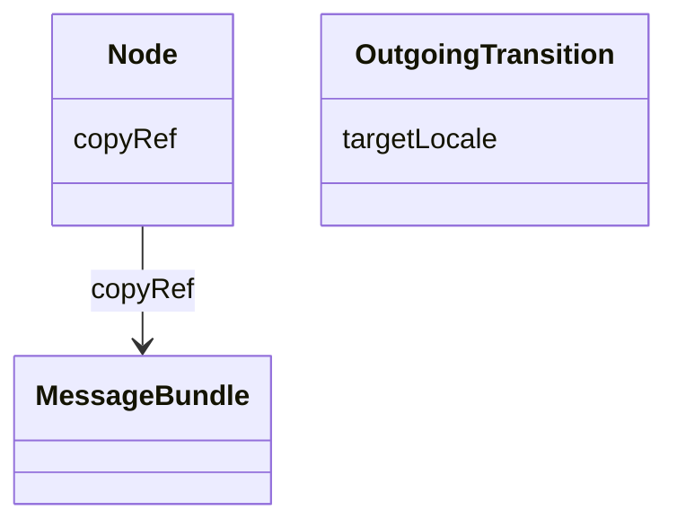

## Overview

This optional module defines a graph-native vocabulary for attaching localization metadata to UJG
nodes. It lets a producer bind any addressable node to a reusable `MessageBundle` resource through
`l10n:copyRef` instead of hiding message keys, locale fallbacks, locale maps, template values, or
accepted argument names inside opaque Core `extensions`.

This module is optional. It annotates the shared graph with localization resources, but it does
**not** change graph topology, traversal rules, or import resolution.

## Terminology

* <dfn>MessageBundle</dfn>: An addressable localization resource that carries message-key, argument,
  and locale payload metadata.

## MessageBundle {data-cop-concept="message-bundle"}

A [=MessageBundle=] identifies a localized message payload by message key and optional argument and
locale metadata. UJG nodes reference a bundle with `l10n:copyRef`.



Example JSON node:

```json
{
  "@type": "l10n:MessageBundle",
  "@id": "urn:l10n:bundle:order-confirmation",
  "l10n:namespace": "checkout.confirmation",
  "l10n:messageKey": "order.confirmation.title",
  "l10n:argumentNames": ["orderNumber"],
  "l10n:defaultLocale": "en",
  "l10n:fallbackLocales": ["en", "de"],
  "l10n:rtl": false,
  "l10n:locales": {
    "en": { "value": "Order ${orderNumber} confirmed" },
    "de": { "value": "Bestellung ${orderNumber} bestaetigt" }
  }
}
```

## Template Value Model

A [=MessageBundle=] remains the only Localization message class. A bundle can be a leaf message or
compose other bundles by using template placeholders inside a locale payload's string `value`
member.

The `value` member is not a top-level Localization property. It is a JSON member inside
`l10n:locales`. When a locale payload declares a string `value`, that string **MAY** be a plain
string or **MAY** contain template placeholders using the `${...}` delimiter form.

Placeholder contents are UJG template tokens, not executable JavaScript expressions:

* If the token matches one of the containing bundle's `argumentNames` values, the token identifies a
  runtime argument supplied by the materialization context.
* Otherwise, the token **MUST** be an IRI or compact IRI that resolves to another [=MessageBundle=].
* Producers **MUST NOT** create cyclic [=MessageBundle=] template references.

`defaultLocale` and `fallbackLocales` apply independently to every [=MessageBundle=], including
composite bundles and bundles referenced by placeholders. When a consumer resolves a referenced
bundle for a requested locale, the referenced bundle applies its own locale payload,
`defaultLocale`, and `fallbackLocales`; the containing bundle does not override them.

This module does not define JavaScript evaluation, ICU MessageFormat, pluralization, argument types,
argument defaults, escaping rules, or runtime interpolation APIs. Implementations MAY support richer
formatting privately through Core `extensions`.

Example composite bundle:

```json
{
  "@type": "l10n:MessageBundle",
  "@id": "urn:l10n:bundle:artifact-display-name",
  "l10n:messageKey": "artifact.displayName",
  "l10n:argumentNames": ["fileName"],
  "l10n:defaultLocale": "en",
  "l10n:fallbackLocales": ["en"],
  "l10n:locales": {
    "en": {
      "value": "${urn:l10n:bundle:artifact-kind-report}: ${fileName}"
    },
    "de": {
      "value": "${urn:l10n:bundle:artifact-kind-report}: ${fileName}"
    }
  }
}
```

## Attachment Model

The module introduces real JSON-LD terms and RDF edges for localization attachment:

* `l10n:copyRef` links any UJG node to a `MessageBundle`.
* `l10n:targetLocale` declares the requested locale associated with an [=OutgoingTransition=].



Example JSON nodes:

```json
[
  {
    "@type": "State",
    "@id": "urn:ujg:state:order-confirmation",
    "label": "Order confirmation",
    "l10n:copyRef": "urn:l10n:bundle:order-confirmation"
  },
  {
    "@type": "l10n:MessageBundle",
    "@id": "urn:l10n:bundle:order-confirmation",
    "l10n:messageKey": "order.confirmation.title"
  },
  {
    "@type": "OutgoingTransition",
    "@id": "urn:example:ot:language-english",
    "label": "English",
    "toCurrentState": true,
    "l10n:targetLocale": "en"
  }
]
```

The module also defines non-reference properties such as `l10n:namespace`, `l10n:messageKey`,
`l10n:argumentNames`, `l10n:defaultLocale`, `l10n:fallbackLocales`, `l10n:rtl`, and JSON-valued
`l10n:locales`.

## Normative Artifacts

This module is published through the following artifacts:

- `l10n.ttl`: ontology, published at `https://ujg.specs.openuji.org/ed/ns/l10n`
- `l10n.context.jsonld`: JSON-LD term mappings, published at `https://ujg.specs.openuji.org/ed/ns/l10n.context.jsonld`
- `l10n.shape.ttl`: SHACL validation rules, published at `https://ujg.specs.openuji.org/ed/ns/l10n.shape`

Examples in this page compose the shared baseline context `https://ujg.specs.openuji.org/ed/ns/context.jsonld`
with the Localization context.

**Non-goals:**

* This module does **not** define locale negotiation, runtime translation loading, JavaScript
  evaluation, or ICU formatting behavior.
* This module does **not** introduce new traversal semantics beyond [[UJG Graph]].
* This module does **not** replace opaque vendor-private hints carried in [[UJG Core]] `extensions`.

### Ontology {data-cop-concept="ontology"}

The normative Localization ontology is defined below and is published at
`https://ujg.specs.openuji.org/ed/ns/l10n`. It is the authoritative structural definition for
`MessageBundle` and the properties declared by this module.

:::include ./l10n.ttl :::

### JSON-LD Context {data-cop-concept="jsonld-context"}

The normative Localization JSON-LD context is defined below and is published at
`https://ujg.specs.openuji.org/ed/ns/l10n.context.jsonld`. It provides the compact JSON-LD term
mappings and coercions for Localization-specific properties and classes.

:::include ./l10n.context.jsonld :::

---

### Validation {data-cop-concept="validation"}

The normative Localization SHACL shape is defined below and is published at
`https://ujg.specs.openuji.org/ed/ns/l10n.shape`. It is the authoritative validation artifact for
Localization structural constraints.

:::include ./l10n.shape.ttl :::

The rules below define the remaining module semantics beyond the structural constraints captured by
the SHACL shape.

1. **Attachment only:** Localization properties **MUST NOT** change Graph validity, graph traversal
   behavior, import resolution, or core node identity.
2. **Bundle semantics:** `l10n:messageKey` identifies the canonical message entry for the attached
   node, while `l10n:locales` carries optional locale-specific payloads for implementations that
   choose to embed translated values. A locale payload's string `value` member MAY contain `${...}`
   UJG template placeholders.
3. **Template tokens:** Placeholder tokens matching `l10n:argumentNames` values identify runtime
   arguments. Other placeholder tokens MUST resolve to [=MessageBundle=] IRIs. Producers MUST NOT
   create cyclic [=MessageBundle=] template references.
4. **Independent locale fallback:** `defaultLocale` and `fallbackLocales` apply independently to
   each [=MessageBundle=], including composite bundles and placeholder-referenced bundles.
5. **Locale target metadata:** `l10n:targetLocale` declares the requested locale associated with an
   outgoing affordance. It does not itself define graph traversal behavior. If a locale switch should
   keep the user on the same graph state, use Graph's `toCurrentState: true` together with
   `l10n:targetLocale`.
6. **Graceful degradation:** A consumer that does not implement this module **MAY** ignore
   Localization semantics, but it **SHOULD** preserve recognized JSON-LD data during
   read-transform-write when possible.
7. **Private runtime hints:** Platform-specific i18n loader configuration that is not intended for
   shared queryability or validation **SHOULD** remain in Core `extensions`.

---

## Examples

### Locale Switch Affordance Example

```json
{
  "@context": [
    "https://ujg.specs.openuji.org/ed/ns/core.context.jsonld",
    "https://ujg.specs.openuji.org/ed/ns/graph.context.jsonld",
    "https://ujg.specs.openuji.org/ed/ns/l10n.context.jsonld"
  ],
  "@type": "OutgoingTransition",
  "@id": "urn:example:ot:language-english",
  "label": "English",
  "toCurrentState": true,
  "l10n:targetLocale": "en"
}
```

### Combined JSON Example

```json
{
  "@context": [
    "https://ujg.specs.openuji.org/ed/ns/context.jsonld",
    "https://ujg.specs.openuji.org/ed/ns/l10n.context.jsonld"
  ],
  "@id": "https://example.com/ujg/l10n/checkout.jsonld",
  "@type": "UJGDocument",
  "nodes": [
    {
      "@type": "State",
      "@id": "urn:ujg:state:order-confirmation",
      "label": "Order confirmation",
      "l10n:copyRef": "urn:l10n:bundle:order-confirmation"
    },
    {
      "@type": "l10n:MessageBundle",
      "@id": "urn:l10n:bundle:order-confirmation",
      "l10n:namespace": "checkout.confirmation",
      "l10n:messageKey": "order.confirmation.title",
      "l10n:argumentNames": ["orderNumber"],
      "l10n:defaultLocale": "en",
      "l10n:fallbackLocales": ["en", "de"],
      "l10n:rtl": false,
      "l10n:locales": {
        "en": {
          "value": "Order ${orderNumber} confirmed"
        },
        "de": {
          "value": "Bestellung ${orderNumber} bestaetigt"
        }
      }
    }
  ]
}
```

### Template Value Example

```json
{
  "@context": [
    "https://ujg.specs.openuji.org/ed/ns/context.jsonld",
    "https://ujg.specs.openuji.org/ed/ns/l10n.context.jsonld"
  ],
  "@id": "https://example.com/ujg/l10n/artifact-name.jsonld",
  "@type": "UJGDocument",
  "nodes": [
    {
      "@type": "l10n:MessageBundle",
      "@id": "urn:l10n:bundle:artifact-kind-report",
      "l10n:messageKey": "artifact.kind.report",
      "l10n:defaultLocale": "en",
      "l10n:locales": {
        "en": { "value": "Report" },
        "de": { "value": "Bericht" }
      }
    },
    {
      "@type": "l10n:MessageBundle",
      "@id": "urn:l10n:bundle:artifact-display-name",
      "l10n:messageKey": "artifact.displayName",
      "l10n:argumentNames": ["fileName"],
      "l10n:defaultLocale": "en",
      "l10n:fallbackLocales": ["en"],
      "l10n:locales": {
        "en": {
          "value": "${urn:l10n:bundle:artifact-kind-report}: ${fileName}"
        },
        "de": {
          "value": "${urn:l10n:bundle:artifact-kind-report}: ${fileName}"
        }
      }
    }
  ]
}
```

### Opaque Runtime Hints

```json
{
  "@id": "urn:l10n:bundle:order-confirmation",
  "@type": "l10n:MessageBundle",
  "l10n:messageKey": "order.confirmation.title",
  "extensions": {
    "com.acme.i18n-runtime": {
      "resourceFile": "checkout/confirmation.json",
      "bundleFormat": "icu"
    }
  }
}
```
