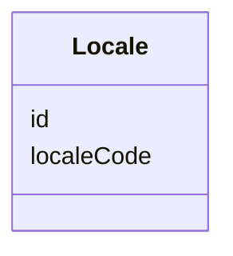
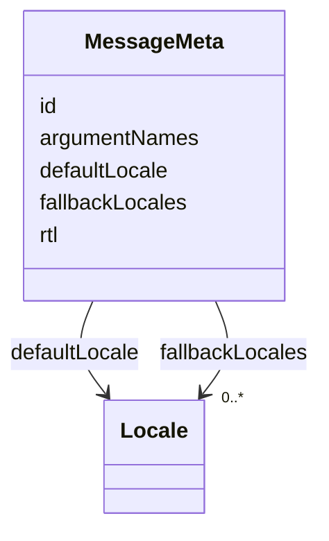
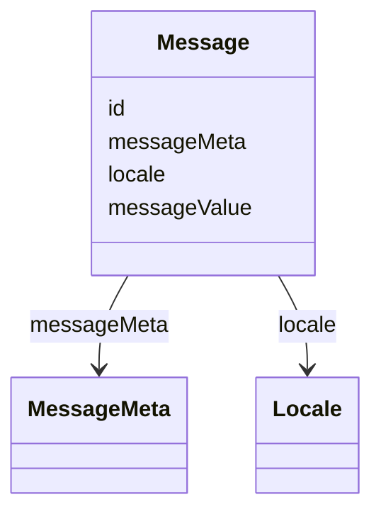
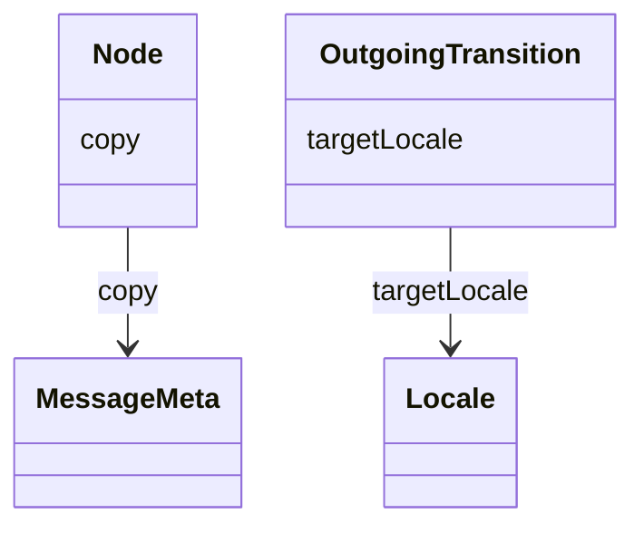

## Overview

This optional module defines a graph-native vocabulary for attaching localization metadata to UJG
nodes. It lets a producer bind any addressable node to a reusable `MessageMeta` resource through
`ujgl10n:copy`, and model concrete locale-specific text as addressable `Message` nodes.

This module is optional. Its properties annotate Graph resources and do not themselves change
topology, traversal rules, or import resolution. A producer may nevertheless model different Graph
Journeys, States, or affordances when content structure genuinely differs by locale; Graph owns
those topology differences.

## Terminology

* <dfn>Locale</dfn>: An addressable locale resource identified by a language tag.
* <dfn>MessageMeta</dfn>: An addressable message identity and shared metadata resource.
* <dfn>Message</dfn>: An addressable locale-specific message value for one `MessageMeta` and one `Locale`.

## Locale {data-cop-concept="locale"}

A [=Locale=] identifies one locale used by localization metadata or locale-specific messages.


```mermaid
classDiagram
  class Locale {
    id
    localeCode
  }
```

Example node:

```ujg-example
./examples/example-08.yamlld
```

## MessageMeta {data-cop-concept="message-meta"}

A [=MessageMeta=] identifies a reusable copy contract. The `MessageMeta` IRI is the stable message
identity. UJG nodes reference a message meta node with `ujgl10n:copy`.


```mermaid
classDiagram
  class Locale
  class MessageMeta {
    id
    argumentNames
    defaultLocale
    fallbackLocales
    rtl
  }
  MessageMeta --> Locale : defaultLocale
  MessageMeta --> "0..*" Locale : fallbackLocales
```

Example node:

```ujg-example
./examples/example-07.yamlld
```

## Message {data-cop-concept="message"}

A [=Message=] carries one locale-specific string value for one [=MessageMeta=] and one [=Locale=].
The message value is an opaque string from the perspective of Localization conformance.


```mermaid
classDiagram
  class MessageMeta
  class Locale
  class Message {
    id
    messageMeta
    locale
    messageValue
  }
  Message --> MessageMeta : messageMeta
  Message --> Locale : locale
```

Example node:

```ujg-example
./examples/example-06.yamlld
```

## Attachment Model

The module introduces real JSON-LD terms and RDF edges for localization attachment:

* `ujgl10n:copy` links any UJG node to a `MessageMeta`.
* `ujgl10n:messageMeta` links a `Message` to the `MessageMeta` it realizes.
* `ujgl10n:locale` links a `Message` to its `Locale`.
* `ujgl10n:defaultLocale` and `ujgl10n:fallbackLocales` link `MessageMeta` to fallback locale
  resources.
* `ujgl10n:targetLocale` declares the requested `Locale` associated with an [=OutgoingTransition=].


```mermaid
classDiagram
  class Node {
    copy
  }
  class MessageMeta
  class Locale
  class OutgoingTransition {
    targetLocale
  }
  Node --> MessageMeta : copy
  OutgoingTransition --> Locale : targetLocale
```

Example nodes:

```ujg-example
./examples/example-05.yamlld
```

Here the locale switch explicitly re-enters the same Journey and State through its entry contract.
Localization supplies the requested locale; Graph supplies the destination.

The module also defines non-reference properties `ujgl10n:localeCode`, `ujgl10n:argumentNames`,
`ujgl10n:rtl`, and `ujgl10n:messageValue`.

## Normative Artifacts

This module is published through the following artifacts:

- `l10n.ttl`: ontology, published at `https://ujg.specs.openuji.org/ed/ns/l10n`
- `l10n.context.jsonld`: JSON-LD term mappings, published at `https://ujg.specs.openuji.org/ed/ns/l10n.context.jsonld`
- `l10n.shape.ttl`: SHACL validation rules, published at `https://ujg.specs.openuji.org/ed/ns/l10n.shape`

Examples in this page compose the shared baseline context `https://ujg.specs.openuji.org/ed/ns/context.jsonld`
with the Localization context.

**Non-goals:**

* This module does **not** define locale negotiation, runtime translation loading, JavaScript
  evaluation, ICU formatting behavior, pluralization, or runtime interpolation APIs.
* This module does **not** introduce new traversal semantics beyond [[UJG Graph]].
* This module does **not** replace opaque vendor-private hints carried in [[UJG Core]] `extensions`.

### Ontology {data-cop-concept="ontology"}

The normative Localization ontology is defined below and is published at
`https://ujg.specs.openuji.org/ed/ns/l10n`. It is the authoritative structural definition for
`Locale`, `MessageMeta`, `Message`, and the properties declared by this module.

:::include ./l10n.ttl :::

### JSON-LD Context {data-cop-concept="jsonld-context"}

The normative Localization JSON-LD context is defined below and is published at
`https://ujg.specs.openuji.org/ed/ns/l10n.context.jsonld`. It provides the compact JSON-LD term
mappings and coercions for Localization-specific properties and classes.

:::include ./l10n.context.jsonld :::

---

### Validation {data-cop-concept="validation"}

The normative Localization SHACL shape is defined below and is published at
`https://ujg.specs.openuji.org/ed/ns/l10n.shape`. It is the authoritative validation artifact for
Localization structural constraints.

:::include ./l10n.shape.ttl :::

The rules below define the remaining module semantics beyond the structural constraints captured by
the SHACL shape.

1. **Attachment only:** Localization properties **MUST NOT** change Graph validity, graph traversal
   behavior, import resolution, or core node identity. Locale-dependent topology **MAY** be modeled
   explicitly with distinct Graph Journeys, Entries, States, and Transitions.
2. **Message identity:** A `MessageMeta` IRI identifies the reusable message contract. Producers
   **MUST** use that IRI as the shared message identity.
3. **Locale identity:** Locale references use `Locale` IRIs. A `Locale.localeCode` value identifies
   the language tag represented by that locale resource.
4. **Message uniqueness:** Producers **MUST NOT** create more than one `Message` for the same
   `messageMeta` and `locale` pair.
5. **Opaque value:** `Message.messageValue` is a string value. Consumers **MUST NOT** infer UJG graph edges,
   message dependencies, JavaScript execution, ICU behavior, or cycle constraints from the string.
6. **Locale target metadata:** `ujgl10n:targetLocale` declares the requested locale associated with an
   outgoing affordance. It does not itself define graph traversal behavior. The host
   [=OutgoingTransition=]'s `toEntry` selects the destination [=JourneyEntry=].
7. **Shared-topology state preservation:** When a locale switch must preserve whichever of several
   States is active, each source State **MUST** directly reference a state-specific OutgoingTransition.
   Each transition's `toEntry` **MUST** target the JourneyEntry for the corresponding destination
   State.
8. **Shared locale switches:** Several States **MAY** list the same locale-switch transition only
   when its one fixed destination entry is correct for each of them. Consumers **MUST NOT**
   reinterpret a shared transition's `toEntry` as relative to the active State.
9. **Locale topology:** When locales share topology, a state-scoped locale-switch OutgoingTransition
   may target an entry whose `state` is the same State where that affordance is available. When
   content structure differs by locale, it may target an entry owned by a locale-specific Journey
   with different local topology.
10. **No locale inference:** Consumers **MUST NOT** infer a Journey, JourneyEntry, or State from
   `targetLocale`; the Graph reference remains explicit and authoritative.
11. **Graceful degradation:** A consumer that does not implement this module **MAY** ignore
   Localization semantics, but it **SHOULD** preserve recognized JSON-LD data during
   read-transform-write when possible.
12. **Private runtime hints:** Platform-specific i18n loader configuration that is not intended for
   shared queryability or validation **SHOULD** remain in Core `extensions`.

---

## Examples

### Shared-Topology State-Preserving Switches

A state-preserving switch is source-specific because each OutgoingTransition has one fixed
`toEntry`. In this shared-topology checkout Journey, switching to English from `Form` re-enters
`Form`, while switching from `Success` re-enters `Success`:

```ujg-example
./examples/example-04.yamlld
```

The two locale-switch affordances may look identical in the interface, but they are different Graph
edges with different destination entries. One locale-switch transition listed by both States would
be wrong for this state-preserving behavior: it has one fixed entry. Sharing one transition remains
appropriate when every source intentionally enters the same locale landing entry.

### Locale Switch Affordance Example

```ujg-example
./examples/example-03.yamlld
```

The English Journey has one confirmation State. The German Journey has a summary followed by a
separate legal-notice State. The locale switch therefore targets the German entry contract rather
than assuming that both locales share a State or topology.

### Combined JSON Example

```ujg-example
./examples/example-02.yamlld
```

### Opaque Runtime Hints

```ujg-example
./examples/example-01.yamlld
```
