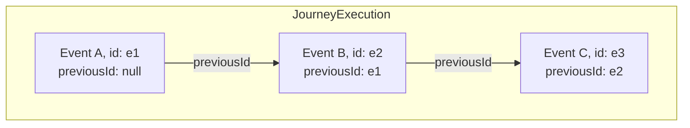

## Overview

This module defines the data model for recording actual user behavior as a **causally ordered event chain**. Ordering is established by explicit linkage between events, not by timestamps.

## Terminology

* <dfn>JourneyExecution</dfn>: A bounded container for events belonging to one logical trace.
* <dfn>RuntimeEvent</dfn>: An atomic record of a single runtime moment.
* <dfn>Event Chain</dfn>: A sequence where each event references its immediate predecessor via `previousId`.

---

## Event Chaining {data-cop-concept="event-chaining"}

### Visual Model



### The JourneyExecution Object (The Container) 

<spec-statement>A [=JourneyExecution=] **MUST** include:

* `type`: `"JourneyExecution"`
* `id`: required, MUST be a valid URI/URN, unique within resolution scope.
* `eventRefs`: array of [=RuntimeEvent=] IDs
</spec-statement>


### The RuntimeEvent Object (The Atom)

<spec-statement>A [=RuntimeEvent=] **MUST** include:

* `type`: `"RuntimeEvent"`
* `id`: required, MUST be a valid URI/URN, unique within resolution scope.
* `executionId`: ID of the owning [=JourneyExecution=]
* `previousId`: string or null
  * `null` indicates the **Root Event**
  * otherwise **MUST** equal the `id` of another event in the same [=JourneyExecution=]
* `stateRef`: string (Graph [=State=] or [=CompositeState=] `id`)
</spec-statement>

<spec-statement>A [=RuntimeEvent=] **MAY** include:

* `payload`: object (domain-specific data)
</spec-statement>

---

## Chain Validity Rules {data-cop-concept="validation"}

<spec-statement>
Within a single execution (events where `executionId` equals the [=JourneyExecution=] id):
  1. **Root**: Exactly one event MUST be the Root Event.
  2. **Resolution**: Every non-root previousId MUST match the id of an event in the same execution.
  3. **Single Successor**: An event id MUST NOT be referenced as previousId by more than one event in the same execution.
  4. **Acyclic**: The chain MUST NOT contain cycles.
</spec-statement>
If any rule above is violated, the [=JourneyExecution=] is invalid.

---

## Reconstruction {data-cop-concept="reconstruction"}

<spec-statement>A Consumer reconstructing event order **MUST**:
  1. Identify the Root Event.
  2. Repeatedly select the unique event whose `previousId` equals the current event’s `id`.
  3. Continue until no successor exists.
</spec-statement>

---


## Appendix: Combined JSON Example {.unnumbered}

```json
{
  "@context": "https://ujg.specs.openuji.org/ed/context.jsonld",
  "type": "UJGDocument",
  "specVersion": "1.0",
   "items": [
    {
      "type": "JourneyExecution",
      "id": "urn:ujg:execution:12345",
      "eventRefs": [
        "urn:ujg:event:12345:100",
        "urn:ujg:event:12345:200"
      ]
    },
    {
      "type": "RuntimeEvent",
      "id": "urn:ujg:event:12345:100",
      "executionId": "urn:ujg:execution:12345",
      "previousId": null,
      "stateRef": "urn:ujg:state:product-page",
      "payload": { "action": "view" }
    },
    {
      "type": "RuntimeEvent",
      "id": "urn:ujg:event:12345:200",
      "executionId": "urn:ujg:execution:12345",
      "previousId": "urn:ujg:event:12345:100",
      "stateRef": "urn:ujg:state:cart",
      "payload": { "item": "shoes" }
    }
  ]
}
```

