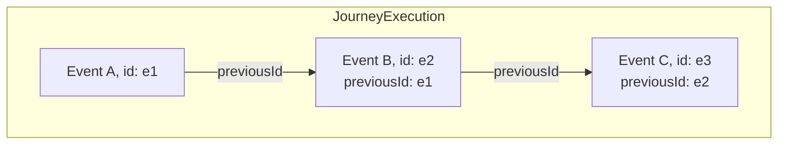

## Overview

This module defines the data model for recording actual user behavior as a **causally ordered event chain**. Ordering is established by explicit linkage between events, not by timestamps.

## Normative Artifacts

This module is published through the following artifacts:

- `runtime.ttl`: ontology, published at `https://ujg.specs.openuji.org/ed/ns/runtime`
- `runtime.context.jsonld`: JSON-LD term mappings, published at `https://ujg.specs.openuji.org/ed/ns/runtime.context.jsonld`
- `runtime.shape.ttl`: SHACL validation rules, published at `https://ujg.specs.openuji.org/ed/ns/runtime.shape`

Examples in this page use an explicit context array composed from the published module contexts. The same composition is also published as the convenience context `https://ujg.specs.openuji.org/ed/context.jsonld`.

## Terminology

- <dfn>JourneyExecution</dfn>: A bounded container for events belonging to one logical trace.
- <dfn>RuntimeEvent</dfn>: An atomic record of a single runtime moment.
- <dfn>Event Chain</dfn>: A sequence where each event references its immediate predecessor via `previousId`.

---

## Event Chaining {data-cop-concept="event-chaining"}

### Visual Model


```mermaid
graph LR
  subgraph Execution [JourneyExecution]
    direction LR
    E1[Event A, id: e1]
    E2[Event B, id: e2<br/>previousId: e1]
    E3[Event C, id: e3<br/>previousId: e2]
    E1 -->|previousId| E2
    E2 -->|previousId| E3
  end
```

A [=JourneyExecution=] groups the [=RuntimeEvent|RuntimeEvents=] for one logical trace. A [=RuntimeEvent=] records one runtime moment and may reference its immediate predecessor via `previousId`; if `previousId` is omitted, the event is the Root Event.

## Ontology {data-cop-concept="ontology"}

The normative Runtime ontology is defined below and is published at `https://ujg.specs.openuji.org/ed/ns/runtime`. It is the authoritative structural definition for `JourneyExecution`, `RuntimeEvent`, and the properties that connect them.

:::include ./runtime.ttl :::

## JSON-LD Context {data-cop-concept="jsonld-context"}

The normative Runtime JSON-LD context is defined below and is published at `https://ujg.specs.openuji.org/ed/ns/runtime.context.jsonld`. It provides the compact JSON-LD term mappings for Runtime examples, including IRI-valued references and opaque JSON `payload` values.

:::include ./runtime.context.jsonld :::

---

## Validation {data-cop-concept="validation"}

The normative Runtime SHACL shape is defined below and is published at `https://ujg.specs.openuji.org/ed/ns/runtime.shape`. It is the authoritative validation artifact for Runtime structural constraints.

:::include ./runtime.shape.ttl :::

The rules below define additional causal constraints on event chains beyond the structural constraints captured by the SHACL shape.

<spec-statement>
Within a single execution (events where `executionId` equals the [=JourneyExecution=] id):
  1. **Root**: Exactly one event MUST be the Root Event.
  2. **Resolution**: Every present `previousId` MUST match the `@id` of an event in the same execution.
  3. **Single Successor**: An event `@id` MUST NOT be referenced as `previousId` by more than one event in the same execution.
  4. **Acyclic**: The chain MUST NOT contain cycles.
</spec-statement>
If any rule above is violated, the [=JourneyExecution=] is invalid.

---

## Reconstruction {data-cop-concept="reconstruction"}

<spec-statement>

A Consumer reconstructing event order **MUST**:

1. Identify the Root Event.
2. Repeatedly select the unique event whose `previousId` equals the current event’s `@id`.
3. Continue until no successor exists.

</spec-statement>

---

## Appendix: Combined JSON Example {.unnumbered}

```json
{
  "@context": [
    "https://ujg.specs.openuji.org/ed/ns/core.context.jsonld",
    "https://ujg.specs.openuji.org/ed/ns/graph.context.jsonld",
    "https://ujg.specs.openuji.org/ed/ns/runtime.context.jsonld",
    "https://ujg.specs.openuji.org/ed/ns/experience.context.jsonld"
  ],
  "@id": "https://example.com/ujg/runtime/execution-12345.jsonld",
  "@type": "UJGDocument",
  "specVersion": "1.0",
  "nodes": [
    {
      "@type": "JourneyExecution",
      "@id": "urn:ujg:execution:12345",
      "eventRefs": ["urn:ujg:event:12345:100", "urn:ujg:event:12345:200"]
    },
    {
      "@type": "RuntimeEvent",
      "@id": "urn:ujg:event:12345:100",
      "executionId": "urn:ujg:execution:12345",
      "stateRef": "urn:ujg:state:product-page",
      "payload": { "action": "view" }
    },
    {
      "@type": "RuntimeEvent",
      "@id": "urn:ujg:event:12345:200",
      "executionId": "urn:ujg:execution:12345",
      "previousId": "urn:ujg:event:12345:100",
      "stateRef": "urn:ujg:state:cart",
      "payload": { "item": "shoes" }
    }
  ]
}
```
