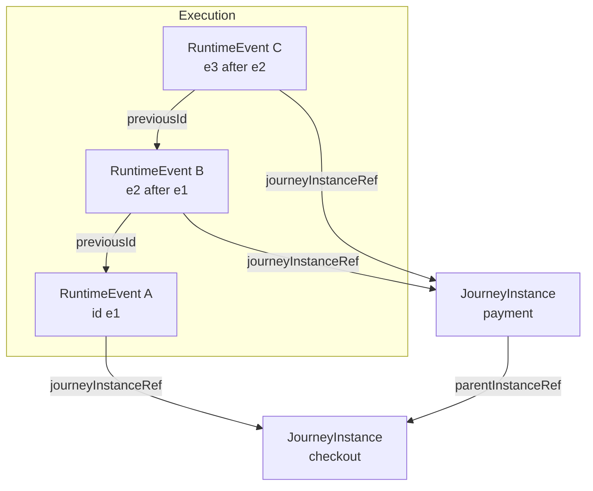

## Overview

This module defines the data model for recording actual user behavior as a **causally ordered event chain** within a bounded execution. Ordering is established by explicit linkage between events, not by timestamps. Runtime events also carry an explicit journey instance reference so the local state where an event occurred can be interpreted in nested journey contexts.

Runtime records observed execution facts. A Client does not need to receive or understand the whole UJG graph document in order to emit runtime events. Each event records enough local scope to make the observed state occurrence unambiguous, and Mapping can later resolve those facts against Graph intent.

## Normative Artifacts

This module is published through the following artifacts:

- `runtime.ttl`: ontology, published at `https://ujg.specs.openuji.org/ed/ns/runtime`
- `runtime.context.jsonld`: JSON-LD term mappings, published at `https://ujg.specs.openuji.org/ed/ns/runtime.context.jsonld`
- `runtime.shape.ttl`: SHACL validation rules, published at `https://ujg.specs.openuji.org/ed/ns/runtime.shape`

Examples in this page use an explicit context array composed from the published module contexts. The same composition is also published as the convenience context `https://ujg.specs.openuji.org/ed/ns/context.jsonld`.

## Terminology

- <dfn>JourneyExecution</dfn>: A bounded execution identifier for one logical trace.
- <dfn>RuntimeEvent</dfn>: An atomic record of a single observed runtime moment.
- <dfn>JourneyInstance</dfn>: A concrete runtime occurrence of a graph [=Journey=], not a [=JourneyIndex=].
- <dfn>Event Chain</dfn>: A sequence where each event references its immediate predecessor via `previousId`.
- <dfn>Root Event</dfn>: The event in a [=JourneyExecution=] whose `previousId` is omitted.

---

## Runtime Model {data-cop-concept="runtime-model"}

### Visual Model


```mermaid
graph TB
  subgraph JourneyExecution [Execution]
    direction LR
    E1[RuntimeEvent A<br/>id e1]
    E2[RuntimeEvent B<br/>e2 after e1]
    E3[RuntimeEvent C<br/>e3 after e2]
    E2 -->|previousId| E1
    E3 -->|previousId| E2
  end
  E1 -->|journeyInstanceRef| J1[JourneyInstance<br/>checkout]
  E2 -->|journeyInstanceRef| J2[JourneyInstance<br/>payment]
  E3 -->|journeyInstanceRef| J2
  J2 -->|parentInstanceRef| J1
```

A [=JourneyExecution=] identifies one logical trace. It is not required to enumerate its [=RuntimeEvent|RuntimeEvents=]. Runtime events are associated with an execution by `executionId`, which supports append-only event streams.

A [=RuntimeEvent=] records one runtime moment and may reference its immediate predecessor via `previousId`; if `previousId` is omitted, the event is the [=Root Event=].

A [=RuntimeEvent=] references exactly one [=JourneyInstance=] using `journeyInstanceRef`. The referenced [=JourneyInstance=] supplies the local graph [=Journey=] scope needed to interpret the event's `stateRef`, especially when the event occurred inside a subjourney reached through a [=CompositeState=].

The core runtime-local address is the pair `RuntimeEvent.stateRef` plus `RuntimeEvent.journeyInstanceRef`. This pair identifies the concrete runtime-local occurrence of the referenced [=State=] or [=CompositeState=].

## Runtime Event {data-cop-concept="runtime-event"}

<spec-statement>

1. A [=RuntimeEvent=] MUST reference exactly one [=JourneyExecution=] using `executionId`.
2. A [=RuntimeEvent=] MUST reference exactly one graph [=State=] or [=CompositeState=] using `stateRef`.
3. A [=RuntimeEvent=] MUST reference exactly one [=JourneyInstance=] using `journeyInstanceRef`.
4. The pair `stateRef` and `journeyInstanceRef` MUST be sufficient to identify the runtime-local state occurrence.
5. A [=RuntimeEvent=] MAY reference its immediate predecessor using `previousId`.
6. If `previousId` is omitted, the event is a [=Root Event=] in the execution chain.
7. Runtime event order MUST be reconstructed using `previousId` links, not timestamps.
8. The `payload` property, when present, is opaque runtime data and MUST NOT be required for resolving state or journey scope.

</spec-statement>

## Journey Instance {data-cop-concept="journey-instance"}

A [=JourneyInstance=] is a concrete runtime occurrence of a graph [=Journey=]. It is a scope node: it describes journey instantiation and nesting, not membership in an event stream. A [=JourneyIndex=] is not a runtime scope because it does not define traversal.

<spec-statement>

1. A [=JourneyInstance=] MUST reference exactly one graph [=Journey=] using `journeyRef`; it MUST NOT reference a [=JourneyIndex=].
2. A [=JourneyInstance=] MAY reference a parent [=JourneyInstance=] using `parentInstanceRef`.
3. If a [=JourneyInstance=] represents a subjourney entered through a [=CompositeState=], it SHOULD provide `viaStateRef`.
4. A [=JourneyInstance=] MUST NOT be required to reference a [=JourneyExecution=].
5. The root [=JourneyInstance=] is the topmost ancestor reached by following `parentInstanceRef` until no parent exists.
6. The local graph [=Journey=] scope for a [=RuntimeEvent=] is the `journeyRef` of the event's `journeyInstanceRef`.
7. The derived journey instance stack for a [=RuntimeEvent=] is the ordered ancestor chain from the root [=JourneyInstance=] to the event's local [=JourneyInstance=].

</spec-statement>

The core Runtime model intentionally does not put `executionId`, `subjectRef`, `depth`, or `frameRefs` on [=JourneyInstance=]. `executionId` belongs to [=RuntimeEvent=] because events form the append-only observed runtime chain. Domain subjects, cases, records, users, and data bindings are application data or module-specific data. Depth and stack order are derivable by walking `parentInstanceRef`.

## Derived Journey Instance Stack {data-cop-concept="derived-journey-instance-stack"}

This section is non-normative.

A Consumer can derive a journey instance stack by following `RuntimeEvent.journeyInstanceRef` to its [=JourneyInstance=], then following `parentInstanceRef` recursively until a root [=JourneyInstance=] is reached.

The derived stack order is root instance to local instance. The final derived stack entry is always the [=RuntimeEvent=]'s `journeyInstanceRef`.

Implementations can materialize this derived stack for indexing, caching, frontend rendering, or Mapping performance, but the materialized stack is not the normative runtime address.

## Ontology {data-cop-concept="ontology"}

The normative Runtime ontology is defined below and is published at `https://ujg.specs.openuji.org/ed/ns/runtime`. It is the authoritative structural definition for `JourneyExecution`, `RuntimeEvent`, `JourneyInstance`, and the properties that connect them.

:::include ./runtime.ttl :::

## JSON-LD Context {data-cop-concept="jsonld-context"}

The normative Runtime JSON-LD context is defined below and is published at `https://ujg.specs.openuji.org/ed/ns/runtime.context.jsonld`. It provides the compact JSON-LD term mappings for Runtime examples, including IRI-valued references and opaque JSON `payload` values.

:::include ./runtime.context.jsonld :::

---

## Validation {data-cop-concept="validation"}

The normative Runtime SHACL shape is defined below and is published at `https://ujg.specs.openuji.org/ed/ns/runtime.shape`. It is the authoritative validation artifact for Runtime structural constraints.

:::include ./runtime.shape.ttl :::

The rules below define additional causal constraints on event chains beyond the structural constraints captured by the SHACL shape.

<spec-statement>
Within a single execution (events where `executionId` equals the [=JourneyExecution=] `@id`):
  1. **Root**: Exactly one event MUST be the [=Root Event=].
  2. **Resolution**: Every present `previousId` MUST match the `@id` of an event in the same execution.
  3. **Single Successor**: An event `@id` MUST NOT be referenced as `previousId` by more than one event in the same execution.
  4. **Acyclic**: The chain MUST NOT contain cycles.
</spec-statement>
If any rule above is violated, the [=JourneyExecution=] is invalid.

---

## Reconstruction {data-cop-concept="reconstruction"}

<spec-statement>

A Consumer reconstructing event order **MUST**:

1. Identify the [=Root Event=].
2. Repeatedly select the unique event whose `previousId` equals the current event's `@id`.
3. Continue until no successor exists.

</spec-statement>

A Consumer interpreting a runtime event's journey context MUST resolve the event's `journeyInstanceRef` to a [=JourneyInstance=] and use that instance's `journeyRef` as the local graph [=Journey=] scope.

---

## Appendix: Combined JSON Example {.unnumbered}

```json
{
  "@context": "https://ujg.specs.openuji.org/ed/ns/context.jsonld",
  "@id": "https://example.com/ujg/runtime/execution-12345.jsonld",
  "@type": "UJGDocument",
  "nodes": [
    {
      "@type": "JourneyExecution",
      "@id": "urn:ujg:execution:12345"
    },
    {
      "@type": "JourneyInstance",
      "@id": "urn:ujg:journey-instance:checkout:12345",
      "journeyRef": "urn:ujg:journey:checkout"
    },
    {
      "@type": "JourneyInstance",
      "@id": "urn:ujg:journey-instance:checkout:12345:payment",
      "journeyRef": "urn:ujg:journey:payment",
      "parentInstanceRef": "urn:ujg:journey-instance:checkout:12345",
      "viaStateRef": "urn:ujg:state:checkout-payment"
    },
    {
      "@type": "RuntimeEvent",
      "@id": "urn:ujg:event:12345:100",
      "executionId": "urn:ujg:execution:12345",
      "stateRef": "urn:ujg:state:shipping-form",
      "journeyInstanceRef": "urn:ujg:journey-instance:checkout:12345",
      "payload": { "action": "surface.enter" }
    },
    {
      "@type": "RuntimeEvent",
      "@id": "urn:ujg:event:12345:200",
      "executionId": "urn:ujg:execution:12345",
      "previousId": "urn:ujg:event:12345:100",
      "stateRef": "urn:ujg:state:payment-card",
      "journeyInstanceRef": "urn:ujg:journey-instance:checkout:12345:payment",
      "payload": { "action": "field.complete", "field": "card-number" }
    }
  ]
}
```
