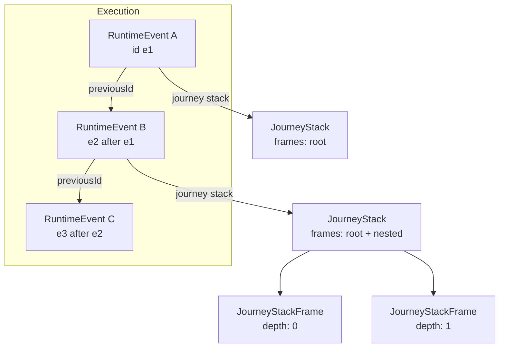

## Overview

This module defines the data model for recording actual user behavior as a **causally ordered event chain** within a bounded execution. Ordering is established by explicit linkage between events, not by timestamps. Runtime events also carry an explicit journey stack so the local state where an event occurred can be interpreted in nested journey contexts.

## Normative Artifacts

This module is published through the following artifacts:

- `runtime.ttl`: ontology, published at `https://ujg.specs.openuji.org/ed/ns/runtime`
- `runtime.context.jsonld`: JSON-LD term mappings, published at `https://ujg.specs.openuji.org/ed/ns/runtime.context.jsonld`
- `runtime.shape.ttl`: SHACL validation rules, published at `https://ujg.specs.openuji.org/ed/ns/runtime.shape`

Examples in this page use an explicit context array composed from the published module contexts. The same composition is also published as the convenience context `https://ujg.specs.openuji.org/ed/ns/context.jsonld`.

## Terminology

- <dfn>JourneyExecution</dfn>: A bounded execution identifier for one logical trace.
- <dfn>RuntimeEvent</dfn>: An atomic record of a single runtime moment.
- <dfn>Event Chain</dfn>: A sequence where each event references its immediate predecessor via `previousId`.
- <dfn>JourneyStack</dfn>: An ordered runtime scope stack describing the chain of journey contexts in which a runtime event occurred.
- <dfn>JourneyStackFrame</dfn>: One journey context within a [=JourneyStack=].

---

## Runtime Model {data-cop-concept="runtime-model"}

### Visual Model


```mermaid
graph TB
  subgraph JourneyExecution [Execution]
    direction LR
    E1[RuntimeEvent A<br/>id e1]
    E2[RuntimeEvent B<br/>e2 after e1]
    E3[RuntimeEvent C<br/>e3 after e2]
    E1 -->|previousId| E2
    E2 -->|previousId| E3
  end
  E1 -->|journey stack| S1[JourneyStack<br/>frames: root]
  E2 -->|journey stack| S2[JourneyStack<br/>frames: root + nested]
  S2 --> F0[JourneyStackFrame<br/>depth: 0]
  S2 --> F1[JourneyStackFrame<br/>depth: 1]
```

A [=JourneyExecution=] identifies one logical trace. It is not required to enumerate its [=RuntimeEvent|RuntimeEvents=]. Runtime events are associated with an execution by `executionId`, which supports append-only event streams.

A [=RuntimeEvent=] records one runtime moment and may reference its immediate predecessor via `previousId`; if `previousId` is omitted, the event is the Root Event.

A [=RuntimeEvent=] also references exactly one [=JourneyStack=] using `journeyStackRef`. The stack supplies the journey scope needed to interpret the event's `stateRef`, especially when the event occurred inside a subjourney reached through a [=CompositeState=].

## Journey Stack {data-cop-concept="journey-stack"}

<spec-statement>

1. A [=RuntimeEvent=] MUST reference exactly one [=JourneyStack=] using `journeyStackRef`.
2. A [=JourneyStack=] MUST contain one or more [=JourneyStackFrame=] references using `frameRefs`.
3. The `frameRefs` order is significant and MUST be interpreted from root journey to local journey.
4. The final [=JourneyStackFrame=] in `frameRefs` identifies the local journey context for the [=RuntimeEvent=]'s `stateRef`.
5. If a [=JourneyStackFrame=] represents a subjourney entered through a [=CompositeState=], it SHOULD provide `viaStateRef` referencing that parent [=CompositeState=].
6. If `depth` is present on a [=JourneyStackFrame=], it MUST match the frame's zero-based position in the containing `frameRefs` list.

</spec-statement>

## Ontology {data-cop-concept="ontology"}

The normative Runtime ontology is defined below and is published at `https://ujg.specs.openuji.org/ed/ns/runtime`. It is the authoritative structural definition for `JourneyExecution`, `RuntimeEvent`, `JourneyStack`, `JourneyStackFrame`, and the properties that connect them.

:::include ./runtime.ttl :::

## JSON-LD Context {data-cop-concept="jsonld-context"}

The normative Runtime JSON-LD context is defined below and is published at `https://ujg.specs.openuji.org/ed/ns/runtime.context.jsonld`. It provides the compact JSON-LD term mappings for Runtime examples, including IRI-valued references, ordered `frameRefs` lists, and opaque JSON `payload` values.

:::include ./runtime.context.jsonld :::

---

## Validation {data-cop-concept="validation"}

The normative Runtime SHACL shape is defined below and is published at `https://ujg.specs.openuji.org/ed/ns/runtime.shape`. It is the authoritative validation artifact for Runtime structural constraints.

:::include ./runtime.shape.ttl :::

The rules below define additional causal constraints on event chains beyond the structural constraints captured by the SHACL shape.

<spec-statement>
Within a single execution (events where `executionId` equals the [=JourneyExecution=] `@id`):
  1. **Root**: Exactly one event MUST be the Root Event.
  2. **Resolution**: Every present `previousId` MUST match the `@id` of an event in the same execution.
  3. **Single Successor**: An event `@id` MUST NOT be referenced as `previousId` by more than one event in the same execution.
  4. **Acyclic**: The chain MUST NOT contain cycles.
</spec-statement>
If any rule above is violated, the [=JourneyExecution=] is invalid.

---

## Reconstruction {data-cop-concept="reconstruction"}

<spec-statement>

A Consumer reconstructing event order **MUST**:

1. Identify the Root Event.
2. Repeatedly select the unique event whose `previousId` equals the current event’s `@id`.
3. Continue until no successor exists.

</spec-statement>

A Consumer interpreting a runtime event's journey context MUST use the `frameRefs` order of the referenced [=JourneyStack=], from root journey to local journey. If `depth` is present, Consumers MAY use it as a denormalized query helper, but the normative stack order is the `frameRefs` list order.

---

## Appendix: Combined JSON Example {.unnumbered}

```json
{
  "@context": "https://ujg.specs.openuji.org/ed/ns/context.jsonld",
  "@id": "https://example.com/ujg/runtime/execution-12345.jsonld",
  "@type": "UJGDocument",
  "specVersion": "1.0",
  "nodes": [
    {
      "@type": "JourneyExecution",
      "@id": "urn:ujg:execution:12345"
    },
    {
      "@type": "JourneyStack",
      "@id": "urn:ujg:stack:checkout",
      "frameRefs": [
        "urn:ujg:stack-frame:checkout:0"
      ]
    },
    {
      "@type": "JourneyStackFrame",
      "@id": "urn:ujg:stack-frame:checkout:0",
      "journeyRef": "urn:ujg:journey:checkout",
      "instanceRef": "urn:ujg:journey-instance:checkout:12345",
      "subjectRef": "urn:ujg:user:12345",
      "depth": 0
    },
    {
      "@type": "JourneyStack",
      "@id": "urn:ujg:stack:checkout:payment",
      "frameRefs": [
        "urn:ujg:stack-frame:checkout:0",
        "urn:ujg:stack-frame:checkout:payment:1"
      ]
    },
    {
      "@type": "JourneyStackFrame",
      "@id": "urn:ujg:stack-frame:checkout:payment:1",
      "journeyRef": "urn:ujg:journey:payment",
      "viaStateRef": "urn:ujg:state:checkout-payment",
      "instanceRef": "urn:ujg:journey-instance:checkout:12345:payment",
      "depth": 1
    },
    {
      "@type": "RuntimeEvent",
      "@id": "urn:ujg:event:12345:100",
      "executionId": "urn:ujg:execution:12345",
      "stateRef": "urn:ujg:state:shipping-form",
      "journeyStackRef": "urn:ujg:stack:checkout",
      "payload": { "action": "surface.enter" }
    },
    {
      "@type": "RuntimeEvent",
      "@id": "urn:ujg:event:12345:200",
      "executionId": "urn:ujg:execution:12345",
      "previousId": "urn:ujg:event:12345:100",
      "stateRef": "urn:ujg:state:payment-card",
      "journeyStackRef": "urn:ujg:stack:checkout:payment",
      "payload": { "action": "field.complete", "field": "card-number" }
    }
  ]
}
```
