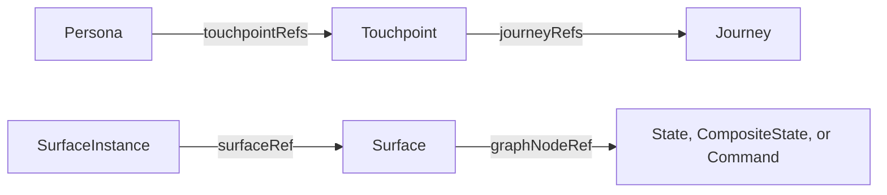
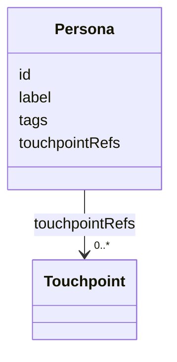
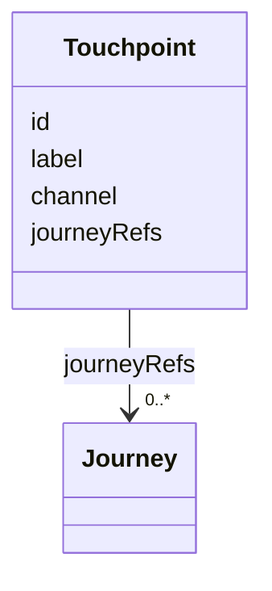
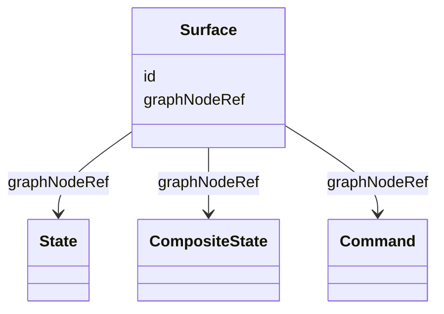
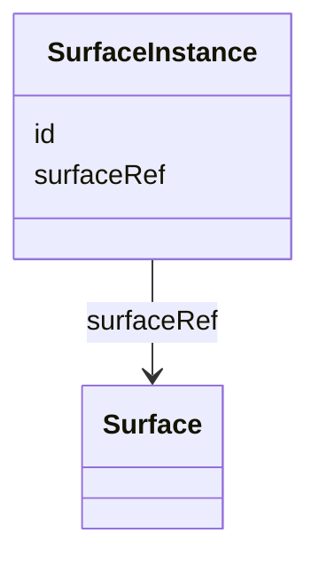

## Overview

This core-family specification describes how an intended journey is made visible to people. It
defines four concepts:

- A [=Persona=] describes a human role or perspective, such as a customer or support agent.
- A [=Touchpoint=] describes where an experience is presented, such as a website, mobile app,
  kiosk, or call center.
- A [=Surface=] gives a stable identity to something visible that represents a Graph node.
- A [=SurfaceInstance=] identifies one concrete occurrence of a Surface at runtime.

The concepts form two independent relationship chains:



The first chain describes the human perspective and presenting boundary around a Journey. The
second describes how visible materialization connects to Graph meaning. Neither chain adds Graph
edges, changes traversal, or identifies who actually used a system at runtime.

Graph does not depend on Surface. A Graph model remains meaningful without personas, touchpoints,
surfaces, or runtime instances.

Examples compose the shared baseline context with
`https://ujg.specs.openuji.org/ed/ns/surface.context.jsonld`.

## Terminology

- <dfn>Persona</dfn>: A human role, archetype, or participant perspective relevant to an
  experience.
- <dfn>Touchpoint</dfn>: A system, channel, or service boundary through which one or more Journeys
  are presented.
- <dfn>Surface</dfn>: A stable, addressable, design-system-agnostic visible boundary for one
  supported Graph node.
- <dfn>SurfaceInstance</dfn>: One concrete runtime-visible occurrence of a Surface.

## Persona {data-cop-concept="persona"}

A [=Persona=] gives a name to a human perspective that matters to an experience. For example,
"Customer", "Support agent", and "Store manager" can be personas. A persona can be associated with
one or more [=Touchpoint|Touchpoints=] through `touchpointRefs`.

A Persona is not a person record. It does not identify an account, authenticated identity, runtime
actor, authorization subject, legal person, system, or organization. It also does not own Graph
nodes. Graph nodes therefore never need a Persona in order to be understood.

<spec-statement>
1. A [=Persona=] **MUST** have an IRI so it can be referenced consistently.
2. A [=Persona=] **MAY** have a `label`, `tags`, and one or more `touchpointRefs`.
3. Every `touchpointRefs` value **MUST** identify a [=Touchpoint=].
4. Graph nodes **MUST NOT** reference a [=Persona=] directly.
5. Persona relationships **MUST NOT** create Graph edges, alter Graph traversal, assert that
   something occurred, identify a Runtime actor, or imply authentication or authorization.
</spec-statement>



Example JSON nodes:

```json
[
  {
    "@type": "Persona",
    "@id": "urn:ujg:persona:customer",
    "label": "Customer",
    "tags": ["shopper"],
    "touchpointRefs": ["urn:ujg:touchpoint:web"]
  },
  {
    "@type": "Touchpoint",
    "@id": "urn:ujg:touchpoint:web",
    "label": "Web shop",
    "channel": "web"
  }
]
```

## Touchpoint {data-cop-concept="touchpoint"}

A [=Touchpoint=] describes where people encounter an experience. A website, mobile app, kiosk,
branch office, and call center are all possible touchpoints. The optional `channel` is a short name
for the kind of boundary, while `journeyRefs` identifies the [=Journey|Journeys=] presented there.

Touchpoints connect to meaningful Journey boundaries rather than individual States or Surfaces.
This keeps a coherent part of an experience together. A Touchpoint does not identify a Persona,
account, Runtime observer, or protocol state by itself.

<spec-statement>
1. A [=Touchpoint=] **MUST** have an IRI and one `label`.
2. A [=Touchpoint=] **MAY** have one `channel` and one or more `journeyRefs`.
3. Every `journeyRefs` value **MUST** identify a [=Journey=].
4. Touchpoint assignment **SHOULD** be made at a Journey boundary when that Journey represents one
   coherent experience on the Touchpoint.
5. `journeyRefs` **MUST NOT** create hidden Graph edges, change traversal, assert occurrence, or
   change Runtime event ordering.
</spec-statement>



Example JSON node:

```json
{
  "@type": "Touchpoint",
  "@id": "urn:ujg:touchpoint:web",
  "label": "Web shop",
  "channel": "web",
  "journeyRefs": ["urn:ujg:journey:checkout"]
}
```

## Surface {data-cop-concept="surface"}

A [=Surface=] gives a stable identity to one visible boundary and connects that boundary to its
Graph meaning with `graphNodeRef`. The referenced Graph node can be a `State`, `CompositeState`, or
`Command`.

For example, a shipping form can be the Surface for a shipping `State`. A visible "Place order"
control can be the Surface for a `Command`. Referencing a Command does not prescribe a button, link,
or any other widget; it only says which intentional invocation the visible boundary represents.

Multiple Surfaces can reference the same Graph node when they are genuinely different visible
boundaries. A different color, framework, or renderer does not by itself make a new Surface.

When Graph traversal creates multiple concrete occurrences, the corresponding Surface can also
appear more than once. Surface does not define occurrence counts, instance keys, collection data,
or rendering behavior. Those details come from Graph semantics and runtime or application data.

<spec-statement>
1. A [=Surface=] **MUST** have an IRI and exactly one `graphNodeRef`.
2. `graphNodeRef` **MUST** identify a `State`, `CompositeState`, or `Command`.
3. A [=Surface=] **MUST NOT** declare a Persona or Touchpoint directly.
4. A [=Surface=] **MUST NOT** change Graph traversal or assert that its Graph node occurred.
5. A [=Surface=] **MUST NOT** define occurrence multiplicity, instance keys, data sources,
   collection iteration, or rendering behavior.
6. A [=Surface=] **MUST NOT** reference a [=Transition=] or [=OutgoingTransition=] through
   `graphNodeRef`.
</spec-statement>



Example JSON node:

```json
{
  "@type": "Surface",
  "@id": "urn:ujg:surface:shipping-form",
  "graphNodeRef": "urn:ujg:state:shipping"
}
```

## SurfaceInstance {data-cop-concept="surface-instance"}

A [=SurfaceInstance=] identifies one concrete occurrence of a [=Surface=]. For example, the same
shipping form Surface can appear during many executions, and each visible occurrence can have its
own SurfaceInstance. Runtime events use `surfaceInstanceRef` to say where an observed moment
occurred.

<spec-statement>
1. A [=SurfaceInstance=] **MUST** have an IRI and exactly one `surfaceRef`.
2. `surfaceRef` **MUST** identify a [=Surface=].
3. A [=SurfaceInstance=] **MUST NOT** declare Graph-node identity directly; its Graph meaning is
   found through the referenced Surface.
</spec-statement>



Example JSON node:

```json
{
  "@type": "SurfaceInstance",
  "@id": "urn:ujg:surface-instance:shipping-form:1",
  "surfaceRef": "urn:ujg:surface:shipping-form"
}
```

## Shared Semantics

1. `Persona.touchpointRefs` and `Touchpoint.journeyRefs` form the descriptive path from a human
   perspective to the Journeys presented for that perspective.
2. `Surface.graphNodeRef` is the canonical relationship from a visible boundary to Graph meaning.
3. `SurfaceInstance.surfaceRef` is the canonical relationship from one concrete visible occurrence
   to its stable Surface.
4. To find the Touchpoints applicable to a Surface, a consumer first finds the Journey or Journeys
   in which the referenced Graph node is used, then finds Touchpoints whose `journeyRefs` include
   those Journeys. A shared Graph node can therefore lead to more than one applicable Touchpoint.
5. To find the Personas associated with those Touchpoints, a consumer finds Personas whose
   `touchpointRefs` include them. This can produce no Persona, one Persona, or several Personas.
6. An associated Persona describes the intended human perspective. It **MUST NOT** be treated as
   the identity of a person observed at runtime.
7. An `OutgoingTransitionGroup` does not have a Surface. When its child
   [=OutgoingTransition|OutgoingTransitions=] need stable visible invocation identity, model a
   [=Command=] and let the outgoing transitions share that Command through `commandRef`.
8. Surface terms do not select design-system components, templates, slots, tokens, or renderers.
9. Concrete Surface occurrence multiplicity derives from Graph traversal and runtime or application
   data; Surface does not add its own multiplicity vocabulary.
10. A consumer may ignore Surface semantics while preserving recognized JSON-LD data.

## Migration From User

Documents written against an earlier Editor's Draft can migrate without changing their overall
Graph structure:

- Change each Surface-module `User` node to `Persona`. Its existing `@id` may stay the same.
- Remove `userRef` from every Graph node. Persona context is not inherited by entries, states,
  transitions, commands, exits, or child journeys.
- Connect each Persona to relevant Touchpoints with `touchpointRefs`.
- Connect each Touchpoint to coherent Journey boundaries with `journeyRefs`.

There is no compatibility alias for `User` or `userRef` in this Editor's Draft.

## Normative Artifacts

The following sections contain the exact machine-readable vocabulary, JSON-LD term mappings, and
validation rules. Readers who only need the conceptual model can continue to the examples.

### Ontology {data-cop-concept="ontology"}

The Surface ontology is published at `https://ujg.specs.openuji.org/ed/ns/surface`.

:::include ./surface.ttl :::

### JSON-LD Context {data-cop-concept="jsonld-context"}

The Surface context is published at `https://ujg.specs.openuji.org/ed/ns/surface.context.jsonld`.

:::include ./surface.context.jsonld :::

### Validation {data-cop-concept="validation"}

The Surface SHACL shape is published at `https://ujg.specs.openuji.org/ed/ns/surface.shape`.

:::include ./surface.shape.ttl :::

## Examples

### Combined Surface Example

In this example, the Customer Persona is associated with the Web shop Touchpoint. That Touchpoint
presents the Checkout Journey. The shipping form Surface gives visible identity to the Shipping
State, and the SurfaceInstance identifies one concrete occurrence of that form.

```json
{
  "@context": [
    "https://ujg.specs.openuji.org/ed/ns/context.jsonld",
    "https://ujg.specs.openuji.org/ed/ns/surface.context.jsonld"
  ],
  "@id": "https://example.com/ujg/surface/checkout.jsonld",
  "@type": "UJGDocument",
  "nodes": [
    {
      "@type": "Persona",
      "@id": "urn:ujg:persona:customer",
      "label": "Customer",
      "touchpointRefs": ["urn:ujg:touchpoint:web"]
    },
    {
      "@type": "Touchpoint",
      "@id": "urn:ujg:touchpoint:web",
      "label": "Web shop",
      "channel": "web",
      "journeyRefs": ["urn:ujg:journey:checkout"]
    },
    {
      "@type": "Journey",
      "@id": "urn:ujg:journey:checkout",
      "defaultEntryRef": "urn:ujg:entry:checkout-default",
      "entryRefs": ["urn:ujg:entry:checkout-default"],
      "stateRefs": ["urn:ujg:state:shipping"]
    },
    {
      "@type": "JourneyEntry",
      "@id": "urn:ujg:entry:checkout-default",
      "stateRef": "urn:ujg:state:shipping"
    },
    {
      "@type": "State",
      "@id": "urn:ujg:state:shipping",
      "label": "Shipping"
    },
    {
      "@type": "Surface",
      "@id": "urn:ujg:surface:shipping-form",
      "graphNodeRef": "urn:ujg:state:shipping"
    },
    {
      "@type": "SurfaceInstance",
      "@id": "urn:ujg:surface-instance:shipping-form:1",
      "surfaceRef": "urn:ujg:surface:shipping-form"
    }
  ]
}
```

### Private Extension Payloads

Core `extensions` remains available for vendor-private Surface data.

```json
{
  "@id": "urn:ujg:surface:cart",
  "@type": "Surface",
  "graphNodeRef": "urn:ujg:state:cart",
  "extensions": {
    "com.acme.audit": { "reviewTicket": "ACME-1234" }
  }
}
```
