# Foundations: From Models of the World to Interaction Graphs

> **Non-normative**
>
> This section provides historical context for UJG. It does not claim that UJG directly descends from every system, theory, or specification discussed below. The history is better understood as several partly independent lines of research that repeatedly approached different aspects of the same problem.
>
> **User Journey Graph (UJG)** is the specification family discussed in this section. Within UJG, **[Graph](/ed/graph)** denotes the layer that represents intended journey topology. The phrase *interaction graph* is used here only as a generic description for a graph representing human-system interaction; it is not an additional UJG term.

UJG models and evaluates human-facing product systems as computable data. Its main specification family separates [Core](/ed/core), [Graph](/ed/graph), [Surface](/ed/surface), [Runtime](/ed/runtime), [Mapping](/ed/mapping), and [Metrics](/ed/metrics), connecting intended interaction with its materialization and observed execution.

## A recurring abstraction problem in software engineering

Much of software history can be viewed as a continuing effort to make systems explicit enough to inspect, communicate, analyze, and reason about.

Different traditions made different structures primary: information relationships, machine states and transitions, processes and causal relations, entities and relationships, objects and domain concepts, user goals and tasks, dialogue structures, presentation models, platform-independent models, hypermedia affordances, and semantic graphs.

These abstractions did not simply replace one another. They address different aspects of a system and frequently coexist.

UJG belongs particularly to the line of work that asks whether **human-system interaction itself can be represented explicitly**, rather than remaining implicit in UI code, application control flow, screen definitions, or telemetry events.

## Foundations: association, behavior, and conceptual models

### 1945 — Bush's Memex: information as an associative space


In July 1945, Vannevar Bush published *As We May Think* in *The Atlantic Monthly*. He described the hypothetical **Memex**, a system intended to help a person store, retrieve, relate, and navigate an increasingly large body of information.

A central idea was **associative indexing**.

Rather than requiring information to be encountered only through predetermined hierarchical classifications, a person could establish relationships between information items and construct persistent sequences of associations that Bush called **trails**. Bush later described bodies of knowledge containing a “mesh of associative trails.”

Conceptually:

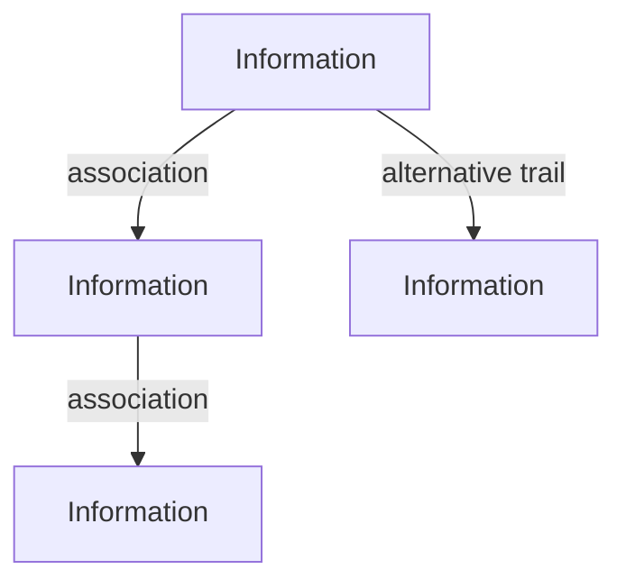

Bush was not describing digital hypertext in its later technical sense. The Memex was imagined using technologies available in the 1940s, particularly microfilm and electromechanical retrieval. The terms *hypertext* and *hypermedia* came later.

Nevertheless, the Memex became an important conceptual precursor to those systems.

Its relevance to interaction modeling lies in a deeper idea:

> **Human activity can be understood partly as traversal through an explicitly structured space of meaningful relationships.**

For the Memex, those relationships connect information:

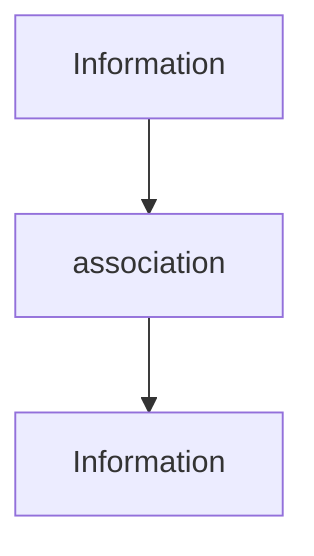

For an interaction model, relationships can instead connect positions and possibilities in an experience:

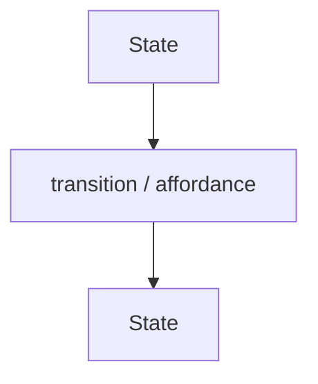

The models are different, but both treat the structure through which a human moves as meaningful in itself.

**Source:** Vannevar Bush, *As We May Think*, *The Atlantic Monthly*, July 1945.

### 1955–1956 — Behavior as states and transitions


George H. Mealy's *A Method for Synthesizing Sequential Circuits* was published in 1955. Edward F. Moore's *Gedanken-Experiments on Sequential Machines* followed in *Automata Studies* in 1956.

Their immediate subject was machine behavior rather than human-computer interaction.

The broader contribution was the ability to reason about behavior through an abstract structure such as:

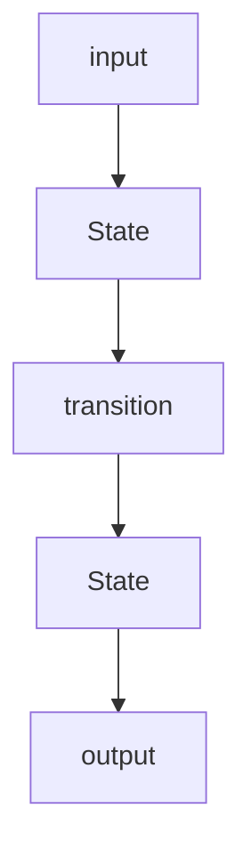

This establishes one of the foundations later reused by interaction models:

> **Behavior can itself become an explicit object of reasoning rather than being visible only through implementation.**

Much later, states and transitions could represent not only the condition of a machine but positions in a dialogue or user journey.

**Source:** George H. Mealy, *A Method for Synthesizing Sequential Circuits*, 1955.

### 1962 — Petri: causality and non-sequential processes


Carl Adam Petri developed his dissertation work during his period at the University of Bonn. *Kommunikation mit Automaten* was submitted to the Faculty of Mathematics and Physics of the **Technische Hochschule Darmstadt**, which accepted it as his doctoral dissertation. The dissertation title page records submission on 27 July 1961 and the oral examination on **20 June 1962**; it also identifies Petri's address at the Institute for Applied Mathematics of the University of Bonn and states that the manuscript was printed there.

Petri's work helped expand behavioral modeling beyond a single sequential chain. Conditions, events, concurrency, and causal relations could become explicit structural elements.

Instead of only:

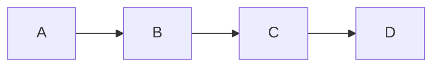

one could reason about structures in which independent or causally related activities coexist.

UJG is not a Petri-net formalism, but the larger lesson remains relevant:

> **Execution structure and causal relations can be modeled independently of program control flow.**

[UJG Runtime](/ed/runtime) applies a related principle by recording observed behavior as a causally ordered event chain. Event order is established by explicit predecessor relationships rather than inferred from timestamps.

**Source:** Carl Adam Petri, *Kommunikation mit Automaten*, doctoral dissertation, Technische Hochschule Darmstadt, 1962; published through the Institute for Instrumental Mathematics at the University of Bonn.

### 1976 — Entity–Relationship modeling: representing a problem world conceptually


Peter Chen's 1976 paper *The Entity-Relationship Model—Toward a Unified View of Data* helped establish conceptual modeling as an intermediate representation between a problem world and its technical data organization.

Its important historical contribution is larger than the familiar diagram notation:

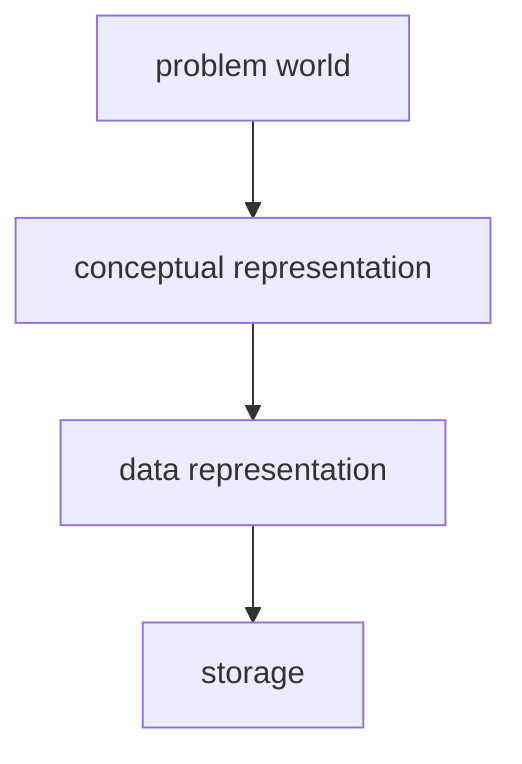

This makes an important distinction:

> **The conceptual structure through which we reason about a problem does not have to be identical to its physical representation.**

That distinction remains useful when considering a possible domain projection from UJG Graph:

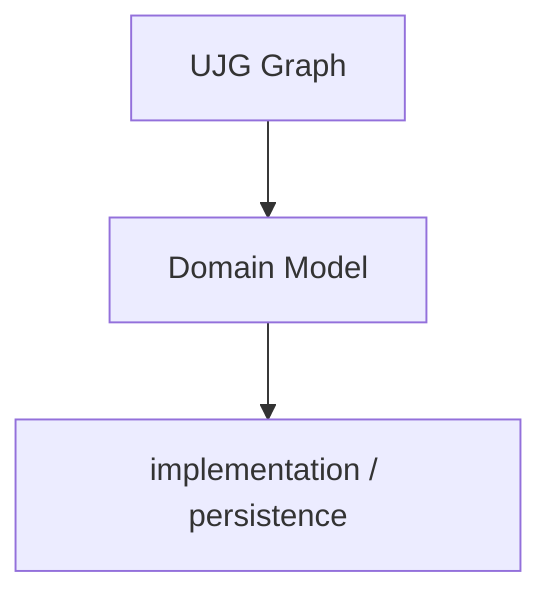

A derived [Domain Model](/ed/extensions/domain-model) need not itself be an ORM model, SQL schema, document structure, service interface, or programming-language class hierarchy.

Those remain possible realizations of the model.

### 1979 — MVC: separating what is represented from how it is encountered


Trygve Reenskaug developed the original Model–View–Controller ideas at Xerox PARC during 1978–1979. His *Models–Views–Controllers* technical note is dated **10 December 1979**.

The Model represented knowledge about a problem world, while Views exposed aspects of that knowledge to a user.

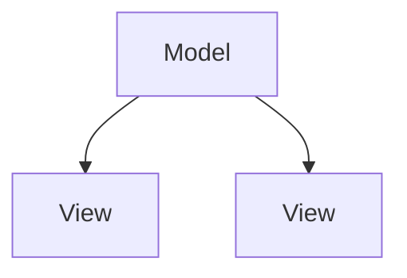

MVC helped establish an enduring distinction:

> **What a system represents and how a human encounters that representation are different concerns.**

Many later architectures still place the application or domain model upstream:

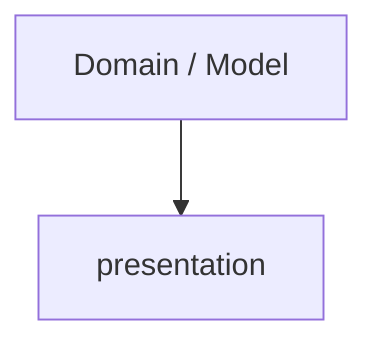

An interaction-centered architecture permits a different arrangement:

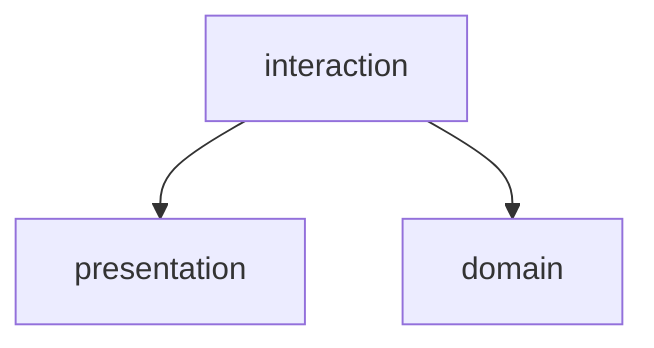

The distinction between representation and presentation survives while the semantic center can shift.

## Interaction becomes a model

### 1980 — Keystroke-Level Model: concrete actions become analyzable


Stuart Card, Thomas Moran, and Allen Newell published **The Keystroke-Level Model for User Performance Time with Interactive Systems** in 1980.

KLM modeled skilled interaction as combinations of elementary operators such as keystrokes, pointing, mental preparation, and system response. Its purpose was predictive: estimate how long a known interaction procedure would take an expert user.

Conceptually:

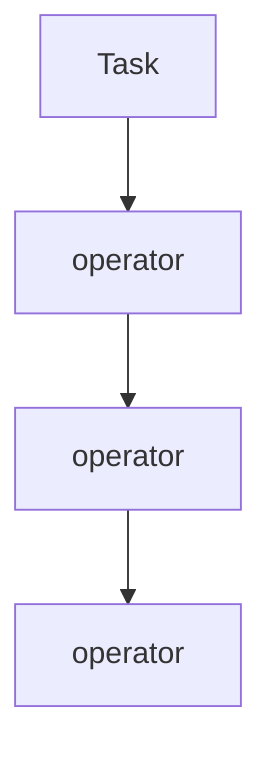

The historically important idea for UJG is broader than timing:

> **A concrete sequence of user actions becomes more meaningful when interpreted relative to an explicit model of the activity being performed.**

That principle becomes considerably richer in GOMS.

**Source:** Card, Moran, and Newell, *The Keystroke-Level Model for User Performance Time with Interactive Systems*, 1980.

### 1981 — Command Language Grammar: task, semantics, dialogue, and physical interaction


Thomas P. Moran's *The Command Language Grammar* was published in 1981.

CLG distinguished several descriptive levels, including **Task**, **Semantic**, **Syntactic**, and **Interaction** levels.

Conceptually:

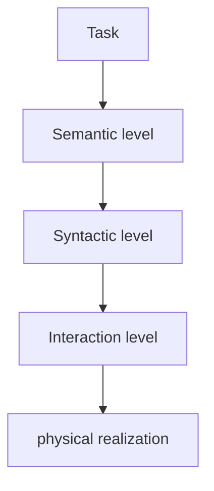

This is important because it treats interaction as something having different semantic levels.

A user's purpose is not identical to a command. A command is not identical to its dialogue syntax. Neither is identical to the physical action through which it is performed.

This anticipates a principle that becomes important in UJG:

> **Interaction semantics and interaction materialization are separate concerns.**

### 1983 — GOMS: relating actions to goals and methods


Card, Moran, and Newell's 1983 *The Psychology of Human-Computer Interaction* developed the family of models conventionally summarized as:

| GOMS element | Role in the model |
| --- | --- |
| Goals | Desired outcomes the user is trying to achieve. |
| Operators | Primitive actions available to the user. |
| Methods | Procedures that decompose a goal into operators or subgoals. |
| Selection Rules | Rules for choosing among alternative methods. |

A higher-level goal can be accomplished through one or more methods; methods decompose into operators; selection rules determine which method should be chosen when alternatives exist.

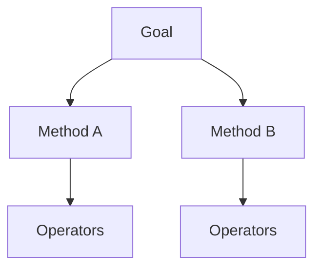

This is one of the strongest historical parallels to UJG Runtime and Mapping.

GOMS normally reasons from intention toward action:

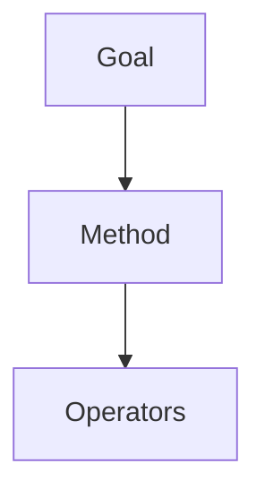

UJG permits a complementary interpretation of observed execution.

The canonical UJG resolution chain is:

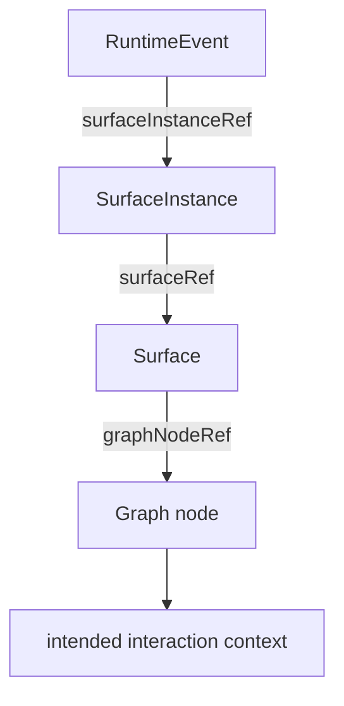

[Runtime](/ed/runtime) records the [`SurfaceInstance`](/ed/surface#dfn-surfaceinstance) at which a [`RuntimeEvent`](/ed/runtime#dfn-runtimeevent) was observed. [Mapping](/ed/mapping) resolves that instance through `SurfaceInstance.surfaceRef` to a [`Surface`](/ed/surface#dfn-surface), then through `Surface.graphNodeRef` to the corresponding [Graph](/ed/graph) state-like node.

The analogy should not be mistaken for equivalence.

GOMS is primarily a model of **human task performance and cognition**. UJG Runtime is an **observational semantic model**. UJG does not require assumptions about expertise, optimality, cognitive processing, or expected execution time.

The methodological relationship is nevertheless important:

> **Observed actions gain additional meaning when interpreted relative to an explicit model of intended activity.**

### 1983 — UIMS and Seeheim: dialogue becomes a separate architectural concern


The influential Workshop on User Interface Management Systems was held in Seeheim, West Germany, on **1–3 November 1983**.

The Seeheim architectural tradition distinguished approximately:

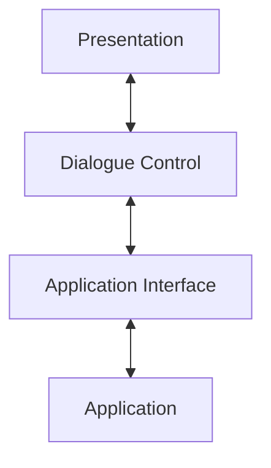

This is one of the closest historical relatives of UJG's concerns.

Its key insight was:

> **The dialogue between a human and an application is neither identical to presentation nor identical to application semantics.**

The difference is where that dialogue model lives.

In the Seeheim tradition, Dialogue Control is primarily an architectural element within an application:

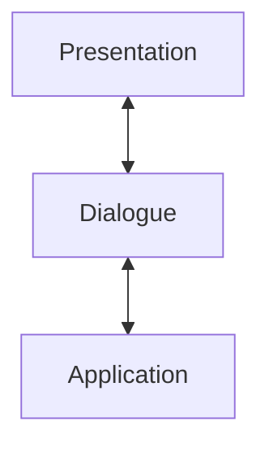

A graph-based interaction architecture can promote the interaction description into an independent semantic artifact:

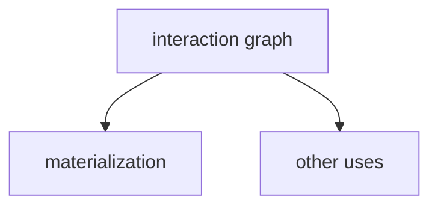

Here *interaction graph* is deliberately generic. Within UJG, the corresponding normative layer is **Graph**.

Interaction is no longer merely something an application *does* at runtime. It becomes something that can be named, exchanged, analyzed, transformed, and compared with actual runtime behavior.

### 1987 — Statecharts: making behavioral models compositional


David Harel's *Statecharts: A Visual Formalism for Complex Systems* appeared in 1987 and extended conventional state diagrams with hierarchy, concurrency, and communication.

The important engineering problem was scalability: a large flat state graph rapidly becomes difficult to reason about.

[UJG Graph](/ed/graph) addresses a related compositional problem through [`Journey`](/ed/graph#dfn-journey), [`Transition`](/ed/graph#dfn-transition), and [`CompositeState`](/ed/graph#dfn-compositestate). A [`Journey`](/ed/graph#dfn-journey) is a named container for local traversable flow topology. A [`CompositeState`](/ed/graph#dfn-compositestate) is a specialized [`State`](/ed/graph#dfn-state) that refers to a child [`Journey`](/ed/graph#dfn-journey); the parent retains the composite as a parent-local state rather than flattening the child's states into its own topology.

Conceptually:

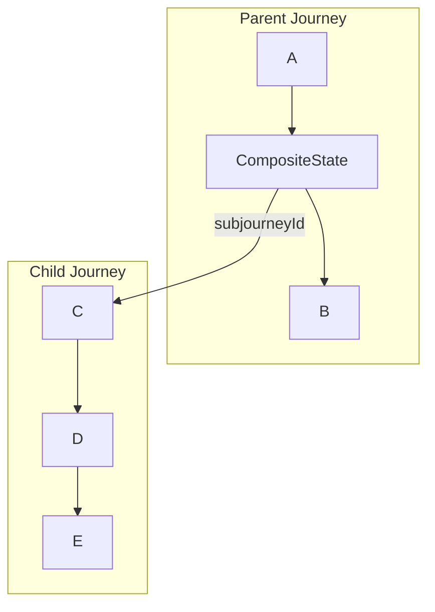

The specific semantics differ from Statecharts, but the recurring engineering principle is similar:

> **Behavioral models require composition if they are to remain usable at system scale.**

## Late 1980s–1990s — Model-based user interfaces


Beginning in the late 1980s and continuing through the 1990s, research systems such as **UIDE** and **HUMANOID** explored using higher-level declarative models to describe application semantics, interaction, presentation, and behavior.

This line of research moved beyond:

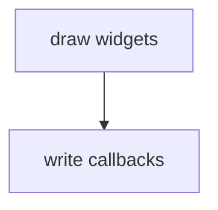

toward:

```mermaid
flowchart TD
  models[abstract models]
  behavior[derive interface behavior]
  ui[materialize UI]
  models --> behavior --> ui
```

Model-based UI environments often accumulated several distinct models:

| Model | Captured concern |
| --- | --- |
| Task Model | User goals, tasks, and task decomposition. |
| Domain Model | Problem-world concepts and relationships. |
| Dialogue Model | Interaction sequence and dialogue control. |
| Presentation Model | Visible representation and layout. |
| User Model | User roles, preferences, or skill assumptions. |
| Platform Model | Device, toolkit, or runtime capabilities. |

That increased expressive power, but it also exposed a persistent difficulty:

> **Every independently maintained model introduces another mapping problem.**

A graph-native architecture suggests another possibility: preserve shared identities and relations in a semantic graph and derive specialized projections where they are required.

### 1994 — USAGE: a model becomes an instrument for evaluation


Byrne, Wood, Sukaviriya, Foley, and Kieras presented **USAGE — the UIDE System for semi-Automated GOMS Evaluation** — in 1994.

USAGE connected a model-based interface design environment with GOMS analysis. It could automatically generate an NGOMSL model from an interface specified in UIDE and use that model for evaluation.

Conceptually:

```mermaid
flowchart TD
  appModel[application/interface model]
  actions[action decomposition]
  goms[GOMS model]
  task[task analysis]
  appModel --> actions --> goms --> task
```

This is historically important because the model is no longer only documentation, a design artifact, or a code-generation source.

It becomes an **instrument for reasoning about interaction**.

That produces an interesting parallel with UJG:

```mermaid
flowchart TD
  ujgGraph[Graph]
  surface[Surface]
  actual[actual interaction]
  runtime[Runtime]
  mapping[Mapping]
  meaning[Graph meaning]
  ujgGraph --> surface --> actual --> runtime --> mapping --> meaning
```

USAGE was predictive and cognitive in orientation; UJG Runtime is observational.

But both participate in a broader historical movement:

> **Make an interaction model operational enough that software can use it to reason about interaction.**

**Source:** Byrne, Wood, Sukaviriya, Foley, and Kieras, *Automating Interface Evaluation*, CHI 1994.

### 1997 — ConcurTaskTrees: human-system activity as an engineering model


Fabio Paternò, Cristiano Mancini, and Silvia Meniconi introduced **ConcurTaskTrees (CTT)** at INTERACT '97.

CTT represented tasks, temporal relationships between them, and distinctions among user, application, and interaction activities.

Conceptually:

```mermaid
flowchart TD
  activity[activity]
  human[human]
  system[system]
  interaction[interaction]
  activity --> human
  activity --> system
  human --> interaction
  system --> interaction
```

This line of research made the user's activities and goals part of the engineering model rather than leaving them implicit in application functionality.

UJG works at a different semantic level but shares this interaction-centered perspective:

> **The structure of human-system activity is itself something software engineering can model.**

## Models become interoperable and transformational

### 1999 — RDF: graph semantics independent of one application domain


The first W3C *RDF Model and Syntax Specification* became a Recommendation on **22 February 1999**.

RDF provided a domain-neutral way to describe identified resources and their relationships, while distinguishing the conceptual graph model from one particular serialization syntax.

At its simplest:

```mermaid
flowchart TD
  subject[subject]
  object[object]
  subject -- predicate --> object
```

or:

```mermaid
flowchart TD
  node1[identified node]
  node2[identified node]
  node1 -- typed relationship --> node2
```

For UJG, RDF-style semantics provide a graph substrate rather than the interaction semantics themselves.

Generic graph semantics provide concepts such as:

| Generic concept | Meaning |
| --- | --- |
| identity | Addressable subjects can be named and reused. |
| relations | Edges relate subjects in typed ways. |
| composition | Smaller structures can participate in larger structures. |
| extension | New vocabulary can add meaning without replacing the substrate. |

UJG Graph supplies specific interaction meaning through concepts such as:

| UJG Graph concept | Interaction meaning |
| --- | --- |
| [`Journey`](/ed/graph#dfn-journey) | Named container for local traversable flow topology. |
| [`State`](/ed/graph#dfn-state) | Discrete local point in the experience. |
| [`Transition`](/ed/graph#dfn-transition) | Directed local edge between graph vertices. |
| [`CompositeState`](/ed/graph#dfn-compositestate) | State that refers to a child `Journey`. |
| [`JourneyExit`](/ed/graph#dfn-journeyexit) | Terminal boundary outcome exported from a journey. |
| [`OutgoingTransition`](/ed/graph#dfn-outgoingtransition) | Navigation affordance outside ordinary local progression. |

The distinction is essential:

```mermaid
flowchart LR
  generic[generic graph semantics]
  ujg[UJG interaction semantics]
  generic -- not equivalent --> ujg
```

[UJG Graph](/ed/graph) vocabulary is itself published as an ontology together with a JSON-LD context and SHACL validation shapes.

### 2000 — REST and hypermedia: state plus available possibilities


Roy Fielding's dissertation *Architectural Styles and the Design of Network-based Software Architectures* was completed in 2000 and formalized REST as an architectural style for distributed hypermedia systems.

The historically relevant aspect for UJG is the hypermedia notion that a representation can expose not only information about a current state but also controls through which further interaction becomes possible.

Conceptually:

```mermaid
flowchart TD
  current[current representation]
  action1[available action]
  action2[available action]
  action3[available action]
  current --> action1
  current --> action2
  current --> action3
```

This has a useful relationship to an explicit distinction in UJG Graph.

A `Transition` is a **structural directed edge** between local vertices of a `Journey`.

An `OutgoingTransition` represents a **navigational affordance** pointing to a possible effective target without becoming a structural transition in that Journey's local topology.

```mermaid
flowchart LR
  label[structural topology]
  s1[State]
  t[Transition]
  s2[State]
  label --> s1
  s1 --> t --> s2
```

versus:

```mermaid
flowchart LR
  label[available possibility]
  journeyState[State]
  outgoing[OutgoingTransition]
  next[next possible State]
  label --> journeyState
  journeyState --> outgoing --> next
```

The distinction is particularly relevant to hypermedia: what a user *can do from here* is not necessarily identical to the structural progression used to define a local journey.

This lineage also reconnects to Bush:

```mermaid
flowchart TD
  memex[1945 Memex]
  associative[associative navigation]
  hypertext[hypertext]
  hypermedia[hypermedia]
  web[Web / REST]
  affordances[available affordances]
  memex --> associative --> hypertext --> hypermedia --> web --> affordances
```

### 2000–2001 — Model Driven Architecture: models as sources of transformation


OMG's **Model Driven Architecture (MDA)** emerged around 2000–2001 and formalized the idea that models could remain meaningful independently of particular platform technologies and participate in systematic transformation toward more specific realizations.

Conceptually:

```mermaid
flowchart TD
  abstract[abstract model]
  transformation[transformation]
  specific[more specific model]
  implementation[implementation]
  abstract --> transformation --> specific --> implementation
```

Its relevance to UJG is not a specific UML or MOF toolchain.

It is the broader engineering idea:

> **A model can be used not only to describe a system but also to derive other representations of that system.**

That becomes important for an interaction-centered architecture:

```mermaid
flowchart TD
  ujgGraph[UJG Graph]
  surface[Surface]
  domain[possible Domain projection]
  ujgGraph --> surface
  ujgGraph --> domain
```

### 2001 — Naked Objects: choosing the Domain Model as the source


Richard Pawson and Robert Matthews' **Naked Objects** work provides an especially useful historical comparison.

The approach deliberately exposes core business objects through automatically generated interfaces.

Its architectural direction can be summarized as:

```mermaid
flowchart TD
  domain[Domain]
  ui[UI]
  persistence[persistence]
  domain --> ui
  domain --> persistence
```

This is close to a mirror image of the interaction-first architecture explored here:

```mermaid
flowchart TD
  ujgGraph[UJG Graph]
  surface[Surface]
  domain[Domain]
  ui[UI]
  ujgGraph --> surface --> ui
  ujgGraph --> domain
```

Both approaches attempt to eliminate accidental duplication by selecting a model that can drive other parts of the application.

They differ in the crucial question:

> **Which model should be upstream?**

Naked Objects answers: the Domain Model.

An interaction-first architecture explores whether interaction intent can instead be upstream of both human-facing and domain projections.

### 2003 — XForms: interaction semantics separated from presentation


XForms 1.0 became a W3C Recommendation in 2003.

XForms separated form model, instance data, bindings, controls, events, and submission mechanisms rather than embedding all form semantics directly into presentation markup.

Its broader architectural contribution is:

> **Interaction semantics can survive changes in their concrete presentation.**

Conceptually:

```mermaid
flowchart TD
  model[interaction/data model]
  uiA[UI A]
  uiB[UI B]
  uiC[UI C]
  model --> uiA
  model --> uiB
  model --> uiC
```

XForms primarily addresses forms and data interaction.

UJG applies a related separation at the broader journey level:

```mermaid
flowchart TD
  ujgGraph[Graph]
  surface[Surface]
  realization[medium-specific realization]
  ujgGraph --> surface --> realization
```

A UJG [`Surface`](/ed/surface#dfn-surface) gives stable, addressable, design-system-agnostic materialized identity to a supported Graph node. A [`SurfaceInstance`](/ed/surface#dfn-surfaceinstance) represents one concrete runtime-visible occurrence of that Surface. Surface annotations do not themselves select rendering behavior.

### 2003 — Domain-Driven Design: domain meaning as the center of software


Eric Evans' *Domain-Driven Design* appeared in 2003, building on much older conceptual and object-oriented modeling traditions.

DDD reinforced an influential engineering idea:

> **Complex software is easier to reason about when its structure and language correspond closely to meaningful concepts in the problem domain.**

A simplified domain-first direction is:

```mermaid
flowchart TD
  problem[problem domain]
  language[shared language]
  domain[Domain Model]
  app[application]
  interaction[interaction]
  problem --> language --> domain --> app --> interaction
```

This belongs directly to the broader historical problem introduced at the beginning of this section: how to make software reflect the things people need to reason about.

An interaction-first architecture raises an additional question:

```mermaid
flowchart TD
  activity[human/system activity]
  ujgGraph[UJG Graph]
  surface[Surface]
  domain[Domain]
  activity --> ujgGraph
  ujgGraph --> surface
  ujgGraph --> domain
```

Could at least part of the necessary Domain Model be discovered from an explicit semantic description of what users and systems meaningfully do?

UJG does **not** currently define such a Domain projection. It is a possible architectural consequence that becomes available once interaction has its own explicit semantic model.

### 2014 — JSON-LD: graph semantics in the JSON ecosystem


JSON-LD 1.0 became a W3C Recommendation in 2014.

JSON-LD allows graph identity and Linked Data semantics to participate in JSON-oriented systems without making a nested JSON document tree the conceptual model.

For UJG, the distinction is important:

```mermaid
flowchart LR
  jsonld[JSON-LD]
  graphRepresentation[graph representation]
  jsonld --- graphRepresentation
```

while:

```mermaid
flowchart LR
  vocab[UJG vocabulary]
  meaning[interaction meaning]
  vocab --- meaning
```

JSON-LD therefore provides the practical representation mechanism through which UJG can use identified graph subjects and relations while remaining compatible with ordinary JSON tooling.

### 2026 — UJG: convergence around interaction


UJG's main specification family currently consists of five logical layers:

```mermaid
flowchart TD
  core[Core]
  ujgGraph[Graph]
  surface[Surface]
  runtime[Runtime]
  mapping[Mapping]
  core --> ujgGraph --> surface --> runtime --> mapping
```

[Core](/ed/core) provides the JSON-LD transport envelope.

[Graph](/ed/graph) represents intended interaction topology.

[Surface](/ed/surface) gives supported Graph nodes stable human-facing materialization and distinguishes a stable `Surface` from a concrete runtime-visible `SurfaceInstance`.

[Runtime](/ed/runtime) records actual observed behavior as a causally ordered event chain.

[Mapping](/ed/mapping) resolves Runtime observations through Surface back onto Graph intent.

[Graph](/ed/graph) includes explicit concepts such as:

| Graph concept | Role |
| --- | --- |
| [`Journey`](/ed/graph#dfn-journey) | Named container for local traversable flow topology. |
| [`JourneyEntry`](/ed/graph#dfn-journeyentry) | Explicit entry contract into a journey. |
| [`State`](/ed/graph#dfn-state) | Discrete local point in the experience. |
| [`CompositeState`](/ed/graph#dfn-compositestate) | State that delegates traversal to a child `Journey`. |
| [`Transition`](/ed/graph#dfn-transition) | Directed local edge between states or journey exits. |
| [`JourneyExit`](/ed/graph#dfn-journeyexit) | Terminal journey-local outcome. |
| [`OutgoingTransition`](/ed/graph#dfn-outgoingtransition) | Navigation affordance leaving local progression or targeting the current state. |

A `Journey` owns local traversable topology. A `Transition` represents structural local progression. A `CompositeState` composes a child `Journey`. An `OutgoingTransition` represents an available navigational affordance without making that affordance part of the Journey's structural transition set.

Surface and Runtime then preserve the relation between abstract intent and concrete occurrence:

```mermaid
flowchart TD
  graphNode[Graph node]
  surface[Surface]
  instance[SurfaceInstance]
  event[RuntimeEvent]
  surface -- graphNodeRef --> graphNode
  surface --> instance --> event
```

For mapping in the observation-to-intent direction, the canonical chain is:

```mermaid
flowchart TD
  event[RuntimeEvent]
  instance[SurfaceInstance]
  surface[Surface]
  graphNode[Graph node]
  context[intended interaction context]
  event -- surfaceInstanceRef --> instance
  instance -- surfaceRef --> surface
  surface -- graphNodeRef --> graphNode
  graphNode --> context
```

[Mapping](/ed/mapping) follows exactly this resolution to interpret observed state events as [`MappedStep`](/ed/mapping#dfn-mappedstep) records in a [`JourneyMapping`](/ed/mapping#dfn-journeymapping) relative to a root Graph [`Journey`](/ed/graph#dfn-journey).

This creates a semantic loop:

```mermaid
flowchart TD
  ujgGraph[Graph intended interaction]
  surface[Surface]
  instance[SurfaceInstance]
  runtime[Runtime]
  mapping[Mapping]
  ujgGraph -- materialize --> surface --> instance --> runtime --> mapping
  mapping -- interpret --> ujgGraph
```

The model therefore remains relevant both **before interaction occurs** and **after interaction has been observed**.

## The GOMS–Runtime parallel

GOMS deserves particular emphasis because the relationship between intended activity and concrete action is central to both approaches, although they use that relationship differently.

GOMS primarily proceeds top-down:

```mermaid
flowchart TD
  goal[Goal]
  method[Method]
  operators[Operators]
  goal --> method --> operators
```

It asks how intended human activity decomposes into executable behavior.

[UJG Runtime](/ed/runtime) and [Mapping](/ed/mapping) enable a complementary bottom-up interpretation:

```mermaid
flowchart TD
  event[RuntimeEvent]
  instance[SurfaceInstance]
  surface[Surface]
  graphNode[Graph node]
  context[intended interaction context]
  event -- surfaceInstanceRef --> instance
  instance -- surfaceRef --> surface
  surface -- graphNodeRef --> graphNode
  graphNode --> context
```

The relationship is **not**:

```mermaid
flowchart LR
  goms[GOMS]
  ujg[UJG]
  goms -- not equivalent --> ujg
```

GOMS is a cognitive and performance-modeling framework.

UJG is not attempting to model human cognition.

The historical parallel lies in a methodological principle:

> **A concrete action is more informative when it can be interpreted in relation to an explicit model of the activity in which it participates.**

USAGE pushed that principle further in 1994 by generating an NGOMSL model from the UIDE model and using it for automated evaluation.

UJG approaches the problem from another direction:

```mermaid
flowchart TD
  intended[intended model]
  materialization[materialization]
  execution[observed execution]
  mapping[semantic mapping]
  reason[reason about intended model again]
  intended --> materialization --> execution --> mapping --> reason
```

This makes [Graph](/ed/graph) a shared semantic coordinate system across design and observation.

## Converging traditions

The historical relationship is better understood as **convergence** than as one linear sequence leading inevitably to UJG.

Several traditions contributed different ideas.

```mermaid
flowchart TD
  associative[ASSOCIATIVE NAVIGATION<br/>Bush / Memex<br/>hypertext / hypermedia<br/>affordance-oriented navigation]
  behavioral[BEHAVIORAL MODELING<br/>Mealy / Moore<br/>Petri<br/>Statecharts]
  task[TASK AND DIALOGUE<br/>KLM<br/>CLG<br/>GOMS<br/>UIMS / Seeheim<br/>ConcurTaskTrees]
  mbui[MODEL-BASED UI<br/>UIDE / HUMANOID<br/>USAGE]
  explicit[interaction as explicit structure]
  ujg[UJG]
  associative --> explicit
  behavioral --> explicit
  task --> explicit
  mbui --> explicit
  explicit --> ujg
```

Other traditions provide capabilities that make such a model useful as a software-engineering artifact but should not be interpreted as one chronological dependency chain:

```mermaid
flowchart TD
  conceptual[CONCEPTUAL MODELING<br/>Chen / domain modeling]
  transformation[MODEL TRANSFORMATION<br/>MDA 2000-2001]
  semantic[SEMANTIC GRAPHS<br/>RDF 1999]
  jsonld[JSON-LD 2014]
  ujg[UJG]
  conceptual --> transformation --> ujg
  conceptual --> semantic --> jsonld --> ujg
```

This diagram deliberately treats **MDA and RDF as parallel traditions**. RDF predates MDA, and neither should be read as historically deriving from the other.

Domain-centered systems provide an additional comparison:

```mermaid
flowchart TD
  label[DOMAIN-CENTERED<br/>Naked Objects / DDD]
  domain[Domain Model]
  ui[UI]
  persistence[persistence]
  label --> domain
  domain --> ui
  domain --> persistence
```

against the possible interaction-centered direction:

```mermaid
flowchart TD
  label[INTERACTION-CENTERED]
  ujgGraph[UJG Graph]
  surface[Surface / UI]
  domain[Domain]
  label --> ujgGraph
  ujgGraph --> surface
  ujgGraph --> domain
```

These approaches need not be competitors. They answer different modeling questions and can coexist.

## A possible Domain projection

Once interaction becomes an explicit semantic model, an additional non-normative question becomes possible:

> **Can part of the domain required by a software system be derived from the semantics of its interactions?**

This suggests two principal projections:

```mermaid
flowchart TD
  ujgGraph[UJG Graph]
  surface[Surface]
  domain[Domain]
  ui[UI realization]
  domainModel[Domain Model]
  realization[realization outside UJG scope]
  ujgGraph --> surface --> ui
  ujgGraph --> domain --> domainModel --> realization
```

The Domain branch should not imply a direct database projection.

Persistence belongs downstream of the Domain Model:

```mermaid
flowchart TD
  ujgGraph[UJG Graph]
  domain[Domain Model]
  implementation[implementation]
  persistence[persistence]
  services[services]
  code[code/types]
  other[other realizations]
  ujgGraph --> domain --> implementation
  implementation --> persistence
  implementation --> services
  implementation --> code
  implementation --> other
```

This preserves a lesson already visible in conceptual-modeling history:

> **The representation used to reason about a problem should not be unnecessarily collapsed into one technological realization of that problem.**

Whether such a Domain projection belongs in UJG itself, in an optional module, or in a separate specification can remain deliberately open.

## Historical perspective

Seen this way, the history is not a simple progression of newer techniques replacing older ones.

It is a history of software engineering gradually learning to make additional aspects of a problem explicit enough to reason about:

| Explicit model | Lineage/examples |
| --- | --- |
| Relationships between information can be modeled | Bush / hypertext |
| Behavior can be modeled | automata / Petri / Statecharts |
| A problem world can be modeled conceptually | ER / object and domain modeling |
| What is represented can be separated from how it is encountered | MVC |
| User goals and task procedures can be modeled | KLM / CLG / GOMS |
| Human-computer dialogue can be modeled separately | UIMS / Seeheim |
| Complex interaction can be represented compositionally | Statecharts / task models / model-based UI |
| Interfaces can be derived from declarative models | UIDE / HUMANOID / XForms |
| Models can participate in automated interaction evaluation | GOMS / USAGE |
| Relationships can retain interoperable semantic identity | RDF |
| Models can systematically produce other models | MDA |
| Available actions can be represented explicitly | hypermedia / REST |
| [Graph](/ed/graph) semantics can participate naturally in JSON systems | JSON-LD |
| Interaction intent can be an interoperable semantic graph | UJG |

UJG's position in this history is therefore **not**:

> previous techniques eventually became UJG.

A more accurate formulation is:

> **Earlier traditions made information relationships, behavior, domain concepts, human tasks, dialogue, presentation, model transformation, interaction analysis, and semantic relationships explicit in different ways. UJG combines several of those ideas around intended human-system interaction as a first-class semantic graph.**

Its distinctive architectural property is the continuity of meaning across:

```mermaid
flowchart TD
  intent[intent]
  materialization[materialization]
  execution[execution]
  observation[observation]
  interpretation[interpretation against intent]
  intent --> materialization --> execution --> observation --> interpretation
```

or, in UJG terms:

```mermaid
flowchart TD
  graph1[Graph]
  surface[Surface]
  instance[SurfaceInstance]
  runtime[Runtime]
  mapping[Mapping]
  graph2[Graph]
  graph1 --> surface --> instance --> runtime --> mapping --> graph2
```

This allows interaction to participate directly in software engineering rather than remaining only an emergent property of implementation.

It also permits the same semantic model to participate in two directions:

```mermaid
flowchart TD
  ujgGraph[Graph]
  materialization[materialization]
  runtime[Runtime]
  mapping[Mapping]
  reason[reason again about intent]
  ujgGraph -- derive --> materialization --> mapping
  ujgGraph -- observe --> runtime --> mapping
  mapping --> reason
```

That closed relationship between **modeling, materialization, observation, and interpretation** is where several previously separate historical traditions become especially relevant to UJG.

## References

Bush, V. — [*As We May Think*](https://www.theatlantic.com/magazine/archive/1945/07/as-we-may-think/303881/). *The Atlantic Monthly*, July 1945.

Mealy, G. H. — [*A Method for Synthesizing Sequential Circuits*](https://onlinelibrary.wiley.com/doi/abs/10.1002/j.1538-7305.1955.tb03788.x). *Bell System Technical Journal*, 1955.

Moore, E. F. — [*Gedanken-Experiments on Sequential Machines*](https://doi.org/10.1515/9781400882618-006). In *Automata Studies*, 1956.

Petri, C. A. — [*Kommunikation mit Automaten*](https://www2.informatik.uni-hamburg.de/TGI/publikationen/public/1962/Petri62/Petri62_eng.html). Doctoral dissertation accepted by the Technische Hochschule Darmstadt; published in Bonn, 1962.

Chen, P. P. — [*The Entity-Relationship Model—Toward a Unified View of Data*](https://doi.org/10.1145/320434.320440). *ACM Transactions on Database Systems*, 1976.

Reenskaug, T. — [*Models–Views–Controllers*](https://zenodo.org/records/3676092). Xerox PARC technical note, 10 December 1979.

Card, S. K., Moran, T. P., and Newell, A. — [*The Keystroke-Level Model for User Performance Time with Interactive Systems*](https://doi.org/10.1145/358886.358895). *Communications of the ACM*, 1980.

Moran, T. P. — [*The Command Language Grammar: A Representation for the User Interface of Interactive Computer Systems*](https://www.sciencedirect.com/science/article/pii/S0020737381800223). 1981.

Card, S. K., Moran, T. P., and Newell, A. — [*The Psychology of Human-Computer Interaction*](https://www.routledge.com/The-Psychology-of-Human-Computer-Interaction/Card-Moran-Newell/p/book/9780898598599). 1983.

Pfaff, G. E., ed. — [*User Interface Management Systems*](https://ci.nii.ac.jp/ncid/BA07447398). Proceedings of the Seeheim workshop, 1983.

Harel, D. — [*Statecharts: A Visual Formalism for Complex Systems*](https://www.sciencedirect.com/science/article/pii/0167642387900359). 1987.

Byrne, M. D., Wood, S. D., Sukaviriya, P. N., Foley, J. D., and Kieras, D. E. — [*Automating Interface Evaluation*](https://doi.org/10.1145/191666.191752). CHI 1994.

Paternò, F., Mancini, C., and Meniconi, S. — [*ConcurTaskTrees: A Diagrammatic Notation for Specifying Task Models*](https://doi.org/10.1007/978-0-387-35175-9_58). INTERACT '97.

W3C — [*RDF Model and Syntax Specification*](https://www.w3.org/TR/1999/REC-rdf-syntax-19990222/). 22 February 1999.

Fielding, R. T. — [*Architectural Styles and the Design of Network-based Software Architectures*](https://ics.uci.edu/~fielding/pubs/dissertation/top.htm). Doctoral dissertation, 2000.

Object Management Group — [*Model Driven Architecture*](https://www.omg.org/mda/specs.htm). 2000–2001.

Pawson, R., and Matthews, R. — [*Naked Objects: a technique for designing more expressive systems*](https://doi.org/10.1145/583960.583967). 2001.

W3C — [*XForms 1.0*](https://www.w3.org/TR/2003/REC-xforms-20031014/). W3C Recommendation, 2003.

Evans, E. — [*Domain-Driven Design: Tackling Complexity in the Heart of Software*](https://www.informit.com/store/domain-driven-design-tackling-complexity-in-the-heart-9780133052961). 2003.

W3C — [*JSON-LD 1.0*](https://www.w3.org/TR/2014/REC-json-ld-20140116/). W3C Recommendation, 2014.

User Journey Graph — [Editor's Draft index](/ed), [Architecture](/ed/architecture), [Graph](/ed/graph), [Surface](/ed/surface), [Runtime](/ed/runtime), and [Mapping](/ed/mapping) specifications, 2026.
